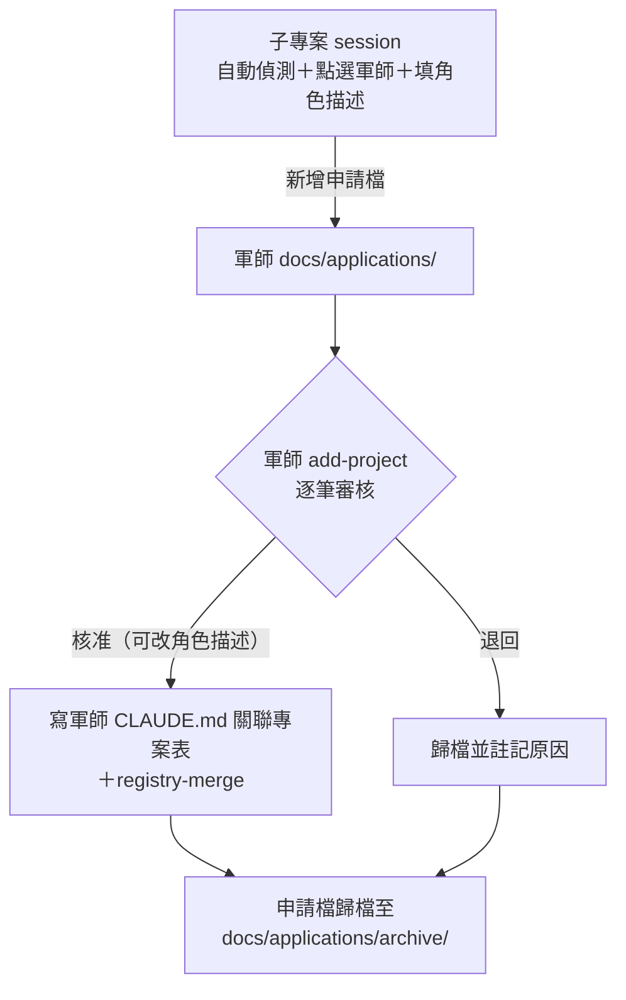

# 申請信箱：子專案申請加入軍師的對話式流程

## 摘要

為 kunsu 體系新增「申請信箱」機制：`/kunsu-init` scaffold 內建 `docs/applications/` 作為回覆信箱之外的第二個例外授權資料夾；新增子專案端 skill，自動偵測子專案資訊並向目標軍師投遞申請檔；軍師端 `add-project` 改為掃描待審申請、逐筆點選審核，核准當下才寫入軍師 CLAUDE.md 與全域註冊表。

---

## 問題框架

現行 `add-project` 要求使用者在軍師目錄的 session 以一行式輸入五個欄位（`顯示名稱 | 絕對路徑 | 角色描述 | 環境限制 | 能否自我驗證`）。實際使用時，這行長字串必須在終端機輸入框打字或貼上：VSCode 終端機偶發顯示錯亂，導致看不到自己輸入的內容；白色佈景主題下提示文字同為白色，必須用滑鼠選取才能辨識。輸入摩擦集中在「長字串進終端機」這個動作本身。

其中的絕對路徑與技術棧其實都能自動偵測，真正需要人工提供的只有角色描述與環境限制。改善準則因此是：**能自動偵測就不問、能點選就不打字**。

授權邊界是本題的硬約束：回覆信箱協議明定 `docs/handoffs/replies/` 是子專案 session 對軍師 repo 的唯一寫入授權（刻意不對稱、刻意限縮）。子專案 session 直接修改軍師 CLAUDE.md 或全域註冊表都違反協議精神。新流程必須以「新增一個例外授權信箱」的形式擴充，而非放寬既有邊界。

---

## 關鍵決策

- **雙信箱協議** — 例外授權從單一 replies/ 擴充為兩個信箱：回覆信箱（`docs/handoffs/replies/`）與申請信箱（`docs/applications/`）。授權形式不變：對方 session 僅能在信箱內新增新檔案，不得編輯信箱內外任何既有檔案。
- **申請信箱落於 `docs/applications/`（handoffs 域外）** — 舊版 `scan-replies.sh` 的 tripwire 只監看 `docs/handoffs/`，域外落點使未遷移的既有軍師收到申請檔時不會誤報異常，失敗模式溫和；申請加入與交接本來也是不同領域。
- **單點登記** — 待審申請不寫註冊表、不寫軍師 CLAUDE.md；所有正式登記只在軍師核准當下一次寫入兩處，避免「註冊表有、CLAUDE.md 沒有」的半登記狀態。
- **角色字串定案權在軍師** — 子專案在申請中「提議」角色描述，軍師核准時可修改後定案；「角色字串三處一致」原則（軍師 CLAUDE.md 關聯專案表、註冊表 roles、handoff `to:`）不變。
- **不做獨立遷移指令** — 既有軍師的補建由軍師端 `add-project` 偵測缺 `applications/` 時提議建立並補協議文字；子專案端投遞前先檢查目標軍師已有信箱。

---

## 參與者

- A1. 子專案 session — 在子專案目錄執行新 skill，產出並投遞申請檔。
- A2. 軍師 session — 執行 `add-project`，審核申請、寫入正式登記、歸檔申請檔。
- A3. 使用者 — 兩端點選與少量填寫；核准或退回的最終決策者。

---

## 關鍵流程

- F1. 申請投遞（子專案端）
  - **觸發：** 使用者在子專案 session 呼叫新 skill。
  - **步驟：** 自動偵測（git 根路徑；目錄名作為顯示名稱預設值；讀自身 CLAUDE.md 摘技術棧）→ 從註冊表撈出軍師清單供點選 → 檢查目標軍師已有 `applications/`（缺 → 導引先於軍師端遷移，終止）→ 使用者填角色描述、環境限制、能否自我驗證 → 在目標軍師 `docs/applications/` 新增申請檔。
  - **結果：** 一份待審申請檔；子專案自身 repo 與註冊表皆無任何寫入。
  - **涵蓋 R4–R9。**
- F2. 申請審核（軍師端）
  - **觸發：** 使用者在軍師 session 執行 `add-project`。
  - **步驟：** 掃描 `docs/applications/` 待審申請 → 逐筆以選項呈現：核准／修改角色描述後核准／退回 → 核准當下執行既有步驟④（更新關聯專案表）與⑤（registry-merge）→ 申請檔歸檔至 `docs/applications/archive/`。
  - **結果：** 正式登記完成，或申請被退回（一樣歸檔，附退回原因）。
  - **涵蓋 R10–R12。**
- F3. fallback 訪談（軍師端）
  - **觸發：** `add-project` 掃描到零筆待審申請。
  - **步驟：** 以 AskUserQuestion 分題訪談取代一行式輸入，收集同樣五個欄位。
  - **涵蓋 R13。**
- F4. 既有軍師遷移
  - **觸發：** `add-project` 偵測軍師缺 `docs/applications/`。
  - **步驟：** 提議補建資料夾＋補協議文字（軍師修改自己的 CLAUDE.md，完全合規）；使用者確認後執行。
  - **涵蓋 R14。**

---

## 需求

**Scaffold 與協議**

- R1. `/kunsu-init` scaffold 建立 `docs/applications/`（含 `archive/` 子目錄）。
- R2. 軍師 CLAUDE.md 範本的回覆信箱協議改寫為雙信箱：明定 `applications/` 的授權範圍（僅新增新檔案）、tripwire 核對範圍同步擴及。
- R3. 申請掃描與 tripwire：軍師端能回報 `applications/` 內未 commit 的新申請份數；`applications/` 內對既有檔案的修改、刪除或搬移視為異常。

**子專案端 skill**

- R4. 新增子專案端 skill，在子專案 session 執行，負責產出並投遞申請檔。
- R5. 自動偵測：絕對路徑（git 根路徑）、顯示名稱預設值（目錄名）、技術棧（讀子專案自身 CLAUDE.md，缺則記「待補充」）。
- R6. 目標軍師以選項點選，清單取自全域註冊表中所有已知軍師路徑。
- R7. 手動輸入僅限角色描述、環境限制（選填）、能否自我驗證；顯示名稱可修改預設值。
- R8. 投遞前檢查目標軍師 `docs/applications/` 存在；不存在則提示先於軍師端執行遷移，不投遞。
- R9. 子專案端絕不寫註冊表與軍師 CLAUDE.md，寫入行為僅限「在申請信箱新增一個申請檔」。

**軍師端 add-project**

- R10. `add-project` 優先掃描待審申請，逐筆以選項審核：核准／修改角色描述後核准／退回。
- R11. 核准當下才寫軍師 CLAUDE.md 與註冊表，沿用既有步驟④⑤，含重複登記與角色改名警告的既有分支。
- R12. 處理完的申請檔（核准或退回）歸檔至 `docs/applications/archive/`，退回者附退回原因。
- R13. 無待審申請時，fallback 訪談以 AskUserQuestion 分題取代一行式輸入。
- R14. 偵測軍師缺 `docs/applications/` 時，提議補建資料夾並補協議文字（遷移）。

**kunsu-inbox 擴充**

- R15. `/kunsu-inbox` 軍師模式一併回報 `docs/applications/` 新到申請份數。

---

## 驗收例

- AE1. 未遷移軍師的投遞防護
  - **涵蓋 R8。**
  - **Given** 目標軍師尚無 `docs/applications/`，**When** 子專案端投遞，**Then** 不寫入任何檔案，提示先於軍師端執行 `add-project` 遷移。
- AE2. 舊版軍師不誤報
  - **涵蓋落點決策。**
  - **Given** 軍師尚未遷移、部署的仍是舊版 `scan-replies.sh`，**When** `docs/applications/` 出現申請檔，**Then** 舊版 tripwire（僅監看 `docs/handoffs/`）不觸發誤報。
- AE3. 修改提議角色後核准
  - **涵蓋 R10、R11。**
  - **Given** 申請檔提議的角色描述不夠精確，**When** 軍師選「修改角色描述後核准」，**Then** 以定案字串寫入關聯專案表與註冊表，並回報角色字串三處一致提醒。
- AE4. 重複申請
  - **涵蓋 R11。**
  - **Given** 申請的子專案路徑已登記於本軍師，**When** 軍師核准，**Then** 進入既有重複登記分支（詢問是否更新角色描述，觸發角色改名警告掃描）。

---

## 範圍邊界

- 子專案 session 直接寫軍師 CLAUDE.md 或註冊表（原方向 1）——違反協議精神，否決。
- 申請檔放子專案自身 repo＋全域指標、借用 `replies/` 偽裝回覆、全域申請佇列（`~/.claude/` 下）——三種替代落點皆否決；申請信箱落在軍師 repo 內，有版控且與回覆信箱對稱。
- SessionStart hook／自動輪詢申請——維持 ADR 002 的延後決策，本次不動。
- 獨立遷移指令——以 `add-project` 內建偵測補建取代。

---

## 依賴與假設

- 註冊表以子專案路徑為鍵：零子專案的軍師不會出現在註冊表中，因此不會出現在子專案端的軍師選單——已知限制；實務上 `/kunsu-init` 訪談至少登記一個子專案。
- 單機單使用者情境：申請信箱無併發寫入疑慮。
- 技術棧自動偵測依賴子專案 CLAUDE.md 存在技術棧小節，缺則沿用現行「待補充」降級行為。

---

## 開放問題

**留待規劃階段決定：**

- 新 skill 的命名與觸發語（例如 `kunsu-join`、`kunsu-apply`、「申請加入軍師」）。
- 申請檔的檔名規則與 frontmatter 欄位設計（比照 handoff 的 Dataview 友善格式）。
- 退回原因的記錄形式（歸檔檔案內註記，或另立獨立檔案）。
- `scan-replies.sh` 擴充或另立掃描腳本的取捨。
