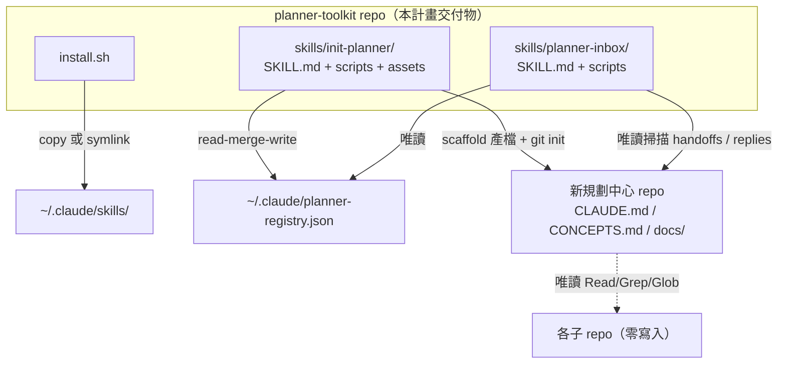
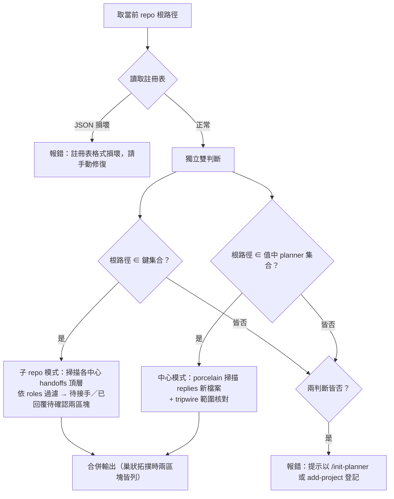

# feat: init-planner 與 planner-inbox skill 工具組

## Summary

交付三件套：`/init-planner`（規劃中心 scaffolding，含 `add-project` 子指令）、`/planner-inbox`（跨 session 傳令自動化）、`install.sh`（部署至 `~/.claude/skills/`）。純 skill＋markdown 範本＋shell 膠水腳本，實作已審定的 ADR 001 與 ADR 002 全部約束。

---

## Problem Frame

ebook 規劃協調中心已驗證「唯讀規劃中心＋回覆信箱」協作模式可行，但兩個痛點未解：建立新中心靠手工複製慣例（無法快速複製到其他專案群），跨 session 傳令靠使用者口述長路徑（子 repo session 不知道哪些中心管到它）。先前嘗試 ce-team（Rust CLI）因注入子 repo 與路徑耦合失敗，教訓已沉澱為 ADR 001（純 skill、零注入、顯式登記）與 ADR 002（全域反向註冊表＋按需 inbox）。本計畫把兩份 ADR 落成可安裝的 skill。

---

## Requirements

**Scaffolding（/init-planner）**

- R1. `/init-planner` 以訪談＋自動查證產生完整規劃中心：CLAUDE.md（5 條 Invariants 逐字＋關聯專案表＋各子專案環境限制＋工作流程六步驟＋回覆信箱協議全文）、CONCEPTS.md（5 個協調概念）、docs/README.md、兩篇 solutions 種子文件、Obsidian vault（含 HOME.md 的 handoffs dataview 區塊）、git init＋經使用者確認的初始 commit。
- R2. scaffold 產出滿足 ADR 001 結構不變量並逐項核查：`docs/handoffs/`、`docs/handoffs/replies/`（含 `.gitkeep`）、規劃中心根目錄為 git repo。
- R3. `/init-planner` 以 read-merge-write 寫入 `~/.claude/planner-registry.json`，不覆寫同一子 repo 隸屬其他中心的既有登記。
- R4. `add-project` 子指令：驗證於規劃中心執行、新增或更新子專案（中心 CLAUDE.md 關聯專案表＋註冊表同步）、維持角色字串三處字面一致；角色改名時掃描既有未完成 handoff 的 `to:` 並列出警告。

**傳令（/planner-inbox）**

- R5. 模式偵測依 ADR 002：以當前 repo 根路徑為唯一基準，獨立雙判斷（註冊表鍵→子 repo 身分；註冊表值中規劃中心路徑→中心身分），兩者皆符合則合併執行，皆非則報錯引導登記；不以目錄存在與否判斷；註冊表 JSON 損壞獨立報錯，不與「未登記」混同。
- R6. 子 repo 模式：列出中心 `docs/handoffs/` 頂層（排除 `replies/` 與 `archive/`）中 `to:` 為本角色且未完成的交接文件，一併顯示規劃中心絕對路徑與 Method 2 回覆提示；`to:` 值不屬於已知角色集合者附加回報。
- R7. 規劃中心模式：`git status --porcelain` 掃描 `docs/handoffs/replies/` 中 `??` 或 index 欄為 `A` 的新檔案回報份數；tripwire 核對——排除 replies/ 新檔案後 `docs/handoffs/` 下仍有變更即停下回報。
- R8. 完成狀態推導：同一 `in_reply_to` 以檔名降序取最新回覆；未完成＝無回覆或最新回覆 status 為 `partial`／`blocked`；`submitted` 獨立列為「已回覆待確認」；`done` 為完成。不修改 handoff 本體。
- R9. 人工閘門不動：`/planner-inbox` 只告知不開工、不主動輪詢；文件明載信箱目錄是唯讀邊界的唯一例外授權。

**部署與驗證**

- R10. `install.sh` 部署兩個 skill 至 `~/.claude/skills/`：預設 copy、`--link` 用 symlink（附 repo 搬家警告）、目標已存在時先提示再覆寫。
- R11. 端到端 dogfooding：於暫存目錄實跑 `/init-planner` 建測試中心，演練 handoff 往返與 `/planner-inbox` 雙模式，全部通過後才視為交付完成。
- R12. 本 repo 文件同步：CLAUDE.md 專案結構與開發狀態、docs/README.md 反映實作後現況。

---

## Key Technical Decisions

- **純 skill＋範本，腳本只做確定性工作**：SKILL.md 指引 Claude 執行探測與判斷（Read／Glob／AskUserQuestion），shell 腳本只負責固定的檔案生成與 JSON 操作（`set -euo pipefail`、絕對路徑呼叫、stdout 回報產出路徑）。鏡射 `~/.claude/skills/handoff` 與 `init-obsidian-vault` 的既有慣例。（ADR 001）
- **範本與種子文件打包進 skill assets**：規劃中心 CLAUDE.md／CONCEPTS.md／docs/README.md 範本與兩篇 solutions 種子文件放 `skills/init-planner/assets/`，scaffold 時從 `$CLAUDE_SKILL_DIR/assets/` 複製——各中心自持一份，消除對母本機器路徑的依賴。範本佔位符沿用 `{{NAME}}` 慣例（同 `init-obsidian-vault` 的 home-template）。解決種子需求開放問題 #2。
- **註冊表 schema 一步到位支援多中心＋多角色**：`{"<子 repo 絕對路徑>": [{"planner": "<中心絕對路徑>", "roles": ["<角色>", ...]}]}`。值為條目陣列（一 repo 可隸屬多中心）、`roles` 為陣列（一 repo 可任多角色）。寫入採 read-merge-write：同鍵不同中心 append、同鍵同中心報「已登記」。JSON 操作於腳本內以 python3（macOS 內建）處理，不引入 jq 依賴。解決開放問題 #3。
- **Obsidian vault 呼叫既有 skill**：直接呼叫 `~/.claude/skills/init-obsidian-vault/scripts/init-vault.sh --target <中心根> --ignore <排除清單> --home docs/HOME.md`；HOME.md 由 `/init-planner` 以自帶範本填入，於通用區塊之外加上 handoffs 交接狀態 dataview 區塊（母本 HOME.md 的規劃中心特有區塊）。解決開放問題 #5。
- **命名 `/init-planner`＋`/planner-inbox`**：inbox 加前綴避免與未來 skill 或內建指令撞名；`add-project` 為 `/init-planner` 子指令。使用者定案，解決開放問題 #6。
- **狀態語義鎖定**：回覆 status 的完成判定以 `done` 為準；`partial`／`blocked`＝未完成；腳本自動產生的 `submitted`＝已回覆待確認（獨立區塊顯示，不混入待接手清單）。「最新回覆」以檔名降序第一為準——`new-handoff-reply.sh` 的同日序號遞增命名保證字串排序與建立順序一致，且不受 clone 後 mtime 重置影響。
- **掃描範圍與 `/handoff list` 對齊**：只取 `docs/handoffs/*.md` 頂層，排除 `replies/` 與 `archive/` 子目錄——archive 內是已完成歸檔的交接，納入會假陽性。
- **add-project 定位機制**：必須於規劃中心根目錄執行，以「當前 repo 根路徑出現在註冊表任一值的 planner 欄位」驗證身分，否則報錯——不靠 cwd 猜測，與 `/planner-inbox` 模式偵測共用同一判斷基準。
- **install.sh 預設 copy、`--link` 開發模式**：仿 `~/.claude/rules` README 的 `cp -r` 慣例（整目錄複製、不加 `/*` 攤平）；`--link` 供本 repo 開發時即改即生效，說明文字附「repo 搬家後 symlink 失效需重跑」警告。

---

## High-Level Technical Design

元件關係與資料流（誰寫誰、誰只讀誰）：



`/planner-inbox` 模式偵測與掃描分支：



---

## Output Structure

```
skills/
  init-planner/
    SKILL.md                          → 訪談、產檔、vault、git、registry 全流程指引
    scripts/
      registry-merge.sh               → read-merge-write 寫入註冊表（python3 處理 JSON）
    assets/
      templates/
        planner-claude.md             → 規劃中心 CLAUDE.md 範本（8 節骨架＋佔位符）
        planner-concepts.md           → CONCEPTS.md 範本（5 個協調概念）
        planner-docs-readme.md        → docs/README.md 範本
        home-dataview-handoffs.md     → HOME.md 附加的 handoffs 狀態 dataview 區塊
      solutions/
        architecture-patterns/
          cross-repo-coordination-planner-pattern.md
        conventions/
          cross-repo-handoff-reply-inbox-convention.md
  planner-inbox/
    SKILL.md                          → 模式偵測、雙模式掃描、狀態推導、輸出格式
    scripts/
      scan-replies.sh                 → 中心模式 porcelain 掃描（?? 與 index=A）
install.sh                            → 部署兩 skill 至 ~/.claude/skills/
```

樹狀圖為預期輪廓；各單元的 Files 清單為權威。

---

## Implementation Units

### U1. 範本與種子資產抽取

- **Goal:** 從 ebook 母本抽出可參數化的規劃中心範本與兩篇 solutions 種子文件，打包進 `skills/init-planner/assets/`。
- **Requirements:** R1、R2
- **Dependencies:** 無
- **Files:** `skills/init-planner/assets/templates/planner-claude.md`、`skills/init-planner/assets/templates/planner-concepts.md`、`skills/init-planner/assets/templates/planner-docs-readme.md`、`skills/init-planner/assets/templates/home-dataview-handoffs.md`、`skills/init-planner/assets/solutions/architecture-patterns/cross-repo-coordination-planner-pattern.md`、`skills/init-planner/assets/solutions/conventions/cross-repo-handoff-reply-inbox-convention.md`
- **Approach:** 固定段落（5 條 Invariants、回覆信箱協議全文含 cd 陷阱／Method 2／tripwire／不對稱授權、工作流程六步驟、CONCEPTS 5 概念）自母本逐字抽出；參數化內容（中心名稱、tagline、關聯專案表、環境限制小節）以 `{{PLACEHOLDER}}` 佔位。範本直接設計為 N 方協調，不留母本早期兩方痕跡。solutions 種子自母本複製，僅將 ebook 特定路徑改為通例說明並加來源註記；母本唯讀不動。交接文件範本的「回覆方式」段落必須同時含 Method 1（cd＋/handoff reply）與 Method 2（絕對路徑直寫）。
- **Patterns to follow:** `~/.claude/skills/init-obsidian-vault/assets/home-template.md` 的 `{{...}}` 佔位符慣例；母本 ebook 專案群規劃中心（本機私有路徑，略）的 CLAUDE.md 8 節結構（唯讀參考）。
- **Test scenarios:**
  - 範本內所有佔位符列表與 U2 SKILL.md 的填寫指引一一對應，無孤兒佔位符。
  - 固定段落與母本逐字 diff：除參數化處與 N 方化調整外零差異。
  - solutions 種子與母本 diff：僅來源註記與通例化改寫差異。
- **Verification:** 範本可被人工代入參數後直接成為合法的規劃中心 CLAUDE.md（結構完整、無殘留佔位符）。

### U2. /init-planner SKILL.md 主流程與 registry 腳本

- **Goal:** 完成 scaffolding skill 主體：訪談→查證→產檔→vault→git→註冊表→驗收核查。
- **Requirements:** R1、R2、R3
- **Dependencies:** U1
- **Files:** `skills/init-planner/SKILL.md`、`skills/init-planner/scripts/registry-merge.sh`
- **Approach:** SKILL.md frontmatter 沿用既有慣例（name／version 0.1.0／description 含觸發語清單／allowed-tools）。流程：①訪談（中心名稱、tagline、目標路徑、子專案清單：名稱／絕對路徑／角色／環境限制／能否自我驗證）；②前置保護——目標路徑已含 CLAUDE.md 即停住詢問（仿 init-obsidian-vault 偵測 .obsidian 的保護模式）；③逐一查證子專案路徑，錯誤彙整後一次 AskUserQuestion 讓使用者修正或略過（不單筆 abort）；讀取各子專案 CLAUDE.md 摘要技術棧，缺檔降級為「待補充」並於結尾回報；④產檔——固定段落逐字複製＋參數注入，建立 `docs/handoffs/`、`docs/handoffs/replies/.gitkeep`、複製 solutions 種子；⑤呼叫 `init-vault.sh`，以 assets 範本填 HOME.md 並附加 handoffs dataview 區塊；⑥git init 前列出已建立檔案清單，經使用者確認後 commit（取消則提示可手動刪除目錄，不自動 rollback）；⑦以 `registry-merge.sh` 逐一登記子專案；⑧驗收核查——結構不變量三項逐項核對後回報。`registry-merge.sh`：參數為子 repo 路徑、中心路徑、roles；內嵌 python3 做 read-merge-write；JSON 損壞時報錯退出。
- **Patterns to follow:** `~/.claude/skills/handoff/SKILL.md` 的子指令小節結構與腳本呼叫語法（全絕對路徑、stdin 傳內文）；`init-vault.sh` 的 `--target/--ignore/--home` 介面。
- **Test scenarios:**
  - 全新空目錄 happy path：8 步全通、產出通過結構不變量核查。
  - 目標已含 CLAUDE.md：停住詢問，不覆寫。
  - 三個子專案其一路徑不存在：彙整錯誤一次詢問，修正後繼續。
  - 子專案無 CLAUDE.md：技術棧降級「待補充」，流程不中斷，結尾回報。
  - registry 已有同鍵、不同中心：append 新條目，既有條目原樣保留。
  - registry 已有同鍵、同中心：報「已登記，略過寫入」。
  - registry JSON 損壞：`registry-merge.sh` 報錯退出，不寫入。
- **Verification:** 於暫存目錄實跑一次完整 scaffold，產出的中心通過結構不變量三項核查，registry 出現正確條目。

### U3. add-project 子指令

- **Goal:** 往既有規劃中心新增或更新子專案，維持角色字串三處一致。
- **Requirements:** R4
- **Dependencies:** U2
- **Files:** `skills/init-planner/SKILL.md`（新增 `### add-project` 小節）
- **Approach:** ①身分驗證——當前 repo 根路徑須出現在註冊表任一值的 planner 欄位，否則報錯「請於規劃中心根目錄執行」；②訪談新子專案（同 U2 訪談欄位）並查證路徑；③更新中心 CLAUDE.md 關聯專案表與環境限制小節；④呼叫 `registry-merge.sh` 登記；⑤子專案已登記時 AskUserQuestion 詢問是否更新角色；⑥角色改名時掃描 `docs/handoffs/*.md` 頂層中 `to:` 等於舊角色且未完成者，列出警告要求使用者確認處置（不自動修復）。
- **Patterns to follow:** U2 的訪談與查證流程；`/handoff list` 的 Glob＋Read frontmatter 純讀掃描。
- **Test scenarios:**
  - 於非規劃中心目錄執行：報錯不動作。
  - 新增未登記子專案 happy path：中心表、環境限制、registry 三處同步。
  - 子專案已登記：詢問是否更新角色。
  - 角色改名且存在 `to:` 為舊角色的未完成 handoff：列出警告清單。
  - 角色改名但所有舊角色 handoff 皆已 done／archive：不出警告。
- **Verification:** 對 U6 測試中心執行 add-project 新增第三個子專案，三處角色字串字面一致。

### U4. /planner-inbox SKILL.md 與掃描腳本

- **Goal:** 完成傳令 skill：模式偵測、子 repo 模式、中心模式、狀態推導、輸出格式。
- **Requirements:** R5、R6、R7、R8、R9
- **Dependencies:** U1（僅 registry schema 約定，無檔案依賴）
- **Files:** `skills/planner-inbox/SKILL.md`、`skills/planner-inbox/scripts/scan-replies.sh`
- **Approach:** SKILL.md 依 ADR 002 修訂版全文落實：①模式偵測——讀 registry（JSON 損壞獨立報錯）、以當前 repo 根路徑獨立雙判斷、巢狀拓撲合併輸出、皆非報錯引導登記；②子 repo 模式——對每個所屬中心，Glob `docs/handoffs/*.md` 頂層、Read frontmatter、依 roles 集合過濾 `to:`、依 R8 規則分「待接手」與「已回覆待確認」兩區塊輸出，附中心絕對路徑與 Method 2 直寫提示；`to:` 不屬於角色集合者列「不符清單」；多中心時依中心分組；③中心模式——呼叫 `scan-replies.sh`（porcelain、路徑限 `docs/handoffs/replies/`、`??` 或 index 欄 `A`），回報新回覆份數；tripwire——排除 replies/ 新檔案後 `docs/handoffs/` 仍有變更即停下回報疑似意外寫入；④明載三條授權邊界：只告知不開工、不主動輪詢、信箱目錄是唯讀邊界的唯一例外。狀態推導由 Claude Glob＋Read 完成（仿 `/handoff list` 純讀慣例），不另寫腳本。
- **Patterns to follow:** `/handoff list` 的掃描與雙表輸出；`new-handoff-reply.sh` 的 frontmatter 欄位（`in_reply_to` 含 `.md` 後綴）與同日序號命名。
- **Test scenarios:**
  - 子 repo 模式狀態矩陣：無回覆→待接手；最新回覆 `partial`／`blocked`→待接手；`submitted`→已回覆待確認；`done`→不列；本體已移入 `archive/`→不列。
  - 同一 `in_reply_to` 同日兩份回覆（`-reply-2026-07-06.md` 與 `-reply-2026-07-06-2.md`）：以 `-2` 為最新。
  - handoff `to:` 值不在 roles 集合：出現於不符清單，不進待接手。
  - 一 repo 隸屬兩中心：輸出依中心分組。
  - 巢狀拓撲（既是子 repo 又是中心）：兩區塊皆輸出。
  - 未登記 repo：報錯並提示登記指令。
  - registry JSON 損壞：報「格式損壞請修復」，不報「未登記」。
  - 中心模式：untracked（`??`）、staged（`A `）、staged 後再修改（`AM`）三種各偵測為新回覆；已 commit 回覆不計。
  - tripwire：handoff 本體被未 commit 修改→停下回報；僅 replies/ 新檔案→正常回報不觸發。
- **Verification:** U6 測試中心上全部場景演練通過。

### U5. install.sh

- **Goal:** 一鍵部署兩個 skill 至 `~/.claude/skills/`。
- **Requirements:** R10
- **Dependencies:** U2、U3、U4（部署對象需先存在）
- **Files:** `install.sh`
- **Approach:** 預設 `cp -r` 整目錄複製 `skills/init-planner` 與 `skills/planner-inbox`（不加 `/*` 攤平）；`--link` 改用 `ln -sfn` 並印出「symlink 依賴本 repo 路徑不變，搬家後需重跑」警告；目標已存在時印出「已存在，將覆寫舊版」提示；結尾列出部署後的目標路徑。
- **Patterns to follow:** `~/.claude/rules/README.md` 記載的整目錄複製慣例。
- **Test scenarios:**
  - 首次安裝：兩目錄出現於 `~/.claude/skills/`。
  - 重複安裝：出現覆寫提示，內容更新。
  - `--link`：目標為 symlink 且指向本 repo；警告文字出現。
  - 僅其一已存在：只對存在者提示，另一個直接安裝。
- **Verification:** 安裝後新開 session 可見 `/init-planner` 與 `/planner-inbox` 觸發。

### U6. 端到端 dogfooding 驗證

- **Goal:** 以實跑證明全鏈路可用，不以「產出看起來對」為驗收。
- **Requirements:** R11
- **Dependencies:** U5
- **Files:** 無新增（於暫存目錄操作；如發現缺陷則回修 U1–U5 對應檔案）
- **Approach:** 於暫存目錄建兩個含 CLAUDE.md 的假子專案 repo →跑 `/init-planner` 建測試中心→逐項核查結構不變量與範本渲染 diff →以全域 `/handoff` 建交接、以 Method 2 直寫模擬子 repo 回覆→分別於假子 repo 與測試中心執行 `/planner-inbox` 演練 U4 全部測試場景→`add-project` 新增第三個假專案並演練角色改名警告→結束後清理 registry 測試條目與暫存目錄。
- **Execution note:** 這是驗收單元——發現的任何缺陷先回修對應單元再重跑，不在本單元內打補丁繞過。
- **Test scenarios:** 即 U2–U5 各單元 Verification 的實際執行集合；全部通過為完成條件。
- **Verification:** 演練紀錄（場景×結果清單）全綠；registry 清理後無測試殘留。

### U7. 本 repo 文件同步

- **Goal:** CLAUDE.md 與 docs/README.md 反映實作後現況。
- **Requirements:** R12
- **Dependencies:** U6
- **Files:** `CLAUDE.md`、`docs/README.md`
- **Approach:** 專案結構樹更新為實際佈局（`skills/planner-inbox/` 取代原 `skills/inbox/` 規劃名）；開發狀態「尚未實作」項目移入「已完成」；docs/README.md 目前狀態與下一步更新。
- **Test scenarios:** Test expectation: none — 純文件同步，無行為面。
- **Verification:** 文件所述路徑與指令名稱與實際產出一致。

---

## Scope Boundaries

### Deferred to Follow-Up Work

- SessionStart hook（第二階段）：`/planner-inbox` 用出實際手感後再評估（ADR 002 Decision 3）。
- 全域 `/handoff` skill 升版改查註冊表（根治 cd 陷阱）：獨立決策點，待首輪實際使用後評估相容性（ADR 002 Decision 6）。本計畫的緩解是 Method 2 提示與 inbox 輸出中心絕對路徑。
- 角色改名的追溯修復機制：本計畫僅做 add-project 警告掃描，批次修復／禁止改名等機制留待實際案例（ADR 002 Deferred / Open Questions）。
- MCP server：僅在「跨機器協作」或「非 Claude agent 型別化存取」訊號出現時重啟評估（ADR 002 Decision 4）。

### Outside this product's identity

- 編譯型工具專案（Rust／Go／Python CLI）——ADR 001 否決。
- 對子 repo 的任何寫入或設定注入——ADR 001 否決。
- 自動 discovery（walk-up 或其他）——ADR 001 否決，路徑一律顯式登記。
- 修改 ebook 母本——唯讀參考。

---

## Risks & Dependencies

- **依賴全域 `/handoff` skill v0.2.1 的檔案慣例**：reply 命名 `{原檔名}-reply-YYYY-MM-DD[-N].md`、frontmatter `in_reply_to` 含 `.md` 後綴、status 預設 `submitted`。該 skill 升版改動慣例會破壞 `/planner-inbox` 比對。緩解：`skills/planner-inbox/SKILL.md` 明載所依賴的欄位與命名規則及對應版本。
- **status 靠人工更新**：腳本只產 `submitted`，`done`／`partial`／`blocked` 依賴接手方手動改。風險是「已回覆待確認」區塊長期堆積。緩解：inbox 輸出格式讓堆積可見；範本的回覆方式段落明載更新 status 的責任。
- **模型渲染確定性**（ADR 001 已接受的限制）：緩解為 U1 固定段落逐字化＋U6 的範本渲染 diff 核查。
- **`init-obsidian-vault` 介面變動**：低風險；U2 以其 `--target/--ignore/--home` 現行介面為準，變動時 U6 會攔截。

---

## Sources & Research

- 母本（唯讀）：ebook 專案群規劃中心（本機私有路徑，略）——CLAUDE.md 8 節結構、CONCEPTS.md 協調概念、`docs/solutions/` 兩篇種子文件、含 handoffs dataview 區塊的 HOME.md。
- 全域 handoff skill：`~/.claude/skills/handoff/`——`new-handoff-reply.sh` 的命名與 frontmatter 規則、`/handoff list` 的頂層掃描慣例。
- 全域 init-obsidian-vault skill：`~/.claude/skills/init-obsidian-vault/`——`init-vault.sh` 介面、`assets/home-template.md` 佔位符慣例、`$CLAUDE_SKILL_DIR` 定位模式。
- 已審定 ADR：`docs/adr/2026-07-06-adr-candidate-001-pure-skill-no-injection.md`（結構不變量）、`docs/adr/2026-07-06-adr-candidate-002-relay-automation-registry-inbox.md`（模式偵測、porcelain 規則、角色字串約束、Deferred / Open Questions）。
- 部署慣例：`~/.claude/rules/README.md` 的整目錄複製模式。
