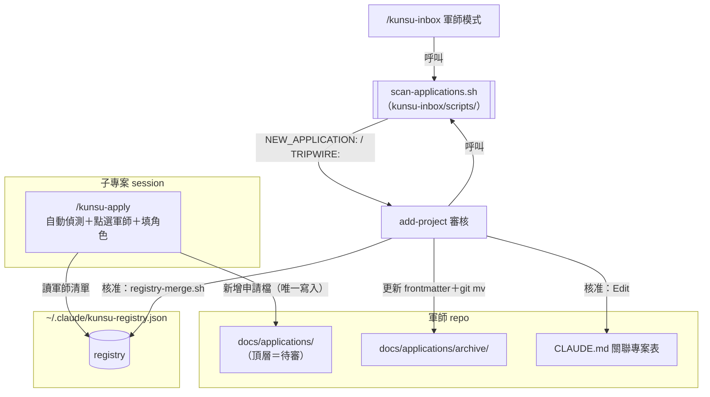
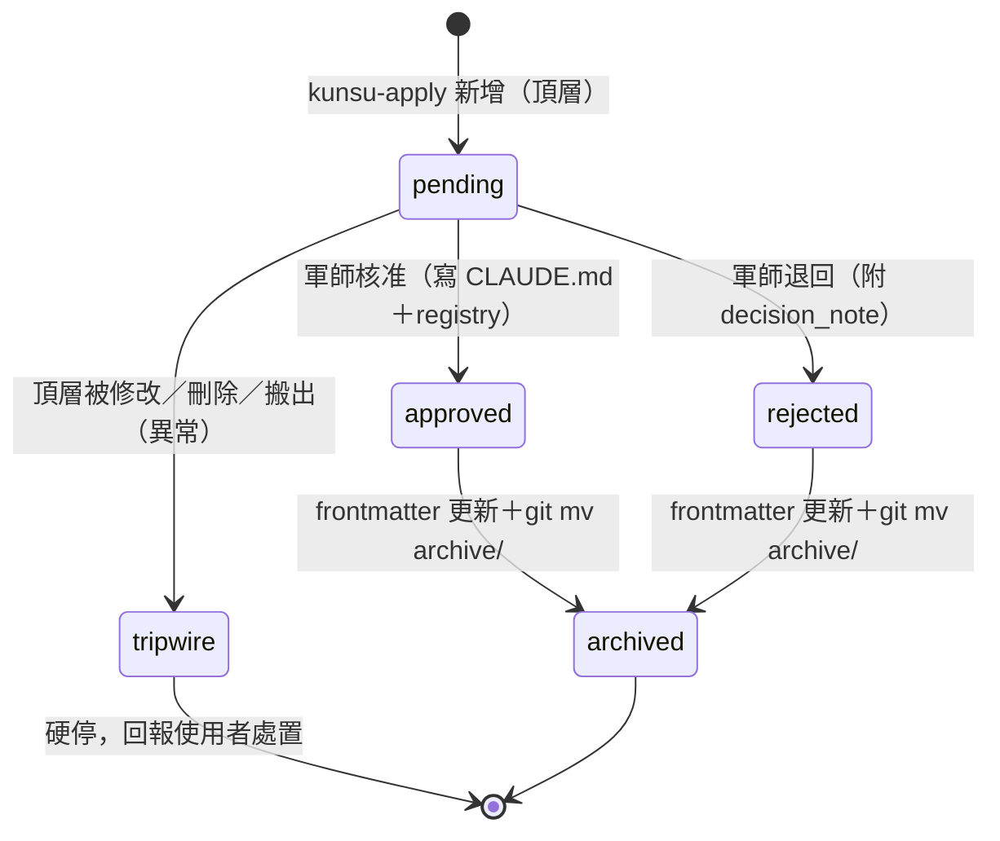

# feat: 申請信箱——子專案申請加入軍師的對話式流程

## Summary

為 kunsu 體系新增「申請信箱」：scaffold 內建 `docs/applications/` 作為回覆信箱之外的第二個例外授權信箱；新增 `/kunsu-apply` skill 讓子專案 session 自動偵測資訊並投遞申請；軍師端 `add-project` 改為掃描待審申請、逐筆審核，核准當下才寫入軍師 CLAUDE.md 與全域註冊表；`/kunsu-inbox` 軍師模式順帶回報新申請份數。

---

## Problem Frame

現行 `add-project` 以一行式五欄輸入收集子專案資訊，長字串在終端機輸入框的體驗差（VSCode 終端顯示錯亂、白色佈景下提示文字不可辨）。其中路徑與技術棧可自動偵測，真正需要人工的只有角色描述與環境限制。改善準則：能自動偵測就不問、能點選就不打字。

授權邊界是硬約束：回覆信箱協議明定 `docs/handoffs/replies/` 是子專案 session 對軍師 repo 的唯一寫入授權。新流程以「新增第二個例外授權信箱」的形式擴充，不放寬既有邊界（see origin: docs/brainstorms/2026-07-07-application-inbox-requirements.md）。

---

## Requirements

**Scaffold 與協議**

- R1. `/kunsu-init` scaffold 建立 `docs/applications/`（含 `archive/` 子目錄，兩層皆含 `.gitkeep`）。
- R2. 軍師 CLAUDE.md 範本的回覆信箱協議改寫為雙信箱：明定 `applications/` 授權範圍（僅新增新檔案）、tripwire 核對範圍同步擴及。
- R3. 申請掃描與 tripwire：回報 `applications/` 未 commit 新申請份數；頂層既有檔案的修改、刪除或搬出視為異常（授權歸檔搬移除外，見 R20）。

**子專案端 `/kunsu-apply`**

- R4. 新增 `kunsu-apply` skill，在子專案 session 執行，產出並投遞申請檔。
- R5. 自動偵測：絕對路徑（git 根路徑）、顯示名稱預設值（目錄名）、技術棧（讀子專案自身 CLAUDE.md，缺則記「待補充」）。
- R6. 目標軍師以選項點選，清單取自全域註冊表所有已知軍師路徑（去重）。
- R7. 手動輸入僅限角色描述、環境限制（選填）、能否自我驗證；顯示名稱可修改預設值。
- R8. 投遞前檢查目標軍師 `docs/applications/` 存在；不存在則提示先於軍師端遷移，不投遞。
- R9. 子專案端絕不寫註冊表與軍師 CLAUDE.md，寫入行為僅限「在申請信箱新增一個申請檔」。

**軍師端 add-project**

- R10. `add-project` 優先掃描待審申請，逐筆以選項審核：核准／修改角色描述後核准／退回。
- R11. 核准當下才寫軍師 CLAUDE.md 與註冊表，沿用既有步驟④⑤，含重複登記與角色改名警告的既有分支。
- R12. 處理完的申請檔更新 frontmatter（`status: approved|rejected`，退回附 `decision_note` 原因）後歸檔至 `docs/applications/archive/`。
- R13. 無待審申請時，fallback 訪談以 AskUserQuestion 分題取代一行式輸入。
- R14. 偵測軍師缺 `docs/applications/` 時，提議補建資料夾並補協議文字（遷移）。

**kunsu-inbox 擴充**

- R15. `/kunsu-inbox` 軍師模式一併回報 `docs/applications/` 新到申請份數。

**強韌性（flow 分析補強）**

- R16. 重投冪等：`kunsu-apply` 投遞前檢查目標信箱是否已有相同子專案路徑的待審申請，有則詢問覆蓋或取消，不靜默建立第二份。
- R17. 註冊表降級：registry 不存在、損壞或軍師清單為空（或目標不在清單）時，`kunsu-apply` 改以手動輸入軍師絕對路徑，仍經 R8 守門。
- R18. 遷移完成核查：補協議文字後以 Grep 驗證特徵字串已存在；失敗則明確回報並提示手動補入，不回滾已建目錄。
- R19. 首次核准時若定案角色字串異於申請提議字串，以提議字串觸發既有角色改名警告掃描（步驟⑦）。
- R20. 歸檔授權：`applications/` 頂層→`archive/` 的搬移（含攜帶 frontmatter 更新）視為授權操作，不觸發 tripwire；`archive/` 內新增亦合法；反向（`archive/`→頂層）搬移視為異常。

---

## Key Technical Decisions

- **新 skill 命名 `kunsu-apply`**：循 ADR 004 的 `kunsu-` 前綴規則（體系專屬 skill 一律加前綴）；觸發語含「申請加入軍師」「kunsu apply」等。
- **掃描腳本獨立成 `scan-applications.sh`，置於 `skills/kunsu-inbox/scripts/`**：與 `scan-replies.sh` 同屬信箱掃描域。`add-project` 以部署路徑 `~/.claude/skills/kunsu-inbox/scripts/scan-applications.sh` 跨 skill 呼叫——兩 skill 由同一 `install.sh` 散布，正常情況必然同在；缺失時報錯提示重跑 `install.sh`，不在 kunsu-init 複製第二份（避免雙份漂移）。
- **tripwire 分類規則（解決歸檔誤報）**：頂層 `*.md` 的 `??`/`A` ＝新申請；頂層→`archive/` 的 rename（含內容修改）＝授權歸檔，不觸發；`archive/` 內新增＝合法；`archive/`→頂層的反向搬移＝tripwire 硬停（已關閉的申請不得繞過審核重回待審佇列）；其餘頂層修改、刪除、自外部搬入＝tripwire 硬停（與 `scan-replies.sh` 對回覆信箱的態度一致，手動刪除申請亦視為異常）。rename 豁免須同時核驗兩側：src 為頂層 `*.md` 且 dst 位於 `archive/`，兩條件缺一即走 tripwire 分支。
- **審核結果以 frontmatter 更新落檔**：歸檔當下由軍師 session 更新 `status` 與 `decision_note` 後 `git mv` 至 `archive/`。申請檔於頂層待審期間不可變（tripwire 守護）；歸檔時點僅剩軍師單一寫入方，無跨 repo 漂移條件，故不沿用 handoff 本體「絕不編輯」的嚴格形式，換取單檔可查（Obsidian dataview 可依 `status` 檢視歷史）。
- **申請檔命名與 frontmatter**：`YYYY-MM-DD-<子專案目錄名 slug>-application.md`，同名防撞沿用 `-2`、`-3` 後綴慣例；frontmatter 欄位 `type: kunsu-application`、`name`、`path`（子專案絕對路徑，分組與冪等鍵）、`proposed_role`、`constraints`、`self_verify`、`stack`、`created`、`status: pending`。
- **單點登記**：待審申請不寫註冊表、不寫軍師 CLAUDE.md；正式登記只在核准當下由軍師端一次寫入兩處（see origin 關鍵決策）。
- **未登記子 repo 可申請**：`kunsu-apply` 不要求當前 repo 已在 registry（首次加入場景正是未登記）；軍師清單取自 registry 全體條目的 `kunsu` 欄位聯集。
- **協議文字變更範圍**：範本 `kunsu-claude.md` 與 `kunsu-inbox/SKILL.md` 授權邊界聲明改為雙信箱；ADR 002 主文不改，另立 ADR candidate 006 記錄修訂（循 ADR 005「歷史快照維持原貌」前例）。

---

## High-Level Technical Design

元件關係與觸點：

申請檔狀態機：

---

## Implementation Units

### U1. 申請掃描腳本 `scan-applications.sh`

- **Goal**：提供申請信箱的未 commit 掃描與 tripwire 核對，供 `add-project` 與 `/kunsu-inbox` 共用。
- **Requirements**：R3、R20。
- **Dependencies**：無。
- **Files**：`skills/kunsu-inbox/scripts/scan-applications.sh`。
- **Approach**：沿用 `scan-replies.sh` 的 porcelain 解析模式（`-uall`、引號路徑去除、rename 偵測、`set -euo pipefail`）。分類規則依 KTD「tripwire 分類規則」。注意與 `scan-replies.sh` 的結構差異：`replies/` 無子目錄，而 bash `[[ ]]` 的 `docs/applications/*.md` pattern 會同時匹配 `archive/` 內檔案（`*` 可跨 `/`），故 if/elif 鏈的第一分支必須是 `docs/applications/archive/*`（靜默略過），之後才判頂層 `*.md`，不可直接類比替換路徑字串。rename 判斷依 KTD 雙側核驗規則（src 頂層＋dst archive/ 才豁免）。輸出行前綴 `NEW_APPLICATION:<相對路徑>`、`TRIPWIRE:<XY> <相對路徑>`；exit code 0（正常）／1（參數錯誤或非 git 根）／2（tripwire）。`docs/applications/` 不存在時視同零筆（exit 0、零輸出）——遷移偵測由呼叫端以 `test -d` 自行判斷。
- **Patterns to follow**：`skills/kunsu-inbox/scripts/scan-replies.sh`（參數約定、註解風格、錯誤輸出至 stderr、exit code 表）。
- **Test scenarios**：
  - 頂層 untracked 新檔 → `NEW_APPLICATION`，exit 0。
  - 頂層 staged 新增（`A `、`AM`）→ `NEW_APPLICATION`。
  - 頂層既有檔修改（`M`）→ `TRIPWIRE`，exit 2。
  - 頂層檔刪除（`D`）→ `TRIPWIRE`（手動刪除視為異常）。
  - 頂層→`archive/` rename（`R`，含攜帶內容修改）→ 不觸發、不計新申請。Covers R20。
  - `archive/`→頂層 rename（反向搬移）→ `TRIPWIRE`，exit 2。Covers R20。
  - `archive/` 內新增檔 → 不觸發。
  - 自 `docs/applications/` 外 rename 進頂層 → `TRIPWIRE`。
  - 檔名含空格（git 引號路徑）正確解析。
  - `docs/applications/` 不存在 → exit 0、零輸出（舊軍師向後相容）。Covers AE2 精神（新版腳本對未遷移軍師不誤報）。
  - 非 git repo 根 → exit 1。
- **Verification**：於暫存目錄建 git repo 實跑上述全部場景，輸出與 exit code 逐項核對。

### U2. Scaffold 雙信箱化（kunsu-init 主流程與範本）

- **Goal**：新 scaffold 的軍師天生具備申請信箱與雙信箱協議文字。
- **Requirements**：R1、R2。
- **Dependencies**：無。
- **Files**：`skills/kunsu-init/SKILL.md`（步驟④目錄建立、步驟⑧驗收清單）、`skills/kunsu-init/assets/templates/kunsu-claude.md`。
- **Approach**：步驟④的 `mkdir -p` 加入 `docs/applications/` 與 `docs/applications/archive/`，各放 `.gitkeep`（與 `docs/handoffs/replies/` 同理：目錄不預建則 clone 後 tripwire 掃描失效）。範本協議段落改寫：「信箱範圍是唯一的例外授權」bullet 改為「以下兩個信箱是唯一例外授權」並分述寫入主體與範圍；tripwire bullet 擴充涵蓋 `docs/applications/`（含授權歸檔搬移的豁免說明）；新增「申請信箱協議」bullet 組（命名規則、frontmatter 欄位、`status` 語義、審核與歸檔規則、單點登記原則）；文件導航表加 `docs/applications/` 列。步驟⑧驗收清單新增 `applications/` 結構核查項（`test -d`、`.gitkeep` 存在）。
- **Patterns to follow**：範本既有 bullet 組織與佔位符規則（本次新增段落為固定文字，無新佔位符）；ADR 001 結構不變量的驗收方式（逐項核查，非目測）。
- **Test scenarios**：
  - scaffold 後 `docs/applications/archive/` 存在且兩層各含 `.gitkeep`。
  - 產出的 CLAUDE.md 以 Grep 驗證雙信箱協議特徵字串存在、無 `{{` 殘留。
  - 步驟⑧驗收表格包含 applications 核查項且通過。
- **Verification**：暫存目錄實跑 `/kunsu-init` 完整 scaffold，逐項核對結構不變量。

### U3. `/kunsu-apply` skill 新建

- **Goal**：子專案 session 一鍵投遞申請，手動輸入降至最少。
- **Requirements**：R4–R9、R16、R17。
- **Dependencies**：U2（申請信箱目錄語義與協議文字為投遞前提）。
- **Files**：`skills/kunsu-apply/SKILL.md`、`skills/kunsu-apply/scripts/new-application.sh`、`install.sh`（`SKILLS` 陣列加入 `kunsu-apply`，並同步更新部署完成訊息，列出 `/kunsu-apply`）。
- **Approach**：SKILL.md frontmatter 循既有慣例（name／version／description 觸發語／allowed-tools）。主流程：`git rev-parse --show-toplevel` 取根路徑與目錄名 → 讀自身 CLAUDE.md 摘技術棧（缺→「待補充」）→ 讀 registry 取軍師清單（AskUserQuestion 點選；registry 不存在／損壞／清單空→改問軍師絕對路徑，R17）→ `test -d` 目標 `docs/applications/`（缺→提示先於軍師端執行 add-project 遷移，終止，R8）→ 冪等預檢：Glob 目標頂層 `*.md`、Read frontmatter 篩 `path` 等於本 repo 根→有待審則 AskUserQuestion 覆蓋或取消（R16）→ 單次 AskUserQuestion 收角色描述／環境限制／能否自我驗證（顯示名稱可改預設值）→ 呼叫 `new-application.sh` 產檔 → 回報檔案路徑與遵約說明（本次寫入僅此一檔）。SKILL.md 明句說明軍師本身亦可作為子專案執行本 skill（巢狀拓撲，無特殊分支）。`new-application.sh` 循 `new-handoff.sh` 慣例：位置參數、防撞後綴、`printf` frontmatter、最後 `echo` 完整路徑。
- **Patterns to follow**：`skills/handoff/scripts/new-handoff.sh`（產檔腳本結構）；`skills/kunsu-inbox/SKILL.md`（registry 讀取與錯誤分類：not_found／json_error）；`install.sh` 既有 `SKILLS` 陣列。
- **Test scenarios**：
  - 正常投遞：自動偵測值正確、申請檔落在目標頂層、frontmatter 齊全、`status: pending`。
  - 目標軍師無 `docs/applications/` → 不寫入任何檔案、提示遷移。Covers AE1。
  - 同子專案已有待審申請 → 覆蓋與取消兩路徑。Covers R16。
  - registry 不存在 → 手動輸入路徑降級，仍過 R8 守門。Covers R17。
  - registry 存在但軍師清單為空 → 同降級路徑。
  - 子專案無 CLAUDE.md → 技術棧記「待補充」，流程不中斷。
  - 於軍師根目錄執行（巢狀拓撲）→ 與一般子專案行為一致。
  - `install.sh` 部署後 `~/.claude/skills/kunsu-apply/` 結構完整。
- **Verification**：暫存目錄建雙 repo（子專案＋軍師）實跑投遞往返，tripwire 掃描確認寫入僅落在申請信箱。

### U4. `add-project` 審核制改造

- **Goal**：`add-project` 以審核待審申請為主流程，訪談降為 fallback；內建既有軍師遷移。
- **Requirements**：R10–R14、R18、R19。
- **Dependencies**：U1（掃描腳本）、U2（協議特徵字串供遷移核查）。
- **Files**：`skills/kunsu-init/SKILL.md`（add-project 子指令改寫）。
- **Approach**：步驟①身分驗證不變。新增前置步驟：`test -d docs/applications/` 缺→遷移提議（AskUserQuestion 確認後 `mkdir -p` 兩層＋`.gitkeep`、Edit 軍師 CLAUDE.md 插入雙信箱協議段落、Grep 特徵字串完成核查，失敗則回報並提示手動補入、不回滾已建目錄，R18）→ 呼叫 `scan-applications.sh`（部署路徑；腳本缺失→報錯提示重跑 `install.sh`）→ exit 2 → 停下回報 tripwire 清單，不繼續 → 零申請 → fallback 訪談：原一行式改為 AskUserQuestion 分題（顯示名稱／路徑／角色描述／環境限制／自我驗證），收齊後接既有步驟③–⑧（R13）→ 有申請：Read 各申請 frontmatter，依 `path` 分組——同路徑多份時提示並預設取最新（檔名排序），其餘一併歸檔為 `rejected`（原因：被較新申請取代）→ 逐筆 AskUserQuestion：核准／修改角色描述後核准／退回（附原因）→ 核准分支：先以 `git -C "<path>" rev-parse --show-toplevel` 驗證申請 `path` 為有效 git 根，失敗時警告並由使用者選擇修正路徑或確認強制登記，不靜默通過；申請 `path` 已在關聯專案表→走既有步驟⑥⑦分支；未登記（首次登記）→若定案字串異於 `proposed_role`，先以 `proposed_role` 為舊字串執行既有步驟⑦掃描（R19），再走既有步驟④⑤ → 處置落檔：Edit 申請 frontmatter（`status`＋`decision_note`）→ `git mv` 至 `archive/`（R12）→ 完成回報：既有三處變更表格擴充「申請處理摘要」（核准 N／退回 M），保留角色字串三處一致提醒，最後提醒使用者 commit 歸檔與登記變更（未 commit 的歸檔已由 U1 規則豁免誤報，提醒僅為降低狀態混淆）。frontmatter 解析失敗的申請呈現為「格式異常」，僅提供退回歸檔選項。
- **Patterns to follow**：既有 add-project 步驟④⑤⑥⑦的精確行為（Edit 精準插入不重排、registry-merge.sh 呼叫、重複登記詢問、角色改名警告清單格式）；`kunsu-inbox` 步驟 4b 的 tripwire 硬停回報格式。
- **Test scenarios**：
  - 單份申請核准（首次登記）：CLAUDE.md 新列、registry 新條目、申請歸檔 `status: approved`。
  - 修改提議角色後核准：定案字串寫入兩處、三處一致提醒、以提議字串觸發⑦掃描（有未完成交接引用提議字串時出警告）。Covers AE3、R19。
  - 申請路徑已登記 → 核准走步驟⑥重複登記詢問。Covers AE4。
  - 退回：申請歸檔 `status: rejected` 且 `decision_note` 含原因，CLAUDE.md 與 registry 無異動。
  - 同子專案兩份待審 → 分組提示、取最新、舊份自動歸檔為 rejected。
  - 申請 `path` 為不存在或非 git 根的路徑 → 核准前警告提示、等待使用者決策（修正或強制），不靜默登記。
  - 零申請 → fallback 分題訪談，後續流程與現行③–⑧一致。
  - 缺 `docs/applications/` → 遷移提議；Edit 錨點不存在（模擬手改過的 CLAUDE.md）→ 核查失敗回報、目錄保留。Covers R18。
  - 歸檔後未 commit 即執行 `/kunsu-inbox` → 不誤報 tripwire（依 U1 規則）。
  - 格式異常申請（frontmatter 截斷）→ 呈現異常、僅可退回歸檔。
- **Verification**：暫存目錄端到端實跑「kunsu-apply 投遞 → add-project 審核 → kunsu-inbox 核對」全鏈路，涵蓋核准、退回、遷移三徑。

### U5. `/kunsu-inbox` 軍師模式擴充

- **Goal**：軍師模式一併回報新申請，授權邊界聲明雙信箱化。
- **Requirements**：R15。
- **Dependencies**：U1。
- **Files**：`skills/kunsu-inbox/SKILL.md`。
- **Approach**：步驟 4b 於既有 `scan-replies.sh` 呼叫後追加呼叫 `scan-applications.sh`；輸出段落新增「申請信箱：收到 N 份新申請（未 commit，等待審核）」並提示以 `add-project` 審核；任一腳本 exit 2 → 硬停回報，行為與現行 tripwire 一致。授權邊界聲明（「唯一授權寫入點」條）改為雙信箱表述，與 U2 範本文字對齊。
- **Patterns to follow**：步驟 4b 既有的腳本呼叫、輸出格式與 exit 2 處理。
- **Test scenarios**：
  - 有新申請 → 回報份數與檔名清單、附審核提示。
  - 零申請零回覆 → 輸出「目前沒有」訊息，不報錯。
  - 申請信箱 tripwire（頂層檔被修改）→ 硬停，與回覆信箱 tripwire 同格式。
  - 未遷移軍師（無 `docs/applications/`）→ 腳本 exit 0 零輸出，僅回報回覆信箱，不報錯（向後相容）。
  - 巢狀拓撲（同時為子 repo 與軍師）→ 合併輸出仍含申請段落。
- **Verification**：暫存目錄實跑軍師模式與巢狀模式各場景。

### U6. 文件與 ADR candidate

- **Goal**：雙信箱協議決策留痕，repo 導航與狀態同步。
- **Requirements**：支援 R2 的決策記錄（無新行為）。
- **Dependencies**：U1–U5 設計定案後撰寫。
- **Files**：`docs/adr/2026-07-07-adr-candidate-006-application-inbox-dual-mailbox.md`、`CLAUDE.md`（專案結構、開發狀態）、`docs/README.md`（導航）。
- **Approach**：ADR candidate 006 記錄：例外授權自單一信箱擴為雙信箱（修訂 ADR 002 Decision 2 的「唯一」語義，主文不改）、tripwire 授權分類規則、審核結果以 frontmatter 更新落檔的取捨（偏離 handoff 本體不可變慣例的理由）、單點登記原則。repo CLAUDE.md 專案結構加入 `kunsu-apply`，開發狀態更新。
- **Test expectation**: none——純文件單元。
- **Verification**：文件連結有效；ADR 內容與 U1–U5 實作一致；`/ce-doc-review` 可另行審查。

---

## Scope Boundaries

### 非目標

- 子專案 session 直接寫軍師 CLAUDE.md 或註冊表——違反協議精神，已於 brainstorm 否決。
- 申請檔放子專案自身 repo、借用 `replies/`、全域佇列等替代落點——已否決（see origin 範圍邊界）。
- 自動核准機制——「是否現在加入」屬產品取捨，依決策分派原則一律走 AskUserQuestion 人工閘門。

### Deferred to Follow-Up Work

- SessionStart hook／自動輪詢申請——維持 ADR 002 的延後決策。
- `/handoff` 升版改查 registry（ADR 002 Decision 6）——`kunsu-apply` 已示範 registry 查詢模式，可作為升版參考，但仍為獨立延後決策。
- 獨立遷移指令——以 `add-project` 內建偵測補建取代；若未來軍師數量增多再評估批次工具。

---

## Risks & Dependencies

- **遷移 Edit 錨點脆弱**：既有軍師的 CLAUDE.md 可能經手改，協議段落插入錨點未必存在。緩解：R18 完成核查＋手動補入指引，不回滾目錄；目前僅兩個既有軍師（ebook、另一真實專案群），失敗成本低。
- **跨 skill 腳本路徑依賴**：`add-project`（kunsu-init）呼叫 `kunsu-inbox` 的部署腳本。緩解：同一 `install.sh` 散布，缺失時明確報錯提示重跑安裝；不複製副本以免漂移。
- **歸檔後未 commit 的狀態窗口**：授權搬移已豁免誤報（R20），但長期不 commit 會累積混淆。緩解：`add-project` 完成回報附 commit 提醒；不自動 commit（沿用「不主動 commit」全域慣例）。
- **舊版部署與新軍師的組合**：使用者未重跑 `install.sh` 時，`add-project` 舊版不認得申請信箱。緩解：功能全數集中在 skill 文件與腳本，重跑 `install.sh` 即齊備；`kunsu-apply` 缺席時無入口，不會產生半套狀態。

---

## Sources & Research

- origin：`docs/brainstorms/2026-07-07-application-inbox-requirements.md`（R1–R15、AE1–AE4、關鍵決策）。
- 種子沉澱：`skills/kunsu-init/assets/solutions/conventions/cross-repo-handoff-reply-inbox-convention.md`（單一作者＋append-only、tripwire 為授權邊界執行、cd 陷阱事故）；`skills/kunsu-init/assets/solutions/architecture-patterns/cross-repo-coordination-planner-pattern.md`（不對稱授權、人工閘門、決策分派原則）。
- ADR 約束：`docs/adr/` 001（結構不變量、`.gitkeep` 必要性）、002（registry 為模式偵測唯一基準、信箱例外授權、uncommitted-as-unprocessed）、004（`kunsu-` 前綴）、005（歷史快照原貌）。
- 實作模式錨點：`skills/kunsu-inbox/scripts/scan-replies.sh`（porcelain 解析與 exit code 契約）、`skills/handoff/scripts/new-handoff.sh`（產檔腳本）、`skills/kunsu-init/SKILL.md` add-project 步驟④–⑦（Edit 插入、registry-merge、重複登記、改名警告）、`install.sh` `SKILLS` 陣列。
- 流程缺口分析：本計畫 R16–R20 源自 spec-flow 分析發現（歸檔搬移 tripwire 衝突、首次核准改名掃描缺口、重投冪等、registry 降級、遷移半完成）。
