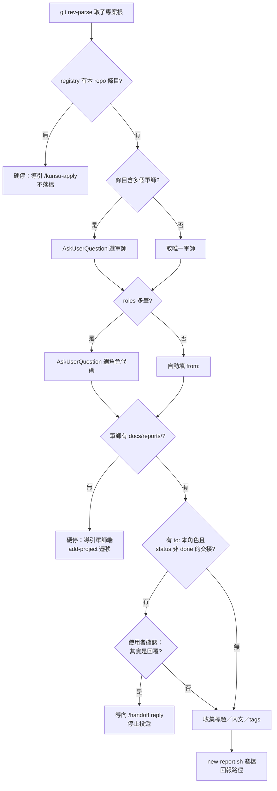

# feat: 上報信箱——docs/reports/ 第三信箱與 /kunsu-report skill

## Summary

依 ADR 008 落地上報信箱：軍師 repo 新增第三個例外授權信箱 `docs/reports/`，新增子專案端 `/kunsu-report` 投遞 skill 與軍師端 `scan-reports.sh` 掃描，scaffold 範本與 add-project 遷移三信箱化，最後完成 ivm／ebook 兩座既有軍師的 live 遷移與 ivm 孤兒上報檔歸位。

---

## Problem Frame

子專案「主動上報」（軍師未發起議題的情報回報）沒有正式管道，session 只能即興落檔：已發生一起錯投軍師 `docs/handoffs/` 頂層（tripwire 攔截），與一起以偽 handoff-reply 格式投入 `replies/` 的孤兒回覆——後者至今仍在 ivm 軍師中（`in_reply_to: none`，`/kunsu-inbox` 無法分類、永不歸檔收斂）。ADR 008（經 5-persona `/ce-doc-review` 審查、8 處修正）決議以第三信箱正式支持主動上報；本計畫是其實作計畫。

---

## Requirements

**A. Scaffold 與協議（軍師結構）**

- R1. kunsu-init 步驟 ④-4 新增 `docs/reports/` 與 `docs/reports/archive/` 目錄及兩層 `.gitkeep`（比照 `docs/applications/` 三行模式），說明段同格式補述「clone 後目錄需存在，否則掃描在首份上報前無從核對」。
- R2. `kunsu-claude.md` 範本：「兩個信箱是唯一的例外授權」與 tripwire 兩條 bullet 改三信箱表述；新增「上報信箱協議」章節，含投遞主體（子專案，僅新增新檔案、限頂層）、命名規則、frontmatter 範例（與 `new-report.sh` 輸出一致）、歸檔三步驟（Edit `status` → `git add` → `git mv` 至 `archive/`）。
- R3. 步驟 ④-6 的 PLANNER_STRUCTURE ASCII tree 補入 `reports/` 與 `reports/archive/` 兩列。
- R4. 步驟 ⑧ 驗收清單自 8 項擴為 11 項：`docs/reports/.gitkeep` 存在、`docs/reports/archive/.gitkeep` 存在、CLAUDE.md 含上報信箱協議（`grep -c 'docs/reports/'` > 0）。
- R5. `kunsu-docs-readme.md` 子目錄表補 `reports/` 與 `reports/archive/` 兩列；同表順手補齊 ADR 006 實作時漏列的 `applications/` 列（同一表格、同次編輯的完整性修正）。
- R6. 新增 `home-dataview-reports.md` 無佔位符範本（依 `type: report` 與 `status` 檢視上報），HOME.md 組裝步驟以 handoffs dataview 相同的附加方式加入；`PLACEHOLDERS.md` 的無佔位符範本清單同步補列。

**B. 子專案端投遞（/kunsu-report）**

- R7. 新增 `skills/kunsu-report/` skill，觸發詞依 ADR 008 Decision 5 分配：「上報軍師」「向軍師上報」「主動上報」「主動回報」「稟報軍師」；灰帶詞「跟軍師報告」「知會軍師」「反映給軍師」亦列入。
- R8. 自動偵測：`git rev-parse --show-toplevel` 取子專案根；以該路徑為鍵讀 registry 取本 repo 自身條目（非全域軍師聯集），多軍師條目時 AskUserQuestion 選定目標軍師。
- R9. 未登記硬停：registry 查無當前 repo 條目 → 停止並回報「此 repo 尚未登記，請先以 `/kunsu-apply` 申請加入」，不寫入任何檔案。
- R10. 多角色消歧：選定軍師的 `roles` 陣列多筆 → AskUserQuestion 列出供選；唯一時自動填入 `from:`。
- R11. 信箱守門：目標軍師無 `docs/reports/` → 報錯終止，文案導引「先在軍師端執行 `/kunsu-init add-project` 完成遷移」（同 kunsu-apply 守門的責任分工文案）。
- R12. report 側反向重導：投遞前 Glob 軍師 `docs/handoffs/*.md` 頂層，篩 `to:` 為本角色代碼且 `status` 非 `done`；有命中 → 反問「是否其實是回覆某份交接」並列候選，使用者確認為回覆時導向 `/handoff reply` 停止投遞。
- R13. `new-report.sh`：內文走 stdin；frontmatter 為 `title`／`type: report`／`from`（角色代碼）／`created`／`status: submitted`／`tags`（預設 `[report]`，可附主題標籤，掃描不解析）；檔名 `{DATE}-{slug}-report.md` 同日同名自動 `-2`、`-3`；stdout 最後一行輸出檔案完整路徑。

**C. 軍師端掃描與信箱回報**

- R14. `scan-reports.sh` 以 `scan-applications.sh` 為基底改寫：rename 分支置於迴圈最頂端（雙側核驗：src 為頂層 `.md` 且 dst 在 `archive/` 才豁免）；if/elif 依序為 `archive/*` 靜默豁免 → `docs/reports/.gitkeep` 豁免 → 頂層 `*.md`（以 `${path_part#docs/reports/}` 不含 `/` 二次驗證）分類 `NEW_REPORT:` 或 TRIPWIRE → 其餘路徑 TRIPWIRE；porcelain 呼叫帶 `-c core.quotepath=false` 與 `-uall`；exit code 0／1／2 語意與既有兩支一致。
- R15. 向後相容：軍師無 `docs/reports/` 時零筆輸出、exit 0（未遷移軍師不報錯）。
- R16. `kunsu-inbox` SKILL.md：4b-1 新增第三支腳本呼叫、4b-2 新增 `NEW_REPORT:` 前綴解析、4b-4 輸出範本新增第三段（「收到 {K} 份新上報（未 commit，等待審閱）」，零時「目前沒有待閱上報。」）、tripwire 訊息的授權歸檔豁免括號補上報信箱、授權邊界聲明第三條改「三個信箱」並列 `docs/reports/` 頂層；frontmatter description 的軍師模式說明列同步改為三信箱並列（新回覆、新申請、新上報）。
- R17. tripwire 行為不變：任一腳本 exit 2 → 立即停止彙整，回報格式沿用。

**D. 遷移與體系同步**

- R18. add-project 步驟 ②：於申請信箱遷移偵測之後新增 reports 遷移偵測，兩段各自獨立（`test -d docs/reports` 判定，互不依賴、依序執行）；缺目錄 → AskUserQuestion 提議補建 → 三步（目錄＋`.gitkeep`、Edit 插入上報信箱協議章節與例外授權 bullet 改寫、Grep 核查）；核查為 `grep -c 'docs/reports/'` > 0，且 `grep -c '兩個信箱是唯一的例外授權'` = 0（此為軍師 CLAUDE.md 雙信箱版 bullet 的專屬前綴，U3 改寫為三信箱後不復存在；勿縮短為「唯一的例外授權」——三信箱版本仍含該子串會誤命中；核查字串以 U3 範本定稿為準，注意勿誤用 kunsu-inbox SKILL.md 的「兩個信箱是唯讀邊界的唯一例外」措辭，兩處文字不同）；任一核查失敗回報不回滾、繼續後續步驟。
- R19. handoff SKILL.md reply 零筆分支：移除「該 skill 尚未提供時，如實告知目前無正式上報管道」過渡措辭，改為直接指向 `/kunsu-report` 投遞；版號 0.3.0 → 0.3.1。
- R20. `install.sh`：SKILLS 陣列加入 `kunsu-report`（第 5 個）、部署完成訊息同步列出。
- R21. 母體 repo 文件：CLAUDE.md Invariant 2 括號說明補 ADR 008 聯記（上報檔內容為暫態投遞，同申請之 `path` 論證）；README.md「例外授權雙信箱」bullet 改三信箱；CONCEPTS.md 新增「上報」詞條、「例外授權信箱」計數改三並列上報信箱、「回覆信箱」詞條補「有無對應交接為回覆與上報的唯一分界」判準。
- R22. live 遷移：ivm 與 ebook 兩座軍師補建 `docs/reports/` 結構、協議章節（走 add-project ② 流程或等效手動三步＋Grep 核查）、HOME.md 附加上報 dataview 區塊。
- R23. 孤兒歸位：ivm 軍師 `docs/handoffs/replies/2026-07-08-首頁搜尋鍵盤功能與Admin巡補頁色彩系統整體修正-reply-2026-07-08.md` `git mv` 至 `docs/reports/` 頂層，frontmatter 補正（`type: report`、移除 `in_reply_to`、`from: shun-tien` 保留、`status: submitted`、補入 `tags: [report]`），檔名保留原名以利歷史追溯；遷移後為已 commit 上報，超出掃描偵測範圍，由軍師手動開檔審閱、歸檔仍走三步驟。

**E. 強韌性**

- R24. 部署原子性：`scan-reports.sh` 與 `kunsu-inbox` SKILL.md 同一實作單元完成、單次 `install.sh` 部署上線，避免「腳本已部署、SKILL 未解析」的靜默盲區。
- R25. 端到端 dogfooding：於暫存目錄實跑 U7 場景清單（含中文檔名、未遷移向後相容、非 git 根），逐項核對輸出與 exit code。

---

## Key Technical Decisions

- **status 值域初版採單一 `archived`**：歸檔時 Edit `status: submitted` → `archived`。`incorporated`／`noted` 雙檔留待用量出現再升級（ADR open question 維持開放）；值域僅出現在範本協議章節文字，腳本不解析 `status`，升級時只改文字慣例、零程式改動。
- **`scan-reports.sh` 基底是 `scan-applications.sh`，不是 `scan-replies.sh`**：前者才有「含 `archive/` 子目錄的雙層信箱」同型結構。`docs/solutions/best-practices/git-porcelain-scan-script-pitfalls.md` 沉澱的三陷阱（`core.quotepath=false`、archive 分支先行＋頂層二次驗證、`git add` 先於 `git mv`）自第一行內建，不等 dogfooding 踩到。
- **上報不設冪等預檢**：申請有 `pending` 待審狀態需防重複投遞，上報依 ADR 為 append-only 情報、同主題多次投遞合法，防撞檔名即足——刻意不鏡射 kunsu-apply 步驟 4。
- **`new-report.sh` 介面混血**：防撞檔名迴圈與「stdout 最後一行＝路徑」慣例循 `new-application.sh`；內文走 stdin 循 `new-handoff.sh`（上報有本文，申請僅 frontmatter 欄位）。
- **HOME dataview 前提修正後仍納入**：審查階段曾以「與申請信箱對稱」為由建議，實查範本僅 handoffs 有 dataview、applications 並沒有；對稱論據不成立，但「Obsidian 檢視上報狀態」有獨立價值（status 值域的檢視需求即源於此），故照使用者確認納入 reports dataview。applications 的 dataview 補齊不在本計畫範圍（見 Scope Boundaries）。
- **歸檔為純手動三步驟，不建子指令**（ADR 008 Decision 4）：Edit `status` → `git add` → `git mv`；順序原因（untracked 檔直接 `git mv` 會 fatal）與 add-project 歸檔申請相同，逐字記入範本協議章節。
- **工具側先行、live 遷移殿後**：U1–U7 完成並部署後才執行 U8，遷移結果以部署後的 `/kunsu-inbox` 核查（沿角色分離計畫 U8 前例）。
- **`tags` 預設 `[report]`**：循 handoff 檔 `tags: [handoff]` 慣例；選填附加主題標籤供 Obsidian 分類，掃描腳本不解析此欄。

---

## High-Level Technical Design

`/kunsu-report` 投遞決策鏈（守門與重導均發生在寫入任何檔案之前）：

軍師端掃描分類規則（`scan-reports.sh`，if/elif 順序即權威順序）詳 R14；`/kunsu-inbox` 軍師模式擴為三支腳本依序執行、三段輸出，tripwire「任一 exit 2 即停」語意不變。

---

## Implementation Units

### U1. /kunsu-report skill 與 new-report.sh

- **Goal**：子專案端可用一句口語完成上報投遞，全部守門與重導在落檔前完成。
- **Requirements**：R7–R13、R20
- **Dependencies**：無（可先行）
- **Files**：`skills/kunsu-report/SKILL.md`（新增）、`skills/kunsu-report/scripts/new-report.sh`（新增）、`install.sh`
- **Approach**：SKILL.md 結構鏡射 `skills/kunsu-apply/SKILL.md`（frontmatter 觸發詞 → 授權邊界 → 執行步驟 → 依賴聲明），步驟為偵測 → registry（本 repo 自身條目，非全域聯集）→ 未登記硬停 → 選軍師／角色 → 信箱守門 → 反向重導 → AskUserQuestion 收集標題與 tags → 內文整理 → 呼叫腳本。腳本防撞與輸出慣例見 KTD「介面混血」。
- **Patterns to follow**：`skills/kunsu-apply/SKILL.md`（守門文案、降級路徑、AskUserQuestion 用法）、`skills/kunsu-apply/scripts/new-application.sh`（slug 規則、防撞迴圈）、`skills/handoff/scripts/new-handoff.sh`（stdin 內文）。
- **Test scenarios**：
  - 未登記 repo 執行 → 回報導引 `/kunsu-apply`、軍師目錄零新檔。
  - 已登記、軍師缺 `docs/reports/` → 回報導引 add-project、零新檔。
  - 正常投遞 → 檔案落在軍師 `docs/reports/` 頂層、frontmatter 六欄齊、stdout 最後一行為路徑。
  - 同日同標題二次投遞 → 產生 `-2` 檔，不覆寫。
  - 存在 `to:` 本角色 open 交接時投遞 → 先反問；選「是回覆」→ 不落檔。
  - 中文標題 slug → 檔名合法、內容完整。
- **Verification**：上述場景於暫存目錄實跑通過（U7 彙總執行）；`install.sh` 部署後新 session 觸發詞可命中。

### U2. scan-reports.sh 與 kunsu-inbox 三信箱化

- **Goal**：軍師端掃描第三信箱並在 `/kunsu-inbox` 回報，tripwire 邊界延伸而語意不變。
- **Requirements**：R14–R17、R24
- **Dependencies**：無（與 U1 平行）
- **Files**：`skills/kunsu-inbox/scripts/scan-reports.sh`（新增）、`skills/kunsu-inbox/SKILL.md`
- **Approach**：腳本以 `scan-applications.sh` 全文為基底，替換信箱路徑與 `NEW_APPLICATION:` → `NEW_REPORT:` 前綴，保留分支順序、雙側核驗、`.gitkeep` 豁免、exit code 三值與標頭註解（archive 先行原因）。SKILL.md 三處同步（4b-1／4b-2／4b-4）＋授權邊界第三條。兩檔同單元、同次部署（R24）。
- **Patterns to follow**：`skills/kunsu-inbox/scripts/scan-applications.sh`（唯一權威基底）；`docs/solutions/best-practices/git-porcelain-scan-script-pitfalls.md`。
- **Test scenarios**（每條核對輸出前綴與 exit code）：
  - 頂層 untracked 新增 `.md` → `NEW_REPORT:`、exit 0。
  - 頂層既有檔修改／刪除 → `TRIPWIRE:`、exit 2。
  - 頂層→`archive/` rename → 豁免、exit 0。
  - `archive/`→頂層 rename → `TRIPWIRE:`、exit 2。
  - `archive/` 內新增 → 豁免、exit 0。
  - `docs/reports/.gitkeep` untracked → 豁免、exit 0。
  - 中文檔名 → 路徑完整無 octal escape。
  - 無 `docs/reports/` 目錄 → 零輸出、exit 0。
  - 非 git repo 根 → stderr 報錯、exit 1。
- **Verification**：九場景暫存目錄實跑全過；`/kunsu-inbox` 軍師模式輸出含第三段、任一腳本 exit 2 時停止彙整。

### U3. kunsu-init scaffold 三信箱化

- **Goal**：新 scaffold 的軍師天生具備上報信箱結構、協議與檢視。
- **Requirements**：R1–R6
- **Dependencies**：無（與 U1、U2 平行）
- **Files**：`skills/kunsu-init/SKILL.md`（④-4、④-6、⑧）、`skills/kunsu-init/assets/templates/kunsu-claude.md`、`skills/kunsu-init/assets/templates/kunsu-docs-readme.md`、`skills/kunsu-init/assets/templates/home-dataview-reports.md`（新增）、`skills/kunsu-init/assets/templates/PLACEHOLDERS.md`
- **Approach**：④-4 加三行（mkdir＋兩個 touch）與說明句；④-6 tree 加兩列；⑧ 驗收 8→11 項。範本協議章節結構鏡射「申請信箱協議」六 bullet 形制，內含歸檔三步驟與 frontmatter yaml 範例；例外授權與 tripwire bullet 改三信箱枚舉。`home-dataview-reports.md` 為無佔位符範本，逐字複製使用。
- **Patterns to follow**：`kunsu-claude.md` 申請信箱協議章節、`home-dataview-handoffs.md`（dataview 結構與使用提醒形制）。
- **Test scenarios**：
  - 全新 scaffold 實跑 → 驗收 11 項全過（含三條 reports 新項）。
  - 產出 CLAUDE.md 無 `{{` 殘留、協議章節 frontmatter 範例與 `new-report.sh` 輸出欄位一致。
  - HOME.md 含上報 dataview 區塊且 Obsidian 可渲染（欄位名與 frontmatter 一致）。
- **Verification**：暫存目錄 scaffold 一座新軍師，驗收清單逐項通過（U7 彙總執行）。

### U4. add-project reports 遷移偵測

- **Goal**：既有軍師可經審核流程順路補建上報信箱，兩段遷移互不牽連。
- **Requirements**：R18
- **Dependencies**：U3（協議章節文字來源為更新後的 `kunsu-claude.md` 範本）
- **Files**：`skills/kunsu-init/SKILL.md`（add-project 步驟 ② 段）
- **Approach**：於申請信箱遷移偵測後新增獨立偵測段，結構原樣複製既有三步流程（AskUserQuestion 提議 → 補建＋Edit → Grep 核查），僅替換目錄、協議章節與核查字串；明文標注「兩段偵測各自獨立、依序執行、單段失敗回報後續段照常」。既有步驟 ②「申請遷移被拒 → 直接跳步驟 ⑤」的硬跳須重組：拆為 ②-a（申請偵測）與 ②-b（上報偵測），②-a 結果（ok／migrated／skipped）以變數記錄、不立即跳轉，②-b 執行完畢後才依 ②-a 結果決定跳步驟 ⑤ 或續步驟 ③——確保拒絕申請遷移不會靜默跳過上報偵測。
- **Patterns to follow**：add-project 步驟 ② 現行申請信箱遷移段（含「失敗不回滾」處置）。
- **Test scenarios**：
  - 軍師同時缺兩信箱 → 依序提議補建兩段、各自核查通過。
  - 僅缺 reports（applications 已遷移，即 ivm／ebook 現況）→ 只觸發 reports 段。
  - applications 缺失且使用者拒絕、reports 同時缺失 → 仍提議補建 reports，完成後才依拒絕結果跳轉步驟 ⑤。
  - Edit 錨點不存在（模擬使用者手改 CLAUDE.md）→ 回報核查失敗、目錄保留、流程繼續。
- **Verification**：暫存目錄以三種前置狀態實跑（U7 彙總執行）。

### U5. handoff 零筆分支收尾

- **Goal**：`/handoff` reply 的 kunsu 語境分支在零筆時直接把使用者送進上報管道。
- **Requirements**：R19
- **Dependencies**：U1（`/kunsu-report` 需已存在，指向才成立）
- **Files**：`skills/handoff/SKILL.md`
- **Approach**：改寫 reply 步驟 1 零筆分支句尾與多筆「均非所指」引用；版號 0.3.0 → 0.3.1。
- **Patterns to follow**：現行零筆分支文案（v0.3.0 預埋處）。
- **Test scenarios**：Test expectation: none——純文案改寫，無行為面；正確性由 U7 端到端場景（零待回交接時口語「回覆軍師」）覆蓋。
- **Verification**：零筆情境下 skill 指引語含 `/kunsu-report` 且無過渡措辭。

### U6. 母體文件與 CONCEPTS 同步

- **Goal**：母體 repo 的協議表述與詞彙表跟上三信箱現實。
- **Requirements**：R21
- **Dependencies**：主體文件改動可與 U1–U5 平行；驗收 grep 須待 U2 完成（`kunsu-inbox` SKILL.md 改為三信箱表述）後執行
- **Files**：`CLAUDE.md`、`README.md`、`CONCEPTS.md`
- **Approach**：Invariant 2 括號說明補 ADR 008 聯記；README 例外授權 bullet 改三信箱枚舉；CONCEPTS 三處（新增「上報」詞條於信箱協作節、「例外授權信箱」計數與並列、「回覆信箱」補判準句）。
- **Patterns to follow**：CONCEPTS.md 既有詞條格式（一段定義＋Avoid 列）。
- **Test scenarios**：Test expectation: none——純文件同步；一致性由 `grep -rn "兩個信箱\|雙信箱"` 核對母體 repo 僅餘歷史文件（ADR、既往計畫）命中。
- **Verification**：上述 grep 核對通過；CONCEPTS 詞條與 ADR 008 Decision 2 判準文字一致。

### U7. 端到端 dogfooding

- **Goal**：全鏈路（scaffold → 投遞 → 掃描回報 → 歸檔 → 遷移）在暫存目錄實證通過後才進 live 遷移。
- **Requirements**：R25（彙總執行 U1–U5 的場景清單）
- **Dependencies**：U1–U5 完成並經 `install.sh` 部署
- **Files**：無新檔（暫存目錄實跑，產物不入 repo）
- **Approach**：暫存目錄 scaffold 新軍師＋假子專案（含臨時 registry 條目），依序跑：scaffold 驗收 11 項 → `/kunsu-report` 六場景 → `scan-reports.sh` 九場景 → `/kunsu-inbox` 三段輸出與 tripwire → 歸檔三步驟後再掃零筆 → 零待回交接的 reply 重導文案核對 → add-project 三種遷移前置狀態。結束清理暫存 registry 條目。
- **Patterns to follow**：申請信箱與 toolkit 計畫的 dogfooding 慣例（場景逐項核對 exit code 與輸出）。
- **Test scenarios**：即 U1–U5 各單元場景清單的彙總執行，外加跨單元鏈路：投遞 → 軍師 `/kunsu-inbox` 回報第三段 → 歸檔 → 再掃零筆零誤報；以及零待回交接情境——暫存子 repo 無待回交接時口語「回覆軍師」觸發 `/handoff` reply kunsu 語境分支，核對指引語含 `/kunsu-report` 且不含舊過渡措辭（即 U5 Verification 條件）。
- **Verification**：全場景通過；任何失敗回到對應單元修復後重跑，不帶病進 U8。

### U8. live 遷移與孤兒歸位

- **Goal**：兩座既有軍師具備上報信箱，ivm 孤兒上報檔進入正常生命週期。
- **Requirements**：R22、R23
- **Dependencies**：U7（工具全部驗證通過並已部署）
- **Files**：跨 repo 操作——目標為 ivm 與 ebook 軍師 repo（路徑見 registry）：各自的 `CLAUDE.md`、`docs/reports/` 結構、`docs/HOME.md`；ivm 另有孤兒檔搬移（`docs/handoffs/replies/2026-07-08-首頁搜尋鍵盤功能與Admin巡補頁色彩系統整體修正-reply-2026-07-08.md` → `docs/reports/`）。
- **Approach**：逐軍師執行 add-project ② 的 reports 遷移段（或等效手動三步＋Grep 核查），HOME.md 附加上報 dataview。ivm 孤兒檔操作序（先改後搬，確保 frontmatter 異動一併入 commit）：Edit frontmatter（`type: report`、刪 `in_reply_to`、`status: submitted`、補 `tags: [report]`）→ `git add`（untracked 與已 commit 兩種前置皆安全）→ `git mv` 至 `docs/reports/` 頂層 → commit 前以 `git status` 確認無殘餘未暫存異動（有則補 add）→ commit。搬移橫跨 `docs/handoffs/` 側，`scan-replies.sh` 會如設計對未 commit 的 rename 觸發 tripwire——遷移完成後即刻 commit 收斂（軍師 repo 的 commit 依其慣例徵得使用者同意）。
- **Execution note**：跨 repo 寫入，每座軍師動工前向使用者確認；先 ebook（無孤兒、單純補建）後 ivm（含孤兒搬移）。
- **Patterns to follow**：角色分離計畫 U8 的 live 遷移模式（工具先行、遷移後以新工具核查）。
- **Test scenarios**：
  - ebook：遷移後 `/kunsu-inbox` 三段輸出、零上報零誤報。
  - ivm：孤兒搬移 commit 前 tripwire 如設計回報；commit 後 `/kunsu-inbox` 三段皆零、無 TRIPWIRE 殘留（已 commit 的上報超出掃描偵測範圍，後續由軍師手動開檔審閱、依協議三步驟歸檔）。
  - 兩軍師 CLAUDE.md 協議 Grep 核查通過、HOME.md dataview 渲染正常。
- **Verification**：兩軍師以部署後的 `/kunsu-inbox` 實跑核對；孤兒檔在 `docs/reports/` 中 frontmatter 六欄合規。

---

## Scope Boundaries

### Deferred to Follow-Up Work

- applications 的 HOME dataview 補齊（本計畫僅為 reports 新增；對稱化留待有實際檢視需求）。
- `status` 值域升級為 `incorporated`／`noted` 雙檔（ADR open question，待用量）。
- 「軍師已讀」輕量標記與上報量成長後的整理慣例（ADR open questions）。
- 信箱掃描腳本抽象化（三支腳本線性增長的整合點，ADR 系列尚未討論）。
- add-project 之外的獨立遷移入口（既有軍師僅兩座且本計畫 U8 直接遷畢，需求消滅）。
- add-project 的 reports 遷移不含 HOME.md dataview 附加（scaffold 與 U8 live 遷移已涵蓋現有需求；未來若有第三座軍師經 add-project 遷移，需手動補 dataview——記為已知落差）。

### Outside this product's identity

- SessionStart hook（ADR 002 Decision 3，第二階段另議）。
- `/handoff` 升版改查註冊表（ADR 002 Decision 6，獨立延後決策）。
- 角色改名的追溯修復工具化（ADR 007 open question）。

---

## Risks & Dependencies

- **Edit 錨點脆弱（U4、U8）**：live 軍師 CLAUDE.md 可能被手改，錨點字串未必存在。緩解：Grep 特徵字串核查、失敗明確回報並提示手動補入、不回滾已建目錄（沿申請信箱 R18 模式）。
- **觸發詞灰帶跨 session 一致性**：灰帶詞可能路由不穩。緩解：雙向重導兜底（ADR Decision 6），路由錯誤僅多一次重導、不產生錯投檔案；實際誤判率留待使用觀察。
- **孤兒搬移的 tripwire 誤解風險（U8）**：`git mv` 未 commit 期間 `scan-replies.sh` 會回報異常，屬設計內行為而非缺陷——單元內明文預告並以即刻 commit 收斂，避免操作者誤判。
- **半更新風險**：SKILL 文字與腳本、範本與 live 軍師若只改一側即成不一致（ADR 005 遷移核查教訓）。緩解：R24 同單元部署、U6 的 grep 全域核對、U8 的 Grep 核查。

---

## Sources & Research

- `docs/adr/2026-07-08-adr-candidate-008-report-inbox-triple-mailbox.md`——決策來源（origin），經 5-persona 審查與 8 處修正。
- `docs/solutions/best-practices/git-porcelain-scan-script-pitfalls.md`——porcelain 掃描三陷阱，R14 與 KTD 直接引用。
- `skills/kunsu-inbox/scripts/scan-applications.sh`——分類分支順序與雙側核驗的權威基底。
- `skills/kunsu-apply/SKILL.md`、`skills/kunsu-apply/scripts/new-application.sh`——投遞管線、守門文案、防撞檔名範本。
- `docs/plans/2026-07-07-001-feat-application-inbox-plan.md`——同型前例計畫（結構版型與強韌性需求群組的前置教訓）。
- `docs/plans/2026-07-08-001-refactor-role-code-description-separation-plan.md`——live 遷移殿後與 Edit 錨點緩解模式。
- ivm 軍師 repo `docs/handoffs/replies/2026-07-08-首頁搜尋鍵盤功能與Admin巡補頁色彩系統整體修正-reply-2026-07-08.md`——孤兒上報真實案例（`from: shun-tien`、`in_reply_to: none`）。
