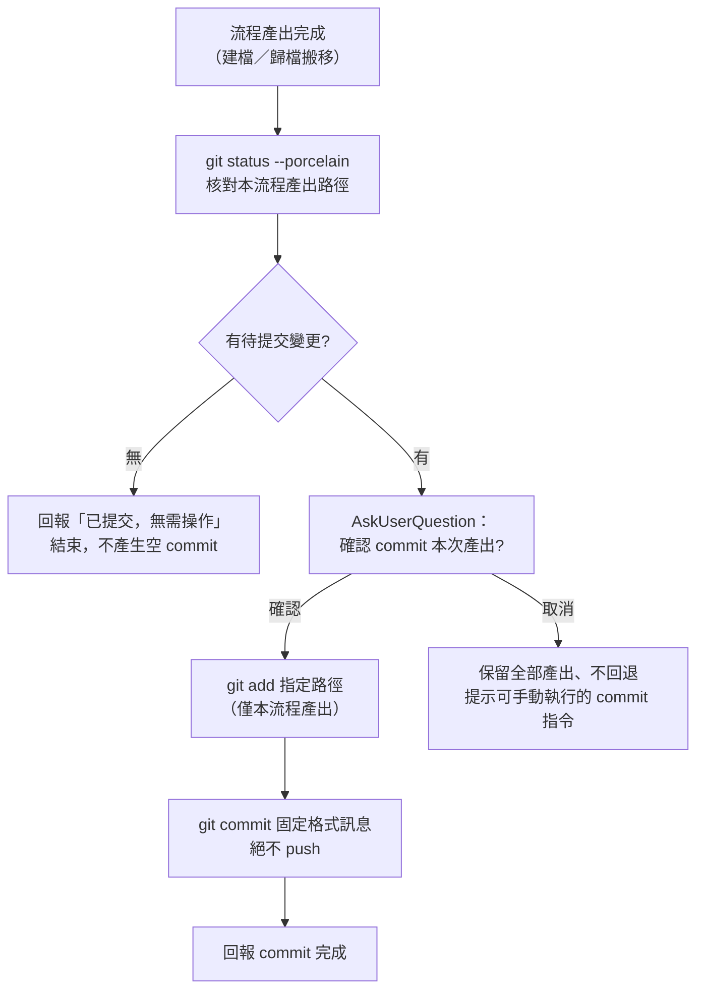
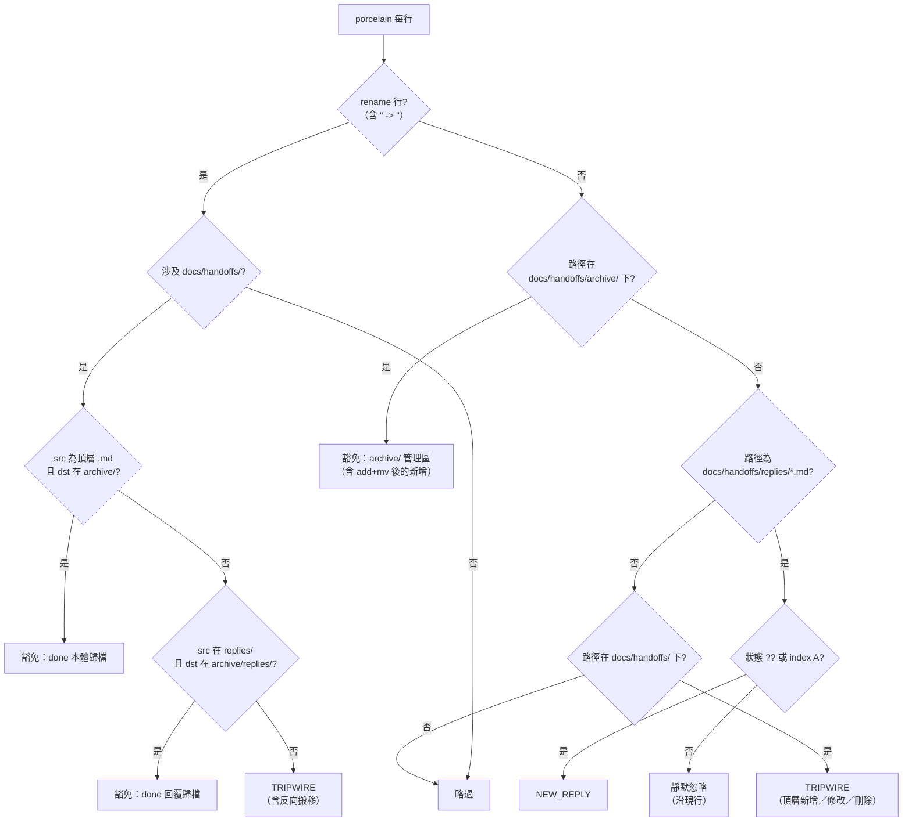

# feat: 協議 commit 逐次確認制與 handoffs 授權歸檔豁免

## Summary

把 kunsu 軍師側／發起側流程尾端的 commit 升級為「AskUserQuestion 確認一次 → 執行」的協議步驟（範圍限本次流程產出檔案、訊息固定格式、絕不 push），全域「不主動 commit」規則不動；並比照 `scan-applications.sh` 的雙側核驗模式，讓 `scan-replies.sh` 豁免 `/handoff done` 的授權歸檔搬移。投遞端（kunsu-apply／kunsu-report／kunsu 語境 reply）維持不 commit——未 commit 是信箱的「新件」訊號。

---

## Problem Frame

kunsu 協議以「未 commit 即未處理」作為信箱狀態機的轉移標記，tripwire 以「授權範圍外的未 commit 變更」作為異常判準。全域規範「不主動 commit」使流程尾端的產出（新交接檔、done 歸檔搬移、審核歸檔）長期懸置於未 commit 狀態：`/handoff done` 的 `git mv` 在 `scan-replies.sh` 現行「任何涉及 `docs/handoffs/` 的 rename 一律 tripwire」規則下必然誤觸，`/kunsu-inbox` 隨之硬停；新建交接檔未 commit 同樣觸發。commit 在此協議中不是版控便利而是狀態轉移，缺了它協議語意就斷鏈。本計畫以「逐次確認即為使用者明確要求」化解規則衝突，是 ADR 002 Decision 5「人工閘門不動」的強化落地，不是新原則。

---

## Requirements

**A. 確認 commit 制（軍師側／發起側）**

- R1. `/handoff add` 步驟 4 的「不要主動 commit」改為確認 commit 步驟：AskUserQuestion 確認後 `git add` 本次建立的交接檔 → `git commit`（固定訊息格式，見 KTD），不 push；使用者取消則保留檔案，並附後續手動 commit 的具體指令提示。
- R2. `/handoff done` 歸檔完成後同樣加確認 commit；`git mv` 前以 `git status --porcelain` 檢查交接本體與回覆檔，對 untracked（`??`）者一律先 `git add` 再 `git mv`（比照 add-project 步驟 ④-4 既有做法）；SKILL.md 明載步驟 3（Edit status）與步驟 4–5（git mv）須連續執行，中間不得執行 `/kunsu-inbox`；確認 commit 於步驟 6（跨文件連結修正）之後執行，`git add` 清單包含歸檔目的地路徑與步驟 6 修改的所有檔案路徑。
- R3. `/handoff reply` 語境分岔：回覆檔落點與當前 repo 相同（本地語境）→ 加確認 commit；落點在另一 repo（kunsu 語境，軍師 `replies/`）→ 維持不 commit，並向使用者一句話說明「未 commit 是軍師信箱的新回覆訊號」。判定以回覆檔絕對路徑是否位於 `git rev-parse --show-toplevel` 結果之下為準，不以觸發語推斷。
- R4. add-project 步驟 ⑩ 的「commit 提醒」段整段改為確認 commit 步驟，舊提醒文字刪除、不得兩種說法並存；`git add` 範圍限本 repo 內產出（軍師 CLAUDE.md、申請歸檔搬移），`~/.claude/kunsu-registry.json` 為 repo 外全域檔、明示不入 commit。
- R5. 上報歸檔：範本上報信箱協議的歸檔三步驟擴為四步（Edit `status` → `git add` → `git mv` → 確認 commit），並補「前三步連續執行、`git mv` 完成前不執行 `/kunsu-inbox`」警語（手動流程的中間態 `M` 狀態無豁免覆蓋，靠流程原子性）；`/kunsu-inbox` 4b-4 上報段的歸檔指引同步改為四步表述。
- R6. 確認 commit 通用防護（各觸發點一致）：執行前以 `git status --porcelain` 核對指定路徑確有待提交變更，無變更則回報「相關檔案已提交，無需操作」且不產生空 commit；只 `git add` 本流程產出的具體路徑，不用 `git add -A` 或整目錄打包；絕不 push。
- R7. 投遞端不變：kunsu-apply、kunsu-report 與 kunsu 語境 reply 維持「不主動 commit」文字，並不受本計畫任何改動影響。

**B. scan-replies.sh 授權歸檔豁免**

- R8. rename 段以 `scan-applications.sh` 的解析模式重構：引入 `strip_quotes` 函式、src／dst 拆分後分別驗證。現行單字串比對無法做雙側核驗，重構是實作前提，不在舊邏輯上打補丁。
- R9. 豁免三形狀：(a) `docs/handoffs/<頂層>.md → docs/handoffs/archive/*` 的 rename（src 以 `${src#docs/handoffs/}` 不含 `/` 二次驗證為頂層）；(b) `docs/handoffs/replies/*.md → docs/handoffs/archive/replies/*` 的 rename；(c) `docs/handoffs/archive/` 下的所有路徑變更——靜默略過，不做狀態欄篩選（與 `scan-applications.sh` 對 archive/ 的既有取捨一致：歸檔區屬軍師管理範圍；untracked 檔先 `git add` 再 `git mv` 後在 porcelain 呈現為 `A` 新增而非 rename，亦涵蓋在內）。
- R10. tripwire 保留項全數不變：反向搬移（archive → 頂層或 replies）、其他任何 rename、頂層既有檔的修改與刪除、頂層 untracked 新交接檔——全部維持觸發；`replies/` 頂層已 commit 回覆的修改沿現行靜默忽略；`NEW_REPLY` 判定回歸不變。
- R11. archive 豁免分支必須置於 `docs/handoffs/*` catch-all 之前（bash `[[ ]]` 的 glob `*` 可跨 `/`，順序即分類邊界）；`scan-applications.sh` 的安全註解等量移植（為何 archive 靜默豁免、為何順序敏感、豁免的威脅模型）。
- R12. 不驗 src／dst basename 同名：與 `scan-applications.sh`、`scan-reports.sh` 一致僅驗路徑形狀，於註解記錄此取捨。

**C. ADR 與文件**

- R13. 先產 ADR candidate 009（協議 commit 確認制：commit 升格為協議步驟、投遞端不對稱維持、handoffs 授權歸檔豁免延伸），定位為 ADR 002 Decision 5 的強化落地；經審視後標 accepted 再動工實作單元。
- R14. 範本 `kunsu-claude.md` 同步三處：回覆信箱協議的授權歸檔括號說明改為三信箱豁免並列（交接歸檔豁免落地後不再是未豁免例外）；上報信箱協議依 R5 擴為四步；版本控制段補「協議流程尾端的確認 commit 為授權操作」一句。
- R15. 母體文件同步：`CLAUDE.md`（開發狀態新條目、專案結構中 handoff 與 kunsu-inbox 的說明文字與版號）、`docs/README.md`（目前狀態段與文件清單補 ADR 009 與本計畫）、`CONCEPTS.md`（「授權歸檔」詞條補交接歸檔豁免、「未 commit 即未處理」詞條補確認 commit 的收斂語意、新增「確認 commit」詞條）。
- R16. `kunsu-inbox` SKILL.md 同步：4b-3 tripwire 訊息的豁免括號改三信箱並列，正常操作舉例改寫（done 歸檔已豁免、不再出現於清單；補「剛執行 `/handoff add` 尚未確認 commit 亦會觸發」提示）；4b-4 上報段依 R5 改寫；依賴聲明段補 handoff done 歸檔豁免慣例、handoff 版號引用更新。
- R17. 版本升版：handoff `0.3.1 → 0.4.0`、kunsu-init `0.1.0 → 0.2.0`、kunsu-inbox `0.2.0 → 0.3.0`；依既有慣例於對應 commit 訊息末尾標注版號。

**D. 遷移與部署**

- R18. live 遷移：ivm 與 ebook 兩座既有軍師的 CLAUDE.md 協議文字同步（R14 的三處等效修改）；以錨點文字 grep 核查後才 Edit，錨點不存在則停下人工比對，不盲改。
- R19. 部署原子性：`scan-replies.sh` 與三份 SKILL.md、範本全部完成後單次 `install.sh` 部署；不得分批上線（避免「腳本已豁免、SKILL 未更新」或反向的靜默盲區）。
- R20. 端到端 dogfooding：暫存目錄實跑 U8 場景清單，必含兩個中間態場景——「done 歸檔後、確認 commit 前執行 `/kunsu-inbox` 不誤報 tripwire」與「取消確認 commit 後流程產出保留、提示含可手動執行的 commit 指令」。

---

## Key Technical Decisions

- **確認制，而非全自動或純提醒**：AskUserQuestion 逐次確認即構成「使用者明確要求」，與全域「不主動 commit」規則相容，全域規則零改動。先例為 kunsu-init 步驟 ⑥（初始 commit 經確認後執行，FAQ 明載允許理由）；本計畫把 add-project 既有的「提醒模式」升格為「確認執行模式」，並將允許理由從「新建 repo 初始 commit」擴為「協議流程尾端對自身產出的收斂 commit」。
- **投遞端不對稱維持**：commit 在信箱協議中是狀態機轉移（未 commit＝未處理／新件），投遞方 commit 會摧毀「新件」訊號、令軍師信箱漏報。確認制只涵蓋軍師側與發起側，此不對稱與例外授權信箱的不對稱同構，記入 ADR 009。
- **commit 訊息固定格式**：統一 `docs:` 類型、「動詞＋對象檔名」結構——add：`docs: 建立交接 <檔名>`；done：`docs: 歸檔交接 <檔名>`；reply（本地）：`docs: 回覆交接 <檔名>`；add-project：`docs: 審核申請 <子專案顯示名>（核准）`；上報歸檔：`docs: 歸檔上報 <檔名>`。用語可於實作時微調，結構固定。
- **reply 語境判定以落點為準**：口語觸發詞可能誤導（「回覆軍師」也可能在軍師 repo 內本地執行），一律以回覆檔實際落點是否在當前 repo 根之下判定。
- **豁免以 scan-applications.sh 為基底移植，不打補丁**：`docs/solutions/best-practices/git-porcelain-scan-script-pitfalls.md` 沉澱的三陷阱（`core.quotepath=false`、archive 分支先行＋頂層二次驗證、`git add` 先於 `git mv`）自第一行內建。現行 scan-replies.sh 的「任一側即 tripwire」是 replies 單層結構時代的保守寫法，本計畫引入 archive 歸檔後該前提不再成立。
- **done 中間態靠流程原子性，不靠豁免**：Edit 後、`git mv` 前的 ` M` 狀態無豁免覆蓋，SKILL.md 明載連續執行約束即足，不為理論上的中間態開豁免洞。注意 `git mv` 只暫存 rename、**不暫存 working tree 修改**（實測 porcelain 呈現 `RM`——rename 已 stage、status 修改未 stage，staged 內容仍是舊版）：確認 commit 的 `git add` 必須包含歸檔目的地路徑（`docs/handoffs/archive/<檔名>`）把 `status: done` 一併暫存，不可誤以為 `git mv` 已處理而省略。rename 豁免僅驗路徑形狀、不看 XY 狀態碼，`RM` 行同樣豁免。上報歸檔為手動流程、中間態暴露時間更長，協議文字以警語約束（R5）。
- **上報歸檔確認點掛範本協議文字**：上報歸檔無專屬 skill 子指令，AI 依軍師 CLAUDE.md 協議執行歸檔時依協議文字觸發確認 commit；純手動歸檔（不經 AI）無確認點——此落差明示接受，待 ADR 008 open question 的歸檔子指令評估時一併考慮。
- **不驗 basename 同名**：`/handoff done` 的 `git mv` 天然同名，既有兩支掃描腳本也僅驗路徑形狀；為一致性與精簡不加驗，取捨記入註解（R12）。

---

## High-Level Technical Design

確認 commit 通用序列（R1、R2、R4、R5 共用，R6 防護內建）：

`scan-replies.sh` 重構後的分類決策（if／elif 順序即權威順序，archive 分支先於 catch-all）：

流程 × 確認 commit 覆蓋矩陣：

| 流程 | 執行位置 | 確認 commit | 依據 |
|------|----------|-------------|------|
| `/handoff add` | 發起方 repo（任意） | ✓ | R1 |
| `/handoff done` | 發起方 repo（任意） | ✓ | R2 |
| `/handoff reply`（本地語境） | 回覆檔在本 repo | ✓ | R3 |
| `/handoff reply`（kunsu 語境） | 回覆檔在軍師 repo | ✗（新回覆訊號） | R3、R7 |
| add-project 審核歸檔 | 軍師 repo | ✓ | R4 |
| 上報歸檔（依協議） | 軍師 repo | ✓（範本文字掛點） | R5 |
| `/kunsu-apply`、`/kunsu-report` 投遞 | 子專案 → 軍師信箱 | ✗（新件訊號） | R7 |
| `/kunsu-inbox` 查詢 | 軍師／子 repo | ✗（唯讀，不變） | — |

---

## Implementation Units

### U1. ADR candidate 009——協議 commit 確認制

- **Goal**：把「commit 升格為協議步驟」的決策與其邊界（投遞端不對稱、豁免延伸、全域規則不動）落成 ADR candidate，審視通過後作為 U2–U8 的依據。
- **Requirements**：R13
- **Dependencies**：無（先行）
- **Files**：`docs/adr/2026-07-09-adr-candidate-009-protocol-commit-confirmation.md`（新增）
- **Approach**：結構循 ADR 006／008 前例（Context → Decisions → Consequences → Open Questions）。Decisions 至少涵蓋：確認制的授權論證（逐次確認＝明確要求，ADR 002 Decision 5 強化）、覆蓋矩陣（HTD 表格）、commit 訊息格式、scan-replies.sh 豁免三形狀與保留項、上報歸檔掛點落差。Open Questions 記「純手動歸檔無確認點」與「歸檔子指令化」留待用量評估。
- **Test scenarios**：Test expectation: none——決策文件，無行為面。
- **Verification**：ADR 經審視標 accepted；決策項與本計畫 R1–R12 一一對應無矛盾。

### U2. scan-replies.sh 重構與授權歸檔豁免

- **Goal**：`/handoff done` 的歸檔搬移不再誤觸 tripwire，同時所有既有 tripwire 保護與 `NEW_REPLY` 判定不變。
- **Requirements**：R8–R12
- **Dependencies**：U1
- **Files**：`skills/kunsu-inbox/scripts/scan-replies.sh`
- **Approach**：rename 段整段以 `scan-applications.sh` 行 79–101 的模式重寫（`strip_quotes`、src／dst 拆分、雙側核驗），再加 handoffs 特有的第二豁免形狀（replies → archive/replies）；非 rename 分支新增 `docs/handoffs/archive/` 靜默豁免，置於現有 replies 分支之前、`docs/handoffs/*` catch-all 之前；檔頭註解更新偵測條件與豁免說明，安全註解等量移植。
- **Patterns to follow**：`skills/kunsu-inbox/scripts/scan-applications.sh`（解析模式、分支順序、註解密度）、`docs/solutions/best-practices/git-porcelain-scan-script-pitfalls.md`（三陷阱）。
- **Test scenarios**（暫存目錄 fixture repo 直測腳本，逐項核對 stdout 與 exit code）：
  - 頂層交接檔 `git mv` 至 `archive/`（`R` 狀態）→ 無輸出、exit 0。
  - 已 commit 交接檔先 Edit 再 `git mv` 至 `archive/`（`RM` 狀態）→ 無輸出、exit 0（豁免僅驗路徑形狀，不看狀態碼）。
  - 回覆檔 `git mv` 至 `archive/replies/`（`R` 狀態）→ 無輸出、exit 0。
  - untracked 回覆 `git add` 後 `git mv` 至 `archive/replies/`（呈現為 `A` 新增）→ 無輸出、exit 0。
  - `archive/` 檔案搬回頂層（反向）→ `TRIPWIRE`、exit 2。
  - `replies/` 檔案搬至頂層（移出信箱）→ `TRIPWIRE`、exit 2。
  - 頂層 untracked 新交接檔（`??`）→ `TRIPWIRE`、exit 2。
  - 頂層既有交接檔修改（` M`）→ `TRIPWIRE`、exit 2。
  - `replies/` 下 untracked 新回覆（`??`）→ `NEW_REPLY`、exit 0（回歸）。
  - `replies/` 下已 commit 回覆被修改（` M`）→ 靜默忽略、exit 0（回歸）。
  - 含空格與中文檔名的歸檔 rename → 引號剝除正確、豁免成立。
  - 非 git 根路徑參數 → stderr 錯誤、exit 1（回歸）。
- **Verification**：全部場景通過；與 `scan-applications.sh` 的分支結構逐段對照無邏輯漂移。

### U3. handoff SKILL.md——add／done／reply 確認 commit（v0.4.0）

- **Goal**：三個子指令的尾端行為與協議一致：add 與 done 確認 commit、reply 依語境分岔。
- **Requirements**：R1、R2、R3、R6、R7（reply kunsu 語境文字）
- **Dependencies**：U1；U2（done 確認 commit 依賴豁免已就位，否則中間態誤報）
- **Files**：`skills/handoff/SKILL.md`
- **Approach**：三處「不要主動 commit」（行 102、144、174）分別改寫。add 尾端與 done 尾端插入統一格式的確認 commit 步驟（HTD 序列：porcelain 核對 → AskUserQuestion → `git add` 指定檔 → `git commit` 固定訊息 → 回報；取消 → 保留＋手動指令提示）。done 另補：步驟 4 前對本體與回覆檔的 untracked 檢查與 `git add` 前置、步驟 3–5 連續執行約束一行；確認 commit 置於步驟 6 之後，`git add` 必含歸檔目的地路徑（`git mv` 不暫存 working tree 修改，`status: done` 靠此步帶入）與步驟 6 修改的檔案。reply 步驟 4 改為語境判定（回覆檔落點 repo 比對）後分岔，kunsu 語境明載不 commit 的一句話理由。frontmatter version 升 `0.4.0`。
- **Patterns to follow**：`skills/kunsu-init/SKILL.md` 步驟 ⑥（AskUserQuestion 確認後 commit 的問句與 FAQ 說明結構）、行 471–475（`git add` 先於 `git mv` 的引注寫法）。
- **Test scenarios**（暫存目錄 dogfooding，AI 實跑 skill 流程）：
  - 一般 repo `/handoff add` → 確認 → 產生一筆 `docs: 建立交接 <檔名>` commit，working tree 乾淨。
  - `/handoff add` → 取消 → 檔案保留為 untracked，回報含可手動執行的 commit 指令。
  - `/handoff done`（本體已 commit、有一份已 commit 回覆）→ 兩筆 `git mv` ＋確認 commit 一次完成，`archive/` 與 `archive/replies/` 成對。
  - `/handoff done`（本體或回覆為 untracked）→ 先 `git add` 再 `git mv`，不出現 `not under version control` 錯誤。
  - 軍師 repo 內 `/handoff reply`（本地語境）→ 確認 commit 成立。
  - 子專案跨 repo `/handoff reply`（kunsu 語境）→ 不 commit，回報含「新回覆訊號」說明。
  - 流程前使用者已手動 commit 全部產出 → 確認步驟回報「已提交，無需操作」，無空 commit。
- **Verification**：七場景通過；SKILL.md 中不再存在無條件的「不要主動 commit」字樣（kunsu 語境 reply 的不 commit 為有條件敘述；grep 時注意原文含 markdown bold 標記）；`grep -c "連續執行" skills/handoff/SKILL.md` 大於 0（done 連續執行約束已落地）。

### U4. kunsu-init SKILL.md——add-project 確認 commit（v0.2.0）

- **Goal**：add-project 審核歸檔尾端從「提醒模式」升格為「確認執行模式」，舊文字不殘留。
- **Requirements**：R4、R6
- **Dependencies**：U1
- **Files**：`skills/kunsu-init/SKILL.md`
- **Approach**：步驟 ⑩ 行 598–600 的「commit 提醒」段整段替換為確認 commit 步驟（同 HTD 序列）；`git add` 對象明列為軍師 CLAUDE.md 與 `docs/applications/archive/<檔名>`，並明示 registry 不入 commit（repo 外全域檔）。frontmatter version 升 `0.2.0`（含 U5 範本改動一併生效）。
- **Patterns to follow**：本檔步驟 ⑥ 的 AskUserQuestion 先例與「為何允許」FAQ 寫法。
- **Test scenarios**（暫存目錄 dogfooding）：
  - 完整申請審核核准 → 歸檔 → 確認 → 一筆 `docs: 審核申請 <名>（核准）` commit，內容僅含 CLAUDE.md 與歸檔搬移，不含 registry。
  - 取消確認 → 登記與歸檔結果保留、提示手動指令；再跑 `/kunsu-inbox` 不誤報（歸檔搬移本有豁免）。
- **Verification**：兩場景通過；`grep -c "請使用者確認後自行執行或指示執行" skills/kunsu-init/SKILL.md` 為 0（舊提醒文字已清除）。

### U5. 範本 kunsu-claude.md——三處協議文字同步

- **Goal**：新 scaffold 出的軍師自帶確認 commit 協議與正確的三信箱豁免表述。
- **Requirements**：R5（範本側）、R14
- **Dependencies**：U1
- **Files**：`skills/kunsu-init/assets/templates/kunsu-claude.md`
- **Approach**：三處編輯——回覆信箱協議的授權歸檔括號（行 69 附近）改為「三信箱的授權歸檔搬移均已被掃描規則豁免」表述；上報信箱協議歸檔三步驟擴為四步（第 4 步確認 commit）＋連續執行警語；版本控制段（行 136–137）補「協議流程尾端的確認 commit 為授權操作」。
- **Patterns to follow**：範本既有協議章節的語氣與 bullet 密度；上報協議段落結構（`Edit status → git add → git mv` 的逐字慣例）。
- **Test scenarios**：Test expectation: none——純範本文字；行為面由 U8 scaffold 驗收場景覆蓋（新 scaffold 軍師的 CLAUDE.md 含四步歸檔與確認 commit 字樣）。
- **Verification**：`grep` 三處錨點文字各命中一次；PLACEHOLDERS.md 無需變動（無新佔位符）。

### U6. kunsu-inbox SKILL.md——tripwire 訊息與依賴聲明同步（v0.3.0）

- **Goal**：tripwire 訊息與豁免現實一致，使用者能從訊息自行判斷觸因。
- **Requirements**：R5（4b-4 側）、R16
- **Dependencies**：U1、U2（訊息描述的豁免行為以 U2 落地為前提）
- **Files**：`skills/kunsu-inbox/SKILL.md`
- **Approach**：4b-3 tripwire 訊息改寫——豁免括號改「三信箱（回覆、申請、上報）的授權歸檔搬移已被掃描規則豁免」；正常操作舉例移除「/handoff done 的歸檔搬移尚未 commit」（已豁免、不會再出現於清單），改舉「剛執行 /handoff add 尚未確認 commit」。4b-4 上報段歸檔指引改四步表述。依賴聲明表補 done 歸檔豁免慣例（頂層→archive、replies→archive/replies 成對）、handoff 版號引用改 v0.4.0。frontmatter version 升 `0.3.0`。
- **Patterns to follow**：本檔 4b-3／4b-4 既有訊息範本的格式。
- **Test scenarios**（暫存目錄 dogfooding，配合 U2 腳本）：
  - 軍師 repo 有 done 歸檔未 commit ＋一份新回覆 → `/kunsu-inbox` 正常列出新回覆、不報 tripwire。
  - 軍師 repo 有頂層 untracked 新交接檔 → tripwire 訊息含「/handoff add 尚未確認 commit」提示。
- **Verification**：兩場景通過；SKILL.md 內不殘留「done 歸檔會觸發 tripwire」的舊表述。

### U7. 母體文件與 CONCEPTS 同步

- **Goal**：母體 repo 的索引與詞彙表反映新協議。
- **Requirements**：R15、R17（版號在 CLAUDE.md 專案結構的引用）
- **Dependencies**：U1–U6（內容定稿後撰寫）
- **Files**：`CLAUDE.md`、`docs/README.md`、`CONCEPTS.md`
- **Approach**：CLAUDE.md 開發狀態「已完成」補本功能條目（含 ADR 009 連結與三個版號）、專案結構的 handoff／kunsu-inbox 說明文字更新；docs/README.md 目前狀態段與文件清單補列；CONCEPTS.md 三處詞條依 R15（「授權歸檔」豁免範圍改三信箱、「未 commit 即未處理」補確認 commit 收斂、新增「確認 commit」詞條——協議流程尾端經 AskUserQuestion 逐次授權的收斂 commit，與全域不主動 commit 規則的關係）。
- **Test scenarios**：Test expectation: none——純文件。
- **Verification**：CLAUDE.md 開發狀態、docs/README.md、CONCEPTS.md 三處交叉引用一致（ADR 編號、版號、詞條名）。

### U8. 部署、live 遷移與端到端 dogfooding

- **Goal**：單次原子部署上線，兩座 live 軍師協議同步，全鏈路實測通過。
- **Requirements**：R18、R19、R20
- **Dependencies**：U2–U7 全部完成
- **Files**：（部署與遷移操作，無母體 repo 檔案變更；ivm／ebook 軍師 CLAUDE.md 為 repo 外目標）
- **Approach**：先單次 `install.sh` 部署（copy 模式）；再對兩座軍師執行 R18 的錨點核查＋三處 Edit（每座軍師各一筆確認 commit，正好首次實跑新協議）；最後暫存目錄端到端 dogfooding。
- **Test scenarios**（端到端，聚合 U2／U3／U4／U6 場景之外的整合面）：
  - 新 scaffold 一座軍師 → CLAUDE.md 含四步上報歸檔與確認 commit 字樣（U5 驗收）。
  - 完整 handoff 生命週期：add（確認 commit）→ 子專案 reply（kunsu 語境不 commit）→ 軍師 `/kunsu-inbox` 見新回覆 → 彙整 → done（歸檔＋確認 commit）→ 再跑 `/kunsu-inbox` 乾淨無報。
  - done 歸檔後、確認 commit 前插跑 `/kunsu-inbox` → 不誤報 tripwire（中間態豁免成立）。
  - 取消確認 commit → 產出保留、提示含手動指令；後補 commit 後 `/kunsu-inbox` 乾淨。
  - live 軍師遷移後 `/kunsu-inbox` 正常（協議文字變更不影響掃描）。
- **Verification**：五場景通過；兩座軍師 CLAUDE.md 錨點 grep 核查通過；`~/.claude/skills/` 部署內容與 repo 一致（diff 抽查 scan-replies.sh 與三份 SKILL.md）。

---

## Scope Boundaries

- **全域 `~/.claude/CLAUDE.md` 的「不主動 commit」規則不動**——確認制的相容性論證使其無需修改。
- **tripwire 其他分類不放寬**：頂層 untracked 新交接檔、頂層修改刪除、反向搬移全部維持觸發；豁免僅及授權歸檔的三形狀。
- **軍師「彙整回覆後 commit」不加 skill 內建確認**：彙整不是 skill 子指令（`/kunsu-inbox` 只告知不開工），彙整後的 commit 由使用者下令，維持現狀。

### Deferred to Follow-Up Work

- 上報歸檔專屬子指令化（ADR 008 open question）——落地後可把上報歸檔的確認 commit 從範本文字掛點升級為 skill 內建。
- basename 同名驗證強化（若未來出現改名歸檔的誤用再議）。
- applications 的 HOME dataview 補齊等既有已知落差（沿上報信箱計畫的 Scope Boundaries，不因本計畫改變）。

---

## Risks & Dependencies

- **live 軍師文字漂移**：兩座軍師的 CLAUDE.md 可能經人為改動，錨點文字或已不符。緩解：R18 的「grep 錨點 → 命中才 Edit → 不命中停下人工比對」流程（沿 add-project 遷移偵測前例）。
- **豁免弱化 archive/ 偵測面**：豁免 archive/ 內新增後，直接寫入 archive/ 的異常不再被攔。威脅模型與 `scan-applications.sh` 已接受的取捨等價（會寫 archive/ 的只有 done 流程，且投遞腳本只往 replies/ 寫），於 U2 註解記錄。
- **AskUserQuestion 依賴互動環境**：headless／pipeline 情境無法確認。skill 文字以互動為預設；headless 情境自然退化為「不 commit＋提示」，與現狀相同、不劣化。
- **部署時序**：U2 豁免與 U3 done 確認 commit 互為前提（先部署 U3 而無 U2 → done 後掃描誤報）。緩解：R19 單次部署，dogfooding 於部署後執行。
