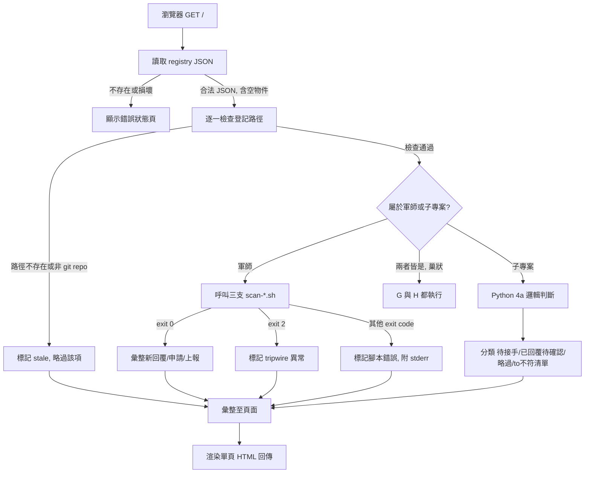

# kunsu 訊息聚合本機 Dashboard

## Summary

獨立本機 FastAPI 服務，彙整全域反向註冊表裡所有軍師與子專案的 kunsu 訊息狀態（交接、申請、上報），每次刷新瀏覽器頁面即同步觸發全新掃描，取代目前逐一切換 CLI 視窗手動執行 `/kunsu-inbox` 的做法。封裝為 `skills/kunsu-dashboard/`，沿用現有 skill 目錄部署慣例，但執行時完全不經過 Claude Code session。

## Problem Frame

使用者同時維運多個 kunsu 網路（軍師＋子專案各自獨立 CLI 視窗），`/kunsu-inbox` 只能逐一手動觸發，造成注意力被切割、回頭處理時要重新確認脈絡。研究確認 Claude Code 原生 Agent View、第三方 claude-view 與 MCP 路線都解不了「知道 kunsu 信箱內容」這個需求（見 origin 文件）。本計畫聚焦如何落地這個缺口的填補方式。

---

## Requirements

**資料聚合**

- R1. 每次觸發掃描時讀取全域反向註冊表 `~/.claude/kunsu-registry.json`，取得全部登記的軍師與子專案路徑，並對每個路徑做存在性與 git repo 有效性檢查；失效者標記為 stale，不執行後續掃描。
- R2. 對通過檢查的每個軍師路徑，呼叫既有 `scan-replies.sh`／`scan-applications.sh`／`scan-reports.sh`，取得新回覆／新申請／新上報清單與 tripwire 狀態。
- R3. 對通過檢查的每個子專案路徑，以 Python 判斷交接文件「待接手」／「已回覆待確認」／略過，邏輯對齊 `/kunsu-inbox` 步驟 4a。

**呈現與刷新**

- R4. 掃描結果彙整為單一網頁，依軍師分組與子專案分組呈現；同一 repo 同時符合兩種身分（巢狀拓撲）時，在兩個分組各自出現一次。
- R5. 資料新鮮度由使用者刷新瀏覽器頁面觸發，每次刷新同步重新執行 R1–R3，不使用背景計時器或背景執行緒。
- R6. 伺服器需使用者手動啟動，不隨開機或既有 Claude Code session 自動啟動。

**安全邊界延續**

- R7. tripwire（scan 腳本 exit code 2）與 stale（路徑或 git repo 檢查失敗）分別以不同視覺樣式標示，不得混同或靜默略過；有問題的區塊不得拖垮其餘區塊的正常呈現。

**封裝與依賴**

- R8. 新增 `skills/kunsu-dashboard/`，沿用現有 skill 目錄慣例（`SKILL.md` ＋程式碼子目錄），由 `install.sh` 一併部署；`SKILL.md` 僅作啟動說明，不涉及 Claude Code 觸發執行邏輯。
- R9. 新增 pip 依賴（`fastapi`、`uvicorn[standard]`、`PyYAML`）以 `requirements.txt` 宣告，安裝步驟寫在 `SKILL.md`；`install.sh` 本身不負責安裝依賴。

**治理**

- R10. 新增一份 ADR 候選，記錄本工具與 CLAUDE.md Invariant 1（純 skill＋範本，不建編譯型工具）如何共存及例外條件。

---

## Key Technical Decisions

- **單檔 sync FastAPI app，`HTMLResponse` 字串回傳，不用 Jinja2**：頁面內容量小，f-string 拼接零額外依賴；未來若渲染邏輯膨脹可再引入 Jinja2。
- **啟動方式為 `python main.py`，非 `uvicorn main:app` CLI 呼叫**：`main.py` 內 `if __name__ == "__main__":` 區塊以 `uvicorn.run(app, host="127.0.0.1", port=<port>, reload=False, workers=1)` 程式化啟動。`uvicorn main:app` 的 CLI 呼叫不會執行這個區塊，程式化寫死的 `reload=False`／`workers=1` 因而不生效、且 `$WEB_CONCURRENCY` 環境變數仍可能被繼承——`python main.py` 是唯一能讓這些保護實際生效的啟動方式。
- **依賴管理用 `requirements.txt`，不用 `pyproject.toml`**：單機個人工具，不需要被 `pip install` 成套件，`pyproject.toml` 對此規模過度工程化。
- **子程序呼叫一律加 `timeout`**：`subprocess.run(..., timeout=15)`，避免任一登記路徑的 git 指令卡住拖垮整頁刷新；逾時視為該區塊失敗，比照 stale 樣式呈現。
- **掃描前置存在性＋git repo 有效性檢查，取代依賴 exit code 1**：對每個登記路徑先做路徑存在性與 `git rev-parse --show-toplevel` 驗證，失敗者標記 stale、不呼叫掃描腳本，避免 exit code 1（參數錯誤／非 git repo 根）與 tripwire（exit code 2）在使用者眼中混同。
- **4a 判斷邏輯以獨立 Python 實作，不與 SKILL.md 抽共用來源**：接受兩處維護成本，靠測試守住行為一致；若之後維護成本過高再評估重構共用（見 Scope Boundaries）。`skills/kunsu-inbox/SKILL.md` 步驟 4a 上方須加一行維護提示（「修改本步驟時，`skills/kunsu-dashboard/app/subrepo_status.py` 需同步更新並重跑其測試」），讓下一個修改 4a 的 session 主動看到這個耦合，而不是只留在本計畫的 Risks 段落。
- **巢狀拓撲不合併呈現**：比照 `/kunsu-inbox` 步驟 5 的「兩段依序輸出」慣例，同一 repo 在軍師分組與子專案分組各自出現一次，不做跨分組合併卡片。
- **所有端點僅回傳 `text/html`，不提供 JSON／XML 等結構化格式端點**：這是 [ADR 010](../adr/2026-07-11-adr-candidate-010-dashboard-service-exception.md) Decision 第 1 項第 5 條的硬性條件，把「只服務人類瀏覽器、不是機器對機器介面」從意圖聲明變成可檢查的技術約束；U4 實作與後續任何新增路由都不得違反，否則本工具不再符合 Invariant 1 例外的適用範圍，需重新走 ADR 評估。

---

## High-Level Technical Design



---

## Output Structure

```
skills/kunsu-dashboard/
  SKILL.md
  requirements.txt
  app/
    main.py
    registry.py
    kunsu_scan.py
    subrepo_status.py
  tests/
    test_registry.py
    test_kunsu_scan.py
    test_subrepo_status.py
    test_main.py
```

---

## Implementation Units

### U6. ADR：Invariant 1 例外承認

- **Goal:** 新增 ADR 候選文件，正式記錄本工具引入常駐服務型架構的例外理由與邊界條件，並在 U1–U5 動工前完成至少一輪審閱。
- **Requirements:** R10
- **Dependencies:** 無——但本單元須**先於 U1–U5 完成**（含至少一輪 `/ce-doc-review`）才開始寫程式碼。理由：本專案 ADR 001–009 全數先於對應功能落地；若讓 U1–U5（本工具首次引入 pip 依賴與常駐服務）先合併，ADR 010 會從治理關卡淪為事後追認文件——一旦審閱認為例外條件不成立，U1–U5 已落地的程式碼需要回撤。
- **Files:**
  - `docs/adr/2026-07-11-adr-candidate-010-dashboard-service-exception.md`（新增）
- **Approach:** 依本專案既有 ADR 格式（參考 `docs/adr/2026-07-06-adr-candidate-002-relay-automation-registry-inbox.md` 的 Decision／Consequences 結構）撰寫，內容須包含以下三項，缺一則審閱視為不完整：
  1. **例外範圍界定**（僅限本機單使用者唯讀查詢工具，刷新觸發、非背景輪詢、無多使用者服務）——且至少一項條件須具備「可證偽性」，能實際駁回未來某個表面相似但不該套用此例外的提案（例如：不得有 launchd／cron 等自主重啟路徑；啟動與停止必須由使用者手動掌握，不得由其他 skill 或排程觸發）。
  2. **與 ADR 001 的 MCP 論述明確區隔**：ADR 001 駁回 MCP 部分理由是「增加常駐 process 與設定負擔」，而本工具同樣引入常駐 process——ADR 010 必須寫出機制層級的區別（例如：唯讀彙整本機已存在的檔案 vs. 引入新傳輸層／協定），而不僅是「使用情境不同」這種立場層級的區別，否則無法回應「為何 MCP 不行、這個可以」的質疑。
  3. 未來若有其他工具想比照此例外時的判斷條件。
- **Test scenarios:**
  - Test expectation: none -- 純文件產出，無程式行為需要測試。
- **Verification:** ADR 內容經至少一輪 `/ce-doc-review` 並取得使用者確認後，U1 才開始動工；CLAUDE.md「開發狀態」段落是否同步更新留給 `ce-work` 執行時視情況處理。

### U1. Registry 讀取與路徑健康檢查

- **Goal:** 讀取全域反向註冊表，對每個登記路徑做存在性與 git repo 有效性檢查，輸出結構化的「可掃描清單」與「stale 清單」。
- **Requirements:** R1, R7
- **Dependencies:** U6（ADR 審閱通過後才開始寫程式碼，見 U6 說明）
- **Files:**
  - `skills/kunsu-dashboard/app/registry.py`（新增）
  - `skills/kunsu-dashboard/tests/test_registry.py`（新增）
- **Approach:** 移植 `skills/kunsu-list/scripts/registry-list.sh` 的 JSON 讀取邏輯（處理「檔案不存在」「JSON 損壞」「合法空物件」三種情況，改為結構化回傳而非文字輸出）。對每個唯一路徑（軍師路徑與子專案路徑聯集），依序執行路徑存在性檢查與 `git -C <path> rev-parse --show-toplevel`（帶 timeout）；任一失敗即標記 stale。輸出結構含 `healthy` 清單、`stale` 清單、`registry_error`。
- **Test scenarios:**
  - happy path：合法 registry，全部路徑存在且為有效 git repo → 全數進 healthy，stale 為空
  - edge case：registry 檔案不存在 → 回傳對應 `registry_error`，不拋例外
  - edge case：registry JSON 格式損壞 → 回傳對應 `registry_error`，訊息與檔案不存在情境不同
  - edge case：registry 為合法空物件 `{}` → healthy 與 stale 皆為空清單，`registry_error` 為 None
  - error path：登記路徑存在但不是 git repo（如目錄被清空重建）→ 標記 stale，不拋例外
  - error path：登記路徑完全不存在 → 標記 stale
- **Verification:** 對五種 registry 情境（正常、不存在、損壞、空物件、含 stale 路徑）分別驗證輸出結構符合預期分類。

### U2. 軍師模式掃描整合

- **Goal:** 對 U1 判為 healthy 的軍師路徑呼叫既有三支掃描腳本，解析輸出並分類 tripwire。
- **Requirements:** R2, R7
- **Dependencies:** U1
- **Files:**
  - `skills/kunsu-dashboard/app/kunsu_scan.py`（新增）
  - `skills/kunsu-dashboard/tests/test_kunsu_scan.py`（新增）
- **Patterns to follow:** `skills/kunsu-inbox/scripts/scan-replies.sh`、`scan-applications.sh`、`scan-reports.sh` 的輸出格式（`NEW_REPLY:`／`NEW_APPLICATION:`／`NEW_REPORT:`／`TRIPWIRE:` 前綴行，exit code 0/1/2 語意）。
- **Approach:** 腳本絕對路徑以 `Path(__file__).resolve()` 為基準往上推算至 `kunsu-inbox/scripts/`（例如 `Path(__file__).resolve().parents[2] / "kunsu-inbox" / "scripts"`），在 `install.sh` 的 `cp -R` 與 `--link` 兩種部署模式下皆能正確定位（`--link` 模式為目錄 symlink，`resolve()` 會正確跟隨至來源路徑）；不得硬編 `~/.claude/skills/...` 絕對路徑，避免與 `--link` 開發模式脫鉤。對每個 healthy 軍師路徑，依序以 `subprocess.run(["bash", <腳本絕對路徑>, kunsu_path], capture_output=True, text=True, timeout=15)` 呼叫三支腳本；逐行解析 stdout 依前綴分類。exit code 2 標記該軍師 tripwire 異常並附上 `TRIPWIRE:` 行內容；非 0 非 2 的 exit code（U1 已排除非 git repo 根，理論上僅剩腳本自身異常）標記為腳本錯誤並附 stderr，與 tripwire 視覺樣式區分（見 U4）。
- **Test scenarios:**
  - happy path：三支腳本皆 exit 0，各回傳若干筆 `NEW_*:` 行 → 正確解析成新回覆／新申請／新上報清單
  - happy path：三支腳本皆 exit 0，零筆結果 → 回傳空清單，不視為異常
  - edge case：`TRIPWIRE:` 為 rename 形式（`src -> dst`）→ 正確解析雙側路徑
  - error path：任一腳本 exit code 2 → 該軍師標記 tripwire，停止彙整該軍師（比照 SKILL.md 4b-3「立即停止」），不影響其他軍師
  - error path：任一腳本非預期 exit code → 標記為腳本錯誤，附 stderr，與 tripwire 視覺區分
  - integration：對暫存 git repo fixture（含已知未 commit 檔案）呼叫真實三支腳本 → 驗證解析結果與腳本實際輸出一致
- **Verification:** 針對三支腳本的 exit code 0/2/非預期三種情境個別驗證分類正確；對暫存 fixture repo 跑過整合測試確認端到端一致。

### U3. 子專案模式狀態判斷（4a Python 版）

- **Goal:** 對 U1 判為 healthy 的子專案路徑，重現 `/kunsu-inbox` 步驟 4a 的「待接手／已回覆待確認／略過」判斷邏輯。
- **Requirements:** R3
- **Dependencies:** U1
- **Files:**
  - `skills/kunsu-dashboard/app/subrepo_status.py`（新增）
  - `skills/kunsu-dashboard/tests/test_subrepo_status.py`（新增）
- **Patterns to follow:** `skills/kunsu-inbox/SKILL.md` 步驟 4a-1 至 4a-4（角色代碼聯集、frontmatter 讀取、`in_reply_to` 精確比對、日期／n 數值排序取最新回覆）；`docs/solutions/best-practices/git-porcelain-scan-script-pitfalls.md` 陷阱三（判斷交接文件是否為「頂層」須用不遞迴的路徑比對，避免 `archive/` 內已歸檔項目被誤判為待接手）。
- **Approach:** 用不遞迴的 glob（如 `Path(kunsu_path, "docs/handoffs").glob("*.md")`）取頂層交接文件，天然排除 `replies/`／`archive/` 子目錄；讀 YAML frontmatter（`title`／`from`／`to`／`created`），一律以 `yaml.safe_load()` 解析，嚴禁 `yaml.load()`（後者允許執行任意 Python 代碼，frontmatter 內容來自其他協作者可寫入的子專案 repo，不可信任其安全性）；比對角色代碼集合分三類（納入主流程／`to:` 不符清單／略過）。回覆比對：同法取 `docs/handoffs/replies/*.md`，解析檔名中的 `{date}` 與可選 `{n}` 後綴，依 `(date, n)` 數值降序排序取最新，依 `status` 分類。函式輸出需包含第四類「to: 不符清單」，供 U4 渲染。
- **Test scenarios:**
  - Covers AE1. happy path：交接文件無任何回覆 → 分類為「待接手」
  - Covers AE2. happy path：最新回覆 `status: submitted` → 分類為「已回覆待確認」
  - Covers AE3. happy path：最新回覆 `status: done` → 不列出
  - edge case：最新回覆 `status: partial` 或 `status: blocked` → 分類為「待接手」
  - edge case：同日多份回覆（`-2`、`-3` 後綴）→ 依數值排序取最大 n 者為最新，不可用字串字典序排序
  - edge case：交接文件 `to:` 值不在此軍師任何已知角色代碼集合中 → 加入「to: 不符清單」，不歸類於待接手或已回覆待確認
  - error path：交接文件 frontmatter 缺少必要欄位（如缺 `to`）→ 不拋例外，該筆歸入異常清單，不中斷其餘交接文件的判斷
- **Verification:** 針對 SKILL.md 4a-3 表格列出的五種回覆狀態組合逐一驗證分類正確；同日多份回覆排序以至少一組含 `-2` 後綴的 fixture 驗證數值排序而非字串排序。

### U4. FastAPI 應用與 HTML 渲染

- **Goal:** 提供 `GET /` 路由，彙整 U1–U3 結果渲染成單頁 HTML，處理空登記、stale、tripwire、腳本錯誤、巢狀拓撲的呈現。
- **Requirements:** R4, R5, R6, R7
- **Dependencies:** U1, U2, U3
- **Files:**
  - `skills/kunsu-dashboard/app/main.py`（新增）
  - `skills/kunsu-dashboard/tests/test_main.py`（新增，使用 FastAPI `TestClient`）
- **Approach:** `main.py` 內同步 `def index()` 路由：呼叫 U1 → 對 healthy 路徑依身分分流呼叫 U2／U3（同一路徑若同時符合軍師與子專案身分，兩者都呼叫）→ 組裝成軍師分組與子專案分組兩個 HTML 區塊，f-string 拼接回傳 `HTMLResponse`。子專案分組內「to: 不符清單」項目以獨立標示的警示列呈現（不歸入待接手或已回覆待確認）。所有來自 registry、frontmatter 或 scan 腳本輸出、會被插入 HTML 的字串一律先經 `html.escape()`（`from html import escape`，標準函式庫零新依賴）再拼接，防止協作者寫入的 frontmatter 內容（如 `title`）帶有 HTML／script 標籤時被瀏覽器執行。空 registry（`healthy` 與 `stale` 皆空且無 `registry_error`）顯示「目前沒有任何已登記的軍師或子專案」而非錯誤樣式；`registry_error` 存在時顯示對應錯誤訊息。
- **Technical design:**
  ```
  for path in all_registered_paths:
      if path in stale: render_stale_card(path); continue
      if path is a kunsu (軍師身分): render_kunsu_section(kunsu_scan_result[path])
      if path is a subrepo (子專案身分): render_subrepo_section(subrepo_status_result[path])
      # 兩個 if 皆可能為真（巢狀拓撲），各自獨立渲染，不合併
  ```
  （方向性虛擬碼，非最終程式碼結構）
- **Test scenarios:**
  - Covers AE4. happy path：一個軍師 tripwire、其餘軍師與子專案正常 → 該軍師區塊顯示異常標示，其餘區塊正常渲染
  - happy path：至少一軍師、一子專案皆有正常掃描結果 → 兩分組皆正確渲染
  - edge case：registry 為空物件 → 顯示「無登記」訊息，非錯誤樣式
  - edge case：registry 檔案不存在／損壞 → 顯示對應錯誤訊息，回應 HTTP 200（非 500），避免瀏覽器顯示通用錯誤頁
  - edge case：某路徑同時符合軍師與子專案身分（巢狀）→ 在軍師分組與子專案分組各出現一次
  - edge case：某路徑被標記 stale → 顯示 stale 樣式，與 tripwire／腳本錯誤樣式視覺可區分
  - edge case：子專案的交接文件屬「to: 不符清單」→ 以獨立警示列呈現，不落入待接手或已回覆待確認
  - edge case：frontmatter `title` 內含 `<script>` 等 HTML 標籤字元 → 渲染後的 HTML 原始碼中該字元已被轉義，不構成可執行標籤
  - integration：對含多種狀態組合（healthy 軍師、tripwire 軍師、stale 路徑、待接手子專案、已回覆待確認子專案、to 不符清單）的完整 fixture registry，驗證單頁 HTML 同時正確呈現全部類別
- **Verification:** 用 FastAPI `TestClient` 對 `/` 發請求，驗證回應 HTTP 200 與 HTML 內容含各狀態對應的可辨識標記；並驗證回應 `Content-Type` 為 `text/html`，`app` 內未定義任何回傳 JSON 的路由（比對 ADR 010 Decision 第 1 項第 5 條）。

### U5. 啟動、依賴打包與部署整合

- **Goal:** 讓 dashboard 可透過標準指令啟動，pip 依賴有清楚安裝路徑，並整合進現有部署慣例。
- **Requirements:** R6, R8, R9
- **Dependencies:** U4
- **Files:**
  - `skills/kunsu-dashboard/SKILL.md`（新增，啟動說明用途，不涉及 Claude Code 觸發邏輯）
  - `skills/kunsu-dashboard/requirements.txt`（新增：`fastapi`、`uvicorn[standard]`、`PyYAML`）
  - `install.sh`（修改：`SKILLS` 陣列加入 `kunsu-dashboard`）
- **Approach:** `SKILL.md` 內容為純文字操作說明：需 Python 3.10 以上（FastAPI 0.139.0／uvicorn 0.51.0 皆要求 `>=3.10`；macOS 內建系統 Python 通常為 3.9，不足時提示以 Homebrew 或 pyenv 安裝較新版本），首次使用需 `pip install -r requirements.txt`；啟動指令 `python main.py --port <port>`，`main.py` 內以 `argparse` 接收 `--port` 並呼叫 `uvicorn.run(app, host="127.0.0.1", port=port, reload=False, workers=1)`。此 `SKILL.md` 不使用觸發語慣例格式，因為此工具刻意不透過 Claude Code 觸發，純粹借用目錄部署慣例。`install.sh` 沿用既有 `cp -R` ／ `--link` 邏輯，pip 依賴安裝維持手動步驟，不在 `install.sh` 內自動執行。
- **Test scenarios:**
  - Test expectation: none -- 此單元為文件與部署腳本設定，無行為邏輯需要單元測試。
- **Verification:** 以 `install.sh --link` 執行後確認 `~/.claude/skills/kunsu-dashboard/` 為正確 symlink；依 `SKILL.md` 步驟手動執行 `pip install -r requirements.txt` 與啟動指令，確認伺服器可在 `127.0.0.1` 對應 port 回應。

---

## Scope Boundaries

**Deferred for later**
- 背景／排程自動刷新（launchd／cron）——留待手動版用出實際手感後再評估。

**Outside this product's identity**
- Session 執行狀態總覽（Agent View／FleetView／claude-view 類）——不是這個 dashboard 的範圍。
- MCP-based 方案——本專案 [ADR 002](../adr/2026-07-06-adr-candidate-002-relay-automation-registry-inbox.md) 已評估並明確延後（非否決；重啟評估訊號為跨機器協作，或需讓無法執行 Claude hooks／skills 的 agent 型別化存取信箱，目前皆未出現）。

**Deferred to Follow-Up Work**
- 4a 邏輯若日後兩處維護成本過高，重構為 `SKILL.md` 與 Python 共用來源。
- `docs/solutions/` 補充本次開發教訓（Python 呼叫 shell 腳本解析慣例、Invariant 1 例外判斷條件）——待落地後由 `/ce-compound` 處理。

---

## Risks & Dependencies

- **風險：首次引入 pip 依賴，最低 Python 版本為 3.10** — 查證 PyPI 確認 FastAPI 0.139.0 與 uvicorn 0.51.0（2026-07 當前穩定版）皆標示 `Requires: Python >=3.10`。macOS 內建系統 Python（Monterey／Ventura 隨附版本）通常為 3.9，不滿足此門檻；`pip install -r requirements.txt` 會直接失敗且錯誤訊息不易理解。緩解：`SKILL.md` 明確寫「需要 Python 3.10 以上（`python3 --version` 確認），系統內建版本不足時以 Homebrew（`brew install python@3.12`）或 pyenv 安裝」。
- **風險：subprocess 逾時值可能不夠或過長** — 15 秒為初始預設，實作時如發現大型 repo 的 `git status` 耗時更久可調整，不視為阻塞規劃的問題。
- **風險：登記路徑數量增長後單次刷新延遲累加** — 每個路徑的 git／腳本呼叫依序執行，最差情境（多個路徑同時逾時）延遲會隨路徑數線性累加；正常情境（本機 git repo）單次呼叫通常在 1 秒內完成，暫不視為需要並行化的理由，若實際使用後發現刷新明顯變慢再評估 `concurrent.futures` 並行呼叫。
- **依賴：三支 `scan-*.sh` 腳本輸出格式維持不變** — 若未來修改前綴格式或 exit code 語意，U2 需同步更新。
- **依賴：`skills/kunsu-inbox/SKILL.md` 步驟 4a 邏輯若變更，U3 需人工同步**（已在 Key Technical Decisions 接受此風險，並已加維護提示緩解）。
- **依賴：`requirements.txt` 不釘版本號** — 單機個人工具，維持與現有腳本（無版本鎖定慣例）一致的最小化姿態；若未來多機器部署或版本破壞性升級造成問題，再補版本號範圍。

---

## Sources / Research

- [FastAPI First Steps](https://fastapi.tiangolo.com/tutorial/first-steps/)、[Custom Response](https://fastapi.tiangolo.com/advanced/custom-response/) — `HTMLResponse` 字串回傳與 `def`／`async def` 差異。
- [uvicorn Settings](https://github.com/encode/uvicorn/blob/master/docs/settings.md) — 程式化啟動時 `reload`／`workers` 參數語意。
- [FastAPI PyPI](https://pypi.org/project/fastapi/)、[uvicorn PyPI](https://pypi.org/project/uvicorn/) — 查證最低 Python 版本 `>=3.10`（0.139.0／0.51.0，2026-07 當前穩定版）。
- `skills/kunsu-list/scripts/registry-list.sh` — registry 讀取與 stale 偵測先例（U1 移植對象）。
- `skills/kunsu-inbox/scripts/scan-replies.sh`／`scan-applications.sh`／`scan-reports.sh` — 軍師模式重用對象（U2）。
- `skills/kunsu-inbox/SKILL.md` 步驟 4a／4b — 子專案與軍師模式判斷邏輯來源規格（U3、U2）。
- `docs/solutions/best-practices/git-porcelain-scan-script-pitfalls.md` — 四個陷阱，U3 對應陷阱三（不遞迴路徑比對排除 archive/）；陷阱二（`core.quotepath`）僅適用於直接解析 `git status` porcelain 輸出的程式碼，U3 不呼叫 git、僅用 `Path.glob` 讀檔與 YAML frontmatter，故不適用，U2 呼叫既有腳本時陷阱二已由腳本自身處理。
- `docs/adr/2026-07-06-adr-candidate-001-pure-skill-no-injection.md` — Invariant 1 原始理由，U6 需參照。
- `install.sh` — 現有部署機制，無 pip 依賴安裝先例。
