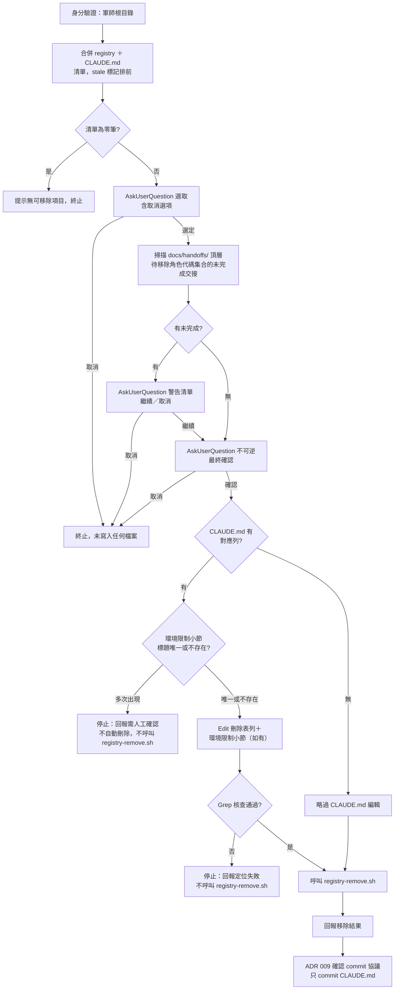

# feat: 軍師端 remove-project 子指令——移除子專案登記

## Summary

為 `skills/kunsu-init/SKILL.md` 新增 `remove-project` 子指令，對稱於既有 `add-project`：在軍師 repo 內執行，列出本軍師目前登記的子專案（路徑已不存在者標記並排前），選定後整筆移除該子專案在本軍師的所有角色代碼登記，移除前掃描未完成交接文件並警告、需經不可逆確認，同步更新軍師 CLAUDE.md 關聯專案表與全域反向註冊表。新增 `registry-remove.sh` 對稱 `registry-merge.sh`。一併起草 ADR 012 記錄關鍵決策。

---

## Problem Frame

`add-project` 支援新增子專案登記與角色代碼異動，但沒有對應的移除路徑。子專案可能因檔案結構合併或拆分使原本登記的路徑或角色失效，目前唯一手段是手動編輯 `~/.claude/kunsu-registry.json` 與軍師 CLAUDE.md，既不安全也無法比照既有流程對未完成交接示警。`kunsu-list` 已有 stale 偵測（⚠ 標記路徑不存在的登記）但只報不修。本計畫源自 `docs/brainstorms/2026-07-12-remove-project-requirements.md`；規劃階段的 repo 研究與流程缺口分析（詳見 Sources & Research）另外發現數項須一併補齊的邊界情況——registry 與 CLAUDE.md 不同步、路徑正規化一致性、多角色代碼警告顯示、各步驟取消收尾——均併入本計畫的 Requirements，屬同一功能的完整性補強，非範圍外的新功能。

---

## Requirements

**A. registry-remove.sh（新腳本）**

- R1. 新增 `skills/kunsu-init/scripts/registry-remove.sh`，介面 `[--registry <path>] <sub-repo-abs-path> <kunsu-abs-path>`，沿用 `registry-merge.sh` 的 python3 行內執行、路徑 `realpath` 正規化、`tempfile` + `os.replace` 原子寫入；exit code 慣例：**0＝找到並成功移除**、**3＝找不到對應登記（冪等略過，非錯誤，但與「成功移除」分開回報，避免路徑打錯時被誤判為已完成）**、1＝JSON 損壞、2＝參數錯誤。
- R2. 移除邏輯：從 `data[sub_repo]` 篩掉 `kunsu`（正規化後）相符的 entry；篩後為空 → 整個 key 從 `data` 刪除，不留空陣列，exit 0；篩後仍有其他軍師的 entry → 只更新該 list，保留其他軍師登記，exit 0；找不到 `sub_repo` key 或本軍師 entry → 印出提示訊息，exit 3。

**B. remove-project 子指令**

- R3. `skills/kunsu-init/SKILL.md` 新增 `remove-project` 子指令段落，frontmatter description 補觸發語（格式比照 `add-project`）：`Use remove-project sub-command when asked to「remove-project」「移除子專案」「刪除子專案登記」「移除子專案登記」「把子專案從軍師移除」「remove project from planner」.`
- R4. 身分驗證沿用 `add-project` 步驟①的 `git rev-parse --show-toplevel` 與 python3 行內 registry 驗證邏輯（`not_found`／`json_error`／`not_kunsu`／`ok` 四種輸出對應處理），僅能在軍師根目錄執行。
- R5. 清單建立：python3 行內執行，讀 registry 取本軍師（`entry.kunsu` 正規化後相符）的所有子專案（路徑＋roles），與 CLAUDE.md 關聯專案表逐列解析（顯示名稱＋路徑＋角色代碼），兩來源路徑均以 `realpath` 正規化後聯集去重；僅 registry 有的項目顯示名稱 fallback 為「（無 CLAUDE.md 對應列，路徑：`<path>`）」；僅 CLAUDE.md 有的項目正常列出。
- R6. 對聯集清單逐筆執行 `os.path.isdir()` 路徑存在性查核，不存在者標記 ⚠ 並排列在清單前段；清單為零筆時提示「本軍師目前沒有已登記子專案」並終止，不進入後續步驟。
- R7. 以 `AskUserQuestion` 呈現含序號清單供選取，選項含明確「取消」；選取消 → 回報「操作取消，未執行任何移除」並終止，不寫入任何檔案。
- R8. 選定後，取得該子專案在本軍師登記的完整角色代碼集合——registry 該子專案本軍師 entry 的 `roles` 陣列與 CLAUDE.md 該列代碼欄兩者的**聯集**（而非擇一 fallback，避免手動編輯造成的漂移使某側代碼被遺漏而漏警告孤兒交接）；兩側代碼不一致時額外回報「發現 registry 與 CLAUDE.md 角色代碼不一致，掃描已取聯集」。掃描軍師自身 `docs/handoffs/` 頂層文件（`Glob`，不含 `replies/`、`archive/`），篩選 `to:` 屬於此角色代碼集合的交接文件；對每筆逐一讀取 `docs/handoffs/replies/*.md` 全部實體檔案（不依賴 git status，含 untracked）的 frontmatter，篩選 `in_reply_to` 字面等於該交接檔名（含 `.md` 後綴）者為其回覆；有回覆者取最新一份（依檔名 `(date, n)` 降序，不可用字串排序）讀其 `status`：`done` = 完成，其餘（含無回覆、未知 status）= 未完成。
- R9. 有未完成交接 → `AskUserQuestion` 列出警告清單（標題、日期、觸發的角色代碼、最新 status 或「無回覆」，並提示「移除後這些交接會在軍師沙盤歸類為『`to:` 不符清單』，需手動歸檔」），提供「繼續」／「取消」；選取消 → 終止，不寫入任何檔案。無未完成交接 → 不出警告，直接續行。
- R10. 呈現最終不可逆確認：`AskUserQuestion` 顯示即將移除的摘要（顯示名稱、路徑、全部角色代碼），明確說明「全域註冊表不受任何 repo 版控，移除後無法用 git 復原；若此子專案同時登記其他軍師，其他軍師的登記不受影響」；提供「確認移除」／「取消」；選取消 → 終止，不寫入任何檔案。
- R11. 確認後執行雙側移除，順序固定為先 CLAUDE.md、後 registry：`Edit` 刪除關聯專案表對應列（若有環境限制小節，先 `Grep` 確認標題只出現一次，出現多次則停下回報需人工確認、不自動刪除，出現一次才刪除整個小節）→ `Grep` 核查表列與小節皆已消失 → 核查失敗則停下回報「CLAUDE.md 可能已手動修改導致定位失敗，請人工確認後重新執行」、不繼續呼叫 `registry-remove.sh`；核查通過才呼叫 `registry-remove.sh`。
- R12. CLAUDE.md 關聯專案表找不到對應列（僅 registry 有登記）→ 略過 CLAUDE.md 編輯，回報「CLAUDE.md 已無此子專案登記（可能已手動刪除），略過此步驟」，直接執行 `registry-remove.sh`。
- R13. 回報移除結果（CLAUDE.md 異動摘要、`registry-remove.sh` 的 stdout 與 exit code）；`registry-remove.sh` 回傳 exit 3（找不到對應登記）時，明確回報「registry 中未找到此子專案在本軍師的登記，請確認路徑是否正確；若此子專案原本僅登記於 CLAUDE.md，這是預期行為」，不得與 exit 0（已成功移除）混為一談。
- R14. 依 ADR 009 既有「確認 commit」協議：`git status --porcelain` 核對 CLAUDE.md 有待提交變更（無變更 → 回報「已提交，無需操作」，不產空 commit）→ `AskUserQuestion` 確認（訊息固定 `docs: 移除子專案登記 <顯示名稱>`）→ 確認後 `git add <CURRENT_REPO_ROOT>/CLAUDE.md`（不含 registry）→ `git commit`，絕不 push；取消 → 保留產出，回報可手動執行的 `git add`＋`git commit` 指令。若需完全放棄本次移除，明確說明**不可**先執行 `git checkout CLAUDE.md` 再跑 `add-project`——CLAUDE.md 還原後 `add-project` 會判定為「已登記」，使用者若在該分支回答角色代碼不需異動，`add-project` 不會呼叫 `registry-merge.sh`，導致 registry 停留在已移除狀態、與還原後的 CLAUDE.md 重新產生漂移。正確作法二擇一：(a) 保持 CLAUDE.md 目前未 commit 的刪除狀態，直接執行 `add-project` 走「首次登記」分支同步補回 CLAUDE.md 列與 registry 登記；(b) 若已誤先 `git checkout CLAUDE.md`，改直接呼叫 `registry-merge.sh <sub-repo-abs-path> <kunsu-abs-path> <角色代碼>` 補回 registry，不透過 `add-project`。

**C. 文件**

- R15. 新增 `docs/adr/2026-07-12-adr-candidate-012-remove-project-subcommand.md`，記錄關鍵決策（整筆移除、失效感知輔助選取、雙重確認語意分離、雙側寫入順序與 `registry-remove.sh` 冪等設計、Invariant 2 邊界聲明）與理由，格式比照既有 ADR candidate。
- R16. 母體 `CLAUDE.md`「開發狀態」段落補記本次功能與 ADR，`docs/README.md` 索引表補列新 ADR 與本計畫。

---

## Key Technical Decisions

- **`registry-remove.sh` 獨立成新腳本，不在 `registry-merge.sh` 加旗標**：兩者心智模型不同（新增合併 vs 移除），獨立腳本維持單一職責，與 `registry-list.sh`、`registry-merge.sh` 一支腳本一種操作的既有慣例一致。
- **雙側寫入順序：先 CLAUDE.md、後 registry**：CLAUDE.md 受 git 版控、未 commit 前可用 `git checkout` 復原；registry 不受版控、寫入即不可逆。把可復原的操作放前面、不可逆操作放最後並在其前加 Grep 核查關卡，讓任何中斷後的殘留狀態都停在「CLAUDE.md 已編輯未 commit（可復原）＋registry 未動」，而非「registry 已不可逆移除＋CLAUDE.md 卡在半刪除」。
- **兩階段確認語意分離，不可合併**：R9（未完成交接警告，軟性提示可繼續）與 R10（移除摘要＋registry 不可逆確認，二元決策）目的不同——前者是「你知道會有孤兒交接嗎」，後者是「你確定要做這個不可逆動作嗎」。
- **`registry-remove.sh` 對「entry 不存在」冪等處理，但以獨立 exit code 區分**：目標 entry 不存在時仍視為已達成移除目的（不阻斷 R12 情境），但用 exit 3（而非與「成功移除」共用的 exit 0）回報，避免呼叫端把「路徑打錯、registry 其實沒動」誤判為「已成功移除」——這是不可逆操作，冪等與成功必須可被明確區分。
- **清單合併以 `realpath` 正規化後的路徑為鍵，且兩來源聯集而非只認 registry**：registry 寫入時已對路徑執行 `realpath`，但 CLAUDE.md 存的是使用者原始輸入；R5 合併兩來源時對兩側路徑都正規化後比對，避免 symlink 差異造成同一子專案重複出現或匹配失敗。之所以聯集兩來源（而非只以 registry 為權威候選清單）：本計畫的研究階段已確認 registry 與 CLAUDE.md 可能因手動編輯而不同步（R12 即為此情境的移除處理），若清單只認 registry，僅存在於 CLAUDE.md 的殘留列將永遠無法被 `remove-project` 選中清除，形同留下一條沒有出口的孤兒資料。
- **Invariant 2 邊界聲明**：remove-project 的全部寫入僅發生在軍師自己的 CLAUDE.md（軍師 repo 內）與軍師 repo 外的全域 registry；R8 的未完成交接掃描只讀軍師自身 `docs/handoffs/`，不讀取任何子專案目錄——不構成「軍師對子專案唯讀」的例外，ADR 012 明文聲明此邊界供未來讀者溯源。
- **多角色代碼批次掃描，代碼集合取聯集而非擇一 fallback**：R8 對本子專案在本軍師登記的角色代碼集合逐一掃描 `to:`，合併成單一警告清單並標明每筆觸發的角色代碼；代碼集合來源是 registry `roles` 與 CLAUDE.md 代碼欄的聯集（不是「registry 有就只看 registry」的 fallback）——registry 與 CLAUDE.md 可能因手動編輯而漂移，擇一 fallback 會讓另一側才有的角色代碼被漏掃，使該代碼底下的未完成交接在 R9 警告中悄悄消失，使用者不會被告知就完成了移除。

---

## High-Level Technical Design

`remove-project` 決策鏈（每個 `AskUserQuestion` 節點的「取消」分支均直接終止、不寫入任何檔案）：

---

## Implementation Units

### U1. registry-remove.sh

- **Goal**：提供對稱於 `registry-merge.sh` 的原子移除操作，供 `remove-project` 呼叫。
- **Requirements**：R1、R2
- **Dependencies**：無
- **Files**：`skills/kunsu-init/scripts/registry-remove.sh`（新增）
- **Approach**：以 `registry-merge.sh` 為結構模板——同樣的 bash 參數解析（`--registry` 覆寫旗標）＋python3 heredoc；JSON 損壞的錯誤處理（exit 1）沿用。**與 `registry-merge.sh` 不同之處**：registry 檔案不存在、`sub_repo` key 不存在、或 key 存在但本軍師 entry 不存在，三種情況一律視為「無可移除、冪等略過」，印出說明性提示並以 exit 3 結束（不像 `registry-merge.sh` 對不存在的 registry 會建立新檔案——移除操作沒有「順便建立」的語意）。找到本軍師 entry 才進入實際移除：從 `data.get(sub_repo, [])` 篩掉本軍師（`realpath` 比對）的 entry，篩後為空刪整個 key、否則寫回剩餘 list，寫入成功 exit 0；原子寫入（`tempfile.mkstemp` + `os.replace`）逐字沿用 `registry-merge.sh`。
- **Patterns to follow**：`skills/kunsu-init/scripts/registry-merge.sh`（全檔，除「不存在則建立」的語意外）。
- **Test scenarios**：
  - 子專案僅登記本軍師 → 整個 key 從 registry 消失，不留空陣列，exit 0。
  - 子專案同時登記本軍師與另一軍師 → 只移除本軍師對應的陣列元素，另一軍師 entry 保留，exit 0。（Covers AE1、AE2）
  - `sub_repo` key 不存在於 registry → exit 3，輸出提示「無此登記，略過」，registry 檔案內容不變。
  - `sub_repo` key 存在但本軍師 entry 不存在（僅登記其他軍師）→ exit 3，輸出提示「本軍師無此登記，略過」，其他軍師 entry 不動。
  - registry 檔案不存在 → exit 3，輸出提示，不建立新檔案。
  - registry JSON 損壞 → exit 1，stderr 報錯，不覆寫原檔。
  - `--registry` 覆寫旗標 → 對指定路徑操作，不動預設 `~/.claude/kunsu-registry.json`。
- **Verification**：暫存目錄以 fixture registry 逐案例呼叫，核對 stdout、exit code 與寫入後的 JSON 內容（含格式化與結尾換行）。

### U2. remove-project 身分驗證與清單呈現

- **Goal**：使用者能在軍師 repo 內看到本軍師目前登記的子專案（stale 標記輔助辨識），並安全選取或取消。
- **Requirements**：R3、R4、R5、R6、R7
- **Dependencies**：無
- **Files**：`skills/kunsu-init/SKILL.md`
- **Approach**：frontmatter description 補觸發語（R3）。子指令段落置於 `add-project` 之後，步驟①身分驗證逐字複用 `add-project` 步驟①的兩段 bash／python3 片段。步驟②以 python3 行內執行：讀 registry 過濾本軍師 entry、`Read` CLAUDE.md 關聯專案表逐列解析，兩來源路徑正規化後聯集去重，對每筆 `os.path.isdir()` 判斷、stale 排序在前，輸出含序號清單；零筆時直接終止。步驟③以 `AskUserQuestion` 呈現清單（含取消選項）。
- **Patterns to follow**：`add-project` 步驟①（身分驗證逐字複用）；`skills/kunsu-list/scripts/registry-list.sh`（stale 偵測與清單分組邏輯移植，但需另寫「僅本軍師」的過濾與互動選取，不可直接呼叫該腳本）。
- **Test scenarios**：
  - 非軍師根目錄執行 → 依 `not_found`／`json_error`／`not_kunsu` 分別報錯終止。
  - 本軍師零筆登記 → 提示無可移除項目，終止。（Covers AE4）
  - 清單含 stale（路徑不存在）與正常項目混合 → stale 項目標 ⚠ 且排在清單前段。
  - registry 有、CLAUDE.md 無對應列的項目 → 以路徑 fallback 顯示名稱正常列入清單。
  - 選取「取消」→ 回報操作取消，未寫入任何檔案。
  - symlink 路徑的子專案 → 不因正規化差異在清單中重複出現。
- **Verification**：暫存目錄以 fixture 軍師（registry＋CLAUDE.md 各種登記組合）實跑，核對清單內容、排序與取消分支。

### U3. 未完成交接警告與不可逆確認

- **Goal**：移除前讓使用者看到孤兒交接風險與不可逆後果，任一節點取消都乾淨終止。
- **Requirements**：R8、R9、R10
- **Dependencies**：U2
- **Files**：`skills/kunsu-init/SKILL.md`
- **Approach**：取得選定子專案的角色代碼集合，`Glob` 掃 `docs/handoffs/*.md` 頂層，逐一 `Read` frontmatter 篩 `to:` 屬於代碼集合者；對每筆以 `docs/handoffs/replies/*.md`（全部實體檔案）比對 `in_reply_to`，依 `(date, n)` 降序取最新一份判斷 `status`。有未完成 → `AskUserQuestion` 警告清單＋繼續／取消；通過後再一道 `AskUserQuestion` 呈現不可逆確認摘要＋確認／取消。兩步驟均在任何寫入動作之前完成。
- **Patterns to follow**：`add-project` 步驟⑨角色改名警告（掃描骨架與「最新回覆」排序規則逐字複用，改為批次代碼集合版本）。
- **Test scenarios**：
  - 待移除角色代碼有一份無回覆的交接 → 列入警告清單，標示「無回覆」與觸發代碼。（Covers AE3）
  - 待移除角色代碼有一份最新回覆 `status: done` → 不列入警告（視為完成）。
  - 子專案在本軍師掛兩個角色代碼、各有一份未完成交接 → 警告清單合併顯示兩筆，各自標明觸發代碼。
  - 同日多份回覆（含數值後綴）→ 正確取最新一份而非字串排序誤判。
  - 警告清單出現後選「取消」→ 終止，CLAUDE.md 與 registry 均未異動。
  - 無未完成交接 → 不出警告，直接進入不可逆確認。
  - 不可逆確認出現後選「取消」→ 終止，CLAUDE.md 與 registry 均未異動。
- **Verification**：暫存目錄 fixture 交接與回覆組合實跑，核對警告清單內容與兩處取消分支的乾淨終止。

### U4. 雙側移除執行與回報

- **Goal**：確認後安全完成 CLAUDE.md 與 registry 的雙側移除，任何中斷都停在可復原狀態，並依協議收斂 commit。
- **Requirements**：R11、R12、R13、R14
- **Dependencies**：U1、U3
- **Files**：`skills/kunsu-init/SKILL.md`
- **Approach**：先處理 CLAUDE.md——找到對應列則 `Edit` 刪除（含環境限制小節，先 `Grep` 確認標題唯一出現才刪，出現多次停下回報）並以 `Grep` 核查完全消失；找不到對應列則略過並回報。核查通過（或已略過）才呼叫 `registry-remove.sh`（U1）。回報結果後走 ADR 009 確認 commit 協議（`git status --porcelain` → `AskUserQuestion` → `git add` 單一路徑 → `git commit`，絕不 push），取消時說明可 `git checkout CLAUDE.md` 完全放棄本次移除、但 registry 需另行以 `add-project` 重新登記。
- **Patterns to follow**：`add-project` 步驟⑥（CLAUDE.md 精準 Edit 定位哲學，反向操作為刪除）、步驟⑩與 ADR 009（確認 commit 協議逐字沿用）。
- **Test scenarios**：
  - 正常情境（有環境限制小節）→ CLAUDE.md 表列與小節皆刪除，Grep 核查通過，registry 正確移除。
  - 正常情境（無環境限制小節）→ 只刪表列，不誤動其他段落。
  - CLAUDE.md 手動改動導致 Edit 定位失敗 → 停下回報定位失敗，不呼叫 `registry-remove.sh`，registry 維持原狀。
  - 僅 registry 有登記（CLAUDE.md 無對應列，來自 U2 情境）→ 略過 CLAUDE.md 編輯，直接執行 `registry-remove.sh` 成功。
  - 確認 commit 步驟選「取消」→ CLAUDE.md 變更保留在 working tree（未 commit）、registry 已完成移除，回報可用的手動 `git add`＋`git commit` 指令與 `git checkout` 放棄選項。
  - 確認 commit 步驟 `git status --porcelain` 顯示 CLAUDE.md 無變更（如 U4 的「僅 registry 有登記」情境）→ 回報「已提交，無需操作」，不產空 commit。
- **Verification**：暫存目錄 fixture 軍師實跑上述情境，核對 CLAUDE.md 最終內容、registry 最終內容與 git 狀態（含取消分支的殘留狀態符合預期）。

### U5. ADR 012 與母體文件同步

- **Goal**：關鍵決策落於可追溯的 ADR，母體文件反映新功能。
- **Requirements**：R15、R16
- **Dependencies**：U1–U4（決策內容需依實作定案內容撰寫）
- **Files**：`docs/adr/2026-07-12-adr-candidate-012-remove-project-subcommand.md`（新增）、`CLAUDE.md`、`docs/README.md`
- **Approach**：ADR 結構比照既有 candidate（背景、決策、理由、影響範圍、Open Questions），內容取自本計畫 Key Technical Decisions；`CLAUDE.md`「開發狀態」段落新增一條記錄，`docs/README.md` 索引表補列 ADR 012 與本計畫連結。
- **Patterns to follow**：`docs/adr/2026-07-12-adr-candidate-011-reply-verify-field.md`（同日前例的 ADR 結構與行文風格）。
- **Test scenarios**：Test expectation: none——純文件撰寫，無行為面；正確性由人工核閱決策內容與既有 ADR 是否一致（如 ADR 009 commit 協議措辭不可牴觸）。
- **Verification**：ADR 內容與 U1–U4 實作結果一致；`CLAUDE.md`、`docs/README.md` 連結可點擊、無殘留佔位符。

### U6. 端到端 dogfooding

- **Goal**：全鏈路（清單→警告→確認→雙側移除→commit）在暫存目錄實證通過後才視為完成。
- **Requirements**：彙總 U1–U4 的場景清單（Covers AE4：清單為零筆時的終止行為）
- **Dependencies**：U1–U4 完成並經 `install.sh` 部署
- **Files**：無新檔（暫存目錄實跑，產物不入 repo）
- **Approach**：暫存目錄 scaffold 一座 fixture 軍師＋數個假子專案（涵蓋：正常登記、stale 路徑、多角色代碼、僅 registry 登記、僅 CLAUDE.md 登記、有未完成交接、無環境限制），依序跑完整流程並核對每個分支（含所有取消路徑）的最終檔案狀態。
- **Patterns to follow**：既有功能（申請信箱、上報信箱、角色分離）的 dogfooding 慣例——場景逐項核對輸出與最終狀態，不帶病進 U5 的 live 文件同步。
- **Test scenarios**：即 U1–U4 各單元場景清單的彙總執行，外加跨單元鏈路：選取→警告→確認→雙側移除→確認 commit 全程無中斷；以及中途任一節點取消後，重新執行 `remove-project` 仍能看到該子專案在清單中（未被移除）。
- **Verification**：全場景通過；任何失敗回到對應單元修復後重跑。

---

## Scope Boundaries

### Deferred to Follow-Up Work

- registry 移除前的稽核快照或復原機制——維持現行「registry 無版控、無稽核歷史」慣例（brainstorm 範圍邊界）。
- 子專案端主動投遞「退出申請」（對稱 `kunsu-apply` 反向流程）——brainstorm 範圍邊界，只做軍師端手動移除。
- 單一角色代碼選擇性保留（部分退場）——brainstorm 範圍邊界，只支援整筆移除。
- registry 與 CLAUDE.md 長期漂移的主動偵測／修復工具（本計畫只在 remove-project 執行當下優雅處理 R5、R12 的不同步情境，不建立獨立的漂移掃描或自動修復機制）。

### Outside this product's identity

- 合併/拆分情境的自動偵測或新舊登記自動合併（例如自動判斷兩個路徑其實是同一專案）——`remove-project` 只負責移除舊登記，新增登記仍走既有 `add-project`。

---

## Risks & Dependencies

- **CLAUDE.md Edit 錨點脆弱**：關聯專案表或環境限制小節若曾被手動改動，`Edit`／`Grep` 定位可能失敗。緩解：R11 的 Grep 核查關卡，失敗即停下回報、不繼續呼叫 `registry-remove.sh`（沿用既有 live 軍師遷移的一貫緩解模式）。
- **孤兒交接的沙盤可見性**：移除後既存未完成交接文件仍留在 `docs/handoffs/`，僅角色代碼不再被 `/kunsu-inbox` 掃到，軍師沙盤會歸類為「`to:` 不符清單」。緩解：R9 警告文字已明確告知此後果，使用者可自行決定後續是否手動歸檔。
- **多軍師拓撲下的使用者誤解**：使用者可能誤以為移除是全域生效。緩解：R10 確認文字明確聲明「僅影響本軍師登記」。
- **symlink 路徑正規化**：CLAUDE.md 存原始輸入路徑、registry 存 `realpath` 正規化路徑，理論上可能因環境差異造成清單合併誤判。緩解：R5 對兩側路徑統一正規化後比對；U2 測試場景含 symlink 情境。

---

## Sources & Research

- `docs/brainstorms/2026-07-12-remove-project-requirements.md`——決策來源（origin），brainstorm 定案的範圍與四個驗收例（AE1–AE4）。
- `skills/kunsu-init/SKILL.md` 步驟①（身分驗證）、步驟⑥（CLAUDE.md 精準 Edit）、步驟⑨（角色改名警告掃描骨架與最新回覆排序規則）、步驟⑩（確認 commit 協議）——`add-project` 既有邏輯的複用來源。
- `skills/kunsu-init/scripts/registry-merge.sh`——python3 行內執行、路徑正規化、原子寫入、exit code 慣例的結構模板。
- `skills/kunsu-list/scripts/registry-list.sh`——stale 偵測邏輯（`os.path.isdir()`）移植來源。
- `docs/adr/2026-07-09-adr-candidate-009-protocol-commit-confirmation.md`——確認 commit 協議的具體執行方式與訊息格式慣例。
- `docs/adr/2026-07-08-adr-candidate-007-role-code-description-separation.md`——角色代碼規則與唯一比對鍵定義。
- `CONCEPTS.md`——「全域反向註冊表」「單點登記」「角色代碼」等既有詞彙定義；規劃階段確認詞彙表無「退出」「解除登記」等既有詞，ADR／SKILL 定稿後如頻繁使用「移除登記」可提請 `/ce-compound` 補入。
