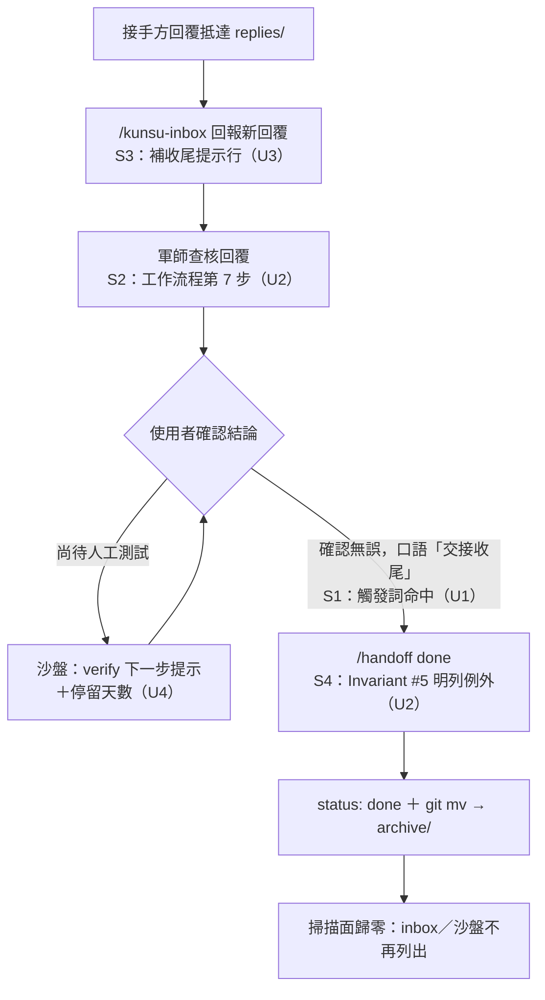

# feat: handoff done 收尾閉環

## Summary

把「`/handoff done` 收尾」補進協作鏈的四個斷點：handoff 觸發詞補收尾口語與 done 行為指引、軍師範本工作流程加第 7 步並於三處明列 done 例外、`/kunsu-inbox` 回覆段補收尾提示行、回覆檔 `status` 值域說明一致化並加接手方限制語。沙盤「已回覆待確認」每筆加 verify 推導的下一步提示與停留天數。ivm／ebook 兩既有軍師比照遷移。

---

## Problem Frame

軍師 session 查核完回覆後不會提示以 `/handoff done` 收尾，使用者也常忘記主動要求，`status: submitted` 的交接長期積壓頂層——持續被掃描消耗 token，沙盤上一直列在「已回覆待確認」。歸檔機制本身完備（done ＝ 改 `status` ＋ `git mv` 至 `archive/`，掃描面天然排除 `archive/`），缺的是讓這個動作在對的時機被想起。完整脈絡見 origin 文件。

計畫期研究另確認兩個 origin 未涵蓋的事實，已納入範圍（見 KTD-1、KTD-2）：範本內除 Invariant #5 外還有兩句無例外的「不回頭修改」禁令；回覆檔 `done` 值若不加限制語，接手方自標會使交接從所有掃描面靜默消失、本體卻未歸檔。

---

## Requirements

**handoff skill**

- R1. `skills/handoff/SKILL.md` description 補帶交接語境的 done 口語：「交接收尾」「這份交接可以收尾了」「這份交接做完了」「完成這份交接」「歸檔這份交接」「標記交接完成」「handoff done」；不收裸詞「收尾」「結案」。（origin R1）
- R2. SKILL.md 補行為指引：發起方語境（本 repo `docs/handoffs/` 有相符本體）下使用者表達查核完成時主動建議 done；接手方語境（無相符本體）不觸發 done，改導向發起方 repo。（origin R2，反面守門為計畫期補充）
- R3. 回覆檔 `status` 值域兩處說明一致化為四值，並在「回覆方式」段落加限制語：`done` 由發起方經 `/handoff done` 設定於本體，接手方回覆勿自標。（origin R3）

**軍師範本與既有軍師遷移**

- R4. 範本工作流程新增第 7 步：查核回覆且使用者確認結論無誤後，主動提示以 `/handoff done` 收尾歸檔，執行仍經使用者確認。（origin R4）
- R5. 範本 done 例外三處明文化：Invariant #5 內文補唯一例外句；工作流程第 6 步「皆不回頭修改」句與回覆信箱協議「任何人（含本 session）不再編輯」句各補例外交叉參照。（origin R5，擴為三處為計畫期修正）
- R6. ivm／ebook 兩軍師 CLAUDE.md 比照 R4、R5 的全部四個位置 live 遷移，逐筆 grep 核查後各以一筆確認 commit 收斂。（origin R6）

**kunsu-inbox**

- R7. 軍師模式輸出範本的新回覆段補一行「→」收尾提示，格式對稱申請段與上報段既有提示行；僅提示、不自動執行。（origin R7）

**軍師沙盤**

- R8. 「已回覆待確認」每筆依最新回覆 `verify` 值附白話下一步提示；缺省與自由字串顯示通用提示，既有 badge 行為不變。（origin R8）
- R9. 「已回覆待確認」每筆顯示停留天數，自最新回覆日期起算；無效日期降級為不顯示，負天數顯示 0。（origin R9）
- R10. 沙盤改動限渲染層，`subrepo_status.py` 五分類邏輯零改動，唯一例外為 verify 空白字串正規化的附帶修正（KTD-5）；pytest 同步增補。（origin R10）

---

## Key Technical Decisions

- KTD-1. **憲章例外三處同步，不是單點修改**：範本內「不回頭修改」禁令共三句（Invariant #5、工作流程第 6 步、回覆信箱協議段落），只改第 5 條會留下另兩句字面矛盾，守規 session 讀到照樣迴避 done。例外主文寫在 Invariant #5（禁令與例外同條），另兩句以簡短交叉參照指回，避免三處各自維護完整例外語。
- KTD-2. **回覆檔 `done` 值加接手方限制語**：`subrepo_status.py` 與 kunsu-inbox 4a 對最新回覆 `status: done` 的處理是「略過不列出」，接手方自標 done 會使交接自沙盤與 inbox 消失、本體卻仍在頂層未歸檔（`/handoff list` 仍列進行中）。值域一致化為四值的同時，「回覆方式」段落明文：done 由發起方經 `/handoff done` 流程設定於本體，接手方勿自標。掃描端行為零改動。
- KTD-3. **一律只提示、不自動執行**：done 永遠由使用者觸發；kunsu-inbox Invariant 1「只告知不開工」零改動，提示行屬告知。
- KTD-4. **停留天數 server-side 計算、防守性降級**：起算點為最新回覆日期（語意＝「回覆已等待確認多久」）。`latest_reply_date` 來自回覆檔名 regex，格式必為 `YYYY-MM-DD` 但無語意驗證（`2026-13-01` 可通過），計算須 try/except `ValueError` 降級為不顯示；負天數 clamp 為 0；`latest_reply_date` 為 None 時防守跳過。
- KTD-5. **verify 空白字串正規化為附帶修正**：現行正規化只擋 `None` 與空字串，`verify: "   "` 會渲染出空白 badge，新增提示邏輯會放大此不一致。於 `subrepo_status.py` 正規化改為 strip 後判空。此為 R10「零邏輯改動」的唯一明文例外，不影響任何分類語意。
- KTD-6. **版號**：handoff `0.5.0 → 0.6.0`、kunsu-inbox `0.3.0 → 0.4.0`（皆為新增觸發語彙／輸出行為的 minor）；kunsu-init 不升版，比照 ADR 011 範本同步不升版的先例。kunsu-inbox 依賴聲明段引用的 handoff 版本同步改 `0.6.0`。

---

## High-Level Technical Design

收尾閉環的完整生命週期與四個斷點的落點（S1–S4 對應 U1–U3 的施工位置）：

---

## Implementation Units

### U1. handoff SKILL.md：觸發詞、done 行為指引與值域一致化

- **Goal**：使用者的收尾口語能命中 skill，session 在對的語境主動建議 done，值域說明不再自相矛盾。
- **Requirements**：R1、R2、R3。
- **Dependencies**：無。
- **Files**：`skills/handoff/SKILL.md`。
- **Approach**：
  - description「Use when asked to」清單補 R1 列舉的七個帶語境口語（行 11–14 一帶）。
  - done 子指令章節（行 213 起）開頭補行為指引兩句：正面（發起方語境、使用者表達查核完成→主動建議 done）與反面（本 repo `docs/handoffs/` 頂層無相符本體時不觸發 done，提示使用者至發起方 repo 執行——防止誤歸檔子專案自己對外的交接）。
  - 「回覆方式」段落（行 303）值域改四值＋接手方勿自標限制語；「注意事項」段落（行 333–334）保持四值並與限制語互相呼應。
  - frontmatter `version: 0.5.0 → 0.6.0`。
- **Patterns to follow**：v0.3.0「回覆軍師」觸發詞補洞的 description 修法（母體 CLAUDE.md 開發狀態 2026-07-08 條目）。
- **Test scenarios**：Test expectation: none — 純 SKILL 文案；行為驗證於 U6 dogfooding（Covers AE3、AE4、AE5）。
- **Verification**：Grep 確認七個口語全數落在 description；done 章節含正反兩面指引；兩處值域字面一致含 `done` 與限制語。

### U2. 軍師範本：第 7 步與 done 例外三處明文化

- **Goal**：軍師 session 的工作流程認知含收尾步驟，且範本內不殘留任何無例外的「不回頭修改」字面禁令。
- **Requirements**：R4、R5。
- **Dependencies**：無（與 U1 平行）。
- **Files**：`skills/kunsu-init/assets/templates/kunsu-claude.md`。
- **Approach**：
  - Invariant #5（行 11）內文補唯一例外句：發起方執行 `/handoff done` 收尾時將本體 frontmatter `status` 改為 `done` 並歸檔——屬授權歸檔（掃描規則已豁免）、不改內文，單一作者原則不變。用語對齊 CONCEPTS.md「授權歸檔」詞條。
  - 工作流程第 6 步（行 45）「交接文件本體與回覆檔案皆不回頭修改」句尾補「（唯一例外：第 7 步的 done 收尾，見 Invariant #5）」。
  - 新增第 7 步（行 45 之後、「回覆信箱協議」之前）：查核回覆且使用者確認結論無誤後，主動提示以 `/handoff done` 收尾歸檔；執行前仍經使用者確認，絕不逕自執行。
  - 回覆信箱協議段落（行 51）「任何人（含本 session）不再編輯」句補同款交叉參照。
  - 行 44（給接手方的「不要編輯交接文件本體」指示）與行 69（三信箱授權範圍）不動——前者對象是接手方、後者已被授權歸檔句涵蓋，無字面矛盾。
- **Patterns to follow**：範本內既有的授權歸檔豁免句式（行 70）。
- **Test scenarios**：Test expectation: none — 範本文案；一致性驗證見 Verification。
- **Verification**：Grep 範本全文「不再編輯」「不回頭修改」，確認每處都帶例外或交叉參照，或對象非發起方；第 7 步存在且位於協議章節之前。

### U3. kunsu-inbox：回覆段補收尾提示行

- **Goal**：軍師模式回報新回覆後，使用者當下就看到收尾路徑。
- **Requirements**：R7。
- **Dependencies**：U1（提示行引用的 handoff 版本與行為以 U1 定稿為準）。
- **Files**：`skills/kunsu-inbox/SKILL.md`。
- **Approach**：
  - 4b-4 輸出範本（行 278–294）新回覆段補一行「→ 彙整查核後若確認完成，以 /handoff done 收尾歸檔」，格式對稱申請段「→ 以 /kunsu-init add-project 逐筆審核」與上報段既有提示行。
  - 依賴聲明段（行 312 一帶）handoff 版本引用 `v0.5.0 → v0.6.0`。
  - frontmatter `version: 0.3.0 → 0.4.0`。
- **Patterns to follow**：4b-4 範本內申請段／上報段的「→」提示行句式。
- **Test scenarios**：Test expectation: none — 純 SKILL 文案；輸出格式驗證於 U6 dogfooding。
- **Verification**：4b-4 範本三段（回覆／申請／上報）各有一行「→」提示；版本與依賴聲明已同步。

### U4. 沙盤：verify 下一步提示與停留天數

- **Goal**：沙盤「已回覆待確認」一眼可見「下一步是誰的什麼動作」與積壓時長。
- **Requirements**：R8、R9、R10。
- **Dependencies**：無（與 U1–U3 平行）。
- **Files**：`skills/kunsu-dashboard/app/main.py`、`skills/kunsu-dashboard/app/subrepo_status.py`、`skills/kunsu-dashboard/tests/test_main.py`、`skills/kunsu-dashboard/tests/test_subrepo_status.py`。
- **Approach**：
  - `main.py` 新增下一步提示對照（比照 `_VERIFY_LABELS` 的 dict 形狀，行 293 一帶）：`needs-deploy` →「等上線部署後驗收，通過後請軍師執行 /handoff done」、`testable-now` →「可立即驗收，確認無誤即執行 /handoff done」、`needs-device` →「等實機測試後，確認即執行 /handoff done」、缺省與自由字串 →「開軍師 session 查核回覆，確認無誤後以 /handoff done 收尾歸檔」。文案為方向性指引，實作時可微調字句、不可改變語意。
  - 停留天數：於 awaiting_confirm 渲染（行 525–532 一帶）以 `date.fromisoformat(h.latest_reply_date)` 對今日取差——`ValueError` 降級不顯示、負值 clamp 0、`None` 防守跳過（KTD-4）。顯示形如「已等 N 天」（0 天顯示「今天回覆」或「已等 0 天」，實作擇一並在測試固定）。
  - 提示與天數僅加在 awaiting_confirm 段；`_html_status_badges` 與其他分類渲染不動。
  - `subrepo_status.py` verify 正規化改 strip 後判空（KTD-5，行 209–212 一帶）。
- **Patterns to follow**：`_VERIFY_LABELS` 對照表與 `_html_status_badges` 的 badge 組裝、`test_main.py` 的 `_handoff`／`_subrepo` monkeypatch fixture、`test_subrepo_status.py` 的 `make_reply` tmp_path fixture。
- **Test scenarios**：
  - Covers AE1. `verify: needs-device`、回覆日三天前 → 渲染含實機測試提示文案與「已等 3 天」。
  - Covers AE2. `verify` 缺省 → 通用提示文案、無 verify badge。
  - 自由字串 `verify: "手動跑批次"` → 通用提示＋原樣 badge 並存。
  - `latest_reply_date` 語意無效（如 `2026-13-01`）→ 天數不顯示、提示照常、頁面不中斷。
  - `latest_reply_date` 為未來日期 → 顯示 0 天。
  - `latest_reply_date` 為 `None`（防守路徑）→ 天數不顯示、不拋例外。
  - `verify: "   "`（空白字串）→ `subrepo_status` 正規化為 `None`，沙盤走通用提示、無空白 badge。
  - 既有行為回歸：partial_done／not_picked_up 段無提示、無天數；awaiting_confirm 內 verify 聚合排序不變。
- **Verification**：pytest 全綠（自 88 項增加）；`uvicorn` 實跑＋瀏覽器或 curl 目視 awaiting_confirm 段的提示與天數。

### U5. ivm／ebook 兩軍師 live 遷移

- **Goal**：既有軍師的憲章與工作流程與新範本一致，session 不再被字面禁令擋住。
- **Requirements**：R6。
- **Dependencies**：U2（範本定稿後照抄）。
- **Files**：兩軍師根目錄 `CLAUDE.md`（路徑自 `~/.claude/kunsu-registry.json` 解析：ivm 與 ebook 兩軍師；查證時兩檔的 Invariant #5 與第 6 步措辭皆與範本完全一致，可整句替換）。
- **Approach**：比照 U2 的全部四個位置（Invariant #5 例外句、第 6 步交叉參照、新增第 7 步、回覆信箱協議交叉參照）逐軍師 Edit；先建對比清單（改動句 × 兩軍師對應位置），逐筆 grep 驗證後再進 commit——歷史上遷移遺漏都是第三方 review 才發現，勿憑印象。每軍師一筆確認 commit 收斂（AskUserQuestion 確認後執行，比照 ADR 009 先例；訊息格式 `docs: 同步 handoff done 收尾條款`）。
- **Test scenarios**：Test expectation: none — 文件遷移；驗證見 Verification。
- **Verification**：兩軍師 CLAUDE.md 各四處 grep 命中且與範本字面一致；`git diff` 僅含預期四處。

### U6. 部署、dogfooding 與母體文件同步

- **Goal**：改動實際生效並驗證端到端行為，母體文件記錄本輪成果。
- **Requirements**：全部（收尾驗證）。
- **Dependencies**：U1–U5。
- **Files**：`CLAUDE.md`（開發狀態）、`README.md`（若列 skill 版本則同步）、`CONCEPTS.md`（視 U1–U2 是否產生新定案詞彙）、部署經 `install.sh`。
- **Approach**：
  - `install.sh` 重新部署（copy 模式覆寫 `~/.claude/skills/`）。
  - Dogfooding：Covers AE3——軍師 repo 口語「這份交接可以收尾了」命中 done；Covers AE4——一般 repo 口語「幫這個功能收尾」不觸發；Covers AE5——查核回覆後說「沒問題」，session 主動提示 done 且不逕自執行。沙盤以真實軍師資料實跑目視。
  - 母體 `CLAUDE.md` 開發狀態補一條（比照既有條目格式，末尾帶 pytest 計數變化）；本計畫 frontmatter `status` 由 ce-work 於收尾時翻 `completed`。
- **Test scenarios**：Test expectation: none — 部署與文件同步；行為驗證即上列 dogfooding 三場景。
- **Verification**：三個 dogfooding 場景結果如預期；pytest 計數與 CLAUDE.md 記載一致。

---

## Scope Boundaries

- 交接本體與回覆檔的 `status` 值域、掃描腳本（`scan-replies.sh` 等）、tripwire 判斷零改動；KTD-5 的 verify 正規化是唯一邏輯層例外。
- partial_done／not_picked_up 不加下一步提示與停留天數——刻意取捨：這兩類的下一步在接手方，使用者無行動力；明文記錄於此以免日後重複討論，後續若要補齊另開需求。
- 不自動執行 done、不加自動歸檔路徑；SessionStart hook 自動提醒維持 ADR 002 延後決策。

### Deferred to Follow-Up Work

- 以 `/ce-compound` 沉澱三篇教訓：skill 觸發詞補洞模式、範本 live 遷移 checklist、沙盤 code review 九缺陷——learnings 研究確認這三批知識目前只活在 CLAUDE.md 敘述段，不在 `docs/solutions/` 可搜尋路徑。

---

## Risks & Dependencies

- **live 遷移人工同步易漏**（歷史上兩次遺漏皆由 doc review 發現）→ U5 的對比清單＋逐筆 grep 核查為強制步驟。
- **觸發詞過泛誤觸發**：handoff 部署於所有 repo → 觸發詞一律帶交接語境（R1），U6 以 AE4 負向場景驗證。
- **`~/.claude/skills/` 為 copy 部署**：改 repo 不重跑 `install.sh` 則不生效，U6 部署步驟不可省。

---

## Sources & Research

- origin：`docs/brainstorms/2026-07-13-handoff-done-closure-requirements.md`（R1–R10、AE1–AE5）。
- 施工點查證：`skills/handoff/SKILL.md`（description 行 4–14、done 章節行 213–244、值域行 303 與 333–334）；`skills/kunsu-init/assets/templates/kunsu-claude.md`（Invariant #5 行 11、第 6 步行 45、協議段行 51）；`skills/kunsu-inbox/SKILL.md`（4b-4 行 278–294、依賴聲明行 312）；`skills/kunsu-dashboard/app/main.py`（`_VERIFY_LABELS` 行 293–297、badge 行 300–329、awaiting_confirm 渲染行 525–532）；`skills/kunsu-dashboard/app/subrepo_status.py`（verify 正規化行 209–212、done 略過行 305–306）。
- `latest_reply_date` 語意無驗證的出處：`subrepo_status.py` `_REPLY_SUFFIX_RE`（行 26）——regex 僅驗格式不驗語意。
- 既有教訓：`docs/solutions/best-practices/git-porcelain-scan-script-pitfalls.md`（本次不動腳本，`git mv` 陷阱四僅供背景）。
- 測試基礎：`skills/kunsu-dashboard/tests/` 現有 88 項；`test_main.py` monkeypatch fixture、`test_subrepo_status.py` tmp_path fixture。
