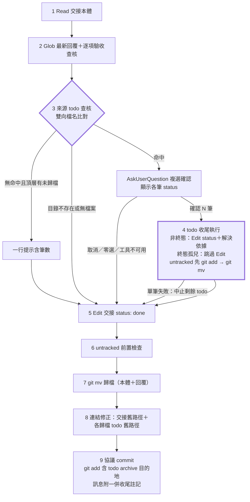

# feat: handoff done 來源 todo 查核與 /todo 0.1.2 缺陷修正

## Summary

在 `/handoff done` 收尾流程插入「來源 todo 查核」與「todo 收尾執行」兩個新步驟：雙向文字提及比對找出相關 todo，AskUserQuestion 確認後一併收尾歸檔，納入同一協議 commit。同批把 `/todo` skill 升 0.1.2，修正 untracked `git mv` 歸檔失敗與 `new-todo.sh` slug 連字號被清除兩個既有缺陷。

---

## Problem Frame

todo 升級成交接處理完畢後，todo 檔常停留「未處理」沒被一併收尾——todo 與 handoff 之間無結構性連結，done 七步驟也沒有任何一步回頭檢查來源 todo，收尾與否取決於使用者是否記得。副作用是軍師沙盤待辦計數失真。完整脈絡見 origin 需求文件（[docs/brainstorms/2026-07-19-handoff-done-todo-closure-requirements.md](../brainstorms/2026-07-19-handoff-done-todo-closure-requirements.md)）。

---

## Requirements

沿用 origin 的 R1–R14 編號與分組，此處為對照摘要，完整語意以 origin 為準。

**來源 todo 查核（`/handoff done` 新步驟）**

- R1. done 於逐項驗收查核之後、歸檔動作之前執行來源 todo 查核，範圍為本 repo `docs/todos/` 頂層未歸檔檔案。
- R2. 雙向文字提及比對：todo 檔內文提及本交接檔名，或交接本體內文提及某 todo 檔名，任一方向命中即列候選。
- R3. 候選以 AskUserQuestion 確認，多筆支援複選，可全部略過。
- R4. 無候選但頂層仍有未歸檔檔案時一行提示（含筆數）；目錄不存在或無檔案時靜默。
- R5. 查核與提示不阻擋 done 流程完成。

**todo 收尾執行**

- R6. 經確認的 todo 依既有 `/todo done` 語意收尾（status 改「已解決」、補解決依據、`git mv` 至 archive；status 已是終態的漏歸檔孤兒僅補歸檔搬移、不改 status 與依據，見 Key Technical Decisions 終態語意保護）。
- R7. 解決依據自動填本交接的歸檔路徑，不另詢問。
- R8. untracked todo 先 `git add` 再 `git mv`。
- R9. todo 收尾改動納入 done 既有協議確認 commit，不新增確認點或第二個 commit。

**`/todo` skill 既有缺陷修正（0.1.2）**

- R10. `/todo done` 與 `/todo rm` 補 untracked 前置檢查。
- R11. `new-todo.sh` slug 產生保留連字號。

**相容與同步**

- R12. `/todo` 檔案格式與 frontmatter 欄位零改動。
- R13. 版號同步：handoff v0.7.0 → v0.8.0、todo 0.1.1 → 0.1.2、kunsu-inbox 依賴聲明更新。
- R14. 軍師沙盤與軍師範本零改動。

---

## Key Technical Decisions

- **互動段與原子塊分離，todo 收尾先於交接原子塊**：來源 todo 查核（含 AskUserQuestion）為新步驟 3，在連續執行約束之外；todo 收尾執行為新步驟 4，原步驟 3–7 順移為 5–9；連續執行約束範圍由「步驟 3 至 5」改為「步驟 4 至 7」（todo 收尾起至交接 `git mv` 完成）。理由：互動等待不得卡在原子塊內；todo 先歸檔使「Edit 後、`git mv` 前」被沙盤掃成 orphaned_done 的暫態最短；中途失敗時交接本體仍在頂層未 done，整段可重跑（見 origin Key Decisions）。
- **比對鍵為具體檔名 substring**：todo → handoff 方向對各 todo 檔內文 Grep 本交接檔名 `<slug>.md`；handoff → todo 方向列出頂層 todo 檔名逐一在交接本體內文查找。泛指 `docs/todos/` 的路徑字串不會命中（比對鍵是具體檔名）；`archive/` 不掃描。中文檔名 substring 比對無特殊處理需求（以 Grep 工具執行，不經 shell glob，`core.quotepath` 陷阱不適用）。
- **終態語意保護**：命中的 todo 若 status 已是「已解決」或「已封存」（漏歸檔孤兒），僅執行 `git add`＋`git mv` 補歸檔，不改 status、不補解決依據；AskUserQuestion 文案對此類候選標明「已標記為<status>但尚未歸檔，確認一併補歸檔？」，與未處理件的收尾文案區分。
- **互動終止統一收斂**：使用者取消 AskUserQuestion、零選、或非互動環境工具不可用，三者一律「不執行任何 todo 操作，逕行交接收尾」——比照協議 commit「不可用視同取消」的既有規則精神，明文寫入步驟，避免實作者誤建阻擋 done 的 guard。
- **解決依據填預期歸檔路徑**：todo Edit 時交接尚未搬移，填 `docs/handoffs/archive/<交接slug>.md`（可確定性預算）。格式：`**解決依據**：交接 docs/handoffs/archive/<交接slug>.md 收尾歸檔`。接受後續步驟失敗時路徑暫時懸空的風險——重跑 done 即收斂。
- **單筆失敗中止其餘 todo 操作**：多筆收尾中任一筆失敗（如 `git mv` 錯誤），中止剩餘 todo 操作、不回滾已完成筆、回報失敗筆，續行交接收尾。安全優先，避免半套狀態擴大。
- **協議 commit 的 `git add` 必含 todo 歸檔目的地**：`git mv` 不暫存 working tree 的內容修改（porcelain 呈現 `RM`），各歸檔 todo 的 `docs/todos/archive/<slug>.md` 必須明列於步驟 9 的 `git add` 範圍，否則 commit 進 archive 的是 Edit 前舊版且錯誤永不自我暴露（陷阱四，見 [docs/solutions/best-practices/git-porcelain-scan-script-pitfalls.md](../solutions/best-practices/git-porcelain-scan-script-pitfalls.md)）。與交接本體 `status: done` 的既有處理完全對稱。
- **commit 訊息附註記**：含 todo 收尾時為 `docs: 歸檔交接 <檔名>；一併收尾 todo <slug>[、<slug>…]`，`docs:` 前綴與主體不變；訊息格式表的 done 列同步此變體。
- **複選形式**：候選 ≤4 筆用 AskUserQuestion multiSelect 一次呈現（label 為 todo 標題、description 含 status 與命中方向）；>4 筆改對話內數字清單請使用者以文字指定，避開選項數上限。

---

## High-Level Technical Design

新的 done 步驟序列（粗框為本次新增；步驟 5–9 即原步驟 3–7 順移）：

連續執行約束涵蓋步驟 4 至 7（中間不得執行 `/kunsu-inbox`）；步驟 3 的互動在約束之外。

---

## Implementation Units

### U1. handoff SKILL.md：done 章節插入來源 todo 查核與 todo 收尾

- **Goal:** done 流程落地 R1–R9 全部行為，升版 v0.8.0。
- **Requirements:** R1–R9、R13（handoff 版號）。
- **Dependencies:** 無。
- **Files:** `skills/handoff/SKILL.md`
- **Approach:**
  - 於現行步驟 2（235–246 行）之後插入步驟 3「來源 todo 查核」：掃描範圍寫「頂層 `docs/todos/*.md`，排除 `archive/`」；雙向比對、候選呈現（含 status 與命中方向、終態孤兒文案）、互動終止收斂規則、無命中提示／靜默分支，全依 Key Technical Decisions 定案內容。
  - 插入步驟 4「todo 收尾執行」：非終態者 Edit status＋解決依據（固定格式）；終態孤兒跳過 Edit；`git status --porcelain` 核對 `??` 先 `git add`（比照現行步驟 4 的 253–255 行寫法）；`git mv` 至 `docs/todos/archive/`；單筆失敗中止規則。
  - 原步驟 3–7 順移為 5–9，內文交叉指涉的步驟號全數同步；連續執行約束 blockquote（249–251 行）改為「步驟 4 至 7」並移至步驟 4 之前。
  - 步驟 8（原 6）：對每筆歸檔 todo 增加 `grep -rl "docs/todos/<slug>.md" docs/` 連結修正，與交接本體的既有修正並列。
  - 步驟 9（原 7）：`git add` 範圍補「各歸檔 todo 的 `docs/todos/archive/<slug>.md`」；訊息格式表（96–100 行）done 列更新為含 todo 收尾時的附註記變體。
  - frontmatter `version: 0.7.0` → `0.8.0`；description 觸發詞不需新增（done 既有口語已覆蓋此路徑）。
- **Patterns to follow:** 逐項驗收查核 bullet 的段落樣式（239–246 行）、untracked 前置檢查措辭（253–255 行）、協議 commit 段結構（75–103 行）。
- **Test scenarios:** Test expectation: none — 純 SKILL 文案；行為驗證於 U5 dogfooding。
- **Verification:** 步驟編號 1–9 連續無斷；grep 全文無殘留「步驟 3 至 5」等舊指涉；訊息格式表含新變體；約束 blockquote 位置與範圍正確。

### U2. todo SKILL.md：0.1.2 untracked 前置檢查與交互說明

- **Goal:** `/todo done`／`rm` 自身修復 untracked `git mv` 缺陷，升版 0.1.2。
- **Requirements:** R10、R12、R13（todo 版號）。
- **Dependencies:** 無。
- **Files:** `skills/todo/SKILL.md`
- **Approach:** done 步驟 4（88 行）與 rm 步驟 2（99 行）的 `git mv` 前補 untracked 前置檢查（`git status --porcelain` 核對，`??` 者先 `git add`，措辭比照 handoff done 既有寫法）；「注意」段（127–137 行）補一行「交接收尾時 `/handoff done` 可依使用者確認代執行本收尾流程」的交互說明；frontmatter `version: 0.1.1` → `0.1.2`。檔案格式範例與 frontmatter 欄位零改動（R12）。
- **Test scenarios:** Test expectation: none — 純 SKILL 文案；行為驗證於 U5 場景 11。
- **Verification:** done 與 rm 兩處皆含前置檢查；版號已更新；檔案格式範例段無 diff。

### U3. new-todo.sh：slug 產生順序修正

- **Goal:** slug 保留英文詞間連字號。
- **Requirements:** R11。
- **Dependencies:** 無。
- **Files:** `skills/todo/scripts/new-todo.sh`
- **Approach:** 現行 57–60 行的順序是先 `tr ' _' '--'` 轉連字號、再 `sed 's/[[:punct:]]//g'` 清標點——POSIX `[:punct:]` 含連字號，剛轉出的分隔符被一併清除。調整為先 `sed` 清標點（此時空白仍在）、再 `tr` 把空白與底線轉連字號、最後收斂連續連字號與去頭尾；註解同步更新。
- **Test scenarios:**
  - 英文多詞標題 `fix memory leak` → 檔名 `fix-memory-leak.md`。
  - Covers AE6. 含連字號英文詞的標題（如含 `cache-key`）→ slug 保留連字號。
  - 純中文標題 → slug 與現行為一致（不受順序調整影響）。
  - 標題頭尾帶標點 → 頭尾連字號正確收斂。
  - 同名撞檔 → 仍直接報錯（防撞行為不受影響）。
- **Verification:** 各 case 以 stdin 直接呼叫腳本，stdout 印出的檔案路徑符合預期。

### U4. 文件同步：kunsu-inbox 依賴聲明、CLAUDE.md、CONCEPTS.md

- **Goal:** 版號與文件狀態同步，多副本 grep 核查證明範圍邊界。
- **Requirements:** R13、R14。
- **Dependencies:** U1、U2、U3（版號與行為定案後執行）。
- **Files:** `skills/kunsu-inbox/SKILL.md`、`CLAUDE.md`、`CONCEPTS.md`
- **Approach:**
  - kunsu-inbox 依賴聲明（313 行）v0.7.0 → v0.8.0；核對依賴表格（316–325 行）的「done 歸檔搬移」與「流程尾端確認 commit」兩列是否需補 todo 歸檔敘述，需要則同步。
  - CLAUDE.md：專案結構樹 24／25／27／28 行的版號與描述同步；「尚未實作／後續評估」第 114 行的 `/todo` 兩缺陷條目移除；「已完成」補本次條目；54 行過期的「98 項測試」順手修正為現值。
  - CONCEPTS.md「done 收尾」詞條補一句：收尾時可依使用者確認一併歸檔來源 todo。
  - 多副本 grep 核查（教訓見 [docs/solutions/workflow-issues/handoff-done-closure-gap.md](../solutions/workflow-issues/handoff-done-closure-gap.md)）：以 grep 證明軍師範本（`skills/kunsu-init/assets/templates/`）與 `new-handoff.sh` printf 不含 done 步驟明細副本、無需改動（R14 的零改動以證據確認，不憑記憶）。
- **Test scenarios:** Test expectation: none — 純文件同步；grep 核查即驗證。
- **Verification:** grep `v0.7.0` 於 kunsu-inbox 無殘留；CLAUDE.md 第 114 行條目已移除且已完成段有新條目；範本與腳本 grep 核查結果記錄於回報。

### U5. 暫存目錄 dogfooding 驗證

- **Goal:** 端到端驗證全部行為，涵蓋 origin 六個驗收例與研究補強場景。
- **Requirements:** R1–R11。
- **Dependencies:** U1、U2、U3。
- **Files:** 無新檔（暫存目錄實跑，產物不入 repo）。
- **Test scenarios:**
  - Covers AE1. todo 內文含交接檔名，done 確認選取 → status 改已解決、解決依據為預期 archive 路徑、與交接同一 commit；commit 後 `git status --porcelain` 乾淨，且 archive 內檔案內容為 Edit 後新版（陷阱四驗證，不能只看退出碼）。
  - Covers AE2. 無命中、頂層 3 筆未歸檔 → 一行提示含筆數，交接照常歸檔。
  - Covers AE3. 無 `docs/todos/` 目錄 → 全程無 todo 相關訊息。
  - Covers AE4. 命中的 todo 為 untracked → 先 `git add` 再 `git mv`，歸檔成功。
  - Covers AE5. 有候選但全略過 → todo 檔原封不動，交接照常歸檔。
  - 反向命中：交接本體含 todo 檔名、todo 內文無提及 → 仍列候選。
  - 孤兒補歸檔：status 已解決的頂層 todo 命中確認 → 僅搬移，status 與內文零 diff。
  - 已封存命中確認 → 僅搬移，status 維持已封存。
  - 已 commit（非 untracked）的 todo 收尾 → archive 內容為 Edit 後新版（porcelain `RM` 路徑驗證）。
  - Covers AE6. U3 的 slug 各 case 於暫存目錄實跑。
  - `/todo done` 直接對 untracked todo 執行 → 歸檔成功（0.1.2 修正驗證，不經 handoff）。
- **Verification:** 全場景通過並附 `git log`／`git status --porcelain` 佐證；任何場景不以退出碼或訊息文字宣稱代替檔案內容核對。

---

## Scope Boundaries

沿用 origin：升級時點零改動（不加 frontmatter 欄位、不加 `/todo escalate`）；歷史積壓不批次清理；沙盤與範本零顯示層改動；不做跨 repo 比對。

### Deferred to Follow-Up Work

- 軍師範本新增 `docs/todos/` 相關 dataview 或 README（範本目前僅覆蓋 handoffs 與 reports，本次不動）。

---

## Risks & Dependencies

- **訊息格式表變體是協議字面改動**：ADR 009 固定 `docs:` 訊息格式，本次僅擴充 done 列的附註記變體、不動前綴與主體；U4 的 grep 核查涵蓋所有引用該格式的副本，防止單處更新造成慣例漂移。
- **沙盤 orphaned_done 暫態**：todo Edit 後、`git mv` 前的瞬間，若使用者恰好刷新沙盤會短暫看到孤兒計數；連續執行約束已涵蓋（步驟 4 至 7），且沙盤僅手動刷新觸發掃描，風險可接受、不另處理。
- **短檔名偶然命中**：極短 todo 檔名在交接內文偶然出現會產生假陽性候選；AskUserQuestion 確認關卡即為守門，不另設比對門檻。

---

## Sources & Research

- `skills/handoff/SKILL.md` 224–270 行（done 七步驟）、75–103 行（協議 commit 與訊息格式表）、249–251 行（連續執行約束）——U1 的插入點與比照對象。
- `skills/todo/SKILL.md` 83–101 行（done／rm 步驟）、`skills/todo/scripts/new-todo.sh` 57–60 行（slug 缺陷根因）。
- `skills/kunsu-inbox/SKILL.md` 311–325 行（依賴聲明與表格）。
- [docs/solutions/best-practices/git-porcelain-scan-script-pitfalls.md](../solutions/best-practices/git-porcelain-scan-script-pitfalls.md)——陷阱一（untracked 先 add）與陷阱四（mv 後 add 目的地否則 commit 舊版）直接約束 U1／U2／U5。
- [docs/solutions/workflow-issues/handoff-done-closure-gap.md](../solutions/workflow-issues/handoff-done-closure-gap.md)——done 流程改動的多副本同步核查法，約束 U4。
