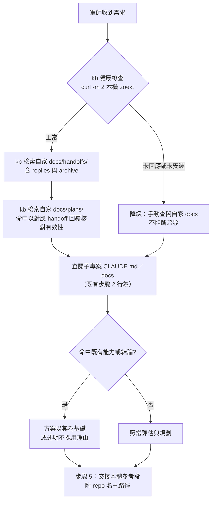

# feat: 軍師規劃前既有盤點與 kb 檢索接線（核心＋kb playbook）

**目標 repo**：本計畫跨四個資產落地——kunsu（本 repo，範本與母體文件）、三個 live 軍師（`~/Documents_local/project/kunsu-project-root/` 下的 `ebook`／`ivm`／`px`）、tshehtu（`~/Documents_local/Obsidian 專案/tshehtu`，kb skill 原始碼）。以下各單元的檔案路徑為各自 repo 的相對路徑。

## Summary

軍師範本工作流程的步驟 2 併入「規劃前既有盤點」指引——產出方案前以 kb（zoekt）依 handoffs → plans → 子專案文件優先序檢索既有能力與結論，步驟 5 交接本體附盤點所得參考；三個 live 軍師同步遷移，tshehtu 的 kb skill 補「搜歷史／搜教訓」查詢 playbook。首發範圍為核心＋kb playbook（origin R1–R6、R9），跨 repo solutions 外環（R7–R8）延後。

---

## Problem Frame

實證案例：ebook 軍師處理「已購書籍加入排序功能」時漏查自家歷史（既有快取列表記錄於過往 plan／handoff），過度規劃至使用者人工介入才收斂（see origin: docs/brainstorms/2026-07-24-kunsu-pre-planning-inventory-requirements.md）。軍師工作流程步驟 2 現行只要求查閱子專案文件，未要求檢索自家 `docs/handoffs/` 與 `docs/plans/`；zoekt 全機索引已存在（tshehtu），缺的是接線慣例。

---

## Requirements

沿用 origin 需求編號。本輪範圍：

**軍師工作流程（核心）**

- R1. 範本工作流程步驟 2 新增規劃前既有盤點：以 kb 依「自家 `docs/handoffs/`（含 `replies/` 與 `archive/`）→ 自家 `docs/plans/` → 子專案文件」優先序檢索既有能力與結論。
- R2. 盤點命中既有能力或結論時，方案以其為基礎或述明不採用的理由。
- R3. 步驟 5 拆解交接文件時，盤點所得相關結論以「repo 名＋路徑」列入交接本體參考段。
- R4. kb 不可用時降級為手動查閱，流程不中斷、不報錯中止。

**查詢基礎（kb playbook）**

- R5. kb skill playbook 新增「搜歷史／搜教訓」段：`docs/handoffs/`、`docs/plans/`、`docs/solutions/` 的 query 模板、frontmatter 過濾技巧、頂層熱區與 archive 冷區的兩層檢索慣例。
- R6. 搜歷史／搜教訓回報沿用 kb 既有慣例：附索引新鮮度與已索引範圍邊界說明。

**落地與遷移**

- R9. 範本更新後，ebook／ivm／px 三個 live 軍師 CLAUDE.md 同步遷移（origin R9 僅列 ebook／ivm 兩軍師；規劃查證確認 px 為第三個 live 軍師且工作流程段與範本完全一致，納入本輪，依據見 Sources & Research）。

**延後（見 Scope Boundaries）**：R7（全域跨 repo 檢索慣例薄段）、R8（ce-learnings-researcher 間接觸及）。

---

## Key Technical Decisions

- **盤點併入現有步驟 2 與步驟 5，不新增編號**：工作流程 1–7 編號有交叉引用（步驟 6 引用「第 7 步」、回覆信箱協議引用「工作流程第 7 步」），重編號會使範本與三軍師的遷移面積翻倍。盤點屬「評估技術可行性」的前置動作，語意上本就歸步驟 2。
- **plans 有效性核對句寫進步驟本文**：檢索到的 plan 是歷史意圖快照，可能已被推翻；步驟文字明載「plans 命中以對應 handoff 回覆的實際結果核對」。執行 session 讀的是步驟文字，不能只依賴 CONCEPTS.md 詞條（同理，軟依賴降級語意也在步驟內明文——沿用 handoff done 收尾閉環的教訓：機制只寫在別處時，守規 session 會跳過）。
- **索引限已 commit 內容的提醒進步驟本文**：zoekt 僅索引已 commit 內容，最新未 commit 的交接／回覆不在索引，步驟文字提醒必要時輔以直接翻檔。
- **索引前置重建是操作步驟，不是缺陷修復**：tshehtu 兩個既有缺陷（`~/.tshehtu/project-dir` 缺失、discovery 未入排程）維持 origin 範圍界定——於 tshehtu 記 todo 不在本輪修；但三軍師已搬家至 `kunsu-project-root/` 而 inventory 停在 2026-07-07 舊路徑，不手動重跑 discovery＋重建索引則盤點必然撲空，故列為 U1 前置操作。
- **版號零變動**：純範本 assets 改動循 2026-07-13 先例不升 kunsu-init 版號；handoff／kunsu-inbox 掃描行為零改動，版號與依賴聲明不動。
- **ebook 逐句替換保留客製**：ebook 工作流程步驟 2–3 含專案特定子分類（純後台／單端前端／跨專案、Android／Lumen／書城網站），整段覆蓋會抹掉客製；ivm 與 px 和範本完全一致可直接套用新版段落。
- **跨 repo 執行順序：kunsu 範本定稿 → 三軍師遷移與 tshehtu 對齊**：tshehtu playbook 的措辭引用範本最終文字，先定稿再對齊避免交叉引用漂移。

---

## High-Level Technical Design

盤點步驟的執行流程（步驟 2 內嵌，含軟依賴降級分支）：

---

## Implementation Units

### U1. tshehtu 索引前置重建（操作）

- **Goal**：三軍師現行路徑（`kunsu-project-root/`）進入 zoekt 索引，盤點檢索有效。
- **Requirements**：R1 的前提條件。
- **Dependencies**：無（可最先執行）。
- **Files**：無程式改動——手動執行 tshehtu 的 `scripts/discovery.py` 與 `scripts/rebuild-index.sh`。
- **Approach**：`~/.tshehtu/project-dir` 缺失使 kb SKILL.md 記載的 `$(cat ~/.tshehtu/project-dir)` 指令失效，直接以 tshehtu repo 實際路徑執行兩腳本；完成後核對 `~/.tshehtu/inventory.json` 含三軍師新路徑。
- **Test scenarios**：Test expectation: none——操作步驟，驗證即測試。
- **Verification**：zoekt 查詢 `r:<三軍師 repo 名>` 各命中其 `docs/handoffs/` 或 `docs/plans/` 內容；`~/.tshehtu/last-index-success` 更新為當日。

### U2. 軍師範本盤點步驟（kunsu）

- **Goal**：範本工作流程步驟 2 含完整盤點指引、步驟 5 含參考段項目。
- **Requirements**：R1、R2、R3、R4。
- **Dependencies**：無（措辭定稿是 U3、U4 的前提）。
- **Files**：`skills/kunsu-init/assets/templates/kunsu-claude.md`。
- **Approach**：步驟 2 標題與既有子彈（純單端／跨專案判斷）保留，於「查閱相關子專案…」前插入盤點指引——kb 查詢優先序（handoffs 含 replies 與 archive → plans → 子專案文件）、plans 以 handoff 回覆核對、索引限已 commit 提醒、軟依賴降級明文（KTD 全數落於步驟本文）、命中回饋方案的 R2 措辭。步驟 5 「須包含」清單加「相關既有教訓（選附）：盤點所得以 repo 名＋路徑列入」。副本清單核查：grep `skills/kunsu-init/SKILL.md` 是否重述工作流程步驟文字，有則同步；`PLACEHOLDERS.md` 不動（無新佔位符）。
- **Patterns to follow**：步驟 7 done 收尾的寫法（行為指引＋例外明文同段）；`init-obsidian-vault` 軟依賴措辭（「未安裝時略過」）。
- **Test scenarios**：步驟編號 1–7 不變（grep `^[0-9]\.` 計數）；同型句掃蕩——grep「評估技術可行性」「產出方案」「查閱」語境與新指引無矛盾；佔位符集合與 `PLACEHOLDERS.md` 一致（無孤兒）。
- **Verification**：範本 diff 檢閱通過上述三項掃描。

### U3. 三軍師 live 遷移

- **Goal**：ebook／ivm／px 三軍師 CLAUDE.md 工作流程段含盤點指引，ebook 客製措辭保留。
- **Requirements**：R9。
- **Dependencies**：U2。
- **Files**（各目標 repo）：`CLAUDE.md`（工作流程段）。
- **Approach**：ivm、px 與範本完全一致——直接以範本新版步驟 2／步驟 5 段落替換；ebook 逐句替換——盤點指引插入其客製子分類（純後台／單端前端／跨專案）之前，步驟 3 的「Android／Lumen／書城網站」客製保留，「規劃中心」自稱殘留不動（列入 Deferred）。每軍師依教訓紀律：grep 舊句恰中一次 → 替換 → 反向核查（新句命中、舊句歸零）→ 一筆 `docs:` 確認 commit（AskUserQuestion 逐次確認）。
- **Patterns to follow**：`docs/solutions/workflow-issues/handoff-done-closure-gap.md` Guidance (c) 的 live 遷移核查流程；歷次遷移 commit 訊息格式（`docs: 同步規劃前既有盤點步驟（2026-07-24 計畫）`）。
- **Test scenarios**：三軍師各 grep 盤點指引關鍵句恰中一次；ebook grep「純後台」「書城網站」仍命中（客製未被覆蓋）；三軍師步驟編號仍為 1–7。
- **Verification**：三筆確認 commit 完成，各軍師工作流程段通過正反向 grep。

### U4. tshehtu kb playbook 搜歷史／搜教訓段

- **Goal**：任何 session 可從 kb SKILL.md 直接取得檢索軍師歷史與跨 repo 教訓的 query 模板。
- **Requirements**：R5、R6。
- **Dependencies**：U1（三軍師入索引，handoffs 查詢方能命中）、U2（措辭對齊範本定稿）。
- **Files**（tshehtu repo）：`skill/kb/SKILL.md`（symlink 部署，改 repo 即生效）。
- **Approach**：查詢 playbook 新增「搜歷史／搜教訓」小節——query 模板（`f:docs/handoffs/`、`f:docs/plans/`、`f:docs/solutions/` 各搭關鍵字；frontmatter 過濾如 `problem_type:`、`tags:`、`status:`）、兩層檢索慣例（預設查頂層熱區、需要時以 archive 路徑翻冷區）、引用格式（repo 名＋路徑、標明他 repo 情境）；回報沿用既有「附索引新鮮度＋已索引範圍邊界」慣例（該段已存在，交叉引用即可）。附帶：於 tshehtu 以 `/todo` 記兩筆既有缺陷（`project-dir` 缺失、discovery 未入排程）。
- **Patterns to follow**：kb SKILL.md 既有 playbook 三段的結構與口吻（指令＋解碼範例＋注意事項）。
- **Test scenarios**：新增 query 模板逐條實跑一次，各至少命中一筆真實資料（handoffs／plans／solutions 各一）；模板中的 base64 解碼慣例與既有段一致。
- **Verification**：`/kb` skill 文字即時生效（symlink），模板實跑證據留存。

### U5. dogfooding 驗證

- **Goal**：以真實資料證明盤點步驟達成 origin 驗收情境。
- **Requirements**：origin AE1、AE2。
- **Dependencies**：U1–U4。
- **Files**：無新檔。
- **Approach**：AE1 回歸——以 zoekt 查詢 ebook 軍師「已購書籍」「快取列表」相關關鍵字，確認命中記載既有能力的 plan／handoff（即當初漏查的知識，現可檢索）；AE2 降級——暫停 zoekt 服務（`launchctl stop`）後依步驟 2 新指引走一遍，確認降級提示與流程不中斷，完畢重啟服務並確認恢復。
- **Test scenarios**：Covers AE1——查詢命中 ebook 軍師既有 plan／handoff 至少一筆，內容確為快取列表相關；Covers AE2——服務停止時健康檢查失敗、指引降級為手動查閱、無中斷或報錯；服務重啟後查詢恢復命中。
- **Verification**：兩情境的查詢輸出與行為記錄留存於回報。

### U6. 母體文件同步（kunsu）

- **Goal**：kunsu 母體文件反映本輪落地。
- **Requirements**：收尾慣例（非 origin R 編號）。
- **Dependencies**：U1–U5。
- **Files**：`CLAUDE.md`（開發狀態、文件導航）、`docs/README.md`、`CONCEPTS.md`（核對「規劃前既有盤點」詞條與最終實作一致）。
- **Approach**：依歷次慣例——開發狀態新增本輪條目、文件導航補本計畫列、docs/README.md 目前狀態與文件清單同步；`docs:` 確認 commit。
- **Test scenarios**：Test expectation: none——純文件同步。
- **Verification**：三份文件交叉引用一致（計畫路徑、詞條、版號描述）。

---

## Scope Boundaries

**Deferred to Follow-Up Work**

- R7／R8 外環：全域 CLAUDE.md 跨 repo solutions 檢索慣例薄段與 ce-learnings-researcher 間接觸及——等跨 repo 檢索的實際痛點出現再做；屆時落點建議全域 CLAUDE.md 直加（origin outstanding question 隨之關閉）。
- ebook 軍師「規劃中心」自稱殘留（ADR 005 詞彙統一未完整同步）——與本輪無關的既有漂移，不順手修。
- tshehtu 兩個既有缺陷修復——本輪僅記 todo（U4 附帶），排程化 discovery 與 `project-dir` 補寫另案。

**非目標**

- 通用 `/handoff` skill、CE plugin、軍師沙盤、mem0／RAG 基礎設施：均不改動（origin Scope Boundaries 全數沿用）。

---

## Risks & Dependencies

- **索引時效缺口會復發**：本輪 U1 手動重建後，未來 repo 搬家或新增仍不會自動進 inventory，直到 tshehtu 排程化 discovery（已記 todo）。緩解：kb 回報固定附索引新鮮度，盤點撲空時提示重跑 discovery。
- **zoekt 僅索引已 commit 內容**：軍師最新未 commit 的交接／回覆不在索引。緩解：步驟文字明載輔以直接翻檔（KTD）。
- **ebook 逐句替換出錯**：緩解：grep 恰中一次 → 替換 → 反向核查紀律（U3）。
- **依賴 tshehtu zoekt 常駐服務**：kb 為軟依賴，服務異常時盤點降級不阻斷（R4），不構成硬依賴。

---

## Sources & Research

- origin：`docs/brainstorms/2026-07-24-kunsu-pre-planning-inventory-requirements.md`（三個 promoted idea 為其上游，各含落地研究）。
- `docs/solutions/workflow-issues/handoff-done-closure-gap.md`——副本清單、憲章同型句掃蕩、live 遷移 grep 核查三紀律（U2、U3 直接套用）。
- `docs/solutions/best-practices/git-porcelain-scan-script-pitfalls.md`——中文檔名 quotepath 與 Edit＋`git mv` 陷阱（U3、U6 commit 時適用）。
- 範本工作流程段現況：`skills/kunsu-init/assets/templates/kunsu-claude.md` 第 29–47 行（步驟 1–7 硬編碼、無佔位符牽動）。
- live 軍師現況（2026-07-24 查證）：ivm、px 工作流程段與範本完全一致；ebook 步驟 2–3 含客製子分類；三軍師實際路徑在 `kunsu-project-root/`，tshehtu inventory（2026-07-07）仍記舊路徑——U1 的直接依據。
- SKILL.md 版號慣例：frontmatter `version:` 純數字；2026-07-13 範本工作流程新增第 7 步未升 kunsu-init 版號——版號零變動 KTD 的先例。
