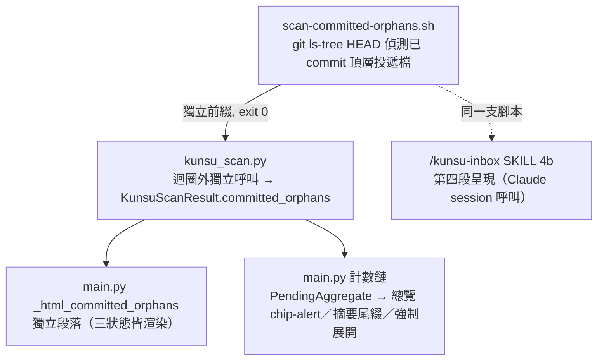

# feat: 投遞檔已 commit 漏收偵測（遺漏提醒）

## Summary

新增一支獨立偵測腳本 `scan-committed-orphans.sh`，以 `git ls-tree HEAD` 找出三信箱「已 commit、卻仍留在頂層未歸檔」的投遞檔，當成自成一類的**遺漏提醒**。軍師沙盤以獨立段落呈現（不受既有三支路 early return 影響）並整合計數，`/kunsu-inbox` 同步新增段落，現有三支 `scan-*.sh` 與 tripwire 邏輯零改動。出一份 ADR candidate 記錄設計。

---

## Problem Frame

kunsu 三信箱以「未 commit 即新件」為狀態訊號。三支 `scan-*.sh` 全基於 `git status --porcelain`——已 commit 且無修改的檔案不出現在 porcelain 輸出，對三支一律隱形；沙盤軍師視角 `kunsu_scan.py` 直接呼叫這三支腳本，故同樣漏。若環境有 auto-commit 把投遞檔誤 commit，軍師會**靜默漏收**：不報錯，只是掃不到。目前僅沙盤子專案視角（`subrepo_status.py`，檔案系統 glob）不受影響，且只覆蓋 replies。本需求為預防性，面向未來公開使用者（詳見 origin）。

---

## High-Level Technical Design

單一偵測來源（bash 腳本）扇出到兩個呈現面（沙盤、inbox）；沙盤內遺漏提醒為**獨立段落**，與軍師信箱三支路（tripwire／script_error／正常）平行、不受其 early return 影響：

腳本 exit 0 永不觸發 tripwire 的 exit 2；`kunsu_scan.py` 對它於 `_SCRIPTS` 共用迴圈**之外**獨立呼叫（迴圈遇 exit 2 立即 return 會跳過尾端項），確保 tripwire 觸發時仍收集遺漏提醒。渲染段落獨立於 `_html_kunsu` 的三支路，`total==0`／tripwire／script_error 三種狀態下有 `committed_orphans` 皆顯示（見 KTD3、KTD9）。

---

## Requirements

沿用 origin R1–R10（see origin: `docs/brainstorms/2026-07-24-committed-orphan-detection-requirements.md`）。

**偵測核心**

- R1. 獨立偵測腳本接受信箱目錄參數，找出該信箱**已 commit（存在於 HEAD tree）且無 porcelain 變更**、仍留頂層未歸檔的投遞 `.md` 檔，以自成一類前綴輸出。staged-only 新檔（未進 HEAD、porcelain 呈 `A`）不屬本腳本職責，由現有三支腳本當新件偵測，兩者不得雙重回報同一檔。
- R2. 腳本以 exit 0 回傳，不觸發現有 tripwire 的 exit 2；遺漏提醒與 tripwire、一般新件三者在輸出上可區分。
- R3. 三信箱共用同一支腳本，以參數化目錄達成。
- R4. 現有三支 `scan-*.sh` 零改動——porcelain「新件」與 tripwire 判定不變。

**偵測範圍與豁免**

- R5. replies 偵測 `docs/handoffs/replies/` 頂層回覆檔，排除 `docs/handoffs/` 頂層交接本體（軍師自建、commit 為正常）。
- R6. applications 偵測 `docs/applications/` 頂層 `.md`、reports 偵測 `docs/reports/` 頂層 `.md`。
- R7. 三信箱一律排除 `archive/` 子目錄與 `.gitkeep`。
- R8. 孤兒 reply（對應交接已 done）與一般漏收件歸同一遺漏提醒清單，不分類。

**呈現**

- R9. `/kunsu-inbox` 軍師模式輸出遺漏提醒，自成一類、續行不硬停。
- R10. 軍師沙盤以獨立段落呈現遺漏提醒（三狀態皆渲染）；沙盤軍師視角掃描納入偵測結果。計數整合入頁首總覽列與軍師分組摘要（本計畫確認的範圍，見 KTD6）。

---

## Key Technical Decisions

- KTD1. **偵測手段用 `git ls-tree HEAD`，非 `git ls-files`、非 porcelain。** porcelain 只顯示與上次 commit 的差異，已 commit 檔不出現；而 `git ls-files` 會列出 staged-but-not-committed 的新檔（porcelain `A` 狀態），與現有三支腳本雙重回報同一檔。`git ls-tree HEAD --name-only -r <dir>` 只列存在於 HEAD commit 的檔案，精確對應「已 commit」。呼叫帶 `-c core.quotepath=false`（防中文檔名靜默消失，見 Sources 陷阱二）。

- KTD2. **獨立第四支腳本、三信箱參數化共用，現有三支零改動。** porcelain 職責純粹不變、風險隔離；獨立腳本天然滿足「自成一類、獨立 exit 0」，並引入「HEAD tree 存在性偵測」能力為未來升級路（origin 方案 3）預留。

- KTD3. **遺漏提醒續行、自成類別，腳本 exit 0；`kunsu_scan.py` 於共用迴圈外獨立呼叫第四支。** 偵測到的是內容合法的投遞檔（只是被誤 commit），與 tripwire（未 commit 越界寫入）為鏡像，不套用 exit 2 硬停。現有 `scan_kunsu` 的 `for ... in _SCRIPTS` 迴圈遇 `returncode == 2` 立即 `return`，故第四支**不加入 `_SCRIPTS`／`_prefix_to_list`**，而在迴圈外（前後皆可）獨立呼叫、解析其前綴進 `committed_orphans`，再與前三支結果一併建構 `KunsuScanResult`——tripwire 觸發時前三支中止 return 前，仍先完成第四支收集。

- KTD4. **偵測範圍不對稱（正確性約束）＋豁免。** replies 掃 `docs/handoffs/replies/` 子目錄、applications／reports 掃各自頂層；交接本體不偵測。三信箱排除 `archive/` 與 `.gitkeep`。腳本內以「子目錄分支最先、頂層分支加 `${path#prefix} != */*` 二次驗證」防 bash glob `*` 跨 `/`（見 Sources 陷阱三）。

- KTD5. **沙盤新標籤用新 CSS 前綴，不得為 `badge`／`chip`／`tlabel`。** 兩條既有負向測試斷言（全頁不含 ` 0` 時改為「（遺漏提醒）」，避免與尾綴「遺漏 N」呈現「（無新訊息）｜遺漏 N」的矛盾。

- KTD7. **出 ADR candidate 014。** 記錄「遺漏提醒＝tripwire 鏡像、`git ls-tree HEAD` 偵測、不對稱範圍、續行不硬停、獨立渲染、計數整合」決策，比照 kunsu 慣例每個狀態機語意改動皆出 ADR。ADR 先於程式碼動工（比照 kunsu-dashboard 計畫 U6）。

- KTD8. **孤兒 reply 歸同一桶不細分。** 對應交接已 done 的孤兒 reply 與一般漏收件同列，MVP 不另立「歸檔未清」類別。

- KTD9. **遺漏提醒為獨立渲染段落，不嵌入 `_html_kunsu` 三支路。** `_html_kunsu` 在 tripwire_lines 非空、script_error 非空、`total==0` 三種情況各自 early return 或替換為佔位段落；若把遺漏提醒嵌入其正常分支，這三種狀態下 `committed_orphans` 會靜默消失——而「無新訊息但有漏收件」正是最需提醒的場景。改為獨立函式 `_html_committed_orphans(committed_orphans)`，在 `index()` 組裝軍師卡片時附加（`_html_kunsu(...) + _html_committed_orphans(...) + _html_todo_section(...)`），三狀態皆渲染。

---

## Implementation Units

### U1. ADR candidate 014：遺漏提醒偵測

- **Goal** — 記錄設計決策，讓後續單元有據可依。
- **Requirements** — KTD1–KTD9 的決策來源。
- **Dependencies** — 無（先行）。
- **Files** — `docs/adr/2026-07-24-adr-candidate-014-committed-orphan-detection.md`（create）。
- **Approach** — Context（三信箱 porcelain 隱形的靜默漏收、預防性動機）／Decision（KTD1–KTD9，含鏡像 tripwire 定位、`git ls-tree HEAD` 手段、不對稱範圍、續行不硬停、獨立渲染、計數整合、孤兒歸一桶）／Consequences（現有腳本零改動的風險隔離、升級路預留、多副本文字同步成本）／Open Questions（前綴字串、chip 樣式最終確認留實作）。比照既有 ADR candidate 格式與 frontmatter。
- **Test expectation: none** — ADR 文件。
- **Verification** — ADR 涵蓋 KTD1–KTD9，status 為 proposed/candidate，交叉引用 origin 與陷阱文件。

### U2. 偵測腳本 scan-committed-orphans.sh

- **Goal** — 新增獨立腳本，偵測三信箱頂層已 commit 投遞檔。
- **Requirements** — R1, R2, R3, R5, R6, R7, R8。
- **Dependencies** — U1。
- **Files** — `skills/kunsu-inbox/scripts/scan-committed-orphans.sh`（create）；`skills/kunsu-dashboard/tests/test_kunsu_scan.py`（新增直接以 `subprocess` 呼叫本腳本的 integration test，比照 `git_repo_with_inbox_files` fixture 風格擴充成可建立「已 commit」與「staged-only」兩種狀態的檔）。
- **Approach** — 參數化「信箱掃描根 + archive 排除」；`git -C "$ROOT" -c core.quotepath=false ls-tree HEAD --name-only -r <掃描目錄>` 取 HEAD 中已 commit 檔（只 `.md`），濾掉含 `/archive/` 與 `.gitkeep`；replies 掃 `docs/handoffs/replies/`、applications／reports 掃各自頂層並以 `${p#prefix} != */*` 排除巢狀；命中者輸出自成一類前綴（建議 `MISSED:`，最終字串於實作定），`exit 0`。空 repo（無 HEAD／無 commit）以 `git rev-parse --verify HEAD` 前置判斷，無 HEAD 時視同零筆、exit 0。驗證 git repo 根（比照現有三支）。
- **Patterns to follow** — `skills/kunsu-inbox/scripts/scan-applications.sh` 的整體骨架（引數校驗、`strip_quotes`、`-c core.quotepath=false`、archive 排除分支順序）；`docs/solutions/best-practices/git-porcelain-scan-script-pitfalls.md` 四陷阱。
- **Test scenarios**
  - 三信箱各建一「已 commit 頂層投遞檔」→ 腳本以正確前綴列出、exit 0。
  - untracked 頂層投遞檔（porcelain `??`）→ 不列出。
  - **staged-only 頂層投遞檔（`git add` 未 commit，porcelain `A`、不在 HEAD）→ 不列出**（避免與現有腳本雙重回報，覆蓋 R1）。
  - `archive/` 下已 commit 檔 → 不列出。
  - `.gitkeep` → 不列出。
  - 中文檔名的已 commit 投遞檔 → 正確列出（quotepath 防護）。
  - replies 場景：`docs/handoffs/` 頂層交接本體已 commit → 不列出（交接本體不偵測）。
  - 孤兒 reply（`replies/` 頂層已 commit、對應交接已歸檔）→ 列出（歸同一桶）。
  - 無 commit 的空 repo（無 HEAD）→ 零筆、exit 0（不報錯）。
  - 非 git repo 根 → 錯誤 exit（比照現有三支）。
- **Verification** — 上述場景測試綠燈；腳本對已 commit 檔命中、對 untracked／staged-only／archive／gitkeep／交接本體不誤報，exit code 恆為 0（非錯誤路徑）。

### U3. kunsu_scan.py 整合偵測結果

- **Goal** — 沙盤軍師視角掃描納入第四支腳本，且不受 tripwire 中止影響。
- **Requirements** — R2, R10。
- **Dependencies** — U2。
- **Files** — `skills/kunsu-dashboard/app/kunsu_scan.py`；`skills/kunsu-dashboard/tests/test_kunsu_scan.py`。
- **Approach** — `KunsuScanResult` 新增 `committed_orphans: list[str]` 欄位（frozen dataclass，建構時帶入）。第四支腳本**不加入 `_SCRIPTS`／`_prefix_to_list`**（那會進入 `returncode == 2` 立即 return 的共用迴圈，尾端項被跳過）；改在 `scan_kunsu` 的 `_SCRIPTS` 迴圈**之前**以獨立區塊呼叫第四支、解析其前綴到本地 `committed_orphans` 變數，再讓迴圈跑前三支；所有 `return KunsuScanResult(...)` 出口（正常、tripwire exit 2、script_error）均帶入已收集的 `committed_orphans`（frozen 一次性建構）。第四支自身若 exit 非 0，記入獨立錯誤描述、不污染 `committed_orphans` 亦不阻斷前三支。
- **Patterns to follow** — 現有 `scan_kunsu` 的 subprocess 呼叫、exit code 分類（0／2／其他）、frozen dataclass 建構慣例；第四支的解析比照 `_prefix_to_list` 的前綴剝除但為迴圈外獨立處理。
- **Test scenarios**
  - 第四支輸出前綴 → 正確解析進 `committed_orphans`。
  - 前三支之一觸發 tripwire（exit 2）→ `tripwire_lines` 非空**且** `committed_orphans` 仍非空（續行語意的守門斷言）。
  - 第四支 exit 非 0 → 記錯誤、不影響前三支結果與 `committed_orphans` 為空。
  - 三信箱皆無漏收 → `committed_orphans` 為空清單。
- **Verification** — `committed_orphans` 正確帶出；tripwire 與遺漏提醒可並存（互不抑制）；四出口均帶入該欄位。

### U4. 沙盤遺漏提醒獨立段落

- **Goal** — 以獨立段落渲染遺漏提醒，三狀態皆顯示。
- **Requirements** — R9（呈現對稱）, R10, KTD9。
- **Dependencies** — U3。
- **Files** — `skills/kunsu-dashboard/app/main.py`；`skills/kunsu-dashboard/tests/test_main.py`。
- **Approach** — 新增獨立函式 `_html_committed_orphans(committed_orphans)`，在 `index()` 組裝軍師卡片處以 `_html_kunsu(...) + _html_committed_orphans(...) + _html_todo_section(...)` 附加——**不**嵌入 `_html_kunsu` 三支路，故 tripwire／script_error／`total==0` 三狀態皆渲染。段落含 `
` 展開式與 `<h4>` 標題（比照 `_render_kunsu_category`）；每項於 `
` 外常態可見位置附「→ 下一步」提示。提示文案定義一則常數（比照既有 `_NEXT_STEP_HINTS`），語意為「此檔已被 commit，若屬誤 commit：`git rm --cached` 後重新走投遞流程；若確認已處理則歸檔」。標籤用新 CSS 前綴（如 `olabel`，非 badge／chip／tlabel）。
- **Patterns to follow** — `_render_kunsu_category`／`_html_latest_badge`（`main.py`）的 `
` 卡片與標題列；`_NEXT_STEP_HINTS`（`main.py:419`）的常數化提示；沙盤既有 verify 白話提示的常態可見設計。
- **Test scenarios**
  - `committed_orphans` 非空 → 頁面含遺漏提醒段落與各項路徑。
  - **`total==0`（軍師無新回覆／申請／上報）但 `committed_orphans` 非空 → 段落仍渲染**（守門「無新訊息卻漏收」場景，覆蓋 KTD9）。
  - **tripwire 觸發（`_html_kunsu` 走 card-tripwire）且 `committed_orphans` 非空 → 段落仍渲染。**
  - 每項含「→ 下一步」提示文字（常態可見，非僅 `
` 內）。
  - 新標籤 class 不以 `badge`／`chip` 開頭；段落與「待辦技術債」截字斷言相容。
  - `committed_orphans` 為空 → 不渲染段落（不留空標題）。
- **Verification** — 三狀態（正常／tripwire／`total==0`）皆渲染；UX 提示到位；既有負向斷言全綠。

### U5. 沙盤計數整合

- **Goal** — 遺漏提醒併入總覽列、分組摘要與強制展開，並修正標籤矛盾。
- **Requirements** — R10, KTD6。
- **Dependencies** — U3。
- **Files** — `skills/kunsu-dashboard/app/main.py`；`skills/kunsu-dashboard/tests/test_main.py`。
- **Approach** — `PendingAggregate`（`main.py:460`）新增 `committed_orphans: int = 0` 欄位；`_aggregate_pending`（`main.py:478`）以建構子參數帶入累計（frozen，不可建構後賦值）；`index()` 呼叫端同步新增 `committed_orphans` 計數取值行（比照 `todo_pending` 自 `scan` 帶入的路徑，避免呼叫端遺漏）；`_pending_suffix`（`main.py:510`）尾綴加「遺漏 N」（零不顯示）；`_kunsu_group_open_and_label`（`main.py:530`）強制展開條件加「`committed_orphans > 0`」，且其 `total==0` 分支標籤在 `committed_orphans > 0` 時由「（無新訊息）」改為「（遺漏提醒）」；`_html_overview`（`main.py:560`）加 `chip-alert` 樣式的遺漏提醒 chip（全零不渲染）。
- **Patterns to follow** — `todo_pending` 欄位的既有帶入鏈：`PendingAggregate` 欄位 → `_aggregate_pending` 參數 → `index()` 取值 → suffix／overview／強制展開四處同步。
- **Test scenarios**
  - 有遺漏提醒 → 分組摘要尾綴含「遺漏 N」。
  - 有遺漏提醒且 `total==0` → 分組標籤為「（遺漏提醒）」而非「（無新訊息）」（守門標籤矛盾）。
  - 有遺漏提醒 → 該軍師分組強制展開（即使無其他新訊息）。
  - 有遺漏提醒 → 頁首總覽列含 `chip-alert` 遺漏提醒 chip。
  - 全零 → 尾綴無「遺漏」、總覽無該 chip、標籤維持「（無新訊息）」、不影響既有折疊判斷。
  - `PendingAggregate` 以含 `committed_orphans` 的建構子建立不拋 `FrozenInstanceError`。
- **Verification** — 五處（欄位／彙整／呼叫端／suffix＋標籤／overview／強制展開）同步；frozen dataclass 建構正確；全零時零視覺副作用。

### U6. inbox SKILL.md 第四段（v0.5.0）

- **Goal** — `/kunsu-inbox` 軍師模式新增遺漏提醒段落。
- **Requirements** — R9。
- **Dependencies** — U2。
- **Files** — `skills/kunsu-inbox/SKILL.md`。
- **Approach** — 4b-1 補第四支腳本呼叫、4b-2 補前綴說明、4b-4 正常輸出區塊末尾（括號備用文字之前）補遺漏提醒段落與「→ 下一步」動作指引、括號備用文字補「／目前沒有遺漏提醒。」；版號 `0.4.0` → `0.5.0`（新增信箱類型屬 minor）；同步依賴聲明。腳本前綴與「下一步」文案須與 U2 腳本、U4 沙盤提示一致（多副本同步，grep 核查）。
- **Patterns to follow** — SKILL.md 4b 三段既有格式（段落標題、`→ 動作指引` 行、零筆備用文字）。
- **Test expectation: none** — skill 指令文件；行為一致性靠 U3 的 `kunsu_scan.py` 與腳本輸出對齊。
- **Verification** — 第四段格式與前三段一致；版號遞增；描述的腳本呼叫與 U2 腳本前綴一致。

### U7. 文件同步與收尾

- **Goal** — 詞彙、開發狀態、部署確認。
- **Requirements** — 全域一致性。
- **Dependencies** — U1–U6。
- **Files** — `CONCEPTS.md`；`CLAUDE.md`。
- **Approach** — `CONCEPTS.md` 新增「遺漏提醒」詞條（tripwire 鏡像、`git ls-tree HEAD` 偵測、獨立渲染、續行不硬停、display-only 不參與 tripwire 比對）；`CLAUDE.md` 開發狀態補本次條目與 skill 目錄結構（`scan-committed-orphans.sh`）；確認 `install.sh` 因整目錄部署而零改動（僅驗證，不改）。多副本定型文字（腳本前綴、「下一步」文案）以 grep 核查同步。
- **Test expectation: none** — 文件。
- **Verification** — CONCEPTS 詞條落地；CLAUDE.md 反映新腳本與狀態；install.sh 確認無需改動。

---

## Scope Boundaries

**本計畫涵蓋**：origin R1–R10 全部，含計數整合完整落地（KTD6）與 ADR（KTD7）。

**Deferred（見 origin，非本計畫）**
- 穩健訊號機制重構（軍師視角「新件」判斷改用檔案系統／HEAD 存在性，origin 方案 3）——獨立腳本不堵死此路。
- 孤兒 reply 細分為獨立「歸檔未清」類別。
- 安裝 gate 與 pre-commit 硬阻斷（對話早期的手段 A／B）。
- 修復自動化——遺漏提醒只提示不代為歸檔。

**Deferred to Follow-Up Work（本計畫實作衍生）**
- 沙盤 HTML 渲染慣例與 pytest git repo fixture 慣例目前無 `docs/solutions/` 沉澱；本計畫完成後以 `/ce-compound` 補寫（solutions 研究建議）。
- 遺漏提醒段落是否加「最新時間」badge（比照其他分類的 `_html_latest_badge`）以維持視覺對稱——次要，實作時評估。

---

## Risks & Dependencies

- **第四支腳本與 tripwire 序列的交互**（KTD3／U3）：現有 `scan_kunsu` 遇 exit 2 立即 return——故第四支不進 `_SCRIPTS` 迴圈、於迴圈外獨立收集。U3 的「tripwire 與遺漏提醒並存」測試是此風險的守門。
- **遺漏提醒渲染路徑覆蓋**（KTD9／U4）：`_html_kunsu` 三支路各自 early return，遺漏提醒須為獨立段落方能在 `total==0`／tripwire／script_error 三狀態顯示。U4 明列三狀態渲染測試。
- **`git ls-tree HEAD` 手段的正確性**（KTD1／U2）：避開 `git ls-files` 含 staged 導致與 porcelain 腳本雙重回報；空 repo（無 HEAD）需前置判斷。U2 明列 staged-only 與空 repo 測試。
- **frozen dataclass 建構陷阱**（KTD6／U5）：`PendingAggregate` 不可建構後賦值——曾於 todo 功能 doc review 被抓出。U5 明列建構子帶入與 `FrozenInstanceError` 測試。
- **負向測試斷言的 CSS 命名約束**（KTD5／U4）：新標籤誤用 `badge`／`chip` 前綴會打破既有斷言。U4 明列相容性測試。
- **多副本文字同步**：inbox SKILL 段落、腳本前綴、「下一步」文案三處須一致（U4／U6），以 grep 核查。
- **install.sh 零改動假設**：整目錄部署使新腳本自動涵蓋（repo 研究確認）；`kunsu_scan.py` 的第四支呼叫為迴圈外獨立區塊、不進 `_SCRIPTS`（U3）——兩者不可混淆。

---

## Sources / Research

- `docs/solutions/best-practices/git-porcelain-scan-script-pitfalls.md` — 四陷阱（`git mv` 前置 `git add`、`core.quotepath=false`、bash glob 跨 `/`、`RM` 只驗路徑形狀）。`git ls-tree HEAD` 作為 committed 檔偵測手段的根據見本計畫 KTD1（該手段來自 solutions 研究的建議，非此陷阱文件本體）。
- `skills/kunsu-inbox/scripts/scan-applications.sh` — 第四支腳本的骨架範本（引數校驗、archive 排除分支順序、`strip_quotes`）。
- `skills/kunsu-dashboard/app/main.py` — `_html_kunsu:658`（三支路 early return）、`PendingAggregate:460`、`_aggregate_pending:478`、`_pending_suffix:510`、`_kunsu_group_open_and_label:530`、`_html_overview:560`、`_NEXT_STEP_HINTS:419`；CSS 前綴分離（`:149`）與負向測試約束（`test_missing_verify_shows_no_badge:970`、`test_todo_labels:1682`）。
- `skills/kunsu-dashboard/app/kunsu_scan.py` — `KunsuScanResult:41`、`_SCRIPTS:32`、`_prefix_to_list:97`、tripwire exit 2 立即 return 的迴圈（`:132–143`）。
- `skills/kunsu-dashboard/tests/test_kunsu_scan.py:225` — `git_repo_with_inbox_files` integration fixture（新腳本測試範本）。
- `skills/kunsu-inbox/SKILL.md`（v0.4.0，4b 段落）— 軍師模式第四段對齊來源。
- origin：`docs/brainstorms/2026-07-24-committed-orphan-detection-requirements.md`。
