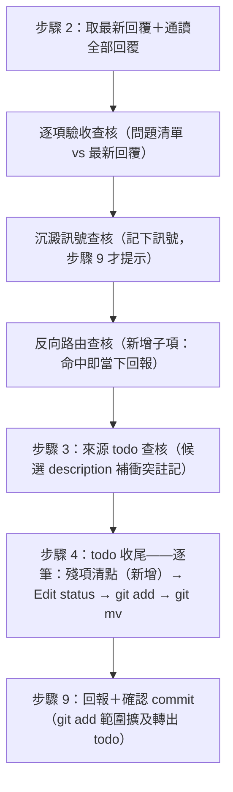

# feat: 回覆內容路由與收尾殘項清點

## Summary

在三個既有收尾／彙整時刻各加一道輕量查核：`skills/kunsu-inbox/SKILL.md` 軍師模式回報新回覆／新上報時附分流提示行；`skills/handoff/SKILL.md` done 步驟 2 通讀回覆時新增「反向路由查核」子項（抓指向發起方或第三方的行動項與已解答的既有疑問，當下回報）；done 步驟 4 與 `skills/todo/SKILL.md` done 把 todo 標「已解決」前新增「殘項清點」。全部僅提示不自動執行、零觸發詞、零腳本改動、零範本改動、免 live 軍師遷移。

---

## Problem Frame

軍師流程未定義「回覆讀完後內容各自去哪」：指向軍師自身的行動項與已解答的既有疑問沒有落點，只靠當次 session 記憶承載。ebook 軍師 2026-08-13 檢討記錄了三個實例（事件三：答案已在信箱六天、差點重複發交接去問；事件四：明確行動項懸空六天零處置；事件六：交接宣稱「已記錄追蹤」實際未記錄——衍生缺口寫在查證回覆裡、不在交接問題清單上，隨主議題歸檔一起消失）。三實例跨軍師查證確認缺口屬系統層面：ivm 出現「行動項曾路由進 todo、該 todo 整檔標已解決歸檔時殘項未清點、隨檔蒸發」的容器蒸發型變體；px 不漏但靠 kunsu 未規定的自建紀律。事件四時間線證明：含行動項的回覆在 done 收尾當下就在讀檔範圍內，被讀了但反向內容不在查核面上——掛在 done 的反向查核當場攔得住（詳見 origin 文件 Problem Frame）。

---

## High-Level Technical Design

新查核在 done 九步驟中的落點（步驟編號零順移，比照逐項驗收查核 v0.7.0 與沉澱訊號查核 v0.10.0 的「步驟內子項」判例）：

todo 在 done 流程內的五種去向（U2 依此表撰寫協議文字）：

| 去向 | 觸發條件 | 動作 | 步驟 9 commit 訊息 |
|---|---|---|---|
| 一併收尾 | 步驟 3 確認且清點無殘項（或殘項經確認一併視為已解決） | Edit status →「已解決」＋解決依據 → 歸檔 | 「；一併收尾 todo <slug>」 |
| 殘項轉出 | 清點發現殘項，使用者選「轉出」 | 原 todo 照常收尾；session 代建新 todo（裁決即授權） | 原 slug 照列＋「；轉出殘項 todo <slug>」 |
| 保留不歸檔 | 清點後使用者反悔收尾 | 整筆退出收尾清單：不 Edit、不 add、不 mv | 自「一併收尾」清單剔除 |
| 孤兒補歸檔 | status 已是「已解決／已封存」 | 不改終態 status；清點仍執行（提示語意區分）；僅補歸檔 | 「；一併收尾 todo <slug>」（沿用既有） |
| 衝突不建議收尾 | 步驟 2 反向查核命中的行動項指向此候選 todo | 候選 description 註明「本輪回覆含指向此 todo 的未完成行動項」，不建議勾選 | 未勾選則不出現 |

---

## Key Technical Decisions

- **掛載形狀：步驟內子項，零順移**——反向路由查核為 done 步驟 2 末位子項（沉澱訊號查核之後，沿用 `- **名稱**（定性語）：` 慣例）；殘項清點嵌入步驟 4 逐筆序列與 `/todo` done 步驟 2 內（Edit 前），不新增步驟編號。理由：v0.8.0 插入新步驟時曾連動至少五處交叉引用（連續執行約束、步驟 4／8／9 內文），子項路線免此連鎖；`/todo` rm 段引用 done 步驟 4／5 編號亦得以不動。
- **反向查核回報時刻＝步驟 2 當下，與沉澱訊號查核（步驟 9 才提示）刻意相反**——行動項不可遺失，沉澱僅屬建議性提示；使用者暫緩收尾時反向命中已顯式呈現。查核無狀態：暫緩後重跑 done 必然重新提示，此即遺失防線（協議文字須明寫這兩點，防止實作比照最近先例把回報放步驟 9）。
- **回填落點白名單：todo 與 plan；交接本體不可回填**——本體是定案快照（Invariant #5），含已歸檔者。疑問所在為交接本體時，提示改為「答案已存在於〈回覆路徑〉，建議落 todo 或 plan 註記並附該回覆路徑」。本體錯誤的勘誤機制另立 idea（`docs/ideas/2026-08-13-交接本體錯誤的勘誤落點與不可變性張力.md`），不在本計畫。
- **「已解答疑問」查核範圍設優先序與上限**——`docs/todos/` 頂層全讀（量小、行動項預設落點）→ 本交接本體內文引用的文件 → `docs/plans/` 僅標題與目標段掃描；`archive/` 不入查核範圍。範圍外漏報顯式接受（寫入協議文字，避免實作者各自發揮導致保障程度不可預期）。
- **偵測範圍＝全部回覆聯集，撤回標註不剔除**——沿用沉澱訊號查核建立的通讀範圍；早期回覆的行動項被後期回覆明示撤回或已完成時，提示照列並標註該狀態，裁決歸使用者（verify「只讀最新」慣例不適用於本查核，協議文字明寫以免兩個相反先例擇錯）。
- **SessionStart hook 不加分流提示行**——hook 摘要已導引執行 `/kunsu-inbox`，提示行只落 SKILL.md 完整輸出，避免 `session_hook.py` 出現第二份文案副本；R7 的零腳本邊界因此涵蓋 `session_hook.py`。
- **上報接受單層保障**——上報無 done 流程，僅 inbox 提示行一層；歸檔四步驟含人工開檔審閱，視為等效攔截點。範本（上報信箱協議）改動＝三 live 軍師遷移，違反零遷移邊界，顯式不做。
- **版號依判例各升 minor**——handoff v0.11.0→v0.12.0（done 加子項＝v0.7.0／v0.10.0 判例）、todo v0.1.2→v0.2.0（新增使用者可感知行為，非 0.1.2 的缺陷修正定性）、kunsu-inbox v0.5.0→v0.6.0（v0.4.0 收尾提示行判例）。

---

## Requirements

**查核行為（承接 origin R1–R8）**

- R1. kunsu-inbox 軍師模式新回覆段與新上報段各附一行分流提示（`→ ` 開頭、尾註「（僅提示，不自動執行）」，比照既有收尾提示行格式），提醒彙整時判斷「指向軍師的行動項→落 todo 或轉交接；解答既有疑問→回填至該疑問所在的 todo／plan」。
- R2. handoff done 通讀全部回覆時一併判斷：(a) 行動項——回覆要求發起方協調、安排、處理某事，或建議讓第三方知悉，且不屬接手方自身後續工作；(b) 已解答的既有疑問——回覆內容回答了查核範圍內（見 R10）登記過的疑問或承諾。
- R3. 有命中時逐筆提示落點，由使用者決定是否當場處理；查核不自動建檔、不自動編輯（使用者裁決後代建轉出 todo 除外，見 R14）。無命中靜默。
- R4. 反向查核結果於步驟 2 當下隨逐項驗收結果回報；查核無狀態，暫緩收尾後重跑 done 必然重新提示。
- R5. done 步驟 4 把 todo 標「已解決」前執行殘項清點：掃描該檔未註記完成的子項（「下一步」「待辦」等段落），有殘項時逐項回報，使用者三選一——一併視為已解決／轉出為新 todo／保留不歸檔。
- R6. `/todo` done 對稱加同款清點（步驟 2 內、Edit 前）；`rm` 明文排除清點（封存語意為整檔不處理）。
- R7. 改動僅三份 SKILL.md；軍師範本、上報歸檔四步驟、`status`／`verify` 值域、掃描腳本、`session_hook.py`、tripwire、pytest 測試全部零改動。
- R8. 版號鏈完整同步：三 skill frontmatter、kunsu-inbox 依賴聲明（主句版號＋括號累積註記）、CLAUDE.md 專案結構行（A1／A2 機械檢查點）、CONCEPTS「done 收尾」詞條具名列舉。

**缺口收攏（flow 分析定案）**

- R9. 回填落點限 todo／plan；疑問所在為交接本體時提示附回覆路徑、不觸碰本體（origin 驗收例「事件三重演」依此修訂）。
- R10. 疑問查核範圍優先序：todos 頂層全讀 → 本交接本體引用的文件 → plans 標題與目標段；archive 不入範圍，範圍外漏報顯式接受。
- R11. 步驟 3 候選 todo 同時被反向查核命中未完成行動項時，AskUserQuestion description 註明衝突且不建議收尾。
- R12. 殘項清點不跳過已解決／已封存孤兒；提示語意區分（「已標終態但仍有未註記完成子項，歸檔前確認是否轉出」），不改動終態 status。
- R13. 反向偵測為全部回覆聯集；被後期回覆撤回或已完成的行動項提示時標註該狀態、不靜默剔除。
- R14. 轉出 todo 由 session 於使用者裁決後代建：內文首行「轉出自 `docs/todos/archive/<原slug>.md`」（填歸檔後路徑，比照解決依據填預期路徑的先例）、`source: manual`；步驟 9 `git add` 範圍擴及轉出 todo，commit 訊息加註「；轉出殘項 todo <slug>」。
- R15. 「保留不歸檔」使該筆整筆退出收尾清單（不 Edit、不 add、不 mv），並自 commit 訊息的一併收尾清單剔除。
- R16. todo 無可辨識子項段落時清點靜默通過；同一行動項跨 inbox 提示行、反向查核、來源 todo 查核重複提示屬可接受誤報（提示前可 grep todos 頂層、已有落點者改標「似已落點於〈檔名〉」）。

---

## Implementation Units

### U1. handoff done 反向路由查核

- **Goal**：done 步驟 2 新增「反向路由查核」末位子項，步驟 3 候選 description 補衝突註記。
- **Requirements**：R2、R3、R4、R9、R10、R11、R13、R16。
- **Dependencies**：無。
- **Files**：`skills/handoff/SKILL.md`（done 步驟 2、步驟 3）。
- **Approach**：子項採 `- **反向路由查核**（純資訊性，命中即當下回報，不阻擋流程）：` 開頭，附掛於沉澱訊號查核的通讀動作（無新增讀檔）；內文依序載明——兩類偵測目標與行動項「不分指向發起方或第三方」、聯集範圍與撤回標註、疑問查核範圍優先序（R10 全文）、回填白名單與本體不可回填的替代提示（R9）、當下回報與無狀態重跑保證（R4，明寫「與沉澱訊號查核的步驟 9 提示刻意不同」）、重複提示定調與「似已落點」收斂（R16）。步驟 3 的 AskUserQuestion 候選格式段補一句 description 衝突註記規則（R11）。
- **Patterns to follow**：步驟 2 既有兩子項的粗體名稱＋括號定性語慣例；沉澱訊號查核的「字面存在即提示、不確定傾向記下」措辭；效力陳述用條件式（攔截點遷移教訓，`docs/solutions/workflow-issues/handoff-intercept-point-selection.md`）。
- **Test scenarios**（U6 落實為 dogfooding 斷言）：
  - Covers AE1. 回覆引言區塊含「需要你協調」行動項 → 查核當下列出並提示落 todo，不代建。
  - Covers AE2. 回覆載明答案而承諾寫在另一份交接本體 → 提示「答案已存在於〈回覆路徑〉，建議落 todo／plan」，不提示編輯本體。
  - Covers AE7. 回覆含查證附帶發現的衍生缺口（不在交接問題清單）→ 逐項驗收無此項、反向查核命中並提示落 todo。
  - 早期回覆行動項被後期回覆明示已完成 → 提示照列並標註「後期回覆載明已完成」。
  - Covers AE5. 回覆僅工作結論 → 查核零輸出，done 流程與現行一致。
  - 使用者暫緩收尾後重跑 done → 同一命中重新提示。
- **Verification**：SKILL.md 子項插入位置與慣例形狀正確；`scripts/consistency-check.sh` C 項（行 474／476 定型文字）與 B 項（值域行）不受影響。

### U2. handoff done 殘項清點與步驟 9 連動

- **Goal**：done 步驟 4 逐筆序列嵌入殘項清點，步驟 9 commit 範圍與訊息同步。
- **Requirements**：R5、R12、R14、R15、R16。
- **Dependencies**：U1（同檔、順序執行避免編輯衝突）。
- **Files**：`skills/handoff/SKILL.md`（done 步驟 4、步驟 9、「確認 commit（協議步驟）」段訊息表格 done 列）。
- **Approach**：步驟 4 逐筆序列改為「殘項清點 → Edit status → git add → git mv」（清點在 Edit 前，不打亂既有 porcelain 防護序列）；依 HTD 五去向表撰寫——孤兒不跳過清點且不改終態（R12）、三選項互動沿用步驟 3 既有「≤4 筆 multiSelect、>4 筆數字清單」慣例、保留者整筆退出（R15）、轉出者裁決後代建與關聯行（R14）、無子項段靜默通過（R16）。步驟 9 的 `git add` 窮舉範圍補「轉出 todo 路徑」、commit 訊息格式補「；轉出殘項 todo <slug>」註記；「確認 commit（協議步驟）」段訊息表格的 done 列括號加註同步補「；轉出殘項 todo <slug>」，與步驟 9 字面一致（此表格為 commit 訊息格式的第二副本、無機械檢查涵蓋，靠本清單防漏）。
- **Patterns to follow**：步驟 4 既有「任一筆失敗中止剩餘、已完成不回滾」的失敗語意（清點後新增動作沿用）；`git mv` 不暫存 Edit 內容的陷阱防護（`docs/solutions/best-practices/git-porcelain-scan-script-pitfalls.md`）。
- **Test scenarios**：
  - Covers AE3. 來源 todo「下一步」段兩項未完成 → 清點逐項列出，一項轉出（新 todo 內文首行含歸檔後路徑）、一項一併視為已解決；commit 訊息含兩種註記。
  - 孤兒 todo（已解決未歸檔）含殘項 → 清點提示語意區分，status 零 diff，補歸檔照常。
  - Covers AE6. 殘項全數註記完成 → 清點零輸出，流程與現行一致。
  - 保留不歸檔 → 該筆三動作全跳過，commit 訊息剔除該 slug。
  - porcelain `RM`／`A` 兩種前置狀態的歸檔全鏈無回歸。
- **Verification**：五去向表逐列有對應協議文字；步驟 9 加註格式與 ADR 009 `docs:` 前綴相容。

### U3. todo skill done 清點對稱與 rm 排除

- **Goal**：`/todo` done 步驟 2 內加清點子項（Edit 前），rm 明文排除。
- **Requirements**：R6、R12、R16。
- **Dependencies**：U2（語意以 handoff 步驟 4 定稿為準，兩處對稱）。
- **Files**：`skills/todo/SKILL.md`（done 步驟 2、rm 段）。
- **Approach**：清點以步驟 2 內子句呈現（「Edit 前先清點…」），免步驟順移（rm 段引用「同 done 步驟 4／5」的編號不動）；語意與 handoff done 步驟 4 逐字對齊者僅限查核行為描述，互動與去向沿用（`/todo` done 無收尾清單概念，「保留」即中止本次 done）。rm 段補一句「rm 不執行殘項清點——封存語意為整檔不處理」。既有雙向同步鉤子（handoff 步驟 4 標題「該 skill 步驟更新時同步核查本段」、todo 注意段）本次雙側同批更新，互為核查。
- **Patterns to follow**：0.1.2 的 untracked 前置檢查行文密度；「注意」段的 handoff 交互描述慣例。
- **Test scenarios**：
  - `/todo` done 對含未完成子項的 todo → 清點提示，選轉出後新 todo 建立、原 todo 照常歸檔。
  - `/todo` rm → 不觸發清點。
  - Test expectation 補充：無 pytest 對應（協議文字層），以 U6 dogfooding 斷言覆蓋。
- **Verification**：rm 段步驟編號引用零 diff；與 handoff 步驟 4 的查核語意無矛盾（一次通讀可過）。

### U4. kunsu-inbox 分流提示行

- **Goal**：軍師模式 4b-4 新回覆段與新上報段各加一行分流提示。
- **Requirements**：R1、R7。
- **Dependencies**：無。
- **Files**：`skills/kunsu-inbox/SKILL.md`（4b-4 段）。
- **Approach**：新回覆段於既有收尾提示行後加第二行 `→ `（彙整分流：行動項落 todo 或轉交接、答案回填 todo／plan）；新上報段於既有四步驟提示行後加對稱一行。尾註「（僅提示，不自動執行）」。`session_hook.py` 不動（KTD：hook 導引 `/kunsu-inbox`，避免第二副本）。
- **Patterns to follow**：v0.4.0 收尾提示行的「→ 」格式與執行性質尾註。
- **Test scenarios**：
  - Covers AE4（縮限為機制可保證範圍）. 軍師模式掃到新上報 → 輸出含分流提示行；彙整時是否識別屬期望行為、不入斷言。
  - E 項機械檢查（「未接手／部分完成」詞彙）不受影響——只加不刪。
- **Verification**：兩段提示行格式與既有三行一致；hook pytest 12 項零改動且照常通過。

### U5. 版號鏈與詞條同步

- **Goal**：三 skill 版號、依賴聲明、CLAUDE.md、CONCEPTS 一次收斂。
- **Requirements**：R8。
- **Dependencies**：U1–U4（內容定稿後統一升版）。
- **Files**：`skills/handoff/SKILL.md`、`skills/todo/SKILL.md`、`skills/kunsu-inbox/SKILL.md`、`CLAUDE.md`、`CONCEPTS.md`。
- **Approach**：handoff frontmatter v0.12.0；todo frontmatter v0.2.0；kunsu-inbox frontmatter v0.6.0。kunsu-inbox 依賴聲明主句版號改 v0.12.0，括號累積註記補「v0.12.0 的反向路由查核與殘項清點為 done 流程內部指引——不涉掃描慣例、無豁免需求」。CLAUDE.md 專案結構行同步 handoff／todo 版號與括號描述增述（A1／A2 機械檢查點）。CONCEPTS「done 收尾」詞條括號具名列舉補「反向路由查核」與「todo 殘項清點」，維持「以 handoff SKILL.md done 段為準、此處不重複細節」的單一副本寫法。
- **Patterns to follow**：依賴聲明歷代累積註記句式；CONCEPTS 去窮舉化（僅具名、指向權威來源）。
- **Test scenarios**：Test expectation: none——純版號與詞條同步，由 Verification 的機械檢查覆蓋。
- **Verification**：`scripts/consistency-check.sh` 全項 PASS（A1 handoff 三處、A2 todo 兩處、B 值域四檔、C 定型文字實跑比對、E 分類詞）；kunsu-inbox 自身版號無機械檢查點，人工核對 frontmatter 與 CLAUDE.md 敘述一致。

### U6. 暫存目錄 dogfooding

- **Goal**：以 mktemp 假軍師 repo 實跑全部斷言場景，證明查核行為與零回歸。
- **Requirements**：全部（驗證層）。
- **Dependencies**：U1–U5。
- **Files**：無版控產出（暫存目錄實跑；場景與結果摘要記入 commit 訊息或回報）。
- **Approach**：比照沉澱訊號查核 22 項斷言的既有慣例建 fixture——交接本體＋多份回覆（含行動項、撤回、衍生缺口、答案型）＋todos（含殘項、孤兒、無子項段）；逐場景執行 done 與 `/todo` done，斷言 U1–U3 test scenarios 全數；`/kunsu-inbox` 輸出斷言 U4 提示行；歸檔全鏈 porcelain `RM`／`A` 形狀無回歸；grep 核查——新增協議文字無誤觸不可觸碰區（handoff SKILL.md 值域行與暫離提示行零 diff）、舊句替換恰中（比照 live 遷移 grep 核查紀律）。
- **Patterns to follow**：`docs/solutions/workflow-issues/handoff-done-closure-gap.md` 的多副本同步核查與 grep 計數紀律。
- **Test scenarios**：即 U1–U4 各單元場景的實跑集合，另加乾淨全鏈（無任何命中時三查核全靜默、done 輸出與 v0.11.0 逐字等價僅版號異動）。
- **Verification**：全部斷言通過；`scripts/consistency-check.sh` 全項 PASS；149 項 pytest 零改動照常通過。

---

## Acceptance Examples

- AE1. **Covers R2, R3, R4.** 回覆末尾引言區塊「開辦 Apple Developer 帳號的權限不在 backend 這端，請安排」（事件四重演）。done 步驟 2 反向路由查核當下列出該行動項並提示落 todo；使用者確認後自行（或指示 session）建立 todo，查核不代建。
- AE2. **Covers R2, R9, R10.** 回覆載明後台平台欄位已上線可用並附重現步驟，而該疑問的承諾寫在另一份交接本體第四節（事件三重演）。查核提示「答案已存在於〈回覆路徑〉，建議落 todo 或 plan 註記並附回覆路徑」；不提示編輯任何交接本體。
- AE3. **Covers R5, R14, R15.** done 一併收尾某來源 todo，其「下一步」段兩項未註記完成（ivm 4K 型重演）。清點逐項列出；使用者一項選轉出（session 代建新 todo，內文首行「轉出自 `docs/todos/archive/<原slug>.md`」）、一項一併視為已解決；commit 訊息同時含「；一併收尾 todo <原slug>」與「；轉出殘項 todo <新slug>」。
- AE4. **Covers R1.** 軍師模式掃到新上報（ivm xlsx 型）。inbox 輸出於上報段附分流提示行；後續彙整識別屬期望行為，不在機制保證範圍。
- AE5. **Covers R3.** 回覆僅工作結論、逐項驗收全數命中、無反向內容。反向路由查核零輸出，done 流程與現行一致。
- AE6. **Covers R5, R16.** 來源 todo 的子項全數註記完成。殘項清點零輸出，收尾與現行一致。
- AE7. **Covers R2, R4.** 回覆含查證過程附帶發現的衍生缺口、不在交接問題清單上（事件六重演——「附帶發現隨主議題歸檔消失」的高風險時機）。逐項驗收查核比對問題清單無此項；反向路由查核命中並提示落 todo，主議題照常收尾。
- AE8. **Covers R6.** `/todo` done 對含未完成子項的 todo 執行殘項清點：逐項列出，使用者選轉出後新 todo 建立、原 todo 照常歸檔；`/todo` rm 不觸發清點。

---

## Scope Boundaries

- 憲章分流慣例（範本工作流程強制四類分流）：deferred，等收尾查核實跑後評估（origin Key Decisions）。
- 寫方標記段與疑問識別碼：不做，理由見 origin Key Decisions。
- SessionStart hook 摘要加分流提示行：不做——hook 導引 `/kunsu-inbox`、提示行單一副本落 SKILL.md。
- 上報第二層兜底：不做——單層保障顯式接受，歸檔四步驟人工審閱為等效攔截點。
- 接手方察覺交接與原始來源矛盾的回報義務（事件五衍生，reply 寫方協議）：另立 `docs/ideas/2026-08-13-接手方察覺交接與原始來源矛盾時無回報義務.md`，不在本計畫。
- 交接本體錯誤的勘誤機制（事件五本體，Invariant #5 張力）：另立 `docs/ideas/2026-08-13-交接本體錯誤的勘誤落點與不可變性張力.md`，成形後屬 ADR 層級。
- 申請信箱與「交接遲不收尾」積壓：不納入（origin Scope Boundaries）。
- 源檔事件一（已於 ebook 端完整處置並沉澱查核紀律）與事件二（源檔自判純執行面、非流程問題）：非本計畫標的。

---

## Risks & Dependencies

- **語意判斷的誤報／漏報**：行動項與殘項辨識無法字串比對保證；以「字面存在即提示、由使用者裁決」傾向極小化漏報（origin 假設段），雜訊由 R16 收斂。查核範圍上限（R10）明文接受範圍外漏報。
- **版號鏈漏同步**：A1／A2 有機械檢查；kunsu-inbox 自身版號無機械檢查點，列入 U5 人工核對。
- **定型文字誤觸**：handoff SKILL.md 行 474（值域行）與行 476（暫離提示行）受 consistency-check C 項逐字比對保護，U6 加 grep 零 diff 斷言雙重防護。
- **步驟編號交叉引用**：子項路線免順移，但 U1／U2 編輯後仍以 grep 掃描「步驟 N」引用逐一核對（v0.8.0 順移連鎖的教訓）。

---

## Sources / Research

- origin：`docs/brainstorms/2026-08-13-reply-routing-and-residual-check-requirements.md`（R1–R8、AE1–AE5 初版、五條 Key Decisions）。
- 問題源頭：ebook 軍師 repo `docs/todos/軍師流程缺口回覆內容缺乏路由機制導致軍師自身行動項靜默漏接.md`（2026-08-13 更新版，六起事件；事件三、四、六為本計畫標的，事件五拆出兩筆 idea）。
- 三實例查證（2026-08-13）：事件四時間線（同日建立、回覆抵達、23:00 收尾，commit `71b3a31`——done 掛載點可攔的直接證據）；ivm 51 份回覆 19 筆行動項 16 路由 1 容器蒸發型漏接；px 33 份回覆逾 20 筆全路由、靠自建紀律。
- repo 現況：handoff v0.11.0 done 九步驟結構與步驟 2 子項慣例、v0.7.0／v0.10.0 子項免順移判例、consistency-check 22 項中 A1／A2／B／C／E 與本次相關、依賴聲明累積註記句式、CONCEPTS 去窮舉化寫法（`4a86b77`）。
- 教訓援引：`docs/solutions/workflow-issues/handoff-intercept-point-selection.md`（必經路徑掛載、條件式措辭）、`docs/solutions/workflow-issues/handoff-done-closure-gap.md`（提示行格式、多副本同步核查、grep 計數紀律）、`docs/solutions/best-practices/git-porcelain-scan-script-pitfalls.md`（清點不得打亂 Edit→add→mv 序列）。
- flow 分析（2026-08-13）：2 Critical（回填白名單、查核範圍上限）＋8 Important＋8 Minor，全數收攏於 R9–R16 與各單元 Approach。
