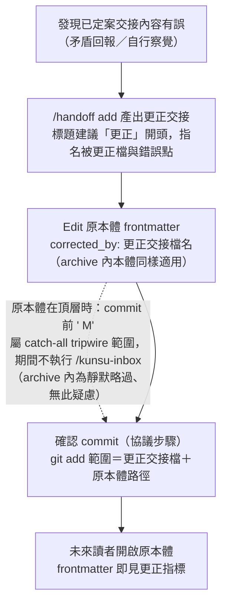

# feat: Invariant #5 生命週期 metadata 邊界與勘誤、引用兩慣例

## Summary

產出 ADR Candidate 016 把 Invariant #5 例外邊界重述為「內文不可變；frontmatter 生命週期 metadata 由發起方維護」，據此落勘誤慣例（更正交接＋`corrected_by:` 指標）與引用慣例（檔名權威、路徑提示）：handoff SKILL.md 新增更正交接子節與引用指引（v0.14.0）、範本七處「唯一例外」措辭一致化、三 live 軍師同步遷移、consistency-check H 檢查追加遷移完整性比對。

## Problem Frame

見 origin：`docs/brainstorms/2026-08-14-invariant5-lifecycle-metadata-requirements.md`。兩個同源缺口——已歸檔本體有錯無法指向更正、交接引用隨歸檔必然腐化且無法修正；偵測側已由 v0.13.0 矛盾回報補完，本計畫處理落點與指標。

---

## Requirements

承 origin R1–R10，計畫層面不增減：

- R1. ADR Candidate 明訂例外邊界重述：內文不可變；frontmatter 生命週期 metadata 由發起方維護。
- R2. ADR 附欄位擴張判準（僅限發起方對自己文件的生命週期事實標記，不承載內容判斷、不進任何比對邏輯、僅 display 與追溯用途，新欄位需 ADR 修訂）。
- R3. 合規欄位窮舉：`status`（既有）、`corrected_by`（新增，選填）。
- R4. 勘誤以更正交接傳遞，不編輯原本體內文。
- R5. 發更正交接當下於原本體 frontmatter 補 `corrected_by`；已歸檔本體同樣適用。
- R6. `corrected_by` 僅 display 與追溯用途，不進掃描、tripwire 或分類邏輯。
- R7. add 指引明訂引用交接／回覆以檔名為權威識別、路徑為當下提示。
- R8. 既有 archive 失效引用不回溯；done 步驟 8 現行範圍零改動。
- R9. 範本 Invariant #5 修訂與三 live 軍師 CLAUDE.md 同步遷移。
- R10. handoff SKILL.md 升 minor、CONCEPTS 詞條同步並新增「更正交接」。

---

## Key Technical Decisions

- **ADR 先行、經 doc review 後再動範本與 SKILL**：比照 ADR 010 先例（U6 ADR 於程式碼動工前完成一輪 doc review），Invariant 層級的文字先定案，下游修訂以 ADR 定稿為準，避免邊寫邊漂。
- **`corrected_by` 值存檔名、不含路徑**：與 R7 檔名權威慣例自洽——指標本身免疫歸檔造成的路徑腐化（更正交接日後歸檔也不需回頭改指標）。值形：單值起步；出現第二份更正時改為 YAML 列表累加，保留全部更正歷史。display-only，消費端查證確認安全（`subrepo_status.py` 以 `yaml.safe_load` 全量解析、無欄位白名單；HOME dataview 只讀 `from`／`to`／`status`／`created` 四欄；`scan-replies.sh` 不解析檔案內容）。
- **tripwire 中間態零腳本改動，頂層與 archive 兩種形狀不同**：頂層本體 Edit 加 `corrected_by` 後、確認 commit 前，porcelain ` M` 落入 `scan-replies.sh` catch-all tripwire 範圍（144–147 行），沿 done 步驟 5–7 先例以連續執行約束（Edit 至 commit 間不執行 `/kunsu-inbox`）＋確認 commit 收斂；archive 內本體的 ` M` 由歸檔區靜默略過分支（131–133 行，依檔頭分類規則最先評估）涵蓋，**無 tripwire 疑慮**（與 origin「archive 不在任何掃描面上」一致）。兩者皆零腳本改動、不擴 rename 豁免形狀；U1 ADR 相容性論證與 U2 子節文字依此兩形狀分別撰寫。
- **「唯一例外」措辭七處一致化，而非單點修改**：範本涉及不可變性的段落共七處（`kunsu-claude.md` 11、46、47、48、54、72、73 行），例外邊界重述後逐處檢視同步、只改必要處（72／73 行規範的是外部寫入邊界，發起方自身的生命週期維護本不在其範疇，預期不動）。依 2026-07-13 憲章掃蕩教訓：機制層先行而憲章字面未跟上，守規 session 會迴避正當操作。
- **consistency-check H 檢查追加 `corrected_by` 比對字串**：把三 live 軍師遷移完整性納入機械檢查（WARN 級，與既有「規劃前既有盤點」「勿自標」兩字串並列），origin 未決項就地定案。
- **live 遷移保留各自既有詞彙變體**：ebook 的「規劃中心」措辭、ivm CONCEPTS 的改寫版詞條與 wiki-link，只同步例外邊界語意、不順手統一詞彙（比照 ADR 005 歷史原貌原則）；各軍師一筆確認 commit（ADR 009）。

---

## High-Level Technical Design

更正交接流程（發起方視角，含 tripwire 中間態的收斂點）：

---

## Implementation Units

### U1. ADR Candidate 016：生命週期 metadata 邊界

- **Goal**：Invariant #5 例外邊界重述的決策記錄定稿，作為 U2–U4 文字修訂的依據。
- **Requirements**：R1–R3。
- **Files**：`docs/adr/2026-08-14-adr-candidate-016-lifecycle-metadata-boundary.md`（新建；命名沿 `adr-candidate-NNN` 主流格式，下一號 016）。
- **Approach**：內容涵蓋——邊界重述與擴張判準（R2 四要件）；合規欄位窮舉（`status`、`corrected_by` 含值形：檔名、單值起步第二份起列表）；兩慣例決策（更正交接、檔名權威）與否決方案記錄（corrections/ 目錄、本體勘誤節、接受現狀，含理由）；對 Invariant #5 原始目的（防版本漂移、單一作者）零損害論證；tripwire 中間態相容性（沿連續執行約束先例）。
- **Patterns to follow**：`docs/adr/2026-07-11-adr-candidate-010-dashboard-service-exception.md`（例外範圍界定＋未來比照判準的章節形狀）、`docs/adr/2026-08-13-adr-candidate-015-dispatch-push-notification.md`（對既有決策翻案／修訂的敘述方式）。
- **Test scenarios**：Test expectation: none——純 ADR 文件；驗證為產出後跑一輪 headless doc review（比照 ADR 010 先例），修正後再進 U2。
- **Verification**：ADR 內含 R2 判準與 R3 窮舉表；doc review 無 P0／P1 殘留。

### U2. handoff SKILL.md：更正交接子節與引用慣例（v0.14.0）

- **Goal**：勘誤與引用兩慣例落入發起方必經路徑。
- **Requirements**：R4–R8、R10。
- **Dependencies**：U1。
- **Files**：`skills/handoff/SKILL.md`。
- **Approach**：add 步驟 1「相關檔案 / 連結」行（現 121 行）補引用慣例一句（檔名為權威識別、路徑為當下提示、歸檔失效不構成錯誤）；add 段末新增 `#### 更正交接` 子節（比照 reply 段「暫離回報」子節的形狀）——適用時機、標題建議「更正」開頭、內文指名被更正檔與錯誤點、產檔後 Edit 原本體補 `corrected_by`（值形依 U1 定稿；archive 內本體同樣適用）、確認 commit 的 `git add` 範圍**包括更正交接檔與原本體路徑**、確認 commit 訊息沿 add 格式加註記（`docs: 建立交接 <檔名>；補記更正指標 <原本體檔名>`，SKILL.md 指令格式段的 commit 訊息表格 add 行一併同步——v0.12.0「第二副本漏列」教訓）、取消分支指引（取消時保留變更並附可手動執行的 commit 指令，明示原本體在**頂層**時未 commit 的 ` M` 會使 `/kunsu-inbox` 觸發 tripwire，屬預期訊號、以補 commit 收斂；archive 內無此疑慮）、連續執行約束（僅頂層情形需要）、`corrected_by` display-only 聲明；frontmatter version 0.13.0 → 0.14.0。done 步驟 5、步驟 8 零改動。
- **Patterns to follow**：reply 段「暫離回報」子節（掛載形狀）；done 步驟 9 的「`git mv` 不暫存 Edit 內容」陷阱說明措辭（本子節的 git add 範圍說明同型）。
- **Test scenarios**：
  - 新子節與引用慣例句就位，Read 確認未打斷既有段落結構。
  - Covers AE1（origin）：逐句對照子節文字——已歸檔本體補指標的場景被字面涵蓋。
  - Covers AE2（origin）：引用慣例句字面涵蓋「路徑失效不構成錯誤、以檔名搜尋」。
  - `grep -c` 確認「回覆檔 \`status\` 值：」與「中途需切換任務時」全檔計數各維持 1（新文字未引入定型句首）。
- **Verification**：consistency-check B／C 通過；version 0.14.0 就位。

### U3. 範本與母體詞彙同步

- **Goal**：憲章層與詞彙層跟上 ADR 016 定稿，新軍師不再帶舊邊界出生。
- **Requirements**：R9（範本側）、R10（詞條側）。
- **Dependencies**：U1。
- **Files**：`skills/kunsu-init/assets/templates/kunsu-claude.md`、`skills/kunsu-init/assets/templates/kunsu-concepts.md`、`CONCEPTS.md`（母體）、`skills/kunsu-init/SKILL.md`（version 0.3.2 → 0.4.0，範本內容變更）。
- **Approach**：`kunsu-claude.md` 11 行 Invariant #5 例外句重述（生命週期 metadata：`status`、`corrected_by`＋一句擴張判準＋歸檔搬移）；54 行回覆信箱協議例外句同步；46／47／48／72／73 行逐處檢視「唯一例外」措辭、只改必要處（72／73 預期不動，理由見 KTD）。`kunsu-concepts.md`「交接文件」詞條例外句同步。母體 `CONCEPTS.md`：「交接文件」「done 收尾」詞條例外句同步、新增「更正交接」詞條（含 `corrected_by` 語意與 display-only 邊界）。
- **Test scenarios**：
  - `grep -n "唯一例外" skills/kunsu-init/assets/templates/kunsu-claude.md` 逐處核對措辭一致。
  - 範本 69 行值域句與 dataview SORT 行零 diff（B／F 檢查前提）。
  - Covers AE3（origin）：149 項 pytest 照常通過（沙盤與 hook 對新欄位零感知）。
- **Verification**：consistency-check B／F／G 通過；母體 CONCEPTS 三詞條就位。

### U4. 三 live 軍師遷移

- **Goal**：ebook／ivm／px 憲章與詞彙跟上，例外邊界全網一致。
- **Requirements**：R9。
- **Dependencies**：U3。
- **Files**（各軍師 repo）：`kunsu-project-root/{ebook,ivm,px}` 各自的 `CLAUDE.md`（Invariant #5 於各 :11；回覆信箱協議句 ebook :117／ivm :104／px :122；工作流程引用句 ebook :110-111／ivm :97-98／px :115-116）與 `CONCEPTS.md`（「交接文件」詞條各 :13-14）。
- **Approach**：與 U3 範本定稿同構編輯；ebook 保留「規劃中心」用詞變體、ivm CONCEPTS 改寫版就地改其例外句語意（保留 wiki-link 與其多出詞條）、px 逐字同步。各軍師一筆確認 commit（AskUserQuestion 確認制，訊息 `docs:` 前綴，絕不 push）。
- **Test scenarios**：
  - 三軍師 `grep -c "corrected_by" CLAUDE.md` 各 ≥1（U5 的 H 檢查字串前置條件）。
  - 三軍師既有詞彙變體字串（ebook「本規劃中心」）於遷移後仍存在——證明未順手改詞。
- **Verification**：三筆確認 commit 完成；遷移後 H 檢查（含 U5 新字串）全 PASS。

### U5. 版號鏈、機械檢查與收尾驗證

- **Goal**：版號鏈收斂、遷移完整性入機械檢查、全套驗證。
- **Requirements**：R10。
- **Dependencies**：U2、U3、U4。
- **Files**：`skills/kunsu-inbox/SKILL.md`（依賴聲明首版號 v0.14.0＋括號續列一句：更正交接與 `corrected_by` 為 add 流程內部慣例、不涉掃描慣例；頂層中間態屬既有 catch-all 行為、archive 內為既有靜默略過分支，皆無新豁免）、`CLAUDE.md`（25 行版號、26 行 add 內容列舉補更正交接、開發狀態新條目）、`scripts/consistency-check.sh`（H 檢查比對字串追加 `corrected_by`）。
- **Approach**：版號鏈三檔同 U2 的 0.14.0；H 檢查沿現有兩字串的連鎖 grep 條件（`consistency-check.sh:121`）追加第三字串、不改 PASS／WARN 語意。
- **Test scenarios**：
  - `scripts/consistency-check.sh` 全項 PASS（A1 版號鏈 0.14.0 三源全等；H 含新字串對三軍師全 PASS）。
  - 漏遷偵測核對：新字串加入後，若任一軍師漏遷 H 即呈 WARN；U4 完成後全 PASS（執行順序允許時可觀察 WARN→PASS 轉變作為字串有效性佐證，選做）。
  - 149 項 pytest 照常通過；`install.sh` 重跑後部署目錄 handoff 為 0.14.0、kunsu-init 為 0.4.0。
- **Verification**：檢查輸出全 PASS、部署完成。

---

## Scope Boundaries

承 origin：corrections/ 目錄與本體勘誤節（否決）；archive 既有失效引用不回溯；沙盤顯示 `corrected_by` 後續評估；接手方端零改動。計畫層追加：`scan-replies.sh` 豁免形狀零改動（tripwire 中間態靠連續執行約束）；done 步驟 5／8 零改動；HOME dataview 欄位零改動（`corrected_by` 不入表格）。

### Deferred to Follow-Up Work

- 沙盤 archive 檢視標示「此件已有更正」（讀 `corrected_by` 渲染，origin Scope Boundaries 已列後續評估）。

---

## Sources & Research

- origin 與兩筆已推進 idea（見 origin Sources）。
- 本 session 查證：範本七處不可變性段落（`kunsu-claude.md` 11／46／47／48／54／72／73）；三 live 軍師 Invariant #5 與範本逐字一致、CONCEPTS 詞條差異（px 逐字、ebook 首詞變體、ivm 改寫版）；`subrepo_status.py` `_parse_frontmatter` 非 strict 無白名單、`scan-replies.sh` 不解析內容僅看 porcelain、HOME dataview 僅讀四欄；H 檢查現僅 grep 「規劃前既有盤點」「勿自標」兩字串，Invariant 改字零影響。
- 教訓：憲章掃蕩三處副本（2026-07-13，「唯一例外」七處一致化的依據）、多副本同步陷阱（`docs/solutions/workflow-issues/handoff-done-closure-gap.md`）、ADR 010 的 ADR 先行先例。
