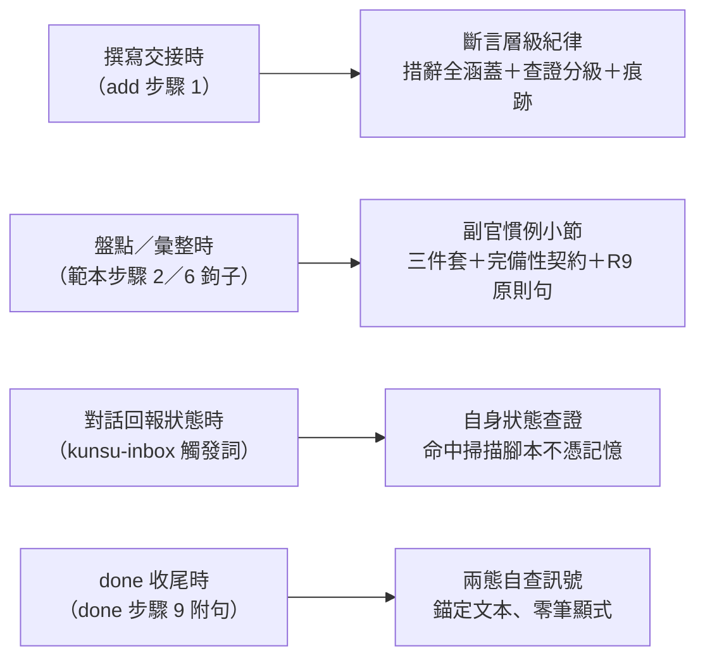

# feat: 軍師端斷言層級紀律與副官慣例

## Summary

四個掛載點落地軍師端兩道防線：handoff add 指引新增斷言層級紀律（措辭義務全涵蓋、查證義務分級、查證痕跡入內文）、done 回報附錨定文本的兩態自查訊號（handoff v0.15.0）；kunsu-inbox description 增列自身狀態類觸發詞（v0.7.0）；軍師範本新增副官慣例小節與步驟鉤子句（kunsu-init v0.5.0）；三 live 軍師遷移與 Invariant #5 計畫合批。

## Problem Frame

見 origin：`docs/brainstorms/2026-08-14-adjutant-source-level-requirements.md`（經兩輪 doc review 收斂）。軍師端失誤的兩並列假說（判準錯位／規則不被查閱）、來源層級不可見與過載偷工的機制，均已在 origin 定案；本計畫為其掛載與遷移。

**前置**：本計畫排在 `docs/plans/2026-08-14-002-feat-invariant5-lifecycle-metadata-plan.md` 之後執行，版號基線承其結果（handoff 0.14.0、kunsu-init 0.4.0；kunsu-inbox 自身版號 002 不動、維持 0.6.0）。

---

## Requirements

承 origin R1–R10，計畫層面不增減。摘記：R1–R3 斷言層級紀律（措辭全涵蓋、定義句、查證分級＋判準、痕跡入內文）；R4–R6 副官慣例（觸發判準、原文與完備性契約、判斷不外包、done 通讀不替代）；R7 盤點原始碼層；R8 遷移與版號；R9 自身狀態查證（kunsu-inbox 觸發詞＋範本原則句）；R10 done 收尾兩態自查（錨定文本、零筆顯式）。

---

## Key Technical Decisions

- **排程於 Invariant #5 計畫之後，遷移合批**：版號序列 handoff 0.14.0→0.15.0、kunsu-init 0.4.0→0.5.0、kunsu-inbox 0.6.0→0.7.0；三 live 軍師遷移與 002 計畫 U4 同批——每軍師一筆確認 commit 涵蓋兩計畫的 CLAUDE.md 與 CONCEPTS 改動（訊息註明兩案），ADR 009 確認制不變。
- **範本副官慣例採獨立小節＋鉤子句**：三件套、原文與完備性契約、判斷不外包、R9 原則句集中單一位置；工作流程步驟 2 與步驟 6 各留一句反向引用。散寫進各步驟會製造多份語意副本（多副本同步教訓）。
- **kunsu-inbox 觸發詞增列比照補詞三步驟教訓**（v0.3.0 先例）：取真實口語、帶語境拒裸詞（「幾件」裸詞不收，收「信箱還有幾件」「還有哪些待收尾」類組合）、負向場景核查後才定稿；觸發詞屬行為面改動，kunsu-inbox 升 minor。
- **add 現況分析定義句一句調和**：改為「本 session 已查證的……引用具體 `檔案:行號`；引用中介文件而未自行查證者，標明『依 X 記載』」——使 R1 合法形態與既有「已查證」定義並存不矛盾（origin OQ 就地解決）。
- **done 自查句實作為步驟 9 常設附句**：掛載位置比照沉澱訊號附句，**輸出契約相反**——有斷言逐筆點數兩態回報（已一手查證／僅標層級，後者列缺口），零筆亦顯式一行「本輪無他方系統斷言」，不沿用其「無訊號零輸出」形狀；錨定步驟 1–2 已讀文本（本體＋回覆），步驟 2 無回覆的收尾分支照常輸出。
- **H 檢查追加「副官」比對字串**：範本遷移完整性入機械檢查（WARN 級），同 002 的 `corrected_by` 做法。

---

## High-Level Technical Design

四掛載點與其攔截時刻（防線 → 時刻 → 落點）：

---

## Implementation Units

### U1. handoff SKILL.md：斷言層級紀律與 done 自查（v0.15.0）

- **Goal**：add 與 done 兩掛載點落地，版號升 0.15.0。
- **Requirements**：R1–R3、R10。
- **Dependencies**：002 計畫執行完畢（版號基線 0.14.0）。
- **Files**：`skills/handoff/SKILL.md`。
- **Approach**：add 步驟 1——現況分析定義句依 KTD 調和；「相關檔案 / 連結」附近新增斷言層級紀律段（定義句「查閱他方系統的中介文件所得＝二手資訊」、措辭義務全涵蓋、查證分級＋操作化判準「接手方會不會據此寫程式或改設計」、查證方式與位置註明入內文）。done 步驟 9——回報清單新增常設附句（R10 兩態自查，錨定步驟 1–2 已讀文本、僅標層級列缺口、零筆顯式一行「本輪無他方系統斷言」；無回覆的收尾分支照常輸出）。
- **Patterns to follow**：v0.13.0 矛盾回報段的帶理由 norm 行文；done 步驟 9 沉澱訊號附句的條件式形狀。
- **Test scenarios**：
  - Covers AE1／AE4／AE5（後半）：逐句對照新段——「依 X 記載」措辭、一手查證附位置、本地語境無分支皆被字面涵蓋；done 自查附句字面涵蓋兩態區分與零筆顯式行。
  - `grep -c` 確認「回覆檔 \`status\` 值：」與「中途需切換任務時」全檔計數各維持 1；值域句零 diff。
  - Read 確認 done 步驟 9 新附句與沉澱訊號附句並存、互不改寫。
- **Verification**：consistency-check B／C 通過；version 0.15.0。

### U2. kunsu-inbox：觸發詞增列與依賴聲明（v0.7.0）

- **Goal**：自身狀態類口語命中掃描腳本；依賴聲明同步。
- **Requirements**：R9（觸發詞側）、R8（依賴聲明）。
- **Dependencies**：U1（版號值）。
- **Files**：`skills/kunsu-inbox/SKILL.md`。
- **Approach**：description 增列帶語境觸發詞（候選：「信箱還有幾件」「信箱幾件」「還有哪些待收尾」「待收尾有哪些」「現在有幾件待處理」；依補詞三步驟核查後定稿）；依賴聲明首版號改 v0.15.0、括號續列一句（斷言層級紀律與 done 自查為 add／done 流程內部指引，不涉掃描慣例、無豁免需求）；frontmatter version 0.6.0 → 0.7.0。
- **Test scenarios**：
  - Covers AE5（前半）：觸發詞文字涵蓋「信箱還有幾件」情境。
  - 負向核查：「幾件」裸詞未入列；候選詞不與 handoff／todo 既有觸發語撞路由（逐詞比對兩 SKILL description）。
- **Verification**：consistency-check A1 三源全等（0.15.0）。

### U3. 範本副官慣例小節與 CONCEPTS（kunsu-init v0.5.0）

- **Goal**：範本層落地，新軍師出生即帶副官慣例。
- **Requirements**：R4–R7、R9（範本原則句）。
- **Dependencies**：002 計畫 U3（範本基線含其修訂）。
- **Files**：`skills/kunsu-init/assets/templates/kunsu-claude.md`、`skills/kunsu-init/assets/templates/kunsu-concepts.md`（新增「副官」詞條——live CONCEPTS 的同構來源）、`CONCEPTS.md`（母體）、`skills/kunsu-init/SKILL.md`（version 0.4.0 → 0.5.0）。
- **Approach**：範本工作流程步驟 2 盤點優先序補「子專案原始碼」層＋查證副官鉤子句；步驟 6 補提取副官鉤子句；工作流程段後新增「副官慣例」小節（觸發判準按用途與負載、原文回傳與完備性契約——掃描範圍＋逐份清單含零命中、判斷不外包、done 通讀不替代、R9 自身狀態原則句、派遣指示正體中文與唯讀約束）。範本 `kunsu-concepts.md` 新增「副官」詞條（U4 live 遷移的同構來源）；母體 CONCEPTS 新增「副官」「斷言層級紀律」詞條（行文比照「矛盾回報」）。
- **Test scenarios**：
  - Covers AE2／AE3：小節文字涵蓋逐份清單導讀、通讀不替代、副官回傳不含裁決建議。
  - 範本值域句與 dataview SORT 行零 diff（B／F 前提）；步驟 2／6 鉤子句與小節互相指涉一致（grep 核對）。
- **Verification**：consistency-check B／F／G 通過；149 項 pytest 照常。

### U4. 三 live 軍師遷移（與 002 計畫合批）

- **Goal**：ebook／ivm／px 同步範本改動。
- **Requirements**：R8。
- **Dependencies**：U3、002 計畫 U4（同批執行）。
- **Files**：`kunsu-project-root/{ebook,ivm,px}` 各自 CLAUDE.md（工作流程段）與 CONCEPTS.md。
- **Approach**：與 U3 範本定稿同構編輯；每軍師一筆確認 commit 涵蓋 002 與本計畫改動（訊息 `docs:` 前綴、註明兩案）；既有詞彙變體（ebook「規劃中心」、ivm wiki-link）保留。
- **Test scenarios**：
  - 三軍師 `grep -c "副官" CLAUDE.md` 各 ≥1（U5 H 字串前提）；變體字串遷移後仍存在。
- **Verification**：三筆確認 commit 完成。

### U5. 版號鏈、機械檢查與驗證（含 token 實測）

- **Goal**：全鏈收斂、部署、成本實測回填。
- **Requirements**：R8；origin OQ 的 token 實測。
- **Dependencies**：U1–U4。
- **Files**：`CLAUDE.md`（結構樹版號行、kunsu-inbox 說明行、開發狀態新條目）、`scripts/consistency-check.sh`（H 追加「副官」）。
- **Approach**：handoff 版號鏈三處（SKILL frontmatter、kunsu-inbox 依賴聲明、CLAUDE.md 結構樹行）同步 0.15.0；kunsu-init 0.5.0 與 kunsu-inbox 0.7.0 為各自 frontmatter 升版、不在 A1 檢查範圍；H 檢查沿連鎖 grep 條件追加第四字串。
- **Execution note**：完成部署後執行一次真實派遣實測——對大型子專案 repo（如 eBookApp）派一個斷言查證副官，記錄 token 消耗、等待時間與回傳體量，回填本計畫 KTD 成本措辭與 origin 的 OQ 條目。
- **Test scenarios**：
  - `scripts/consistency-check.sh` 全項 PASS（A1 為 handoff 版號 0.15.0 三源全等；H 含「corrected_by」與「副官」對三軍師全 PASS）；`grep` 確認 kunsu-init 0.5.0 與 kunsu-inbox 0.7.0 frontmatter 就位。
  - 149 項 pytest 照常；`install.sh` 重跑後部署目錄 handoff 0.15.0／kunsu-inbox 0.7.0／kunsu-init 0.5.0。
- **Verification**：檢查全 PASS、部署完成、實測數據記入計畫執行回報。

---

## Scope Boundaries

承 origin：接手方端零改動、不強制派遣與逐斷言查證、Invariant #2 不動、沙盤／kb 工具鏈／SessionStart hook 不動、來源層級不入 frontmatter 欄位。計畫層顯式接受（審查 residual）：範本文字在長駐 session 後段的注意力衰減、SessionStart 摘要陳舊旁路、R10 對「查核未執行」情境不可見（依賴 done 收尾閉環既有保障）——均不另設機制。

### Deferred to Follow-Up Work

- consistency-check 對 live 軍師歸檔交接的「事實語氣＋中介文件」字面抽查（adversarial 曾提的另一訊號形態，待 R10 實績評估後決定是否加掛）。

---

## Sources & Research

- origin（經 3-persona × 2 輪 doc review，17 筆修正全數收斂）與兩筆已推進 idea。
- 本 session 實查：handoff add 步驟 1／done 步驟 9 結構與沉澱訊號附句先例（`skills/handoff/SKILL.md`）、範本工作流程七步與盤點優先序止於子專案文件（`skills/kunsu-init/assets/templates/kunsu-claude.md:33`）、kunsu-inbox 依賴聲明格式、H 檢查連鎖 grep 形式（`scripts/consistency-check.sh:121`）、subagent 派遣與 Invariant #1／#2 相容性核查。
- 教訓：補詞三步驟（v0.3.0 先例）、多副本同步、攔截點必經路徑、002 計畫的 H 字串追加做法。
