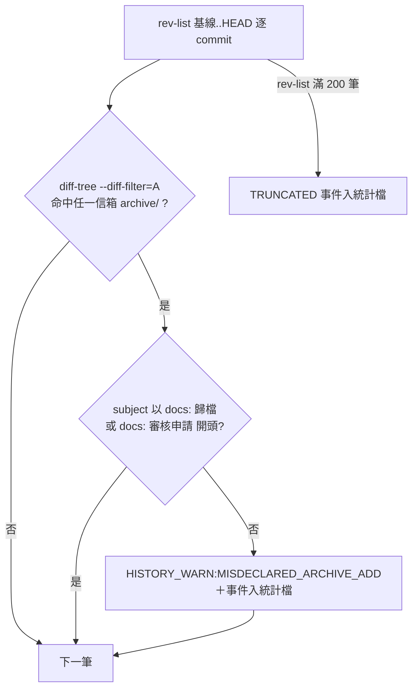

# feat: 確認 commit 宣告範圍契約——pathspec 定型化、上報歸檔腳本與夾帶偵測

## Summary

把協議「確認 commit」的契約自「提交 index」改為「提交宣告範圍」：全部定型指令改帶 pathspec（依來源狀態分兩形）、新增 `archive-report.sh` 補齊上報歸檔的計算載體、`scan-replies.sh` 新增「非白名單訊息 commit 新增信箱 archive/ 檔案」的 advisory 偵測入統計檔，並以 ADR candidate 018 記錄原則與威脅模型。三 live 軍師合批遷移。

---

## Problem Frame

2026-08-31 ebook 軍師同一 session 兩次把上報歸檔的 index 殘留夾帶進「建立交接」commit（`ebook/docs/2026-08-31-commit邊界失誤調查報告.md`，已獨立核對屬實）。三個條件疊加：commit 編排無定型、ADR 009「先暫存、隔著確認」使 index 殘留跨 Bash 呼叫是協議常態、三處權威文本教的正是不帶 pathspec 的寫法。若被夾帶的是未讀回覆，「未 commit 即未處理」訊號被靜默清除——與 2026-08-29 `git add -A` 事故同一條後果路徑。現有防護（git add 守門、tripwire、HISTORY_WARN 兩形狀）對此形狀全盲。完整脈絡見 origin 文件。

---

## Requirements

沿用 origin R1–R16，本計畫依研究結果修訂兩處（表內標注）：

| ID | 要求 |
|----|------|
| R1 | handoff SKILL「確認 commit 協議」定型指令改為 `git add -- <具體路徑> && git commit -m "<訊息>" -- <同一組路徑>`（`-m` 在 `--` 之前——`--` 後一切都被解析為 pathspec），add 與 commit 路徑集合一致 |
| R2 | **（修訂）** pathspec 依來源狀態分兩形：已 commit 檔案的歸檔 rename 成對列出來源與目的地；untracked 來源（porcelain `A ` 形狀）僅列目的地——成對會以 pathspec 不匹配失敗 |
| R3 | 協議補排序規則：index 已有前一流程暫存內容時，先收斂該 commit 再開始新流程的 add |
| R4 | 協議多指令串接一律 `&&`，不用 `;` 或裸換行 |
| R5 | 範本上報歸檔第（4）步、申請歸檔、home-dataview 歸檔說明、kunsu-init add-project／remove-project 的 commit 定型指令同步 pathspec 化 |
| R6 | `scripts/consistency-check.sh` 新增定型指令比對項 |
| R7 | ebook／ivm／px 合批遷移；ebook 另同步白名單流程 commit 適用 pathspec 慣例一句 |
| R8 | 新增 `archive-report.sh`：status Edit（`submitted`→`archived`）→ untracked 前置 add → `git mv` 至 `archive/` → add 目的地；多份並列、archive 內略過重跑、僅具體路徑 |
| R9 | 腳本 stdout 印依兩形分支的帶 pathspec 待確認 commit 指令，不自動 commit（ADR 009 零改動） |
| R10 | 腳本輸出含 index 狀態提示：流程外已暫存路徑警告＋「index 現含 N 筆」提醒 |
| R11 | 範本上報歸檔四步驟全文保留，協議段加腳本指路句 |
| R12 | **（具體化）** `scan-replies.sh` 逐 commit 新增形狀：subject 不以白名單前綴（`docs: 歸檔`、`docs: 審核申請`）開頭的 commit，以 `--diff-filter=A` 新增任一信箱 `archive/` 檔案 → `HISTORY_WARN:MISDECLARED_ARCHIVE_ADD` |
| R13 | 新型別沿 advisory 性質：不改 exit code、基線前進不重報、事件入統計檔；另加 `TRUNCATED` 事件（rev-list 滿 200 筆時聲明數據不完整） |
| R14 | `kunsu_scan.py` 與 session hook 對新型別維持安全靜默（既有未知前綴略過），沙盤顯示不在本案 |
| R15 | ADR candidate 018：宣告範圍原則、兩形 pathspec、白名單、威脅模型（顯式接受邊界窮舉）、觀察期計數自上線起算（不含 2026-08-31 已知一次）、ADR 017 擴 `git commit` 守門列開放問題附啟動條件 |
| R16 | kunsu-inbox 依賴聲明、版號鏈、CONCEPTS 詞條、CLAUDE.md 開發狀態同步 |

---

## Key Technical Decisions

- **兩形 pathspec，依 `git mv` 前的 porcelain 狀態決定**：tracked（rename，`R`／`RM` 形狀）成對列 src＋dst；untracked 來源（add 後為 `A ` 形狀）僅列 dst。實測依據：untracked 來源的 src 從未見於 HEAD 或 index，成對 commit 以 `error: pathspec ... did not match` exit 1 整筆中止——而 untracked 正是上報／申請的常態（投遞端不 commit）。腳本在既有 untracked 前置檢查處記錄狀態即可分支，零額外查詢。
- **偵測豁免採前綴白名單 `{docs: 歸檔, docs: 審核申請}`，startswith 比對**：申請審核 commit（`docs: 審核申請 <顯示名>（核准）`，`skills/kunsu-init/SKILL.md:605`）正當新增 `applications/archive/` 檔案，單一「歸檔」關鍵詞第一天就誤報；「任意位置含詞」則會被標題含「歸檔」的建立交接 commit 繞過（吞噬者形狀本身）。全域集合不做逐信箱配對——跨信箱錯配屬 advisory 可接受噪音，寫入 ADR 威脅模型。
- **新形狀掛 `scan-replies.sh` 既有 rev-list 迴圈**：`rev-list {基線}..HEAD` 本就是整 repo 範圍（路徑限定只在每 commit 的 diff-tree pathspec），迴圈內對每 sha 追加一次三信箱 `archive/` pathspec 的 diff-tree 即可，warns／events／`runs_with_history_warn`／500 筆截尾全部沿用。scan-reports.sh／scan-applications.sh 零改動（三支連跑，同輪被抓）。
- **`archive-report.sh` 對稱裁剪**：無回覆成對搬移段、mkdir 只建 `archive/`、片段比對對 `-report.md` 檔名慣例；status 已是 `archived` 仍在頂層的殘留由 `re.sub` 冪等重做、mv 續行——與 add-project 對申請殘留的 AskUserQuestion 互動補完是刻意差異（腳本情境使用者已下達歸檔意圖）；暫存區外部路徑警告的排除清單僅 `docs/reports/`（上報歸檔無 todo 聯動，不照抄 handoff 版的 `docs/todos/` 豁免）；on_err 補一句「完成前 `/kunsu-inbox` 對中間態會誤報」。
- **印出指令的格式防護**：每路徑雙引號；`-m "<訊息>"` 置於 `--` 之前、pathspec 一律殿後（`--` 之後的一切都被當 pathspec，`-m` 誤置其後會以 pathspec 不匹配失敗——已實測兩形皆以此順序通過）。ADR 明文語意句：pathspec commit 提交**確認當下的工作樹內容**（非暫存快照）——與 ADR 009 的暫存語意偏移屬顯式接受。
- **警示以統計檔為準**：一次性 stdout 警示多半被 hook／沙盤消耗（`kunsu_scan.py` 對未知前綴靜默、基線照樣前進），ADR 明文此限制；hook／沙盤顯示維持「後續評估」（使用者定案不拉入本案）。
- **觀察期計數自上線起算**：各軍師基線已在 HEAD，歷史事件不回溯入統計；ADR 啟動條件明文「不含上線前事件、已知一次於 2026-08-31」，防門檻被靜默墊高。
- **測試策略沿慣例**：偵測邏輯在 bash heredoc 內不可 import，沿掃描腳本既有慣例走暫存目錄 dogfooding 斷言（無新 pytest）；既有 171 項 pytest 不受影響照跑。統計檔操作一律 `KUNSU_SCAN_STATS_FILE` 隔離。
- **遷移紀律**：live 軍師遷移逐句套用「舊句 grep 恰中一次才替換、遷移後舊句歸零」（`docs/solutions/workflow-issues/handoff-done-closure-gap.md` 子模式 (d)），每軍師一筆確認 commit。

---

## High-Level Technical Design

新偵測形狀的判定流程（掛在既有逐 commit 迴圈內，與 SMUGGLED_REPLY／BATCH_REPLY_ADD 判定並行、互不影響）：

定型指令的兩形分支（協議文字與兩支歸檔腳本共用同一規則）：

| 來源狀態（mv 前） | commit pathspec | 依據 |
|---|---|---|
| tracked（已 commit，mv 後 `R`／`RM`） | `"<src>" "<dst>"` 成對 | 只列 dst 會把 rename 拆半 |
| untracked（add 後 `A `） | `"<dst>"` 單邊 | src 從未入 git，成對必敗 |

---

## Implementation Units

### U1. ADR candidate 018 撰寫

- **Goal**：以 ADR 記錄「確認 commit 收斂宣告範圍、不收斂 index」原則與全部顯式接受邊界，供後續強制點提案把關。
- **Requirements**：R15。
- **Dependencies**：無（先行，其餘單元引用其編號）。
- **Files**：`docs/adr/2026-08-31-adr-candidate-018-commit-declared-scope-contract.md`。
- **Approach**：Decision 段涵蓋——宣告範圍原則、兩形 pathspec 規則、排序與 `&&` 串接規範、偵測白名單與型別、pathspec commit 取確認當下工作樹內容的語意句。威脅模型段窮舉顯式接受邊界：歸檔訊息直寫 archive 不可偵測（訊息紀律＋腳本化為唯一防線）、evil merge 盲點、revert 誤報屬可欲提示、手工訊息不合定型、跨信箱前綴錯配、統計檔並發 last-writer-wins、python3 長期缺失後首掃不回溯、BASELINE_RESET 僅物件被 prune 才觸發。開放問題段：ADR 017 擴 `git commit` 守門，啟動條件＝統計檔出現上線後的 `MISDECLARED_ARCHIVE_ADD` 再犯事件（計數不含 2026-08-31 已知一次）。狀態 candidate，未經使用者審定不改 accepted。
- **Patterns to follow**：`docs/adr/2026-08-29-adr-candidate-017-pretooluse-git-add-guard.md`（判準四要件、開放問題與觀察期條款的寫法）。
- **Test scenarios**：Test expectation: none——純文件；U6 的 consistency-check 與 doc review 為其查核面。
- **Verification**：ADR 引用的行為與 U2–U5 落地內容逐條一致（尤其兩形規則與白名單集合字面）。

### U2. 協議定型文字 pathspec 化（SKILL 與範本全副本）

- **Goal**：所有協議 commit 定型指令改帶兩形 pathspec，並補排序與串接規範，副本零遺漏。
- **Requirements**：R1–R5、R7（ebook 白名單句於 U6 遷移時落）、R16（版號）。
- **Dependencies**：U1（引用 ADR 018 編號）。
- **Files**：`skills/handoff/SKILL.md`（確認 commit 協議節 77–105 行：步驟 3 改兩形 pathspec 指令＋新增排序規則與 `&&` 串接各一句；add 步驟 5、更正交接步驟 3、reply 步驟 5、done 步驟 9 的 add 範圍句同步「commit 帶同一組路徑」）、`skills/kunsu-init/SKILL.md`（add-project 步驟⑩ 606 行、remove-project 759 行）、`skills/kunsu-inbox/SKILL.md`（296 行四步驟提示行、449 行依賴聲明版號、460 行慣例表）、`skills/kunsu-init/assets/templates/kunsu-claude.md`（131 行上報四步驟第（4）步、153 行確認 commit 授權句核對）、`skills/kunsu-init/assets/templates/home-dataview-reports.md`（14 行）。
- **Approach**：單一權威語意副本留「確認 commit（協議步驟）」節，其餘各處只改指令字面並指回該節；兩形規則寫在協議節（tracked 成對／untracked 僅 dst，判準為 add 前 porcelain `??`）。handoff frontmatter 版號 v0.18.0 → v0.19.0、kunsu-init v0.6.1 → v0.7.0、kunsu-inbox frontmatter v0.10.0 → v0.11.0（U4 新增腳本與 U5 偵測行為變更同批入此版）、kunsu-inbox 依賴聲明同步 v0.19.0。動工前先 `grep -rn 'git commit' skills/` 建副本清單核對第 1 點研究清點無新增遺漏。
- **Patterns to follow**：`docs/solutions/workflow-issues/handoff-done-closure-gap.md` 子模式 (c)（定型文字多副本連動、Verification 放 grep 字面核查）。
- **Test scenarios**：
  - `grep -rn 'git commit -m' skills/ | grep -v archive-` 對定型指令行逐筆核對——協議指令行全數含 pathspec 佔位或兩形說明且 `-m` 在 `--` 之前，僅 kunsu-init 步驟 ⑥-2 初始 commit（全新 repo `git add .`）維持原樣。
  - 範本 131 行第（4）步含兩形指令且訊息 `docs: 歸檔上報 <檔名>` 零改動。
  - Covers AE1. 暫存目錄模擬「index 已有上報歸檔殘留（untracked 檔已 `git add`）」，依修訂後定型指令 commit 新建交接檔：斷言 commit 僅含交接檔、歸檔殘留原封留在 index。
- **Verification**：`scripts/consistency-check.sh` 既有 22 項全 PASS（新項於 U6 加入）；kunsu-inbox 依賴聲明版號與 handoff frontmatter 一致。

### U3. archive-handoff.sh 印出指令 pathspec 化

- **Goal**：done 歸檔腳本印出的待確認 commit 指令改帶兩形 pathspec，消除「無 pathspec commit 吞外部暫存」的殘餘入口。
- **Requirements**：R2、R9（handoff 側）。
- **Dependencies**：U2（協議文字先定，腳本輸出與其一致）。
- **Files**：`skills/handoff/scripts/archive-handoff.sh`（222–225 行輸出段；190–208 行主迴圈記錄各檔 mv 前狀態）。
- **Approach**：主迴圈在既有 untracked 前置檢查處記錄每份本體與回覆的來源狀態；223 行改印 `git commit -m "<msg>" -- "<路徑>"…`——tracked 者成對列 src＋dst、untracked 者僅 dst，每路徑雙引號。214–220 行外部路徑警告保留，措辭自「會被無 pathspec 的 commit 一併帶入」改為「不在本次 commit 宣告範圍，請確認是否另行處理」。stderr 尾行加「index 現含 N 筆」提醒（R10 同款）。
- **Patterns to follow**：`docs/solutions/best-practices/git-porcelain-scan-script-pitfalls.md`（`RM` 形狀、quotepath、目的地 add）。
- **Test scenarios**：
  - 已 commit 交接＋一份回覆歸檔：執行印出指令後 commit 含成對 rename、工作樹與 index 乾淨。
  - untracked 回覆（未 commit 即收尾）歸檔：印出指令該回覆僅列 dst，執行成功。
  - index 預先塞入一筆無關暫存路徑：執行印出指令後該路徑仍留在 index（宣告範圍外不被吞）、警告有列出。
  - 中文檔名（quotepath）與多份並列：指令雙引號完整、執行成功。
- **Verification**：既有 dogfooding 歸檔全鏈（`R`／`A`／`RM` 形狀、掃描豁免）重跑無回歸。

### U4. archive-report.sh 新增與範本指路句

- **Goal**：上報歸檔腳本化，補齊 v0.18.0 計算載體的覆蓋缺口（兩起事故的實際發生流程）。
- **Requirements**：R8–R11。
- **Dependencies**：U2（兩形規則）、U3（共用輸出格式先例）。
- **Files**：`skills/kunsu-inbox/scripts/archive-report.sh`（新增；上報信箱的掃描與協議由 kunsu-inbox 持有，與 `scan-reports.sh` 同居）、`skills/kunsu-init/assets/templates/kunsu-claude.md`（131 行協議段句尾加指路句）、`install.sh` 覆蓋核對。
- **Approach**：以 `archive-handoff.sh` 為基底裁剪——去回覆成對段與 `docs/todos/` 警告豁免、目錄換 `docs/reports/`、status Edit 換 `submitted`→`archived`（`re.sub` 冪等，殘留中間態重跑自癒）、片段比對支援 `-report.md` 檔名、msg 組裝 `docs: 歸檔上報 <檔名、…>`、stdout 印兩形 pathspec 指令（上報常態 untracked → 多數僅 dst）、on_err 補「完成前 `/kunsu-inbox` 對中間態會誤報（已 commit 上報 Edit 後 ` M` 觸發 tripwire、untracked 仍列新上報）」。範本指路句一句、細節不複寫（四步驟全文保留）。
- **Patterns to follow**：`skills/handoff/scripts/archive-handoff.sh` 全結構（trap on_err、resolve_arg、`$HOME` 止步專案根定位、bash 3.2 相容寫法照抄）。
- **Test scenarios**：
  - Covers AE2. untracked 上報全鏈：`new-report.sh` 產檔 → 腳本歸檔 → 執行印出指令（僅 dst）→ commit 單檔、工作樹乾淨。
  - 已 commit 上報歸檔：印出成對指令、`RM` 形狀收斂。
  - 已在 `archive/` 的參數自動略過（重跑）；status 已 `archived` 仍在頂層的殘留：重跑續完 mv。
  - 多份並列一次歸檔：單一 commit 指令、訊息以「、」串接檔名。
  - 暫存區含 `docs/reports/` 外路徑：警告列出。
- **Verification**：`scan-reports.sh` 對歸檔結果零 tripwire；範本指路句與 U6 三 live 同句逐字一致。

### U5. scan-replies.sh 夾帶偵測新形狀與 SKILL 節同步

- **Goal**：「非白名單訊息 commit 新增信箱 archive/」可觀測化，累積守門裁決數據。
- **Requirements**：R12–R14。
- **Dependencies**：U1（型別名與白名單見 ADR）。
- **Files**：`skills/kunsu-inbox/scripts/scan-replies.sh`（python3 heredoc 236–320 行區段）、`skills/kunsu-inbox/SKILL.md`（4b-5 節 304–323 行加新型別說明、統計節 331–334 行欄位窮舉補 `MISDECLARED_ARCHIVE_ADD`／`TRUNCATED`）。
- **Approach**：逐 commit 迴圈內追加一次 `diff-tree --diff-filter=A -- docs/handoffs/archive/ docs/reports/archive/ docs/applications/archive/`，且置於既有「replies 頂層零新增即 `continue`」守門（現行 258–259 行）之前執行——事故形狀（建立交接夾帶 archive 新增）正是 replies 零新增的 commit，接在守門之後將永不受檢；命中且 subject 不以白名單前綴開頭 → warns＋events（detail 含 sha、subject、檔名清單）；`len(revs) == 200` 時記 `TRUNCATED` 事件。既有 SMUGGLED_REPLY／BATCH_REPLY_ADD 判定零改動；`kunsu_scan.py` 零改動（前綴表不含新型別即靜默）。
- **Test scenarios**（dogfooding 斷言，統計檔以 `KUNSU_SCAN_STATS_FILE` 隔離）：
  - Covers AE3. 重演事故形狀：`docs: 建立交接 x` commit 同時新增 `reports/archive/` 檔 → 輸出 `HISTORY_WARN:MISDECLARED_ARCHIVE_ADD`、統計檔記事件；基線前進後重跑不重報。
  - Covers AE4. `docs: 歸檔上報 x`／`docs: 歸檔交接 x` 正當歸檔不觸發。
  - `docs: 審核申請 x（核准）` 新增 `applications/archive/` 不觸發（白名單第二前綴）。
  - `docs: 建立交接 2026-xx-歸檔規則調整.md`（標題含「歸檔」）夾帶 archive 新增**仍觸發**（startswith 非含詞）。
  - `docs/todos/archive/` 新增與 archive 內檔案修改（corrected_by 形狀，diff-filter M）不觸發。
  - 201 筆 commit 間隔：`TRUNCATED` 事件入統計。
  - 既有六場景（SMUGGLED_REPLY／BATCH_REPLY_ADD／BASELINE_RESET／統計損壞重建）迴歸無變。
- **Verification**：dogfooding 斷言全過（上列七場景含既有六場景迴歸）；171 項 pytest 照常通過（`test_kunsu_scan.py` 實跑腳本斷言不涉新前綴）；session hook 對新型別無輸出變化。

### U6. consistency-check 擴充、三 live 軍師遷移與收尾同步

- **Goal**：新定型文字入機械檢查，三 live 軍師與母體文件收斂到同一版本。
- **Requirements**：R6、R7、R16。
- **Dependencies**：U2–U5 全部完成。
- **Files**：`scripts/consistency-check.sh`（新檢查項＋檔頭清單）、三 live 軍師 `CLAUDE.md`（上報四步驟第（4）步、確認 commit 授權句、ebook 另加白名單流程 pathspec 一句）與 `home-dataview-reports.md`（歸檔順序句）、`CONCEPTS.md`（「確認 commit」詞條內建防護句補宣告範圍與兩形；「done 收尾」詞條腳本句核對）、母體 `CLAUDE.md`（開發狀態新條目、專案結構 scripts 清單補 archive-report.sh）。
- **Approach**：consistency-check 新增檢查項 I——以錨句 grep 比對「確認 commit 協議」兩形指令字面存在於 handoff SKILL 與範本 131 行（沿 C 段錨句比對模式，不實跑歸檔腳本）；H 段 live grep 鏈視遷移新句擴充。遷移依 grep 恰中一次紀律逐句替換，每軍師一筆確認 commit（訊息 `docs:` 定型）。
- **Test scenarios**：
  - `scripts/consistency-check.sh` 全項 PASS（含新項）。
  - 三 live 軍師遷移後：舊句 grep 歸零、新句各恰中一次、`git diff --stat` 僅預期檔案。
- **Verification**：`kunsu-list` 三軍師路徑存活；ebook 白名單句只落 ebook。

---

## Scope Boundaries

**Deferred to Follow-Up Work**（origin 定案，本計畫不動）：

- ADR 017 擴 `git commit` 守門——觀察後另案，啟動條件入 ADR 018 開放問題。
- 申請歸檔腳本化、hook／沙盤對 `HISTORY_WARN` 的顯示、偵測邏輯 pytest 化（現沿 dogfooding 慣例）、統計檔人工回溯歷史指令。
- 訊息宣告範圍中文解析（origin 方向 B 全版）與腳本不留 index（方向 C）——不做。

---

## Risks & Dependencies

- **副本漏改**：定型指令副本橫跨 handoff SKILL 五處＋kunsu-init 三處＋範本兩檔＋腳本 stdout＋kunsu-inbox 兩處＋三 live——U2 動工前 grep 建清單、U6 機械檢查收口；歷史規律是遷移遺漏靠第三方 review 才發現，不依賴記憶。
- **偵測噪音**：白名單集合若漏列未來新定型訊息（新協議流程新增 archive 寫入），advisory 會誤報——ADR 018 記「新增正當歸檔訊息形狀時同步擴白名單」為修訂條件。
- **bash 3.2 相容**：新腳本照抄 `archive-handoff.sh` 既有防護（全形字元緊鄰變數名、`set -u` 空陣列展開），dogfooding 於 macOS 內建 bash 實跑。

---

## Sources

- origin：`docs/brainstorms/2026-08-31-commit-declared-scope-requirements.md`（R1–R16、AE1–AE4、Key Decisions）。
- 事故快照：`ebook/docs/2026-08-31-commit邊界失誤調查報告.md`（本 session 逐筆核對屬實）。
- 實測結論：pathspec commit 與 index 殘留隔離、tracked rename 成對收斂、untracked 來源成對必敗（`error: pathspec ... did not match`）、`git add` 多路徑原子失敗、diff-tree 預設不做 rename 偵測（歸檔 dst 恆為 `A`）、`rev-list --max-count` 先限量後反轉（截斷丟最舊）。
- 副本清點與掛載點：`skills/handoff/SKILL.md:77-105,513-526`、`skills/handoff/scripts/archive-handoff.sh:164-225`、`skills/kunsu-inbox/scripts/scan-replies.sh:160-327`、`skills/kunsu-init/SKILL.md:600-607`、`scripts/consistency-check.sh`（A–H 與錨句比對模式）。
- 教訓：`docs/solutions/best-practices/git-porcelain-scan-script-pitfalls.md`、`docs/solutions/workflow-issues/handoff-done-closure-gap.md`（副本連動 (c)／遷移紀律 (d)）、`docs/solutions/workflow-issues/handoff-intercept-point-selection.md`（條件式陳述、指路句）。
