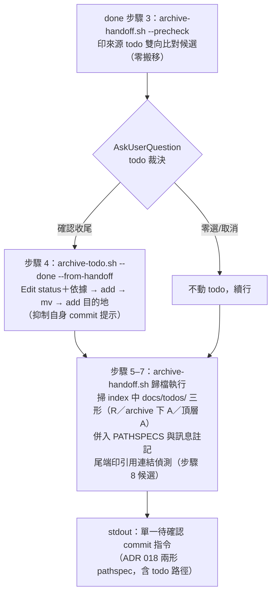

# feat: 產檔查重與 todo 歸檔腳本化——會飄移的紀律改用計算載體

## Summary

三件落地：`new-handoff.sh` 產檔時自動查重（本地時間窗清單保底＋tshehtu zoekt 關鍵詞層，stderr、advisory、降級顯式）；新增 `archive-todo.sh` 收斂 todo 歸檔 git 編排（含 handoff done 一併收尾的 precheck＋index 聚合機制，單 commit 契約零改動）；`archive-handoff.sh` 附掛來源 todo 雙向比對與引用連結偵測。範本「done 收尾」詞條補 `archive-todo.sh` 指路句，三 live 軍師第七波遷移。

---

## Problem Frame

見 origin 文件（ebook 軍師沉澱失效報告 T5／T6 重複交接、`fc143a8` todo 歸檔 pathspec 拆半）。載體光譜實證：文件層機制全部失效過、腳本從未失效（skill 0/23 vs 產檔腳本 14/14）——把查重與 todo 歸檔從「靠記得的紀律」改為「腳本計算」。

---

## Key Technical Decisions

- **查重兩層、候選來源限交接本體**：時間窗清單只掃 `docs/handoffs/` 頂層與 `archive/` 的本體（`type: handoff` 且 `to:` 同收件角色）；`replies/`／`archive/replies/` 僅以檔名 stem（`<stem>-reply-*`）反查推導狀態，不入候選——回覆檔 `to:` 是發起方，入過濾必致全滅（spec-flow I2）。狀態純結構推導：位於 `archive/`＝已歸檔、replies 存在對應回覆＝已回覆、否則 open。
- **fail-open 分兩級**：查重層（advisory）比照 `scan-replies.sh` 統計段——整段 `|| true`、python 內 except 即 stderr 一行＋exit 0，python3 缺失印降級行續行；`archive-todo.sh`（mutation）比照 `archive-handoff.sh`——`trap on_err ERR` 不回滾印重跑指引、python3 缺失 fail-closed exit 1 指路手動步驟。
- **precheck＋index 聚合（使用者定案）**：done 步驟順序不動。步驟 3 改呼 `archive-handoff.sh --precheck`（只印來源 todo 雙向比對候選，零搬移）；步驟 4 以 `archive-todo.sh` 執行收尾（handoff 語境抑制自身 commit 提示）；步驟 5–7 歸檔執行時以 `git -c core.quotepath=false diff --cached -M --name-status`（沿用既有 strip_quotes 解析）掃 index 中 `docs/todos/` 的三形——R 形＝tracked todo 收尾、`docs/todos/archive/` 下 A 形＝untracked 來源收尾（前置 add＋mv 後的 index 形狀，同計「；一併收尾」）、`docs/todos/` 頂層 A 形＝轉出殘項——併入 PATHSPECS 與訊息註記（「；一併收尾 todo <slug>」「；轉出殘項 todo <slug>」）——步驟 9 單 commit 契約與 CLAUDE.md 訊息表零改動，fc143a8 的雙指令殘留形狀在機制上不可能發生。
- **關鍵詞選填參數＋標題自動抽取保底**：必填會增摩擦誘發繞道，反噬腳本載體地位。stdin 內文不入查詢（長內文抽詞品質不穩）。通用詞表 inline 於腳本（單副本零部署面）。
- **stderr 全走、三不變條件**：查重不改產出檔內容、不改 exit code、stdout 維持單行路徑——`consistency-check.sh` C 項在無網路 mktemp 假 repo 實跑 `new-handoff.sh` 並丟棄 stderr，守住三條件即零回歸。
- **依據參數化、mv 前寫入**：解決依據（done）／結案原因（rm）以腳本選填參數在 `git add` 歸檔目的地**之前**寫入檔案，堵「mv 後 Edit 未暫存、pathspec commit 帶入舊版」陷阱（spec-flow I8；porcelain 四陷阱教訓）。內文其他 Edit 明文須在腳本執行前完成。
- **誠實條款**：所有文件措辭寫「把候選推到決策時點眼前」的條件式有效性——時間窗外、tshehtu 索引盲區（未 commit、一小時內、未 discovery 的 repo）攔不住，不寫無條件承諾（攔截點教訓）。

---

## Requirements

沿用 origin R1–R14，依三路研究修訂字面者標注；R15–R16 為規劃期使用者定案新增。

**甲、產檔查重（R1–R6）**

- R1. 查重結果印 stderr、advisory 不中止產檔；執行次序為先產檔、先印 stdout 路徑，查重殿後（機器可讀契約不被 zoekt 延遲拖住）。
- R2.（修訂）時間窗清單：候選＝`docs/handoffs/` 頂層＋`archive/` 的交接本體，`type: handoff` 且 `to:` 同收件角色、日期於時間窗內；replies 兩層僅供推導「已回覆」。逐筆一行含日期、標題、狀態；超上限印「另有 N 筆」。`to` 缺省（採預設值）時不過濾角色、各筆標注 `to:` 並印一行「to 未指定，採預設 backend，請確認」。
- R3.（修訂）tshehtu 層：關鍵詞（選填參數優先、否則標題去通用詞自動抽取）查 zoekt JSON API 全庫，印 repo 相對路徑；查詢字串 sanitize zoekt 語法字元（`:`、引號等）；筆數上限＋「另有 N 筆」。
- R4.（修訂）降級顯式涵蓋全錯誤面：健康檢查失敗、查詢逾時（查詢自身帶短 timeout）、error JSON、非 200 皆印一行顯式降級；零命中亦印一行「查重已執行、零命中」（區分「沒跑」與「跑了沒中」——7 掃 0 教訓）；其餘內部錯誤 fail-open。
- R5. 撤回提示句僅在有候選時印。
- R6.（修訂）兩層都不依賴 kunsu registry；tshehtu 不可用時本地層獨立生效，未登記 repo 照常運作。

**乙、todo 歸檔（R7–R10）**

- R7.（修訂）`archive-todo.sh`：status Edit（`--done`＝已解決／`--rm`＝已封存）→ 選填依據參數寫入（在 add 目的地前）→ untracked 前置 add → `git mv` 至 `docs/todos/archive/` → add 目的地。支援多筆一次收尾；參數解析與錯誤形比照 `archive-handoff.sh`（精確檔名優先、多重命中列候選）。
- R8. stdout 印 ADR 018 兩形 pathspec 待確認 commit 指令（訊息 `docs: 歸檔 todo <slug>`，多筆「、」串列），不自動 commit；handoff 語境以旗標抑制此輸出（改由 archive-handoff.sh 聚合）；孤兒僅補歸檔不改終態。
- R9. 已在 `archive/` 冪等略過；殘項清點與跨檔連結修正不入腳本。
- R10. handoff SKILL done 步驟 4 與 todo SKILL done／rm 歸檔執行字面改為呼叫本腳本（比照步驟 5–7 引導框寫法：建議路徑、失敗才手動）；stderr 印查核指路。

**丙、done 查核附掛（R11–R12）**

- R11.（修訂）`archive-handoff.sh --precheck <slug…>`：只執行來源 todo 雙向檔名比對（todo 內文含交接檔名、或本體內文含 todo 檔名），按交接分組印候選、零搬移零暫存；done 步驟 3 字面改以此輸出為候選來源，裁決仍走既有 AskUserQuestion。grep 一律 `-F --`。
- R12.（修訂）歸檔執行尾端印引用連結偵測：`grep -Frl "docs/handoffs/<slug>.md" docs/`（路徑形，對齊步驟 8 既有規格，非檔名形——檔名形必中本體自身與全部回覆）；筆數上限；修正判斷與「本體含 archive 內不修正僅回報」零改動。

**丁、協議與版本連動（R13–R16）**

- R13.（修訂）版號：handoff v0.20.0、todo v0.3.0、kunsu-init v0.8.0（範本改動）、kunsu-inbox 依賴聲明同步（自身 patch 升版）；三處版號鏈（SKILL frontmatter、依賴聲明、CLAUDE.md 專案結構）齊動。
- R14. 掃描慣例、`status`／`verify` 值域、tripwire 與歸檔豁免零改動；todo 歸檔 porcelain 形狀不觸發 `scan-replies.sh` 任何警示（既有前綴守門已滿足，以負向測試固定）。
- R15.（新增，使用者定案）precheck＋index 聚合機制如 KTD 所述；done 步驟 3／4 字面重排幅度最小化——順序不動，僅把候選來源與執行載體改為腳本。
- R16.（新增，使用者定案）範本 kunsu-concepts「done 收尾」詞條於 archive-handoff.sh 指路句後補 `archive-todo.sh` 一句；四副本（範本＋三 live CONCEPTS）逐字一致同步（第七波遷移），consistency-check H 錨點擴充。

---

## High-Level Technical Design

done 含 todo 一併收尾的新時序（單 commit 聚合）：

查重層次：`new-handoff.sh` 產檔 → stdout 印路徑 → stderr 依序印〔時間窗清單（本地、零依賴）→ tshehtu 命中（curl 健康檢查＋查詢雙 timeout，失敗顯式降級）→ 撤回提示（有候選才印）或零命中一行〕。

---

## Implementation Units

### U1. new-handoff.sh 產檔查重

- **Goal**：產檔後於 stderr 自動印兩層查重候選，行為滿足 R1–R6。
- **Requirements**：R1–R6；AE1、AE2、AE4。
- **Dependencies**：無。
- **Files**：`skills/handoff/scripts/new-handoff.sh`、`skills/handoff/SKILL.md`（add 段補一句「產檔後檢視 stderr 查重候選」指路）。
- **Approach**：查重段置於既有 `echo "$file"`（stdout）之後、既有 stderr 指路行之前；整段以 advisory fail-open 包裹（`|| true`）。本地層：`grep` frontmatter（`-c core.quotepath=false` 讀 porcelain 時；讀檔比對 `type: handoff`／`to:`／`created:` 行首精確形），狀態結構推導；候選掃描剔除本次產出檔自身（與 `$file` 路徑比對後排除——否則新檔必自我命中、撤回提示常駐誤報且零命中場景不可達）。tshehtu 層：端點常數 `${KUNSU_ZOEKT_URL:-http://127.0.0.1:6070}`（env 覆寫供測試隔離）；`curl -s -m 2` 健康檢查 → `curl -s -m <短秒數> -XPOST` 查詢 → python3 解碼（`Line` 為 base64）；`command -v python3` 缺失即印降級行。關鍵詞：第 5 選填參數；自動抽取＝標題以標點空白切分、剔除 inline 通用詞表、留長度達下限的片段。時間窗天數與各層筆數上限以腳本頂部常數定義（預設 14 天／8 筆）。
- **Patterns to follow**：`scan-replies.sh` 統計段 fail-open 形；`~/.claude/skills/kb/SKILL.md` 的 curl＋base64 解碼包裝與健康檢查；`${var}` 大括號與空陣列守門（bash 3.2 教訓）。
- **Test scenarios**（暫存目錄 dogfooding）：
  - Covers AE1. fixture 建 8/27 已回覆＋已歸檔交接，同角色產檔 → stderr 清單含該筆與正確狀態標示、stdout 仍單行路徑。
  - Covers AE2. 以 `KUNSU_ZOEKT_URL` 覆寫至不可達 port 模擬 zoekt 停機 → 本地清單照列＋降級聲明一行、exit 0、產出檔內容與現行版本 diff 為零。
  - Covers AE4. 無 registry 無 git 遠端的一般 repo 產檔 → 查重不報錯。
  - `to` 缺省 → 清單不過濾、各筆標 `to:`、印提醒行。
  - 零命中 → 印「查重已執行、零命中」一行；撤回提示句不出現。
  - 中文標題全通用詞、自動抽取為空 → tshehtu 層印「無有效關鍵詞、略過」，本地層照列。
  - 標題含 `:`／引號 → 查詢字串 sanitize 後不產生 curl／zoekt 錯誤。
  - 回覆檔存在但本體不同角色 → 不入候選（I2 迴歸）。
  - `consistency-check.sh` C 項照常 PASS（三不變條件）。
- **Verification**：dogfooding 斷言全過；`bash -n` 通過；真實軍師 repo 手動跑一次確認 tshehtu 正例命中（R3 正例，以真索引驗）。

### U2. archive-todo.sh 與 todo SKILL 字面

- **Goal**：todo 歸檔 git 編排腳本化，`/todo` done／rm 與 handoff done 步驟 4 共用，滿足 R7–R10。
- **Requirements**：R7–R10、R14；AE3。
- **Dependencies**：無（與 U1 平行）。
- **Files**：`skills/todo/scripts/archive-todo.sh`（新增）、`skills/todo/SKILL.md`。
- **Approach**：以 `archive-handoff.sh` 為鏡像基準裁剪——專案根定位迴圈（含 `$HOME` 止步）、python3 前置檢查（fail-closed）、`trap on_err`、frontmatter Edit 的 python3 heredoc（status 改「已解決」／「已封存」；選填 `--basis <文字>` 於標題下補依據行，rm 語境為結案原因）、untracked 前置 add、`git mv`、add 目的地、stdout 印兩形 pathspec 指令；`--from-handoff` 旗標抑制 stdout commit 指令（改印一行 stderr「已暫存，待 archive-handoff.sh 聚合」）。單次呼叫僅接受單一終態旗標——`--done` 與 `--rm` 不可混用，混合收尾分次呼叫。`/todo` 單獨收尾路徑：stdout 待確認指令僅供使用者確認後執行，腳本與 session 均不主動 commit（ADR 009 確認制延伸至 todo 路徑，與 SKILL 既有「不要主動 commit」字面相容）。todo SKILL done 步驟歸檔執行段與 rm 對應段改為呼叫本腳本的引導框；殘項清點字面零改動。
- **Patterns to follow**：`archive-handoff.sh` 全結構；`archive-report.sh` 的殘留中間態冪等自癒分支。
- **Test scenarios**：
  - Covers AE3. tracked todo 收尾 → porcelain 呈 `RM`、印出指令帶成對 pathspec、執行後 index 無殘留。
  - untracked todo（`??`）收尾 → 前置 add、pathspec 僅列目的地。
  - 多筆一次收尾 → 訊息 slug「、」串列、pathspec 全數列出。
  - 孤兒（已解決未歸檔）→ 僅搬移、status 零 diff。
  - `--basis` 帶入 → 依據行寫入且**在暫存內容中**（`git diff --cached` 可見——I8 迴歸）。
  - 已在 archive/ → 冪等略過 exit 0。
  - rm 語境 → status 改「已封存」＋結案原因行。
  - 中文 slug（quotepath 教訓）→ 全鏈正常。
  - Covers R14. 歸檔 commit 後跑 `scan-replies.sh` → 零 tripwire、零 HISTORY_WARN（負向測試）。
- **Verification**：dogfooding 斷言全過；python3 缺失時 exit 1 並指路手動步驟。

### U3. archive-handoff.sh precheck 與聚合

- **Goal**：附掛兩支 grep 與 index 聚合，滿足 R11、R12、R15。
- **Requirements**：R11、R12、R15。
- **Dependencies**：U2（`--from-handoff` 旗標的對接契約）。
- **Files**：`skills/handoff/scripts/archive-handoff.sh`。
- **Approach**：新增 `--precheck` 模式——resolve 後只跑來源 todo 雙向比對（`grep -F --`，todo 頂層內文 vs 交接檔名、本體內文 vs todo 檔名），按交接分組印候選後 exit 0，零 mutation。歸檔執行主迴圈結束後（暫存區範圍核對段前）：以 `git -c core.quotepath=false diff --cached -M --name-status`（strip_quotes 解析）掃 `docs/todos/` 路徑三形——R 形與 `docs/todos/archive/` 下 A 形（untracked 來源收尾）＝一併收尾（訊息補「；一併收尾 todo <slug>」）、`docs/todos/` 頂層 A 形＝轉出殘項（補「；轉出殘項 todo <slug>」），路徑併入 PATHSPECS；尾端印引用連結偵測（路徑形 grep、上限＋「另有 N 筆」）。stderr 指路行步驟引用同步 U4 新字面。
- **Patterns to follow**：既有「⚠ 標題行＋縮排明細」清單格式；`git cat-file -e HEAD:` 兩形判定沿用。
- **Test scenarios**：
  - precheck：雙向命中各一例（todo→交接、交接→todo）→ 分組輸出正確、工作樹與 index 零 diff。
  - precheck 零命中＋存在未歸檔 todo → 一行筆數提示（對齊步驟 3 既有文案）。
  - 聚合：U2 抑制模式先跑（tracked todo）→ 歸檔執行印出的單一 commit 指令含 todo 成對 pathspec 與「；一併收尾」註記（C1 迴歸——fc143a8 形狀不可能殘留）。
  - 聚合：untracked todo 經抑制模式收尾 → index 呈 `docs/todos/archive/` 下 A 形，pathspec 僅列目的地、註記照計（第三形迴歸）。
  - 聚合：中文 slug todo 收尾 → quotepath 解析正確、不靜默消失。
  - 轉出 todo（untracked 先 add）→ 訊息含「；轉出殘項」、pathspec 含新檔。
  - index 無 todo 形 → 指令與現行版本逐字一致（零回歸）。
  - 引用連結偵測：plans 檔引用被歸檔交接 → 命中列出；本體自身與回覆檔不出現（I6 迴歸）。
  - 既有歸檔全鏈斷言（porcelain `R`／`A`／`RM`、掃描豁免）無回歸。
- **Verification**：dogfooding 斷言全過；與 U2 串跑端到端一次。

### U4. handoff SKILL 字面連動與版號鏈

- **Goal**：done 步驟 3／4／8 與依賴聲明字面收斂，滿足 R10、R13、R15。
- **Requirements**：R10、R13、R15。
- **Dependencies**：U1–U3（字面須對齊實作）。
- **Files**：`skills/handoff/SKILL.md`、`skills/kunsu-inbox/SKILL.md`、`CLAUDE.md`（專案結構版號）。
- **Approach**：步驟 3 候選來源改「執行 `archive-handoff.sh --precheck`，以其輸出為準」；步驟 4 執行載體改 `archive-todo.sh --from-handoff`（殘項清點與三去向裁決字面零改動），並補一句「轉出 todo 代建後立即 `git add -- docs/todos/<新slug>.md`，須於歸檔執行前完成——聚合以 index 形狀為偵測依據」；步驟 8 補「歸檔執行已印引用偵測候選，以其為查找起點」；步驟 9 與連續執行約束字面維持（順序未變）。修改紀律：每句先 grep 清點全部語意副本、字面恰中一次才替換、改後反向核查（多副本教訓）。版號：handoff frontmatter v0.20.0、todo v0.3.0、kunsu-inbox 依賴聲明句尾追加逐版附註（自身 patch 升版）、CLAUDE.md 專案結構三處。
- **Patterns to follow**：步驟 5–7 腳本化引導框寫法；依賴聲明逐版附註格式。
- **Test scenarios**：Test expectation: none——純文件字面；驗證以 grep 字面核查（新句各命中一次、舊句歸零、diff 僅預期檔案）與 consistency-check 版號鏈 PASS 取代。
- **Verification**：`consistency-check.sh` 全項 PASS。

### U5. 範本指路句、第七波遷移與 consistency-check 擴充

- **Goal**：範本與三 live 軍師同句同步、機械防回退，滿足 R16。
- **Requirements**：R16；R13（kunsu-init 版號）。
- **Dependencies**：U2（指路句引用的腳本名與用法定稿）。
- **Files**：`skills/kunsu-init/assets/templates/kunsu-concepts.md`、`skills/kunsu-init/SKILL.md`（frontmatter 版號 v0.8.0）、`scripts/consistency-check.sh`、三 live 軍師 `CONCEPTS.md`（外部 repo，各一筆確認 commit）。
- **Approach**：「done 收尾」詞條 archive-handoff.sh 指路句後插入 archive-todo.sh 一句；kunsu-init SKILL frontmatter 升版 v0.8.0（R13 版號鏈的執行落點）（含「todo 收尾的 git 編排同屬計算不屬記憶」理由）；三 live 以 python3 批次替換＋前置唯一性斷言（第五波先例）；consistency-check H 鏈擴充 `archive-todo` 比對字串（僅 CONCEPTS 檔，比照既有 archive-handoff 錨點先例——軍師 CLAUDE.md 無此字串，雙檔比對會常態假警）、新增 I 項式 `grep -cF` 錨句檢查（查重零命中定型行、archive-todo 指路行——防「文件寫 A 腳本印 B」回退）。
- **Patterns to follow**：v0.6.1 指路句先例；H 項雙檔命中模式；I 項錨句計數模式。
- **Test scenarios**：Test expectation: none——文件與檢查項；驗證即 consistency-check 新舊項全 PASS、三 live grep 恰中一次。
- **Verification**：四副本逐字一致（diff 交叉比對）；consistency-check 全項 PASS。

### U6. 整合 dogfooding 與部署

- **Goal**：暫存目錄斷言集整批實跑，install 部署生效。
- **Requirements**：全部 AE 與各單元負向測試的整批迴歸。
- **Dependencies**：U1–U5。
- **Files**：無新檔（暫存目錄腳本用後即棄，比照 v0.18.0 慣例）；`install.sh` 覆蓋核對（新腳本入部署清單）。
- **Approach**：整批斷言含——查重九場景、todo 歸檔九場景、precheck／聚合七場景、歸檔全鏈 porcelain 無回歸、`scan-replies.sh` 負向、consistency-check 全項；另以真實軍師 repo 手動驗 tshehtu 正例（R3）與 155＋ pytest 零改動照常通過（沙盤與 hook 不受影響的迴歸確認）。
- **Test scenarios**：即上述整批斷言清單。
- **Verification**：斷言全過後 `install.sh` 部署，`ls ~/.claude/skills/todo/scripts/` 確認 archive-todo.sh 就位。

---

## Scope Boundaries

- `new-handoff-reply.sh` 不查重——重複回覆不是事故形狀（T5／T6 是重複交接），明文排除。
- stdin 內文不入 tshehtu 查詢——關鍵詞只來自參數與標題。
- 上報查重（`new-report.sh`）、申請歸檔腳本化、`git commit` 守門 hook、`triggers_on` 教訓動作綁定基礎設施、tshehtu discovery 排程化——維持 origin Scope Boundaries，另批評估。
- 判斷型查核（殘項三去向裁決、收尾與否、連結修不修、沉澱訊號、反向路由、矛盾回報）不入腳本。
- `pretooluse_git_guard.py` 的 `MAILBOXES` 不擴及 `docs/todos/`——守門範圍嚴格依 ADR 017 凍結；archive-todo.sh 以內建具體路徑紀律自律（hook 不攔腳本內部 git 呼叫）。

---

## Risks & Dependencies

- **consistency-check C 項變慢或假紅**：查重若動到產出檔、exit code 或 stdout 即假紅；zoekt timeout 過長會拖慢 23 項整體。緩解：三不變條件入 U1 斷言、timeout 常數短（健康檢查 2s、查詢個位數秒）。
- **複製體收斂債加深**：archive-todo.sh 是 frontmatter heredoc 第三份複製體——已知債（CLAUDE.md 後續評估「複製體收斂」），本案不抽共用（重構級另案），計畫明文承認加深。
- **tshehtu 為個人機器服務**：查重的跨 repo 層只在本機有 tshehtu 時生效；降級顯式保證缺席可見。
- **依賴既有事實**：zoekt reindex 每小時排程（2026-08-31 實查）；discovery 手動——新 repo 入索引前查重對其全盲，誠實條款措辭涵蓋。

---

## Sources & Research

- origin：docs/brainstorms/2026-08-31-dedup-and-todo-archive-scripts-requirements.md
- 三路研究定案要點：查重 advisory fail-open 比照 `skills/kunsu-inbox/scripts/scan-replies.sh` 統計段；時間窗清單以 `type: handoff` 區分本體與回覆；`archive-handoff.sh` 附掛點在主迴圈後、暫存區核對段前後；done 步驟 3／4 現行字面與連續執行約束位置；zoekt 查詢形與 base64 解碼（`~/.claude/skills/kb/SKILL.md`）。
- 教訓出處：docs/solutions/best-practices/git-porcelain-scan-script-pitfalls.md（四陷阱→U2 斷言）、docs/solutions/workflow-issues/handoff-done-closure-gap.md（多副本 grep 紀律→U4／U5）、docs/solutions/workflow-issues/handoff-intercept-point-selection.md（誠實條款與附掛既有腳本的 Key Decision 出處）。
- docs/adr/2026-08-31-adr-candidate-018-commit-declared-scope-contract.md（pathspec 兩形、`-m` 在 `--` 前）。
