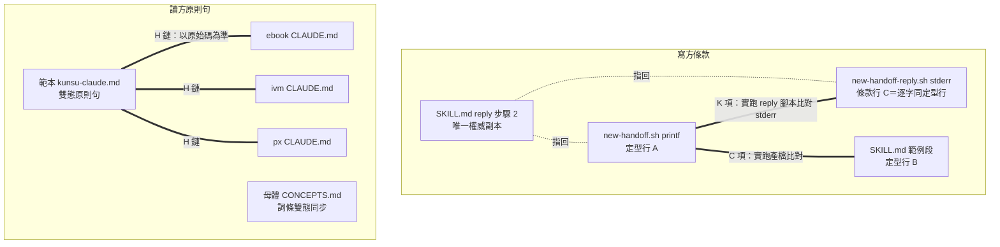

# feat: 實作現況斷言的讀寫雙側補強

## Summary

讀方：軍師範本副官慣例區新增雙態措辭原則句（依 X 記載（未查）／已查＋方式與位置），三 live 軍師同句遷移，母體 CONCEPTS「斷言層級紀律」詞條同步雙態。寫方：投遞前有程式碼改動的回覆附主要修改檔案路徑清單——reply 指引為權威副本，定型文字兩副本加一行，回覆產檔腳本 stderr 逐字同句；consistency-check 以 C 項錨句、新 K 項與 H 鏈字串罩住全部副本。

---

## Problem Frame

實證事故（2026-09-01，ebook 軍師）：軍師依過期文件宣告下「功能未完成」結論，經使用者質疑後查原始碼才更正。診斷為斷言層級紀律的掛載點覆蓋缺口——「對話中回答子專案實作現況」不經 add、done、規劃前盤點任何一個既有掛載點；寫方側，接手方必經的「回覆方式」定型文字對證據隻字未提，軍師查證只能全庫搜尋。完整診斷與需求見 origin（[docs/brainstorms/2026-09-01-current-state-assertion-dual-side-requirements.md](../brainstorms/2026-09-01-current-state-assertion-dual-side-requirements.md)）。

---

## Requirements

R-IDs 沿用 origin，本計畫全數覆蓋（origin R1–R10）：

**讀方**

- R1. 範本副官慣例區「自身狀態不憑記憶」旁新增姊妹原則句：子專案實作現況以原始碼為準，斷言措辭必居兩態之一——「依 X 記載（未查原始碼）」或「已查」並註明方式與位置；無標記的現況斷言即屬可辨識的違規形狀。
- R2. 原則句自帶理由（宣告是時點快照，實作可能在其後發生），能力提示與措辭義務，非行為強制。
- R3. 三 live 軍師（ebook／ivm／px）CLAUDE.md 同句遷移，四副本逐字一致。
- R4. consistency-check 加入讀方句比對字串。

**寫方**

- R5. 定型文字新增一行：投遞前有程式碼改動的回覆附主要修改檔案路徑清單（含暫離免除記號），一行為限、指回 SKILL。
- R6. 定型文字兩副本逐字一致，新行納入 consistency-check C 項錨句。
- R7. SKILL reply 步驟 2 升格為事實條件結構要求（權威副本）。
- R8. 事實條件劃界：投遞前有程式碼改動即附、不論 status（blocked 附卡關前已改檔案）；暫離以 branch 名為錨點明文免除；答疑、拒絕自然免除。
- R10. `new-handoff-reply.sh` stderr 印條款行（逐字同定型行）＋補救指引句，consistency-check 涵蓋此副本。

**同步**

- R9. handoff 版號 v0.20.0 → v0.21.0，kunsu-inbox 依賴聲明同步；掃描慣例、`status`／`verify` 值域、歸檔形狀零改動。

---

## Key Technical Decisions

- **錨句唯一性程序（防 C 項首筆命中碰撞）**：consistency-check C 項以 `grep -F … | head -1` 取 SKILL.md 首筆命中比對，而 reply 步驟 2（約 263 行）在範例段（約 622 行）之前——新錨句若與 R7 權威段共用字面必假陰性。程序：定型行行首採定型詞（如「投遞前有程式碼改動時，回覆請附」），R7 權威段刻意採不同句式（如「回覆投遞前有程式碼改動時」），錨句以 `grep -cF` 對 SKILL.md 全檔實測恰中一次後才定稿。
- **暫離免除上定型文字（防相鄰互斥指令）**：定型文字既有暫離行教「內文附 branch 名與現況」（最小三要素），新行的「不論 status 即附」字面與其互斥。免除記號放新行行內括號（「暫離回報除外——branch 名即查證錨點」），既有暫離行零改動（它本身是 C 項錨句，不動最穩）；SKILL 暫離回報段同步補免除明文。
- **stderr 條款行逐字同定型行＋新 K 項實跑比對**：條款落地後存在四副本（R7 權威、定型行 A＝new-handoff.sh printf、定型行 B＝SKILL 範例段、stderr C＝new-handoff-reply.sh）。A↔B 由 C 項實跑比對罩；A↔C 由新 K 項在 C 項既有 mktemp fixture 內實跑 new-handoff-reply.sh、以產出檔定型行比對 stderr（與 C 項同構、對 shell 引號語意免疫）。不採對兩腳本原始碼 `grep -cF` 比字面——暫存目錄實測：條款行含 `status` 反引號，若沿用 new-handoff-reply.sh line 151 的 echo 雙引號寫法，反引號被指令替換、stderr 印出殘句且 exit 0 不中斷，而原始碼字面比對仍命中、檢查假 PASS；靜態比對看不見引號語意。R7 為唯一權威副本、其餘指回。
- **stderr 屬事後提醒，條款行附補救指引**：回覆內文走 stdin、先於 stderr 定稿，條款行是馬後炮。行尾附「發現漏附可直接補進本回覆檔——尚未 commit、作者是你」；SKILL reply 段明文「投遞前可修訂自己剛建立的回覆檔」（不牴觸 append-only——該規則指不覆寫前一份回覆、不編他人檔案）。
- **母體 CONCEPTS 詞條必同步、範本不開新詞條**：「斷言層級紀律」詞條現為單態措辭（「凡來源為中介文件即標明依 X 記載」）且定性僅「交接撰寫時」——R1 落地即成過期副本，同步為雙態＋補第三掛載點（單檔、零遷移成本）。範本 kunsu-concepts 無此詞條，讀方句寫成自足、不點名裸名詞，避免為一句話啟動四副本詞條遷移。
- **分階段回覆清單基準＝本次投遞前的新改動**：歷次清單以回覆序列聯集為準。與 verify「顯式複寫」刻意相反——verify 是 display-only 欄位只讀最新一份，清單是內文、done 收尾通讀全部回覆。
- **H 鏈字串取「以原始碼為準」**：repo 研究實證該字串於範本、live CLAUDE.md、腳本產出檔全部零命中起點，落字後即唯一。

---

## High-Level Technical Design

副本拓撲與檢查覆蓋（讀方一鏈、寫方一鏈）：

---

## Implementation Units

### U1. 讀方範本句與母體 CONCEPTS 詞條

- **Goal**：範本落雙態原則句，母體詞條同步不留過期副本。
- **Requirements**：R1、R2、R4（字串落字）；origin AE3、AE4。
- **Dependencies**：無。
- **Files**：`skills/kunsu-init/assets/templates/kunsu-claude.md`（line 59「自身狀態不憑記憶」句旁）、`CONCEPTS.md`（「斷言層級紀律」詞條，約 75–77 行）。
- **Approach**：新句比照既有原則句條列格式，內容三要素——以原始碼為準定位句、雙態措辭（依 X 記載（未查原始碼）／已查＋方式與位置）、一句理由（宣告是時點快照）＋「無標記視同未查證」收尾（一句兩用，兼作 AE4 的使用者側判讀規則）。句內含「以原始碼為準」字串（H 鏈錨點）。自足成句、不點名「斷言層級紀律」裸名詞。母體詞條：措辭義務改雙態表述、掛載點補「軍師對話中回答子專案實作現況」一句。
- **Patterns to follow**：範本既有「自身狀態不憑記憶」句的條列與粗體格式；字面禁令掃蕩法（完整理由單點、其餘指回）。
- **Test scenarios**：Covers AE3／AE4。(1) 新句於範本 `grep -cF` 恰中一次；(2) 錨行「自身狀態不憑記憶」仍恰中一次且零改動；(3) 母體詞條含「已查」與雙態表述、含第三掛載點句。
- **Verification**：grep 斷言全過；`git diff` 僅兩檔。

### U2. 三 live 軍師遷移

- **Goal**：ebook／ivm／px CLAUDE.md 與範本四副本逐字一致。
- **Requirements**：R3。
- **Dependencies**：U1（範本句定稿為唯一基準）。
- **Files**：三 live 軍師 CLAUDE.md（目標在本 repo 之外，路徑以 `~/.claude/kunsu-registry.json` 動態發現；現況為 `kunsu-project-root/{ebook,ivm,px}`，錨行「自身狀態不憑記憶」各恰中一次已實測）。
- **Approach**：python3 批次插入，前置唯一性斷言（錨行恰中一次才動、否則停下回報），比照第五、七波遷移慣例。每軍師一筆確認 commit（ADR 009 確認制、宣告範圍契約 pathspec 兩形）。
- **Execution note**：套 done-closure-gap 子模式 (d)——舊句（錨行）`grep -cF` 恰中一次才替換；0＝措辭已漂移停下回報，2+＝逐筆確認。
- **Test scenarios**：(1) 各 live 新句 `grep -cF` 恰中一次且與範本逐字一致；(2) 各 live `git diff --stat` 僅 CLAUDE.md 一檔；(3) 錨行零改動。
- **Verification**：三 live 反向核查全過；consistency-check H 鏈（U6 落地後）PASS。

### U3. SKILL reply 步驟 2 升格與關聯段

- **Goal**：寫方條款的唯一權威副本落地。
- **Requirements**：R7、R8；origin AE1、AE2。
- **Dependencies**：與 U4 聯合定稿（KTD 錨句唯一性程序）——U4 錨句 `grep -cF` 唯一性實測通過前，U3 措辭視為草稿態，不單獨結案。
- **Files**：`skills/handoff/SKILL.md`——reply 步驟 2（263–269 證據句尾、271 矛盾段前）、暫離回報段（約 352–370）、done 逐項驗收查核段（約 400–405）。
- **Approach**：步驟 2 插入條款段：事實條件（回覆投遞前有程式碼改動即附主要修改檔案路徑清單，不論 status；blocked 附卡關前已改檔案）、「主要」粒度（足供發起方定點抽查的代表性檔案，非窮舉 diff）、分階段基準句（列本次投遞前的新改動，歷次以回覆序列聯集為準）、投遞前可修訂自己回覆檔的明文、兩語境通用一句（比照 v0.13.0 矛盾回報先例）。措辭避開 U4 錨句完整字面（KTD 程序）。暫離段補免除明文（branch 名即查證錨點）。done 驗收段證據枚舉補「主要修改檔案清單」四字級擴充，使發起方驗收面可顯式看見清單缺席。
- **Patterns to follow**：v0.13.0 矛盾回報段的指引行文（帶理由的 norm、命中才報）；redact 提醒沿用既有句不動。
- **Test scenarios**：Covers AE1／AE2。(1) 步驟 2 含事實條件、粒度、分階段基準、可修訂明文各一處；(2) 暫離段含免除句；(3) done 驗收段枚舉含「主要修改檔案清單」；(4) U4 錨句字面於 SKILL.md 全檔 `grep -cF` 恰中一次（僅範例段）。
- **Verification**：grep 斷言全過；與 U4 錨句唯一性實測聯測。

### U4. 定型文字新行兩副本

- **Goal**：接手方必經文本帶上條款一行。
- **Requirements**：R5、R6。
- **Dependencies**：U3（權威措辭與錨句程序定稿）。
- **Files**：`skills/handoff/scripts/new-handoff.sh`（printf 149 與 150 之間插一行）、`skills/handoff/SKILL.md`（範例段 622 與 624 之間）。
- **Approach**：一行定型文字（方向性草案）：「投遞前有程式碼改動時，回覆請附主要修改檔案路徑清單（不論 `status`；暫離回報除外——branch 名即查證錨點），細節見 handoff SKILL reply 段。」兩副本逐字一致；既有暫離行（C 項錨句）零改動。
- **Execution note**：改動前先暫存目錄實跑 `new-handoff.sh` 產檔、對「回覆方式」整段 grep 比對兩副本現況（intercept-point 教訓：斷行差異比預期多，同步核查對整段做）。
- **Test scenarios**：(1) 暫存目錄實跑產檔，新行在產出檔與 SKILL.md 範例段逐字一致；(2) stdout 維持單行路徑；(3) 產檔查重 stderr 三不變條件（不改產出檔既有內容結構、不改 exit code、stdout 單行）無回歸；(4) 既有兩錨句比對照常通過。
- **Verification**：實跑＋grep；consistency-check C 項（U6 前先手動等效驗證）。

### U5. 回覆產檔腳本 stderr 條款行

- **Goal**：「手動路徑＋舊交接」情境的唯一載體帶上條款。
- **Requirements**：R10。
- **Dependencies**：U4（同句字面定稿）。
- **Files**：`skills/handoff/scripts/new-handoff-reply.sh`（line 151 既有指路行之後加一行 stderr）。
- **Approach**：新 stderr 行＝定型行逐字同句＋補救指引（「發現漏附可直接補進本回覆檔——尚未 commit、作者是你」）。條款行以單引號字面 `printf '%s\n' '…' >&2` 輸出，不得沿用 line 151 的雙引號 echo（雙引號下 `status` 反引號被指令替換，stderr 印出殘句、`status: command not found`，且 exit 0 不中斷）。既有枚舉指路行保留不動。stdout 單行路徑契約不變。
- **Test scenarios**：(1) 實跑腳本，stderr 含條款行與補救句、既有指路行仍在；(2) stdout 僅一行路徑；(3) 實跑 stderr 所含條款行與 new-handoff.sh 產出檔的定型行逐字一致（以實跑輸出比對，非原始碼字面）。
- **Verification**：實跑比對；K 項（U6）實跑比對通過。

### U6. consistency-check 擴充

- **Goal**：全部新副本入機械檢查，單側漂移不可見成為不可能。
- **Requirements**：R4、R6、R10（檢查面）。
- **Dependencies**：U1、U2、U4、U5（H 鏈新字串須待 U2 遷移後才轉 PASS，先跑時三 live WARN 屬預期）。
- **Files**：`scripts/consistency-check.sh`。
- **Approach**：(a) C 項錨句清單（line 70）加定型行行首定型詞——先以 `grep -cF` 實測 SKILL.md 全檔恰中一次；(b) H 鏈 CLAUDE.md 字串組補「以原始碼為準」；(c) 新增 K…編號接續現有至 J 的序列，新獨立檢查項編 K——在 C 項既有 mktemp fixture 內以 `${gen}` 為原交接執行 `echo x | bash skills/handoff/scripts/new-handoff-reply.sh "${gen}" >/dev/null 2>"${tmp}/reply.err"`，取產出檔整行定型行 `a` 後斷言 `grep -qF "${a}" "${tmp}/reply.err"`（stderr 行含「ℹ」前綴與補救句，故用子字串包含而非整行相等）。
- **Test scenarios**：(1) 全項 PASS（項數自 24 增加）；(2) 負向：直接改動真檔 new-handoff-reply.sh 條款一字（檢查路徑為 repo 內固定路徑，暫存副本不會被檢查；測後 `git checkout` 還原）→ K 項 FAIL；(3) 負向：範本句在但假想 live 缺字串 → H 鏈 WARN（以 fixture 或乾跑推演即可，不動真 live）。
- **Verification**：`bash scripts/consistency-check.sh` 全 PASS。

### U7. 版號鏈與依賴聲明

- **Goal**：版號鏈一致，依賴聲明如實描述行為變更。
- **Requirements**：R9。
- **Dependencies**：U3、U4、U5。
- **Files**：`skills/handoff/SKILL.md`（frontmatter `version: 0.20.0` → `0.21.0`）、`skills/kunsu-inbox/SKILL.md`（line 460 依賴聲明頭尾兩處）、`CLAUDE.md`（專案結構行「通用交接原語（v0.20.0」→ v0.21.0——consistency-check A1 版號鏈第三端點，漏改則 A1 FAIL）。
- **Approach**：依賴聲明 v0.21.0 子句措辭區分——不可複製 v0.20.0「不改產出檔內容」句式：本次**確實改變交接本體產出內容**（回覆方式段多一行定型文字）；frontmatter、stdout 路徑契約、掃描慣例與豁免形狀不變、無新豁免需求。
- **Test scenarios**：Test expectation: none——純版號與聲明文字，由 consistency-check 版號鏈檢查兜底。
- **Verification**：consistency-check 版號鏈項 PASS。

---

## Scope Boundaries

沿 origin 四條（舊交接不回填、不解時效問題、不做行為強制、上報／申請不納入），另定：

- 「舊交接＋純手寫＋不跑腳本」路徑零載體——顯式接受（觸及率實證：產檔腳本 14/14 被使用，此路徑罕見）。
- 母體 CONCEPTS 不為寫方條款開新詞條（「矛盾回報」詞條先例存在，但 R7 權威副本＋指路已足；待實際使用出現查閱需求再議）。
- 範本副官慣例區累積兩條非副官原則句、標題語意漸漂——本案不處理，留待日後整理（spec-flow M5 後段）。
- 三 live CONCEPTS 零改動（範本無「斷言層級紀律」詞條，詞條血統上無同步對象）。

---

## Risks & Dependencies

- **C 項錨句碰撞**（已以 KTD 程序防）：錨句未實測唯一就落地，檢查第一天翻紅或假陰性。程序前置於 U3／U4 定稿。
- **live 遷移漂移**：錨行實測已各恰中一次；若執行時計數異常即停下回報，不憑印象改（learnings 紀律）。
- **echo 雙引號吞反引號、靜態字面比對不可見**：條款行含 `status` 反引號；new-handoff-reply.sh 既有輸出用 echo 雙引號，雙引號下反引號被指令替換——暫存目錄實測 stderr 印出「不論 ；暫離回報除外」並附 `status: command not found`、exit 0 不中斷（`set -euo pipefail` 下亦然），而對原始碼 `grep -cF` 仍命中、檢查假 PASS。故 U5 條款行強制單引號 printf、K 項改實跑比對 stderr（對引號語意免疫）；日後任何改回雙引號的編輯會被 K 項當場抓到。
- **佈署生效順序**：skill 腳本改動需經 `install.sh` 重佈署至 `~/.claude/skills/` 才對 live session 生效；U2 已遷 live CLAUDE.md 而腳本未重佈時，接手方暫看不到新 stderr 條款行（hook 版號變動提示兜底）。收尾時一併重佈。

---

## Sources / Research

- origin：[docs/brainstorms/2026-09-01-current-state-assertion-dual-side-requirements.md](../brainstorms/2026-09-01-current-state-assertion-dual-side-requirements.md)（含 4-persona doc review 修訂與 R7 強度裁決）。
- repo 盤點（2026-09-01 subagent）：插入錨點 `kunsu-claude.md:59`、`SKILL.md:263-289/596-625`、`new-handoff.sh:131-153`、`new-handoff-reply.sh:148-152`、`consistency-check.sh:64-81（C）/141-163（H）`、`kunsu-inbox/SKILL.md:460`；候選字串「以原始碼為準」「主要修改檔案」於目標檔零命中起點；檢查項編號至 J。
- learnings：`docs/solutions/workflow-issues/handoff-done-closure-gap.md`（多副本同步、grep 恰中一次遷移紀律）、`docs/solutions/workflow-issues/handoff-intercept-point-selection.md`（定型文字兩副本斷行差異實測陷阱、條件式可靠措辭）。
- spec-flow 分析（2026-09-01 subagent）：C1 錨句碰撞、C2 暫離互斥、I1–I5、M1–M5，全數收攏於 KTD 與各單元。
- 落地後建議以 `/ce-compound` 沉澱「措辭義務／斷言層級」主軸（v0.15.0＋本次兩輪演進，solutions 現為空白）。
