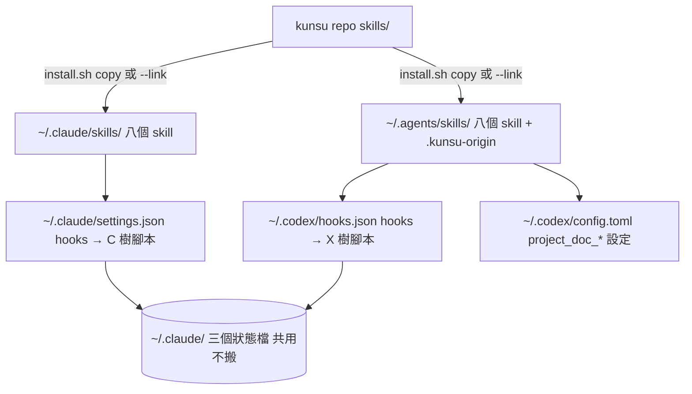
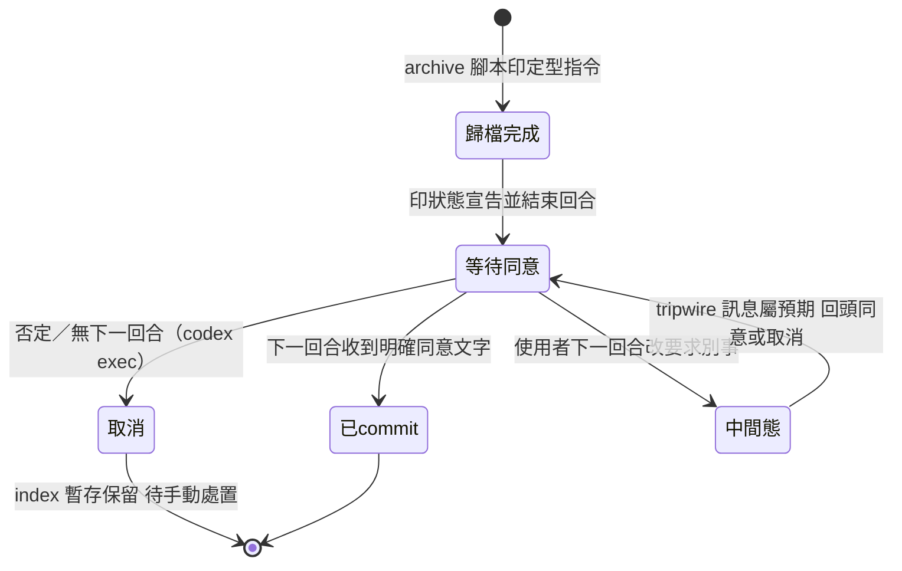
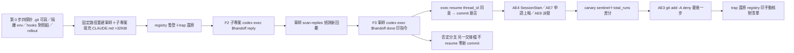

# feat: kunsu 通用化——同一份原始碼雙部署至 Claude Code 與 Codex

## Summary

先出 ADR candidate 019 定憲章（Invariant 3 擴為「各 agent 的 skill 目錄」、ADR 009 確認 commit 的第二種實現形態、ADR 001 Consequences 翻案、sandbox 與 Invariant 2 的邊界），再動載體：`install.sh` 加 `~/.agents/skills/` 目標並補覆寫保護，七份 SKILL.md 內文只用能力名、各附一張 Agent 對應表，kunsu-inbox 掛載說明加 Codex 專用 hook 片段與 config 設定，腳本文案與範本同步中性化，consistency-check 新增裸工具名與七表一致兩項檢查。以 repo 內首支持久化試點腳本（`codex exec`＋`exec resume`）證明 Codex 在軍師端與子專案端都能經 handoff 文件雙向溝通，通過後三 live 軍師第九波合批遷移。

---

## Problem Frame

kunsu 的資料層與腳本層從一開始就與 agent 無關，但部署與指引只認 Claude Code：唯一部署目標 `~/.claude/skills/`、hook 掛載說明只寫 `~/.claude/settings.json`、七份 SKILL.md 以 Claude Code 工具名描述步驟。使用者曾以早期版本試過 Codex，現行版本從未跑過也無法重複驗證。2026-09-06 查證推翻了上游 idea 的「防線真空」前提：Codex 0.142.5 的 hook payload 與 deny 契約與 Claude Code 一致（本 session 以 `codex exec` 實收 `tool_name: "Bash"`、`tool_input.command` 確認），skills 採同一套 SKILL.md 格式，`project_doc_fallback_filenames` 可讀軍師 CLAUDE.md。真正沒有對應物的只剩跨 session 推播與 `kc.fish`。完整需求、決策與八個驗收例見 origin（[docs/brainstorms/2026-09-06-codex-agent-neutral-deployment-requirements.md](../brainstorms/2026-09-06-codex-agent-neutral-deployment-requirements.md)，經 5-persona doc review 13 筆修正）。

規劃期研究另揭三件 origin 未載明、會改變施工形狀的事實：`~/.codex/skills` 在 0.142.5 原始碼標為 deprecated（文件位置是 `~/.agents/skills`，本機已在用且無撞名）；hook 程序**不受 sandbox**（本 session 實測 read-only 下 hook 仍寫入家目錄；origin Dependencies 已據此更正）；`[features] default_mode_request_user_input` 旗標可在 default mode 啟用阻塞式提問（under development、預設關）。

---

## Requirements

R-IDs 沿用 origin，本計畫全數覆蓋（origin R1–R19）；括號內為本計畫追加的施工約束。

**部署**

- R1. `install.sh` 同時部署至 `~/.claude/skills/` 與 `~/.agents/skills/`，兩處指向同一份原始碼；Codex 目錄不存在時略過並提示（追加：目標已有同名非 kunsu 產物時中止列名，不 `rm -rf`）。
- R2. 兩支 hook 的掛載說明同時涵蓋 `~/.claude/settings.json` 與 `~/.codex/hooks.json`，皆機器層級不進 repo；Codex 側含信任審查步驟（追加：只掛全域、附加於既有陣列尾端、掛後自檢）。
- R3. kunsu-inbox 掛載說明新增 `project_doc_fallback_filenames = ["CLAUDE.md"]` 與 `project_doc_max_bytes = 65536`。

**指引字面中性化**

- R4. 七份 SKILL.md 內文以能力名指稱，各附一張「Agent 對應表」（能力→Claude Code 工具／Codex 對應）。
- R5. 阻塞式確認：工具可用即用；不可用時依 agent 判定——Claude Code 視同 headless 取消，Codex 走文字回合。
- R6. handoff SKILL「非互動環境」條款改依 agent 身分拆分，Codex 一律印定型指令與訊息後結束回合、下一回合獲同意才執行；八個 AskUserQuestion 載體全數依協議節指回。
- R7. 跨 session 推播維持「工具不可用整步跳過」，字面補明 Codex 屬此情況、收方為 Codex 時無法命中屬預期。
- R8. `$CLAUDE_SKILL_DIR` 改「skill 目錄」能力描述，fallback 沿用；SKILL 內硬編碼 `~/.claude/skills/...` 路徑同列對應表兩樹。
- R9. `archive-report.sh` stderr 一處、`session_hook.py` 注入文案五處、`pretooluse_git_guard.py` DENY 訊息路徑一處中性化；stdout 契約零改動。
- R10. kunsu-init 範本字面中性化；三 live 軍師於試點通過後合批第九波遷移。
- R17. 斜線呼叫形 `/handoff` 等改寫為「執行 <skill 名> skill（Claude Code `/<name>`；Codex `$<name>`）」；description 觸發詞豁免。

**憲章與文件**

- R11. ADR candidate 019 四項內容（Invariant 3 擴張、adapter 非程式層、ADR 009 修訂、ADR 001 翻案），追加 sandbox 與 Invariant 2 邊界、ADR 002 MCP 訊號未觸發、ADR 010 SKILL.md frontmatter 措辭。
- R12. CLAUDE.md、CONCEPTS.md、範本中「Claude Code session」語意為任一 agent 者改中性用語。

**驗證**

- R13. 試點證明 Codex 子專案端讀交接、寫回覆、投遞申請與上報，軍師端掃描腳本偵測到新件。
- R14. 試點證明 Codex 軍師端 inbox 掃描、add 派發、done 收尾與歸檔腳本，經文字確認後 commit；含「引述 CLAUDE.md 末節」與「`total_runs` 遞增」兩項 canary。
- R15. 試點證明兩支 hook 在 Codex 側生效（SessionStart 注入含 `/clear`、PreToolUse deny）。
- R16. Claude Code 側零行為改變：consistency-check 全過、pytest 全過、一次互動實跑的工具呼叫證據。
- R18. consistency-check 新增裸工具名即 FAIL 檢查，並比對七表一致。
- R19. 試點為 repo 內可重跑腳本，每次 handoff 版號變動後重跑；無法非互動承載者列手動核對項。

---

## Key Technical Decisions

- **Codex 部署目標為 `~/.agents/skills/`，不用 `~/.codex/skills/`**：0.142.5 原始碼把 `$CODEX_HOME/skills` 標為 deprecated 相容路徑，官方文件與 `/import` 都落 `~/.agents/skills`；本機該目錄已存在 16 個 skill、與 kunsu 八個名稱零撞名。兩目錄並存時只部署一處。origin A3 與 Sources 的 `~/.codex/skills` 舊句由 U1 同步改正。
- **各樹自足：Codex hook 指向 Codex 樹自身的腳本**：`~/.codex/hooks.json` 的 command 指向 `~/.agents/skills/kunsu-inbox/scripts/...`，不指回 Claude 樹（Claude 樹移除即 Codex hook 靜默失效）。`session_hook.py` 以 `Path(__file__).resolve().parents[2]` 找沙盤模組，copy 模式下 Codex 樹須含 `kunsu-dashboard`，故 Codex 目標部署全部八個 skill；`--link` 模式兩樹皆解析回 repo，天然自足。
- **kunsu-dashboard/SKILL.md 補最小 frontmatter**：Codex loader 對缺 frontmatter 的 SKILL.md 每次啟動記 warning（invalid SKILL.md files）。補 `name`／`description`，description 明示「安裝與啟動說明，不是可觸發的 skill」，並在該目錄加 `agents/openai.yaml` 設 `policy.allow_implicit_invocation: false`（Codex 專屬檔，Claude Code 忽略）；同時補 Claude Code 原生欄 `disable-model-invocation: true` 與 `user-invocable: false`，否則有 description 的 SKILL.md 會在 Claude 側變成可觸發 skill、違 R16。ADR 010「刻意不使用觸發語慣例格式」措辭改為「frontmatter 存在但兩 agent 各以原生旗標停用選用」，由 ADR 019 附註。
- **字面採「內文能力名＋各 SKILL 一張 Agent 對應表」**：逐處括號會讓第三 agent 到來時要改十七個以上分散編輯點，且 R18 檢查要逐點排除括號；對應表形使內文零工具名、檢查只允許表格區塊、新 agent 只改表。七表是七份副本，由 consistency-check 新項逐字比對（計算載體同步，不靠記憶）。窄清單：AskUserQuestion、ListAgents、SendMessage、`$CLAUDE_SKILL_DIR`、斜線呼叫形、`~/.claude/settings.json`、`~/.claude/skills` 路徑；Read／Edit／Write／Glob／Grep 視為能力通名豁免；frontmatter description 豁免（Codex 隱式選用只讀 description，觸發詞須保留）。
- **阻塞式確認以能力判準，Codex 文字回合語意定型**：R5「工具可用即用」使 `default_mode_request_user_input` 開啟時 Codex 自動視同 AskUserQuestion，不需另寫分支；不可用時依 agent：Claude Code＝headless 取消，Codex＝印定型指令與訊息、加一句狀態宣告（「index 已暫存待確認 commit，下一步只能同意或取消」）、結束回合、下一回合獲同意文字才執行；`codex exec` 無下一回合即等價取消。八載體以 handoff 協議節為單一權威副本，其餘七處（handoff 第 87／458／466 行、kunsu-init、kunsu-apply、kunsu-report、todo）改為指回，套字面禁令掃蕩法。
- **sandbox：基線逐次核准、試點 CLI 覆寫、`writable_roots` 僅選用**：hook 程序不受 sandbox（實測），牆只落在模型經 shell 執行的腳本（reply／apply／report 寫軍師 repo、scan 寫統計檔、add-project 寫 registry）。牆比 origin 假設更近：macOS 上 workspace-write 對每個可寫根底下的 `.git/` 一律唯讀（seatbelt 明文排除），Codex 軍師 session 在真實路徑執行 `git mv`／`git add`／`git commit` 都會被擋——TUI 下會跳核准提示改在 sandbox 外重跑，零設定可用；`/tmp`／`$TMPDIR` 底下的 repo 因 `/tmp` 根的 allow 子句不排除子目錄 `.git` 而例外可寫（本 session 於暫存目錄實測 `git commit` 成功即此形狀），試點結果因此不能證明真實路徑行為，playbook 手動核對項須含「TUI 在真實軍師 repo 收尾時的核准提示」。試點以 `-c sandbox_workspace_write.writable_roots=[...]` 單次覆寫不寫 config（明列 `<repo>/.git` 可解除該根的預設唯讀）；`writable_roots` 常設登記軍師路徑會成為機器路徑第三處登記，字面牴觸 Invariant 2，故只在掛載說明列為選用並註明張力，由 ADR 019 明文三選一（逐次核准／CLI 覆寫／writable_roots＋Invariant 2 例外註記）。另一道牆與 Invariant 2 無關但決定觀察期數據：真實路徑下模型 shell 對 `~/.claude/*.json`（統計檔、hook 狀態檔）的寫入同樣受 sandbox 擋，`scan-replies.sh` fail-open 靜默不記，`total_runs`、基線與 `MISDECLARED` 事件對 Codex 使用全盲、零訊號；只有 hook 路徑會寫。`writable_roots` 選用項因此列「軍師路徑＋`~/.claude`」並註明後者是統計數據完整的前提，ADR 019 三選一把 `~/.claude` 與軍師路徑分開討論。
- **Codex hook 片段只用查證過的欄位**：`hooks.json` 頂層 `deny_unknown_fields`、handler 只認 `type: command`，欄位限 `type`／`command`／`timeout`（秒）／`matcher`；貼 Claude 片段的 `async` 等陌生鍵雖靜默忽略，頂層多鍵即整檔解析失敗。附加於既有陣列**尾端**（信任 key 含位置索引，前插使後續 hook 全變 Untrusted）。放行路徑維持 exit 0 無輸出（輸出 `allow` 會記 Failed）。掛載順序警語改兩 agent 分述：Claude Code fail-closed 擋全部 Bash；Codex fail-open、掛錯路徑或未信任＝守門靜默關閉、零訊號。
- **`project_doc_max_bytes = 65536`**：預算為專案鏈合計（`AGENTS.override.md`→`AGENTS.md`→fallback 逐目錄取首個命中）、全域 `~/.codex/AGENTS.md` 不計、超限只 log warn 靜默截尾。ebook 軍師 CLAUDE.md 34,581 bytes 已超 32 KiB 預設，第九波遷移再加對應表約 2 KB，65536 留一倍餘裕。全域設定會使所有子專案 CLAUDE.md 也被 Codex 讀入，掛載說明明寫此副作用。
- **試點為 repo 內首支持久化 shell 測試腳本**：歷來 dogfooding 皆暫存目錄用後即棄，R19 要求可重跑，落 `scripts/codex-pilot.sh`。隔離：registry 以暫存軍師條目暫時併入真實 `~/.claude/kunsu-registry.json`、trap 還原（session hook 與 reply 語境讀固定路徑，無 env 可覆寫）；統計檔以 `KUNSU_SCAN_STATS_FILE` 隔離；hook 狀態檔接受一次版號提示被消耗。Codex 呼叫一律 `$handoff` 顯式（隱式選用非互動下不穩定）；AE2 同意分支以 `codex exec` 印指令＋`codex exec resume <thread_id> "同意"` 兩回合承載（thread id 取自第一回合 `--json` 的 `thread.started`，不用 `--last`——同一 cwd 連開多個 exec session 時 `--last` 會接錯；第二回合不沿用第一回合設定，`resume` 子指令又沒有 `-C`／`--sandbox` 旗標，故以 shell `cd` 進軍師目錄、以 `-c sandbox_mode="workspace-write"` 與 `-c sandbox_workspace_write.writable_roots=[...]` 重帶 sandbox，`-m`、`--skip-git-repo-check`、`--dangerously-bypass-hook-trust`、`--json` 照帶），同意與否定分支各建一份獨立交接檔，否定分支不 resume 即視為取消、斷言該交接仍在 index 暫存且 `git log` 零新 commit；`--dangerously-bypass-hook-trust` 僅試點使用。`--json` 的可觀測面（原始碼查證）：shell 呼叫為 `command_execution` item（含 command／exit_code／status），hook 執行紀錄與 SessionStart 注入的 developer 訊息都不進 `--json` 也不進 `-o`，被 PreToolUse 擋下的呼叫連 item 都不產生。故 AE3 以隔離統計檔的 `GUARD_DENY` 事件計數＋1 為主斷言、人類模式 stderr 的 `hook: PreToolUse Blocked` 為次；AE4 以 `thread.started` 取得 thread id 後讀 rollout 檔（`~/.codex/sessions/…jsonl`）內 developer 角色訊息含摘要標記為斷言，不用 `--ephemeral`。canary 防繞過：試點軍師 CLAUDE.md 填充至 >32 KiB 並在末節放 sentinel，以 `--json` 斷言 `command_execution` 為零且回覆含 sentinel；`total_runs` 差分以 `-c features.hooks=false` 關閉全部 hook 後再跑 inbox 掃描（`-c hooks.*=[]` 與 hooks.json 為合併非取代，關不掉），分離 hook 路徑與模型 shell 路徑。
- **ADR 019 先出 candidate、一輪 doc review 再動載體**：比照 ADR 010／017 慣例；candidate 撰寫時順補 `docs/README.md` ADR 索引缺列的 017／018。Invariant 3 母體字面於 accepted 後才改（U6）。
- **三 live 遷移「試點通過即合批」**：Codex 軍師端依賴遷移後的 CLAUDE.md（遷移前 live 仍教 AskUserQuestion 確認，Codex 軍師永不 commit），遷移前 live 不支援 Codex 軍師端；python3 批次替換前置唯一性斷言，錨行恰中一次才動，每軍師一筆確認 commit。
- **install.sh 覆寫保護以 `.kunsu-origin` 標記檔判定**：部署 copy 時在目的目錄寫入 `.kunsu-origin`（內容為來源 repo 路徑）；覆寫前允許條件為「dest 是指向本 repo 的 symlink」或「dest 含 `.kunsu-origin`」，否則中止並列名，不 `rm -rf`。以檔案標記而非 SKILL.md 內容判定，避免 todo 等通用名稱的 SKILL.md 不含 kunsu 字樣時誤判。
- **Codex 軍師 add-project 不入試點**：核准寫 registry 走模型 shell 受 sandbox，且 origin Key Decision 列的軍師端流程為 add／done／inbox／歸檔；列為 Scope Boundaries，待 sandbox 解法定案後另批。

---

## High-Level Technical Design

### 部署拓撲（各樹自足）

### Codex 側確認 commit 的回合狀態

### 試點腳本流程

---

## Implementation Units

### Phase A：憲章

#### U1. ADR candidate 019 與索引補列

- **Goal**：憲章層決策先落文，供一輪 doc review，後續載體改動以其為依據。
- **Requirements**：R11、R12（CLAUDE.md Invariant 3 字面延至 U6）；origin Key Decisions 全部。
- **Dependencies**：無。
- **Files**：`docs/adr/2026-09-06-adr-candidate-019-agent-neutral-deployment.md`（新）、`docs/README.md`（ADR 索引補 017／018／019）、`docs/brainstorms/2026-09-06-codex-agent-neutral-deployment-requirements.md`（A3 與 Sources 的 `~/.codex/skills` 改 `~/.agents/skills`）。
- **Approach**：比照 ADR 018 結構（frontmatter 四欄、`> 狀態：Candidate` blockquote、Context／Decision／威脅模型或邊界／開放問題／Consequences／Alternatives considered）。Decision 條列：（一）Invariant 3 擴為各 agent skill 目錄，可檢查條件為 consistency-check D 項擴充（每個部署目標覆蓋全部 skills）；（二）adapter＝部署目標＋字面對應，引 ADR 001 Decision 1 與 ADR 003 vendor 複製否決；（三）ADR 009 修訂——文字同意作第二種實現形態、規範層非結構關卡、事後偵測兜底、不可觀察性明文（同意與未同意逕行 commit 的產物同形）；（四）ADR 001 Consequences「無法服務不跑 Claude Code」翻案，套 ADR 015 兩層記法（事實前提變更＋機制變更），Consequences 寫「使 ADR 001 限制限縮於……」；（五）sandbox 三選一與 Invariant 2 邊界；（六）ADR 002 Decision 4 MCP 訊號未觸發（Codex 已實證能執行同格式 hooks／skills）、Decision 5 閘門不變載體依 agent；（七）ADR 010 SKILL.md frontmatter 措辭附註；（八）ADR 014 Decision 6 機器層級設定擴及 `~/.codex/`。開放問題：`GUARD_DENY` agent 欄位、`default_mode_request_user_input` 成熟後是否改為原生工具。
- **Patterns to follow**：ADR 018 章節與修訂註記寫法；ADR 015 翻案兩層結構；ADR 017 四要件判準與觀察期條款。
- **Test scenarios**：Test expectation: none —— 純文件單元；以 `/ce-doc-review` 一輪（coherence＋feasibility＋adversarial）作品質閘。
- **Verification**：ADR 檔存在且 `status: proposed`；`docs/README.md` ADR 表列至 019；origin 無 `~/.codex/skills` 殘句（`grep -c` 為 0）。

### Phase B：載體

#### U2. install.sh 第二目標與覆寫保護

- **Goal**：一次執行同時部署兩樹，對非 kunsu 產物拒絕覆寫。
- **Requirements**：R1；origin F1、AE6。
- **Dependencies**：U1（目標目錄定案）。
- **Files**：`install.sh`（第 14–16 行純量改目標陣列、第 52–79 行迴圈外包目標迴圈、第 81–95 行提示、第 2／7 行檔頭註解）、`README.md`（第 42／47／51 行）、`skills/kunsu-dashboard/SKILL.md`（最小 frontmatter）、`skills/kunsu-dashboard/agents/openai.yaml`（新）。
- **Approach**：目標清單 `~/.claude/skills`（恆）＋`~/.agents/skills`（`~/.codex/` 存在才啟用，目錄未建即 `mkdir -p`，不以 skills 目錄存在與否判斷 Codex 是否安裝）；`--target` 保留為單目標覆寫供測試，`--link` 為目錄層 symlink（Codex 追蹤目錄 symlink、跳過檔案 symlink，勿改成檔案層）。部署分兩段：先對全部目標×全部 skill 做 pre-flight 覆寫判定——dest 為 symlink 且指向本 repo → 允許；dest 為目錄且含 `.kunsu-origin` → 允許；其他 → 記入衝突清單——任一衝突即整批中止、列名、exit 非零、零目錄改動；全部通過才進入部署迴圈。新增 `--adopt` 旗標：對「一般目錄且無 `.kunsu-origin`」的 dest 視為舊版 kunsu 部署予以覆寫並寫入標記（供既有 copy 樹一次性採納）；預設無旗標維持中止。copy 模式部署後寫 `.kunsu-origin`。尾端提示改列兩 agent 呼叫形（`/name` 與 `$name`）與兩份掛載說明位置；空陣列展開沿 `[[ ${#arr[@]} -gt 0 ]]` 防護（bash 3.2）。kunsu-dashboard/SKILL.md 補最小 frontmatter：`name: kunsu-dashboard`、`description` 明示「軍師沙盤安裝與啟動說明，不是可觸發的 skill」、`disable-model-invocation: true`、`user-invocable: false`（Claude Code 原生停用欄，Codex 忽略陌生欄位）；目錄新增 `agents/openai.yaml` 設 `policy.allow_implicit_invocation: false`（Codex 停用隱式選用，Claude Code 忽略）——兩 agent 各以原生旗標停用選用。
- **Patterns to follow**：既有 dest==src 防呆（第 61–67 行）；`deployed` 陣列展開寫法。
- **Test scenarios**：Covers AE6。(1) `~/.codex/` 不存在 → 只部署 Claude 樹、印一行略過、exit 0；(2) `~/.codex/` 存在但 `~/.agents/skills/` 未建 → 建目錄並部署八個；(3) 目標已有同名目錄且無 `.kunsu-origin` → 中止列名、exit 非零、該目錄零改動；(4) 目標為指向本 repo 的 symlink → 覆寫成功；(5) `--link` 後 `~/.agents/skills/handoff` 為目錄 symlink；(6) 重跑冪等（`.kunsu-origin` 存在即覆寫）；(7) 兩目標中第二目標衝突時第一目標零改動（pre-flight 整批中止）；(8) 無標記實體目錄＋`--adopt` → 覆寫並產生標記檔。以 `--target` 指向暫存目錄實跑上述場景；手動核對：Claude Code `/` skill 清單不列 kunsu-dashboard。
- **Verification**：八場景全過；`bash -n install.sh`；consistency-check D 項（U7 擴充後）對兩目標各 PASS。

#### U3. 七份 SKILL.md 字面中性化與 Agent 對應表

- **Goal**：內文零 Claude 專屬工具名，各 SKILL 一張逐字一致的對應表，八個確認載體指回單一協議節。
- **Requirements**：R4、R5、R6、R7、R8、R17、R12；origin F2、F3。
- **Dependencies**：U1。
- **Files**：`skills/handoff/SKILL.md`（第 87／102／189／205／209／220／335／343／349／357／458／466 行等；version → 0.22.0）、`skills/kunsu-init/SKILL.md`（AskUserQuestion 24、`$CLAUDE_SKILL_DIR` 19；→ 0.9.0）、`skills/kunsu-apply/SKILL.md`、`skills/kunsu-report/SKILL.md`、`skills/kunsu-list/SKILL.md`、`skills/todo/SKILL.md`（→ 0.4.0）、`skills/kunsu-inbox/SKILL.md`（第 471 行依賴聲明；version → 0.12.0）。
- **Approach**：對應表為固定區塊（標題「Agent 對應表」，列：阻塞式確認／跨 session 推播／skill 目錄／skill 呼叫形／hook 設定檔／子 agent；欄：能力、Claude Code、Codex），七份逐字相同、置於 frontmatter 後首節。內文改寫規則：工具名→能力名（「阻塞式確認」「跨 session 推播」「skill 目錄」），斜線形→「執行 <name> skill」，`~/.claude/skills/...` 路徑→「<skill 目錄>/...」。推播定型訊息（第 209／349 行）內的 `/kunsu-inbox` 同改，收方可能是 Codex。R6 協議節為權威：Claude Code 不可用即取消；Codex 印指令＋狀態宣告後結束回合、下一回合同意才執行；其餘七載體只寫「依協議節確認」。description 觸發詞不動；「Claude Code session」語意為任一 agent 者改「agent session」。
- **Patterns to follow**：字面禁令掃蕩法（例外主文單點、其餘指回）；定型文字副本清點先於改寫（以 grep 實測為準，不用 origin 快照數字）。
- **Test scenarios**：(1) 七份 SKILL.md 對應表區塊 `diff` 兩兩為空；(2) 對應表外全文 `grep -c` 窄清單七個字串皆為 0（description 行與表格行排除）；(3) handoff 協議節含「結束該回合」「下一回合」「狀態宣告」三錨句各恰中一次；(4) 第 466 行 todo 收尾句與第 102 行同型句皆已改為指回；(5) kunsu-inbox 依賴聲明版號與 handoff frontmatter 一致（A1 檢查）。
- **Verification**：U7 新項 L／M 對本單元 PASS；既有 A／B／C／K 項不回歸；R16 互動實跑（U8 收尾時）顯示 Claude 側仍呼叫 AskUserQuestion 與 ListAgents。

#### U4. kunsu-inbox 掛載說明：Codex hook 片段與 config 設定

- **Goal**：使用者依說明即可讓兩支 hook 與 project doc 設定在 Codex 側生效並自檢。
- **Requirements**：R2、R3；origin F1、F4。
- **Dependencies**：U3（同檔改動合併）。
- **Files**：`skills/kunsu-inbox/SKILL.md`（第 364–454 行兩節各加 Codex 段、新增「Codex config 設定」節、第 34 行授權邊界句）、`skills/kunsu-inbox/scripts/session_hook.py`（docstring 第 13–14 行）、`skills/kunsu-inbox/scripts/pretooluse_git_guard.py`（docstring 第 27–28 行）。
- **Approach**：兩節掛載／解除 prose 改以「hook 設定檔（見 Agent 對應表）」指稱，Claude Code 與 Codex 的實際設定檔路徑只出現在各自 fenced 片段內或片段標題註解（L 項豁免 fence）。Codex 片段為完整 `hooks.json`（頂層只有 `hooks`），SessionStart matcher `*`、PreToolUse matcher `Bash`，command 指向 `~/.agents/skills/kunsu-inbox/scripts/...`（`$HOME` 經 shell 展開），`timeout` 以秒；掛載固定順序：（1）先清理 hooks.json 內指向不存在腳本的壞條目（本機索引 0 的 observe.sh 條目即實例）→（2）再把 kunsu 群組附加於對應陣列尾端、不前插→（3）再於 TUI「Hooks need review」信任，狀態記 `hooks.state`；維護句明寫「hooks.json 任何改動須重信任、腳本內容改動不用；刪除任一位置在前的群組會改變 kunsu 條目的位置索引，須重新信任」；掛後自檢：以合成 payload 餵 guard 期望 deny JSON、TUI `/hooks` 確認 Trusted。順序警語兩 agent 分述。config 節：`project_doc_fallback_filenames`／`project_doc_max_bytes = 65536`，附「全域設定、所有 repo 的 CLAUDE.md 皆被讀入」副作用與「AGENTS.md 出現即 fallback 失效」條件；`writable_roots` 列為選用、內容為「軍師路徑＋`~/.claude`」，附 Invariant 2 註記與「不列 `~/.claude` 則 Codex 側統計靜默缺漏」說明；`default_mode_request_user_input` 列為選用（開啟即取得阻塞式確認）。既有 PreToolUse 片段自 JSON 片段改為完整檔，與 SessionStart 節對稱。
- **Patterns to follow**：現行兩節「掛載／解除／警語」結構。
- **Test scenarios**：(1) 文件內 Codex hooks.json 片段以 `python3 -c 'json.load'` 可解析且頂層唯一鍵為 `hooks`；(2) 片段內 handler 鍵集合 ⊆ {type, command, timeout}；(3) 兩 docstring 各含 `~/.codex/hooks.json`；(4) 警語含「fail-open」與「fail-closed」各一。
- **Verification**：U8 的 AE3／AE4 以此片段實掛通過；grep 斷言全過。

#### U5. 腳本文案中性化

- **Goal**：手動路徑上唯一倖存的載體（腳本 stderr 與 hook 注入文案）不再導向 Codex 不存在的斜線指令或路徑。
- **Requirements**：R9。
- **Dependencies**：U3（對應措辭定稿）。
- **Files**：`skills/kunsu-inbox/scripts/archive-report.sh`（第 36／242 行）、`skills/kunsu-inbox/scripts/session_hook.py`（第 175／177／245／282／290 行）、`skills/kunsu-inbox/scripts/pretooluse_git_guard.py`（第 46–53 行 DENY_MESSAGE）、`skills/kunsu-inbox/tests/test_session_hook.py`、`skills/kunsu-inbox/tests/test_git_guard.py`、`skills/handoff/scripts/archive-handoff.sh` 與 `skills/todo/scripts/archive-todo.sh`（stderr 指路行清點）。
- **Approach**：文案改「執行 kunsu-inbox skill」等能力語，或同列兩形（`/kunsu-inbox`／`$kunsu-inbox`）；DENY_MESSAGE 的歸檔腳本路徑改由 `Path(__file__).resolve().parents[2] / "handoff" / "scripts" / "archive-handoff.sh"` 推算（與 `session_hook.py` 既有寫法同式），deny 語意與 JSON 形狀零改動；stdout 契約零改動。測試補：deny 訊息含推算後路徑；session hook 摘要不含裸 `/kunsu-inbox`。
- **Patterns to follow**：`session_hook.py:38` 的 `parents[2]` 推算；stderr 單引號 printf（assertion-level 教訓）。
- **Test scenarios**：(1) `test_git_guard` deny 訊息含 `archive-handoff.sh` 且路徑以 guard 所在樹推算；(2) `test_session_hook` 軍師模式摘要含「kunsu-inbox skill」字樣、不含裸 `/kunsu-inbox`；(3) stdout 契約：`archive-report.sh` 印出的待確認指令與改動前逐字一致（暫存目錄實跑比對）。
- **Verification**：pytest（kunsu-inbox，既有 38 項＋本單元新增，數字以 `--collect-only` 實測為準）全過；U7 新項對腳本層 PASS。

#### U6. 範本、母體憲章與 CONCEPTS

- **Goal**：新軍師出生即 agent 無關；母體文件與 ADR 019 一致。
- **Requirements**：R10（範本半）、R12。
- **Dependencies**：U1 accepted（Invariant 3 字面）、U3（措辭定稿）。
- **Files**：`skills/kunsu-init/assets/templates/kunsu-claude.md`（AskUserQuestion 第 132／154 行、斜線形 27 處、`~/.claude/skills` 第 84／132 行）、`skills/kunsu-init/assets/templates/kunsu-concepts.md`（第 20 行指路句、副官詞條）、`CLAUDE.md`（第 9 行 Invariant 3、第 55 行、專案結構版號、開發狀態條目）、`CONCEPTS.md`（「Agent 對應」詞條目標目錄與對應表形）、`README.md`（第 3／42／51／93 行）。
- **Approach**：範本斜線形改「執行 <name> skill」並於工作流程節加一句指向 SKILL 對應表；第 154 行 ADR 009 句改「經阻塞式確認或文字回合確認」；CONCEPTS 詞條補 `~/.agents/skills` 與對應表形；CLAUDE.md Invariant 3 改「部署至各 agent 的 skill 目錄（Claude Code `~/.claude/skills/`、Codex `~/.agents/skills/`）」；開發狀態條目依既有寫法（源自→定案→落地→審查→驗證數字）。
- **Patterns to follow**：範本原則句條列格式；開發狀態條目慣例。
- **Test scenarios**：(1) 範本 `grep -c` 窄清單字串為 0；(2) 範本含「Agent 對應表」指向句恰中一次；(3) CLAUDE.md Invariant 3 含 `~/.agents/skills`；(4) consistency-check A 項版號鏈 PASS。
- **Verification**：kunsu-init 以暫存目錄 scaffold 一次，產出 CLAUDE.md 對窄清單零命中。

#### U7. consistency-check 擴充

- **Goal**：字面漂移在檢查層即失敗，七表一致由計算保證，雙目標覆蓋可證。
- **Requirements**：R18、R16。
- **Dependencies**：U3、U6（錨句定稿）。
- **Files**：`scripts/consistency-check.sh`（檔頭說明、D 項、H 鏈、新 L／M 項）。
- **Approach**：L 項——七份 SKILL.md 排除 frontmatter description 行、對應表區塊與 fenced code block 內容後，對窄清單七字串 `grep -c` 皆 0 才 PASS（G 項「出現即 FAIL」形）；斜線呼叫形以錨定樣式比對（前導為行首、空白或全形標點，後接 skill 名，再接非路徑字元，例如 `(^|[[:space:]（「])/(handoff|todo|kunsu-(init|inbox|apply|report|list))([[:space:]）」、。]|$)`，樣式寫進腳本註解供日後增列），避免誤中 `docs/handoffs/`、`skills/handoff` 等路徑；範本兩檔同列。M 項——抽出七份對應表區塊兩兩 `diff`，任一差異即 FAIL。D 項擴——`install.sh` 含兩目標字面且 SKILLS 陣列八個名稱皆在。H 鏈——第九波遷移後追加「Agent 對應表」比對字串（CLAUDE.md 單檔；先查落點防雙檔常態假警）。負向測試以反向 sed 還原，不用 `git checkout`。
- **Patterns to follow**：G 項計數形、I 項多載體形、K 項實跑形（腳本輸出類走實跑，本單元不新增實跑項）。
- **Test scenarios**：(1) 基線全 PASS；(2) 故意在 handoff SKILL 內文裸寫 AskUserQuestion → L 項 FAIL，還原後 PASS；(2b) 在 kunsu-inbox SKILL 的 fence 外裸寫 `~/.claude/settings.json` → L 項 FAIL（確認 fence 豁免沒有過寬）；(3) 故意改一份對應表一格 → M 項 FAIL；(4) 故意刪 install.sh 第二目標字面 → D 項 FAIL。
- **Verification**：`bash scripts/consistency-check.sh` 全 PASS，項數自 26 增至 29 以上。

### Phase C：驗證與遷移

#### U8. Codex 試點腳本

- **Goal**：一支可重跑腳本證明 Codex 雙端雙向溝通、hook 生效、確認 commit 兩態，並印手動核對清單。
- **Requirements**：R13、R14、R15、R19；origin F2、F3、F4、AE1–AE5、AE7、AE8。
- **Dependencies**：U2–U7 全部落地並重新 `install.sh`。
- **Files**：`scripts/codex-pilot.sh`（新）、`docs/playbooks/codex-pilot.md`（新，手動核對清單與 TUI 場景）。
- **Approach**：前置檢查（`codex --version`、`~/.agents/skills/handoff` 存在、`~/.codex/hooks.json` 含 kunsu 條目，並核對 `~/.codex/config.toml` 的 `hooks.state` 鍵 `hooks.json:pre_tool_use:<群組索引>:0` 與 hooks.json 內 kunsu 群組實際索引一致）；試點目錄為固定路徑 `${TMPDIR:-/tmp}/kunsu-codex-pilot/{kunsu,sub-registered,sub-unregistered}`、每輪先 `rm -rf` 再重建（`codex exec` 會把 cwd 寫成 `[projects.*] trust_level` 條目，固定路徑使寫入收斂為一次；仍在 `$TMPDIR` 的 `.git` 可寫例外範圍內），建軍師（以 kunsu-init 範本 scaffold）與兩個子專案（一登記、一未登記），軍師 CLAUDE.md 填充至 >32 KiB 並於末節放 sentinel；registry 暫登＋`trap` 還原，統計檔 `KUNSU_SCAN_STATS_FILE` 隔離；所有 `codex exec`／`exec resume` 帶 `</dev/null`、`--sandbox workspace-write`（resume 以 `-c sandbox_mode`）、`--skip-git-repo-check`、`--dangerously-bypass-hook-trust`、`-c model=...`、`-c sandbox_workspace_write.writable_roots=[<軍師路徑>]`、`-c features.default_mode_request_user_input=false`（釘死文字回合路徑，旗標開啟行為只在 TUI 手動核對）、`--json`。第 0 步四個探針，任一失敗即中止並印原因：(a) `touch .git/x` 探測 workspace-write 下 `.git/` 是否可寫，不可寫即把 `<repo>/.git` 加入 `writable_roots`；(b) `codex exec 'echo $KUNSU_SCAN_STATS_FILE'` 加一次合成 PreToolUse 呼叫，確認模型 shell 與 hook 程序皆讀到隔離檔路徑（否則 deny 與 total_runs 會寫進真實統計檔）；(c) hooks 關閉對照組——`-c features.hooks=false` 下跑零指令提示斷言隔離檔 `total_runs` 不變；(d) 一次 SessionStart 觸發後 rollout 檔存在且含任一角色的信箱摘要標記。斷言：AE1 回覆檔落點與 `scan-replies.sh` 命中；AE7 申請與上報檔落點與兩支掃描命中；AE8 派發本體 `to:` 正確、輸出含「未推播」；AE2 第一回合 `--json` 的 `agent_message` 含定型指令且 `git log` 零新 commit，`cd <軍師> && codex exec resume <thread_id>`（重帶 `-c sandbox_mode` 與 writable_roots、`-m`、`--skip-git-repo-check`、bypass、`--json`）送同意後 commit 存在且 porcelain 形狀與 Claude 側一致（`R`／`A` 兩形、quotepath）；否定分支用另一份交接檔、不 resume，斷言 index 仍暫存且零新 commit；AE3 排在軍師端鏈最後一步（AE2 兩分支與 canary 之後），先存 `git status --porcelain` 快照，提示詞明示「指令被擋即回報，不得以其他形式重試、不得改用具體路徑」，要求 Codex 執行 `git add -A`，斷言隔離統計檔 `GUARD_DENY` 計數 ≥1 且增量全數來自試點軍師路徑、`--json` 無對應 `command_execution` item（被擋呼叫零痕跡即為證據）、porcelain 與快照一致；AE4 雙斷言——主：讀 rollout 檔（路徑取自 hook payload 的 `transcript_path`）任一角色訊息含信箱摘要標記；次：prompt 要求逐字回顯啟動時收到的信箱摘要並以 `-o` 檔比對標記；皆未中則降為 playbook 手動核對項而非硬失敗；canary 主斷言改為 rollout 內 `# AGENTS.md instructions for <cwd>` 注入訊息含 sentinel（直接量到截尾與否、不依賴模型行為），`command_execution` 為零降為次要斷言、非零記 inconclusive（本機全域 `~/.codex/AGENTS.md` 的 Project Context Discovery 段會驅動模型主動 `cat` CLAUDE.md）；`total_runs` 差分以 `-c features.hooks=false` 關閉全部 hook 為對照組後再跑 inbox 掃描；R16 附帶：以 Claude 側既有路徑重跑 AE5 產物形狀比對。無法非互動承載者（TUI `/clear` 觸發、hook 信任 UI、真實軍師路徑下收尾時的 `.git/` 唯讀核准提示、隱式選用是否命中、`default_mode_request_user_input`）寫入 playbook 手動核對清單。
- **Execution note**：先跑接手方鏈（F2，只依賴 hook 與 sandbox 外寫入），確認 sandbox 牆與 writable_roots 覆寫可行後再跑軍師端鏈；任何計數或形狀異常即停下回報，不憑印象改斷言。
- **Patterns to follow**：consistency-check C／K 項的 mktemp fixture 骨架；git porcelain 四陷阱（`-c core.quotepath=false`、untracked 先 add）；`test_git_guard` 的 payload 形狀；bash 3.2 相容（`$var` 緊鄰全形字元、`set -u` 空陣列）。
- **Test scenarios**：Covers AE1／AE2／AE3／AE4／AE5／AE7／AE8。(1) 全綠一輪；(2) trap 還原後真實 registry 與執行前 `diff` 為空；(3) 中途失敗（如 sandbox 擋寫）時 trap 仍還原且印出失敗步驟；(4) 重跑兩次結果一致；(5) 去掉 writable_roots 覆寫時接手方鏈失敗形狀為顯式錯誤（非靜默）。
- **Verification**：腳本 exit 0、印出手動核對清單；playbook 記錄一次 TUI 手動核對結果（含 `/clear` 注入、信任 UI、逐次核准）。

#### U9. 三 live 軍師第九波遷移

- **Goal**：ebook／ivm／px CLAUDE.md 與 CONCEPTS 和範本副本逐字一致，Codex 軍師端可用。
- **Requirements**：R10（live 半）、R3（預算數值依遷移後大小複核）。
- **Dependencies**：U8 通過（origin Outstanding Questions 定案：試點通過即合批）。
- **Files**：三 live 軍師 CLAUDE.md 與 CONCEPTS.md（路徑以 `~/.claude/kunsu-registry.json` 動態發現）。
- **Approach**：python3 批次替換，前置唯一性斷言（斜線形與 AskUserQuestion 兩句各恰中預期次數才動，0＝漂移停下、2+＝逐筆確認）；先在暫存副本跑一次 diff 審閱再對 live 執行；遷移後反向核查（新句命中、舊句歸零、`git diff --stat` 僅預期檔）；每軍師一筆確認 commit（pathspec 兩形）。遷移後量測三份大小，確認 65536 餘裕。
- **Execution note**：套 done-closure-gap 子模式 (d)。
- **Test scenarios**：(1) 三 live 對窄清單字串零命中；(2) 各 live `git diff --stat` 僅 CLAUDE.md 與 CONCEPTS.md；(3) H 鏈（U7）對三 live PASS；(4) ebook CLAUDE.md 大小 < 65536。
- **Verification**：consistency-check H 鏈全 PASS；以 Codex 開 ebook 軍師 session 一次（TUI）確認能引述末節。

---

## Scope Boundaries

沿 origin 全部邊界（不做協議 spec、不搬狀態檔、不做 kc.fish Codex 版、不建 Codex 推播、資料層與腳本行為零改動、不寫 Codex 薄殼），另定：

- 「沙盤零改動」的唯一、有限例外：`skills/kunsu-dashboard/SKILL.md` 補最小 frontmatter 與新增 `agents/openai.yaml`（沙盤 app 與 start.sh 零改動）。理由：Codex loader 對缺 frontmatter 的 SKILL.md 每次啟動記 warning，而 `session_hook.py` 需同樹存在 `kunsu-dashboard`；兩 agent 各以原生旗標停用選用以維持 ADR 010「不可觸發」原意。ADR 019 明列此例外。

- Codex 軍師 add-project 審核不入試點，待 sandbox 解法定案後另批評估。
- `GUARD_DENY` 事件 `agent` 欄位不在本批（origin Deferred；ADR 019 列為開放問題）。
- `default_mode_request_user_input` 僅在掛載說明列為選用，不成為驗收條件；旗標成熟後再評估改原生工具。
- `~/.codex/skills` 不部署、不清理；使用者既有 `~/.codex/hooks.json` 內指向已刪除第三方腳本的壞條目由掛載說明提醒清理，不代為刪除。
- 腳本層 `~/.claude/*.json` 狀態檔路徑與 `CLAUDE.md || AGENTS.md` 根標記零改動。

### Deferred to Follow-Up Work

- `/import`（Codex 自 Claude Code 匯入）與 install.sh 雙部署的互動：匯入會複製 `~/.claude/skills/*` 至 `~/.agents/skills/`（目標已存在則跳過），與本計畫 `.kunsu-origin` 判定的關係待實測一次後於掛載說明補一句。
- hook 狀態檔跨 agent 共用的一次性提示消耗，日後若需獨立以檔名後綴區分。
- 五項只存在於 CLAUDE.md 與 plans 的教訓（觸及率指路牌、hook 狀態檔隔離、bash 3.2、翻案記法、四要件）落地後以 `/ce-compound` 沉澱為 solutions。

---

## System-Wide Impact

- **兩樹共用三個狀態檔**：registry、統計檔、hook 狀態檔不搬；hook 路徑兩 agent 併寫，模型 shell 路徑在 Codex 側受 sandbox 限制（未開 `writable_roots` 即靜默不記）；既有並發防護缺口（後續評估項）在雙 agent 下暴露機率上升，本計畫不處理、ADR 019 威脅模型記一筆。
- **全域 project doc 設定**：`project_doc_fallback_filenames` 使 Codex 在所有子專案也讀 CLAUDE.md（過去只讀 AGENTS.md），子專案 session 行為可能改變；掛載說明明寫。
- **hooks.json 位置索引**：kunsu 條目附加尾端後，使用者日後刪除前面的第三方條目會使 kunsu hook 變 Untrusted 而靜默停用；掛載說明與 playbook 手動核對項各提醒一次。
- **軍師 CLAUDE.md 增長**：對應表指向句與呼叫形改寫使三 live 各增約 2 KB，`project_doc_max_bytes` 已預留。

---

## Risks & Dependencies

- **Codex 版本漂移**：文件內容已領先 0.142.5（`mcp_tool`、`SessionEnd`、五值 `permission_mode` 皆不存在於本版）；掛載片段只用本版查證欄位，playbook 記錄查證版本，升版後重跑 U8。
- **`codex exec` 對 user 層 hook 是否需 bypass 旗標未定**：0.142.5 原始碼未查得結論；U8 一律帶旗標，TUI 信任狀態另列手動核對。
- **隱式選用不穩定**：試點一律 `$handoff` 顯式呼叫；隱式選用是否命中列手動核對，不作斷言。
- **`.git/` 在 workspace-write 下唯讀（macOS，issue #15505 仍適用）**：真實路徑的 Codex 軍師收尾必經 TUI 核准提示；試點在 `$TMPDIR` 下例外可寫，U8 第一步探測並以 `writable_roots` 明列 `<repo>/.git` 覆寫，playbook 另記真實路徑一次手動核對。`--sandbox danger-full-access` 僅作最後備援。
- **`-c hooks.*` 與 hooks.json 為合併非取代**：任何以 `-c` 注入的 hook 會與使用者既有條目並行觸發（本 session 實測一次呼叫兩份 payload）；試點關 hook 一律用 `-c features.hooks=false`。
- **user 層已信任 hook 在 exec 的派發**：原始碼路徑顯示會派發，但本版無對應自動化測試；U8 全程帶 bypass 旗標，TUI 信任狀態列手動核對。
- **L 項排除規則的假陰性**：description 與表格行排除以行首特徵判定，改寫 SKILL 結構時可能漏排；負向測試每次改 SKILL 結構後重跑。
- **live 遷移漂移**：錨行計數異常即停，不憑印象改。
- **`.kunsu-origin` 首次部署缺席**：既有 Claude 樹是舊版 copy 部署、無標記檔，新版 install.sh 首跑會對八個目標整批中止；一次性以 `./install.sh --adopt` 採納並寫入標記（`--link` 使用者不受影響）。

---

## Sources / Research

- origin：[docs/brainstorms/2026-09-06-codex-agent-neutral-deployment-requirements.md](../brainstorms/2026-09-06-codex-agent-neutral-deployment-requirements.md)（5-persona doc review 13 筆修正；Dependencies 的 hook sandbox 句於本計畫研究期更正）。
- 本 session 實測（2026-09-06）：`codex exec` PreToolUse payload `tool_name: "Bash"`／`tool_input.command`；read-only sandbox 下 hook 仍寫入家目錄（不受 sandbox）；exec 需 `--dangerously-bypass-hook-trust`；`codex exec resume` 存在；`~/.agents/skills` 已存在 16 個 skill 零撞名；`codex features list` 顯示 `default_mode_request_user_input` under development 預設 false、`multi_agent` stable。
- Codex 官方文件與 rust-v0.142.5 原始碼（2026-09-06 subagent 查證）：hooks 格式與 `deny_unknown_fields`、信任雜湊與位置索引、fail-open 與放行輸出契約、hook runner 無 sandbox 包裝、skills loader（description 必要、陌生欄位忽略、缺 frontmatter 記錯、目錄 symlink 追蹤、`$CODEX_HOME/skills` deprecated）、`project_doc_max_bytes` 合計預算與全域不計、`[sandbox_workspace_write]` 四欄、`default_mode_request_user_input` 旗標、`/import` 落點 `~/.agents/skills`、無跨 session 傳訊。URL：learn.chatgpt.com/docs/hooks、/docs/build-skills、/docs/config-file/config-reference、/docs/agent-configuration/agents-md、/docs/import。
- repo 盤點（2026-09-06 subagent）：`install.sh:14-16/52-79/81-95`、七份 SKILL 字面實測計數、`kunsu-inbox/SKILL.md:364-454` 兩節結構、`session_hook.py:175/177/245/282/290`、`pretooluse_git_guard.py:46-53`、`consistency-check.sh` G／I／K／H 項形、ADR 018 章節結構、`docs/README.md` ADR 索引缺 017／018。
- learnings：`docs/solutions/workflow-issues/handoff-done-closure-gap.md`（副本清點、live 遷移 grep 紀律、掃蕩法）、`docs/solutions/workflow-issues/assertion-level-discipline-coverage-gap.md`（靜態比對假 PASS、可觀察化）、`docs/solutions/workflow-issues/handoff-intercept-point-selection.md`（攔截點遷移、條件式可靠）、`docs/solutions/best-practices/git-porcelain-scan-script-pitfalls.md`（試點斷言）。
- spec-flow 分析（2026-09-06 subagent）：C1–C4、I1–I12、M1–M12 全數收攏於 KTD 與各單元；未收攏者列 Scope Boundaries 或 Risks。
- 相關 ADR：001:24／32、002:29／30、003:25／34／39、009:46-54／98-99、010:21／46、014:29、015:24／34、017:35／53／78。
