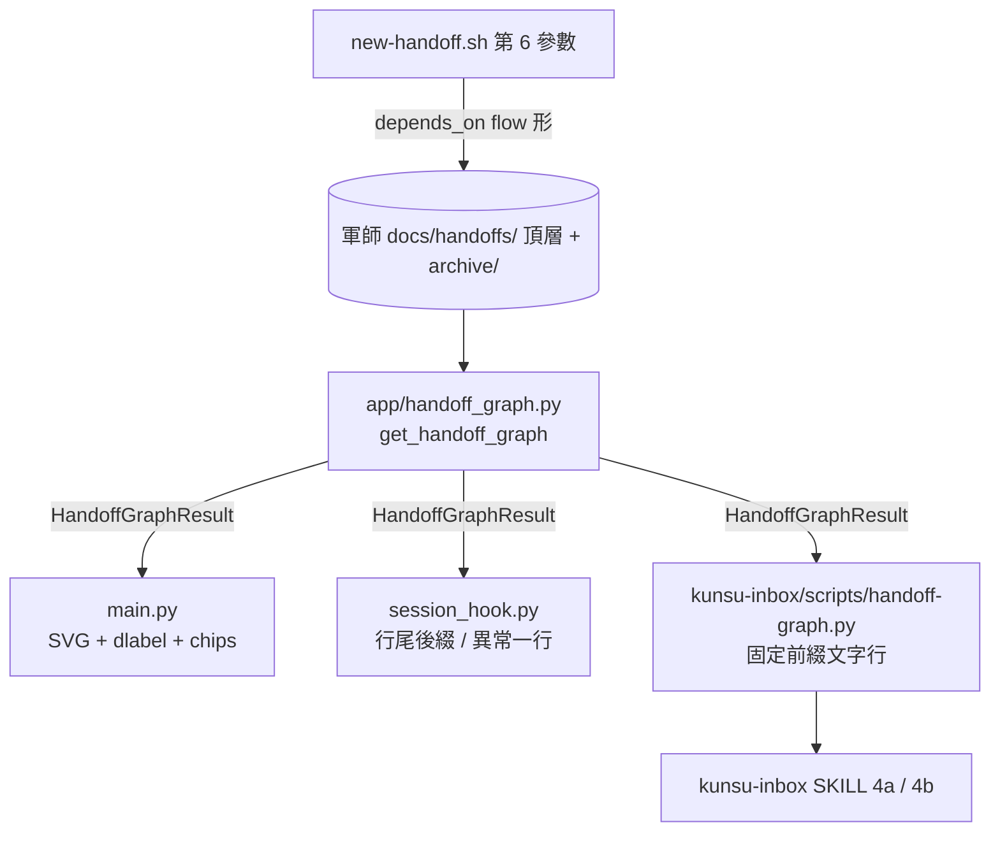

# feat: 交接依賴圖——depends_on 邊、推導態與沙盤 inline SVG

## Summary

交接產檔腳本新增第 6 參數寫入 `depends_on`（flow 形檔名列表）；沙盤 app 新增 `handoff_graph.py` 讀軍師頂層＋archive 本體建圖，推導「可開工」「等依賴」並回報循環、無法解析與異常邊；沙盤每軍師分組內新增伺服器端 inline SVG 依賴圖與每筆標籤，SessionStart hook 摘要附推導態，kunsu-inbox 經新增的 `handoff-graph.py` CLI 呼叫同一模組。ADR 016 補一句修訂註記，範本加一句指路句並走第十一波遷移。營端零改動。

---

## Problem Frame

交接之間的依賴只存在於內文，軍師靠記憶或通讀才知道誰在等誰；營因上游未完成而空等時，沙盤看起來與正常進行無異。現有機制已有節點（交接）、節點狀態（回覆推導）與呈現面（沙盤、hook、kunsu-inbox），缺的只有邊與由邊推導的兩個狀態。完整框架見 origin（[docs/brainstorms/2026-09-08-handoff-dependency-dag-requirements.md](../brainstorms/2026-09-08-handoff-dependency-dag-requirements.md)）。

研究揭露三個 origin 未涵蓋的事實，本計畫據以調整：沙盤 `subrepo_status.py` 與 hook 完全不掃 `archive/`、不讀本體 `status`，done 節點判定是全新行為；kunsu-inbox 子 repo 模式是模型手工 Glob／Read，沒有腳本呼叫點；ebook archive 有 3 份 2026-07-10 手動歸檔遺留 `status: open`。

---

## Requirements

R-IDs 沿用 origin（R1–R20）。三處依裁決修訂：R7 的「可派工」改稱「可開工」；R13 補「孤立節點（無入邊無出邊）不印推導態」，使 AE6 成立；R10／R19 的 kunsu-inbox 載體定為新增 CLI。新增：

- R21. ADR 016 補修訂註記：Decision 2「不進任何比對邏輯」為新欄位擴張判準，既有 `status` 作生命週期事實可供推導讀取；`depends_on` 為建檔時的定案快照內容，非 ADR 016 欄位。
- R22. 推導態只看直接邊：全部直接依賴的本體 `status: done` → 可開工；任一非 done → 等依賴；循環為 advisory 標記，不另立狀態，不影響環外節點。
- R23. 無法解析的邊（不存在、指向回覆檔、非字串元素）推導為等依賴並標記；指向自己的邊忽略不入推導、列入循環回報；重複檔名去重；純量值容錯為單元素列表。
- R24. 更正交接為普通節點、自帶完整新依賴；原本體的邊不變，節點以 `corrected_by` 加 display 註記，不進推導。
- R25. 活節點＝本體非 done 且至少有一條邊（出邊、入邊或無法解析邊）的節點；孤立的 open 本體不畫、不計入門檻。SVG 畫活節點與其直接 done 上游；活節點超過 8 個時該軍師的圖區塊降級為文字清單。
- R26. 上游 done 解鎖下游時不推播，由 hook 與沙盤兜底。

---

## Key Technical Decisions

- **活節點只算有邊的節點。** 三 live 軍師頂層 open 本體現為 33／13／9 份，若以「本體非 done」計數，SVG 在任何 live 軍師都會因超過 8 筆而降級，主要交付物零觸及；限定「有邊」後，圖只含實際宣告過依賴的子圖，與「孤立節點不印」裁決同構。
- **依賴滿足判準＝本體 `status: done`，位置無關。** 值域實際只有 `open`（產檔）與 `done`（done 收尾），頂層已 Edit 為 done 尚未 `git mv` 的中間態視為滿足；archive 內非 done 標「已歸檔未標 done」異常，不視為滿足。位置判準會把 ebook 三份遺留算滿足、把中間態算未滿足，兩者在 live 資料實際分歧。
- **推導只看直接邊，不算傳遞閉包。** 環上節點皆非 done 自然互等，環外下游自然等依賴，循環偵測因此只是標記；避免第三種推導態與環外節點的特殊規則。
- **新模組自持 frontmatter 解析，解析失敗顯式回報。** `subrepo_status._parse_frontmatter` 對 `safe_load` 失敗回空 dict 屬靜默，會把寫壞的 `depends_on` 當「無依賴」，與 R15 衝突；比照 `todo_status.py` 各持一份解析的既定慣例，錯誤歸入 `errors`。
- **推導結果以 `{filename: 推導態}` 對照表回傳，`HandoffInfo` 零改動。** `HandoffInfo` 為 frozen dataclass，消費端以檔名查表即可附標籤；沙盤分類與 hook 既有輸出零改動。
- **`depends_on` 採 flow 形單行、置於 `tags:` 之後。** `new-handoff.sh` 查重以 `sed -n '1,12p'` 讀 frontmatter，block 列表寫在 `to:` 之前會把欄位擠出窗口使查重靜默漏檔；flow 形與 `tags` 同型，`yaml.safe_load` 直接得 list，`archive-handoff.sh` 只 `re.sub` status 一行不重排。
- **產檔腳本採第 6 位置參數（逗號分隔）。** 與既有五個位置參數同型，`TO_GIVEN` 以 `$#` 判定的解析方式不變；呼叫端給第 6 參數時前五個須填佔位，SKILL 範例明示。
- **kunsu-inbox 經 CLI 呼叫同一模組。** 新增 `skills/kunsu-inbox/scripts/handoff-graph.py`，比照 `session_hook.py` 推算沙盤路徑並延遲匯入，印固定前綴文字行；4a／4b 各加一行呼叫。否則模型會手算依賴，Ollama 側必失效。
- **推導態標籤只有 ready／waiting 兩種，另加 corrected 與 anomaly 兩個 display 註記。** 不疊加「依賴未齊已回覆」等第三種語意，origin 只界定兩個推導態。
- **標籤與 chips 用獨立 CSS 前綴 `dlabel`。** 既有測試斷言 `'<span class="badge' not in html` 與 `badge-other` 缺席；沿用 2026-07-17 `tlabel` 前綴隔離教訓。
- **`<details>` 錨點新建，id 以軍師目錄名前綴消歧。** 沙盤現無任何 `id=`；同檔名可能跨軍師重複。
- **hook 軍師模式只印異常一行。** 維持「只告知」定位；子專案模式在既有行尾附推導態，不新增分類。
- **範本指路句一句、第十一波遷移。** 熟練軍師 session 的必經路徑只剩 CLAUDE.md 與腳本本身；指路句只搬名字與權威位置，細節單一副本留 SKILL。遷移套 CONCEPTS「遷移波次」定式（`grep -cF` 恰中一次、diff 當散文審讀、每軍師一筆精確 pathspec commit）。

---

## High-Level Technical Design



推導規則（方向性草圖，非實作規格）：

```text
for node in nodes where node.status != done:
    deps = resolve(node.depends_on)          # 去重、忽略自迴圈、分類 resolved / unresolved
    if not deps and not has_incoming(node):  # 孤立
        derived[node] = None
    elif all(d.status == done for d in resolved) and not unresolved:
        derived[node] = READY                # 可開工
    else:
        derived[node] = WAITING              # 等依賴，附 waiting_on 清單
cycles = tarjan(edges among non-done nodes)  # advisory
```

指向處理表（R23）：

| `depends_on` 元素 | 處理 |
|---|---|
| 同軍師頂層或 archive 本體 | 正常邊；滿足 iff `status: done` |
| archive 內非 done | 正常邊、未滿足；另列異常「已歸檔未標 done」 |
| 頂層與 archive 同名並存 | 取頂層；列異常「重複本體」 |
| 不存在 | 無法解析；該節點等依賴 |
| 命中回覆檔名正則 | 無法解析，訊息專指「指向回覆檔」 |
| 自己 | 忽略不入推導；列入循環回報 |
| 重複 | 去重不回報 |
| 純量字串 | 容錯為單元素列表 |
| 非字串元素 | 該元素為無法解析 |

---

## Implementation Units

### U1. 產檔腳本第 6 參數與 handoff SKILL 字面

- **Goal:** `new-handoff.sh` 接收依賴檔名並寫入 `depends_on`，SKILL add 段與檔案格式範例同步。
- **Requirements:** R1, R2, R3, R4, R19, AE6
- **Dependencies:** 無
- **Files:** `skills/handoff/scripts/new-handoff.sh`、`skills/handoff/SKILL.md`、`skills/kunsu-inbox/SKILL.md`（依賴聲明鏈尾）、`CLAUDE.md`（版號行）
- **Approach:** 第 6 位置參數 `DEPENDS_ON` 逗號分隔；非空時於 `tags:` 行後印 `depends_on: [a.md, b.md]`（元素 trim、去空、去重），缺省不產生欄位。stderr 於查重段前印一行：給參數時「依賴宣告：N 筆」、缺省時「未宣告依賴；有上游交接請以第 6 參數補宣告」。檔頭用法與第 38 行錯誤提示兩處同步補參數。SKILL：指令格式行加 `[depends_on]`；注意段註明元素不得含 `:`、`#`、逗號等 YAML flow 敏感字元（腳本產生的 slug 已去標點，手動命名檔案自行遵守）；add 步驟 1 補「盤點上游交接並宣告依賴」一項；步驟 2 呼叫範例補第 6 參數與佔位說明；更正交接子節補「更正交接自帶完整新依賴，原本體 `depends_on` 不編輯」；檔案格式範例補選填欄位；注意段比照 verify 條目說明 `depends_on`。handoff 版號 0.22.0 → 0.23.0；kunsu-inbox 依賴聲明鏈尾追加「v0.23.0 的 depends_on 確實改變交接本體產出內容（僅給參數時），stdout／掃描慣例／豁免形狀不變」；CLAUDE.md 第 25 行版號同步。
- **Patterns to follow:** `tags` 的 `$tags_yaml` flow 形組裝（第 78–83 行）；查重 stderr advisory 與指路行（第 319 行）；三不變條件註解（第 157–159 行）。
- **Test scenarios:**
  - 給第 6 參數 `a.md,b.md` → frontmatter 含 `depends_on: [a.md, b.md]` 且位於 `tags:` 之後；stdout 仍單行路徑。
  - 缺省 → 無 `depends_on` 行，產出檔與現行逐字一致（Covers AE6）。
  - 參數含空白與重複 `a.md, a.md` → 去重為單元素。
  - `depends_on` 三項時，以同標題再產檔一次，查重本地層仍命中該檔（12 行窗口未被擠出）。
  - `scripts/consistency-check.sh` A1／B／C／J 項全 PASS（C 項單參數實跑不受影響）。
- **Verification:** 暫存 git repo 實跑四場景；consistency-check 全 PASS。

### U2. 沙盤建圖模組 `handoff_graph.py`

- **Goal:** 單一模組讀頂層＋archive 本體建圖，推導可開工／等依賴，回報循環、無法解析與異常。
- **Requirements:** R5, R6, R7, R8, R9, R10, R22, R23, R24, AE1, AE2, AE4, AE5, AE7
- **Dependencies:** 無（可與 U1 並行）
- **Files:** `skills/kunsu-dashboard/app/handoff_graph.py`（新）、`skills/kunsu-dashboard/tests/test_handoff_graph.py`（新）
- **Approach:** 入口 `get_handoff_graph(kunsu_path) -> HandoffGraphResult`（frozen）。節點：`filename, title, to_role, status, location(top/archive), depends_on, corrected_by`（`corrected_by` 為 `tuple[str, ...]`：純量容錯為單元素、list 逐元素 `str()`、非字串元素歸 `errors`——ebook archive 已有兩份本體為兩元素 block 列表）；本體判定用「有 `title/from/to` 且不在 `replies/`」而非 `type: handoff`（沙盤既有 fixture 無 `type:`）。結果欄位：`nodes`、`edges`、`active_nodes`（有邊且非 done 的檔名集合，供渲染端直接取用）、`derived: {filename: "ready"|"waiting"}`（孤立節點不入表）、`waiting_on: {filename: [檔名]}`、`unresolved: [(from, target, reason)]`、`cycles: [[檔名]]`、`anomalies: [(filename, kind)]`、`errors: [ErrorItem]`。目錄不存在回空結果不報錯。目錄內每個 `.md` 先以檔名建節點；frontmatter 解析失敗或缺 `title/from/to` 者記入 `errors` 且節點 status 視為未知（不滿足依賴），指向它的邊為已解析但 waiting，不落入 `unresolved`；`depends_on` 型別錯誤歸 `errors`，不靜默。匯出常數 `DERIVED_READY`／`DERIVED_WAITING` 供消費端避免裸字串。
- **Patterns to follow:** `todo_status.py` 的模組結構（frozen dataclass、入口簽名、目錄缺席回空、`KNOWN_*` 常數匯出）；`subrepo_status.py` 的回覆檔名正則（第 26 行）與 frozen 建構慣例；`todo_status.py:171-174` 的 `is None` 欄位存在判斷。
- **Test scenarios:**
  - Covers AE1. B 依賴 A，A 在 archive 且 done → B 為 ready。
  - Covers AE2. A 在頂層 open、B 依賴 A → B 為 waiting，`waiting_on[B] == [A]`。
  - 頂層 A 已 Edit 為 done 未 mv → 依賴 A 的 B 為 ready（中間態）。
  - archive 內 A 為 open → B 為 waiting，`anomalies` 含 (A, archived_not_done)。
  - Covers AE4. A↔B 循環 → `cycles` 含兩檔名；A、B 皆 waiting；不在環上、依賴已 done 節點的 C 仍 ready。
  - Covers AE5. B 依賴不存在檔名 → `unresolved` 含 (B, 目標, not_found)，B 為 waiting；B 其餘已 done 依賴仍正常計入。
  - 指向回覆檔名 → reason 為 reply_file。
  - 自迴圈 → 邊不入推導，`cycles` 含單元素。
  - 重複檔名 → `edges` 去重；純量 `depends_on: a.md` → 視為單元素；元素為整數 → unresolved reason bad_type。
  - 全部節點無 `depends_on` → `derived` 為空 dict，`edges` 為空（Covers AE6）。
  - 33 份孤立 open 本體＋一條 B→A 邊 → `active_nodes` 僅含 A、B 兩檔名。
  - 頂層與 archive 同名 → 取頂層，`anomalies` 含 duplicate。
  - frontmatter 縮排寫壞 → `errors` 一筆，其餘節點照常；B 依賴該壞檔 → B waiting、`unresolved` 不含該檔。
  - `docs/handoffs/` 不存在 → 空結果、無錯誤。
  - 更正交接 Y 帶 `depends_on: [C]`、B 帶 `corrected_by: Y` → B 的邊不變，Y 為普通節點（Covers AE7）。
  - B 的 `corrected_by` 為兩元素 block 列表 → 節點 `corrected_by` 為兩元素 tuple，無錯誤。
- **Verification:** 新測試全過；既有 176 項零回歸。

### U3. 沙盤渲染：inline SVG、標籤、錨點與 chips

- **Goal:** 每軍師分組內新增依賴圖區塊，清單每筆附推導態標籤，節點連結至展開明細，總覽列非零才顯示等依賴與循環計數。
- **Requirements:** R11, R12, R13, R15, R24, R25, AE3, AE6
- **Dependencies:** U2
- **Files:** `skills/kunsu-dashboard/app/main.py`、`skills/kunsu-dashboard/tests/test_main.py`
- **Approach:** `index()` 軍師正常分支呼叫 `get_handoff_graph` 一次，結果傳入 `_html_subrepo`／`_html_handoff_detail`（以檔名查 `derived`）與新函式 `_html_dependency_graph`。圖區塊置於軍師卡與待辦區塊之間，`<details>` 折疊、預設展開當且僅當存在等依賴或循環或無法解析。SVG：以 U2 的 `cycles`（Tarjan SCC）縮點後的 DAG 做 longest-path 分欄，同一 SCC 的節點置同一欄、SCC 內的邊不參與層級計算只畫並標紅；同欄等距、直線或折線邊；節點依本體狀態上色（done 灰、其餘依既有分類色）、等依賴描邊、循環紅、無法解析虛線邊；節點外包 `<a href="#<軍師目錄名>--<檔名去 .md>">`；`_html_detail` 加選填 `anchor_id` 參數，id 掛在 `<summary>` 內的 `<span id=…>` 而非 `<details>` 本身（目標為 `<details>` 的後代時瀏覽器才會自動展開）。活節點（`active_nodes`）超過 8 個時改印文字清單（節點→依賴、推導態）。無任何邊時區塊印一行「無依賴宣告」而非整段消失（靜默單義化）。標籤 `dlabel dlabel-ready`／`dlabel-waiting`／`dlabel-corrected`／`dlabel-anomaly`，置於 `_html_status_badges` 回傳串之後、與 ⛔ 並列；孤立節點不加標籤。`_html_overview` 新 chips「等依賴 N」「⟳ 循環 M」「依賴無法解析 K」用 `chip` 既有樣式但 class 名前綴 `chip-dep-*`。`PendingAggregate` 不改。
- **Patterns to follow:** `_html_todo_section` 的區塊與解析錯誤呈現；`_html_overview` 零值不渲染；`_CSS` 三前綴分離；`test_main.py` 的 `_client_with_kunsu_only` 與純子字串斷言；`_html_awaiting_confirm_item` 提示置於 `<details>` 外。
- **Test scenarios:**
  - 一軍師兩交接 B 依賴 A（A open）→ HTML 含 `<svg`、兩個 `<a href="#...--">` 錨點、B 摘要列含 `dlabel-waiting`，總覽含「等依賴 1」。
  - Covers AE3. B 最新回覆 blocked 且等依賴 → 同時含 `badge-blocked` 與 `dlabel-waiting`。
  - Covers AE6. 全部交接無 `depends_on` → 既有斷言全過，頁面不含 `dlabel-`，圖區塊含「無依賴宣告」。
  - 循環 → 含 `<svg`、環內兩節點同欄、循環提示文字與兩檔名；總覽含「循環 1」；渲染於有限時間內完成。
  - 無法解析 → 提示含目標檔名與原因文字。
  - 九個有邊的活節點 → 不含 `<svg`，含文字清單；另有 30 個孤立 open 本體時仍以九個計算。
  - `corrected_by` 節點 → 含 `dlabel-corrected` 與更正檔名；兩元素列表時逐檔名列出。
  - 同檔名跨兩軍師 → 兩錨點 id 不同。
  - 既有負向斷言（`badge` 缺席、`tlabel` 計數）零回歸。
- **Verification:** pytest 全過；真實啟動伺服器對 ebook／ivm／px 三軍師 curl 頁面，檢視 SVG 可讀且錨點可跳。

### U4. SessionStart hook 推導態摘要

- **Goal:** 子專案模式每筆行尾附推導態，軍師模式新增異常一行。
- **Requirements:** R10, R14, R15, AE2
- **Dependencies:** U2
- **Files:** `skills/kunsu-inbox/scripts/session_hook.py`、`skills/kunsu-inbox/tests/test_session_hook.py`
- **Approach:** `_sub_mode_lines` 延遲匯入 `get_handoff_graph`，對每筆以檔名查 `derived`：ready 附「可開工」、waiting 附「等依賴：A.md, C.md」；孤立不附。等依賴件不改分類排序。`_kunsu_mode_lines` 當 `cycles`／`unresolved`／`anomalies` 非空時加一行「⚠ 依賴圖異常：循環 N／無法解析 M／已歸檔未標 done K」，全空不印。建圖呼叫自帶 try/except：失敗時該軍師段補一行「⚠ 依賴圖不可用（<例外類別>）」，其餘分類行照常輸出，不交給 `main()` 外層降級吞掉整份摘要。
- **Patterns to follow:** `_reply_annotated` 的行格式；`_capped` 上限；`hook_state_isolation` autouse fixture；`_write_handoff` 加 `depends_on` 參數。
- **Test scenarios:**
  - Covers AE2. 子專案 B 依賴 open 的 A → 輸出含 `B.md（created …）等依賴：A.md`。
  - A done 於 archive → 含「可開工」。
  - 無 `depends_on` → 輸出與現行逐字一致。
  - 軍師模式循環 → 含「依賴圖異常」行；無異常 → 不含。
  - 建圖拋例外 → 仍含「未接手」等既有行，另含「依賴圖不可用」提示行，exit 0。
- **Verification:** hook 測試全過（18 → 約 23）。

### U5. kunsu-inbox CLI `handoff-graph.py` 與 SKILL 呼叫形

- **Goal:** 模型不手算依賴；4a／4b 各以一行呼叫取得推導文字。
- **Requirements:** R10, R14, R15, R19, R20
- **Dependencies:** U2
- **Files:** `skills/kunsu-inbox/scripts/handoff-graph.py`（新）、`skills/kunsu-inbox/tests/test_handoff_graph_cli.py`（新）、`skills/kunsu-inbox/SKILL.md`、`CLAUDE.md`（專案結構行）
- **Approach:** 用法 `python3 handoff-graph.py <kunsu_path> [--role <角色代碼>]`；輸出固定前綴行：`DEP:<檔名>\t<ready|waiting>\t<waiting_on 逗號>`、`DEP_CYCLE:<檔名,…>`、`DEP_UNRESOLVED:<檔名>\t<目標>\t<原因>`、`DEP_ANOMALY:<檔名>\t<kind>`、`DEP_ERROR:<訊息>`；`--role` 時 `DEP:` 行只列 `to:` 為該角色者；零輸出時印 `DEP_NONE`。失敗印 `DEP_ERROR` exit 0（advisory）。SKILL 4a-3 後加 4a-3b「執行 handoff-graph.py 取推導態」，4a-5 三張表各加「依賴」欄；4b 加第四段「依賴圖摘要」（獨立於 4b-3 tripwire 停止規則之外，圖讀檔不讀 git）。Agent 對應表零改動：呼叫形為 `python3 <skill 目錄>/scripts/…`，兩 agent 相同，計畫明寫此判斷。kunsu-inbox 版號 0.12.0 → 0.13.0（4a／hook 行為變動）。SKILL 字面須通過 consistency-check L 項（不裸出斜線形）。
- **Patterns to follow:** `session_hook.py` 的 `_DASHBOARD_ROOT` 推算與延遲匯入；`kunsu_scan.py` 固定前綴解析契約；SKILL 4b 呼叫腳本的段落寫法。
- **Test scenarios:**
  - 暫存軍師含依賴 → stdout 含 `DEP:B.md\twaiting\tA.md`。
  - `--role backend` → 只列 to: backend 的行。
  - 無依賴 → 單行 `DEP_NONE`。
  - 目錄不存在 → `DEP_NONE`，exit 0。
  - 沙盤模組匯入失敗（以 subprocess 執行複製到暫存目錄的腳本，使路徑推算落空）→ `DEP_ERROR` 行、exit 0。
- **Verification:** 測試全過；consistency-check E／L／M 項 PASS。

### U6. 文件與檢查面：ADR 016 註記、CONCEPTS、範本指路句、consistency-check

- **Goal:** 憲章與機制字面一致，副本受機械檢查罩住。
- **Requirements:** R18, R21, R24
- **Dependencies:** U1–U5（版號、模組名與測試數定案）
- **Files:** `docs/adr/2026-08-14-adr-candidate-016-lifecycle-metadata-boundary.md`、`CONCEPTS.md`、`skills/kunsu-init/assets/templates/kunsu-claude.md`、`skills/kunsu-init/assets/templates/kunsu-concepts.md`、`skills/kunsu-init/SKILL.md`（版號）、`scripts/consistency-check.sh`、`CLAUDE.md`、`docs/README.md`
- **Approach:** ADR 016 Decision 2 後加「修訂註記（2026-09-08）」一段（R21 文字）。母體 CONCEPTS「交接依賴圖」詞條：可派工→可開工、補「孤立節點不印」「推導只看直接邊」「更正交接零覆蓋」。範本 `kunsu-claude.md` 工作流程第 5 步條列加一句「有上游交接時以第 6 參數宣告 `depends_on`，推導規則見 handoff SKILL add 段」；`kunsu-concepts.md` 新增「交接依賴圖」詞條（自母體裁剪）。kunsu-init 0.9.0 → 0.9.1。consistency-check：H 鏈追加 `depends_on`（CLAUDE.md 與 CONCEPTS.md 雙檔）；A1 版號鏈自動涵蓋；新增檢查項 P？——不做，改在 C 項 fixture 內以第 6 參數實跑一次斷言 `depends_on:` 行存在且位於 `tags:` 之後。CLAUDE.md 專案結構補 `handoff_graph.py`、`handoff-graph.py`、修正測試數；`docs/README.md` 技能對照視需要一句。
- **Patterns to follow:** ADR 011 排序規格修訂註記的寫法；H 鏈追加字串先例（`archive-todo`）；C 項 mktemp fixture。
- **Test scenarios:** Test expectation: none -- 純文件與檢查腳本；以 consistency-check 全項 PASS 與負向測試（暫時移除範本指路句 → H 項 FAIL，以反向 sed 還原）驗證。
- **Verification:** consistency-check 全 PASS（H 鏈新字串於 U7 遷移前對三 live 軍師為 WARN，屬預期）；負向測試命中。

### U7. Dogfooding 與第十一波遷移

- **Goal:** 端到端實證，三 live 軍師同步範本句。
- **Requirements:** R16, R17, R18, R26 與全部 AE
- **Dependencies:** U1–U6
- **Files:** 三 live 軍師 `CLAUDE.md`、`CONCEPTS.md`（本 repo 外，遷移波次）；`install.sh` 重佈署
- **Approach:** 暫存目錄建軍師＋兩子專案：依序驗證產檔帶依賴、`scan-replies.sh` 對含 `depends_on` 的頂層本體零新警示、`archive-handoff.sh` 歸檔後 `depends_on` 行存活、hook 與 CLI 輸出、沙盤頁面；異常場景含 archive 內 open、指向回覆檔、自迴圈、Edit-done 未 mv、`depends_on` 三項查重命中。遷移：範本指路句與 kunsu-concepts 詞條以 python3 對三 live 逐字替換，錨行 `grep -cF` 恰中一次才動，diff 當散文審讀，每軍師一筆 `git add -- <檔> && git commit -m "…" -- <同組檔>`，工作區未 commit 回覆原封不動。R26 不推播列於 Scope。
- **Patterns to follow:** CONCEPTS「遷移波次」定式；`docs/solutions/workflow-issues/literal-replacement-residue-and-review-triage.md`。
- **Test scenarios:** Test expectation: none -- 以 dogfooding 斷言清單（約 25 項）記錄於實作回報。
- **Verification:** 斷言全過；三軍師各一筆確認 commit；`install.sh` 重佈署後 `~/.claude/skills/` 與 `~/.agents/skills/` 兩樹含新腳本。

---

## Scope Boundaries

- 不建靜態營拓撲檔、不建模交接以下粒度、不支援跨軍師依賴（origin）。
- 不採 Mermaid／Graphviz；Graphviz 輸出列為日後可選升級。
- 不新增回覆 `status` 值、不新增觸發詞、掃描腳本與 tripwire 零改動。
- 上游 done 不推播解鎖（R26）。
- `corrected_by` 不進推導；`depends_on` 不進 ADR 016 白名單，事後不編輯。
- 沙盤 `PendingAggregate` 與分組強制展開規則不改（等依賴不觸發強制展開）。

### Deferred to Follow-Up Work

- 派發即推播訊息附「本交接等依賴」提示（M-3）。
- HOME dataview 交接表加 `depends_on` 欄。
- consistency-check P 項（替換正確性）仍未實作，本輪遷移靠散文審讀。
- 活節點超過 8 個的排版升級（Graphviz 軟依賴）。

---

## Open Questions

**Deferred to Implementation**

- SVG 分層排版的具體幾何（節點寬高、折線規則）以三軍師實況調整。
- hook 子專案模式的 `waiting_on` 列表超過 3 筆時是否截斷。
- `handoff-graph.py` 是否需 `--json`：不需，ADR 010 精神下 CLI 面向模型閱讀，固定前綴行已足。

---

## System-Wide Impact

- **讀檔範圍新增**：沙盤與 hook 首次讀 `archive/` 本體（ebook 221 份）；每次刷新或 session 啟動多一次目錄走訪與 frontmatter 解析，預估毫秒級，hook 仍 fail-open。
- **憲章字面**：ADR 016 修訂註記為唯一憲章觸碰；Invariant 1／2／5 零改動。
- **版號鏈**：handoff 0.23.0、kunsu-inbox 0.13.0、kunsu-init 0.9.1；A1／A2 機械檢查涵蓋。
- **副本清點**：`depends_on` 語意出現於 handoff SKILL（權威）、`new-handoff.sh` stderr 行、kunsu-inbox 依賴聲明、母體 CONCEPTS、範本 kunsu-claude 指路句、範本 kunsu-concepts 詞條、ADR 016 註記；除 SKILL 外皆指回。

---

## Risks & Dependencies

- **archive 遺留 open**：ebook 三份會持續列異常；屬資料修正（補 `status: done`，archive 內為靜默略過分支），列入 U7 遷移時順手處理，另案不阻塞。
- **kunsu-inbox 4a 呼叫形觸及率**：4a 是模型手工流程，CLI 只在 skill 被呼叫時被讀到；hook 與沙盤為兜底。
- **既有測試對 `/fake/kunsu` 實跑**：`test_main.py` 未 patch 新函式，模組對不存在目錄須回空結果，否則 64 項連鎖失敗。
- **Codex 試點**：Codex 額度 2026-10-06 重置前無法實測 CLI 在 Codex 側；呼叫形與 session_hook 同型，風險低。

---

## Sources / Research

- `skills/handoff/scripts/new-handoff.sh:26-34, 78-108, 154-159, 178-203, 319` — 參數、frontmatter 組裝、stdout 契約、查重 12 行窗口、指路行。
- `skills/kunsu-dashboard/app/subrepo_status.py:26, 85-141, 226-228, 299-310` — 回覆檔名正則、frontmatter 解析靜默、頂層 only、分類。
- `skills/kunsu-dashboard/app/main.py:116-173, 259-268, 319-348, 405-414, 460-507, 872-1017` — CSS 前綴、`_html_detail`、標籤、聚合、頁面組裝。
- `skills/kunsu-dashboard/app/todo_status.py` — 獨立掃描模組先例。
- `skills/kunsu-inbox/scripts/session_hook.py:47, 118-122, 143, 187, 273-293` — 沙盤路徑推算、延遲匯入、fail-open。
- `skills/kunsu-inbox/SKILL.md:125-253, 543-556` — 4a 結構與依賴聲明鏈。
- `skills/handoff/scripts/archive-handoff.sh:261-275` — status Edit 只換一行。
- `docs/adr/2026-08-14-adr-candidate-016-lifecycle-metadata-boundary.md` Decision 2–5。
- `docs/solutions/workflow-issues/assertion-level-discipline-coverage-gap.md`、`handoff-intercept-point-selection.md`、`literal-replacement-residue-and-review-triage.md`、`handoff-done-closure-gap.md`。
