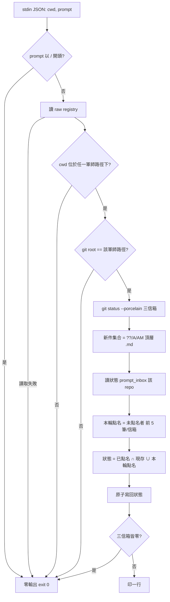

# 軍師提問時三信箱新件提示 - Plan

## Goal Capsule

- **Objective**：軍師 session 在自己動手做任何事之前，已經知道信箱裡有等它讀的新件——不依賴使用者記得執行 kunsu-inbox skill，也不依賴回覆方有沒有走 handoff skill。
- **Means**：在軍師 repo 掛一支 UserPromptSubmit hook，每次使用者提問時對三信箱做一次 git status 級的差分掃描，有新件就注入一行純文字（KTD1、KTD2）。
- **Product authority**：本計畫只認領「迴圈補 inspect 訊號」這一個範圍。同一輪評估提出的另外兩個方向（「還缺什麼」視圖、範本第 3 步降為條件式總表）不是 active scope，見 How This Work Fits Together。
- **Authority hierarchy**：Product Contract 的 R-ID 決定產品行為；Planning Contract 的 KTD 決定實作機制；單元不得改寫兩者。
- **Stop conditions**：研究發現任一 session-settled 決策無法成立時停下回報；掛載機器層級設定（settings.json、hooks.json）一律由使用者執行，實作 session 不代寫。
- **Execution profile**：單一 repo、純 python3 stdlib、無新依賴；hook 全程唯讀、fail-open。
- **Tail ownership**：機器層級掛載、install.sh 重佈署、Codex 側實測（R11）由使用者在 U6 逐項授權後執行；commit 由使用者明確要求時才執行。
- **Open blockers**：無。

**Product Contract preservation**：changed: R4 — 補「未點名者於後續提問輪替列名」一句，使每份新件恰被點名一次（澄清首次列名語意，非範圍變更）；新增 AE7–AE9 涵蓋流程分析抓出的三個邊界。其餘 R、A、F、AE 內容與 ID 不變。

---

## Product Contract

### Summary

軍師 session 每收到一句使用者提問，就以一行告知回覆、上報、申請三個信箱有多少未歸檔新件；新件第一次出現時列出檔名，之後只計數。純資訊補全、不擋任何動作、fail-open。

### Problem Frame

2026-09-23 書城正式環境切換：軍師 11:43 派發交接給 store-nginx（派發即推播成功），11:44 使用者一句「備份好了就繼續」後軍師開始改正式 `.env`。11:50 至 11:52 store-nginx session 以 Write 直接建立兩份回覆檔——未呼叫 handoff skill、未跑產檔腳本、零 SendMessage——「回覆即推播」因此根本沒觸發。13:08 使用者對軍師說「可以重啟了」，13:09 全站 API 回 502；成因、修法與連帶範圍全寫在那份躺了 77 分鐘沒被讀的回覆裡。軍師直到 14:18 執行 kunsu-inbox skill 才看到三份新回覆。

事故揭露兩個結構性事實。第一，軍師側現有的抵達訊號（SessionStart hook、回覆即推播）都不落在「派發之後、動手之前」這個時點：前者只在 session 啟動時跑，後者依賴回覆方走 skill。第二，「未 commit」不等於「未讀」——協議上回覆檔投遞後維持未 commit 直到軍師 done 歸檔，ebook 軍師此刻頂層就有 16 份未 commit 回覆，任何「每次提問列全名」的做法都會立刻變成雜訊。

ebook 軍師自己的 todo 亦已記錄「推播只覆蓋回覆信箱，上報與申請在長駐 session 中無抵達訊號」（`docs/todos/` 頂層，status 未處理），與本案是同一個缺口的另外兩個信箱。

### Key Decisions

- **掛使用者提問事件，不掛執行動作前、不補回覆側** (session-settled: user-directed — chosen over PreToolUse 對 ssh／rsync／deploy 等指令的執行前掃描，以及讓回覆即推播不依賴 skill 呼叫: 提問是使用者自己的動作，與 ADR 014 對事件驅動的定義同類；對回覆方走不走 skill 一律生效；不跨 ADR 017「提醒→阻止」線；執行動作清單無法機械窮舉). Governs R1, R2.
- **首次列檔名，之後只計數** (session-settled: user-approved — chosen over 只提示一次、每次列全檔名: 只提示一次會在忙碌對話中被跳過後永久消失，重演 9/23；每次列全名在 ebook 常態 16+ 份未歸檔回覆下立刻成為雜訊). Governs R4, R5, R7.
- **三信箱一起掃，tripwire 不在此列** (session-settled: user-approved — chosen over 只掃回覆信箱、三信箱加 tripwire: 同一次 git status 已看到三信箱，順手補掉上報與申請無抵達訊號的既有缺口；tripwire 是「停下來處理」級訊號，每句提問都印會把它降成背景雜訊). Governs R3.
- **只做軍師側** (session-settled: user-approved — chosen over 子專案側對稱一併做: 軍師側一次 git status 即可，子專案側需讀軍師 repo 頂層交接 frontmatter 並推導分類，每句提問成本高一階，先以軍師側驗證「每次提問一行」的噪訊比). Governs R1.
- **憲章落點採 ADR 014 修訂註記，不另立 ADR** (session-settled: user-approved — chosen over 新 ADR: 本 hook 與 SessionStart hook 同屬使用者動作觸發的事件驅動通道，無定時器、無背景監聽，屬同類擴張). Governs R9.
- **資訊補全，不強制行為**。本 hook 只讓訊號抵達，「沒把握的問題答案回來前不執行到那一步」仍是 session 的判斷，留在 ebook solution 文字層，不做成阻止機制（harness 不做枷鎖前提）。

### Requirements

**觸發與身分**

- R1. hook 只在當前 repo 為軍師（依全域註冊表判定）時輸出；子專案 repo 與未登記 repo 零輸出。
- R2. 觸發面為使用者提問事件，每次執行一次確定性掃描；無定時器、無背景程序、不呼叫 LLM、全程唯讀。

**輸出內容**

- R3. 掃描範圍為回覆、上報、申請三個信箱頂層的未 commit 新件；tripwire 與歷史夾帶警示不在本 hook 輸出範圍。
- R4. 本次首次出現的新件列出檔名，每個信箱列名有上限，超過以「另有 N 份」收尾；未點名者於後續提問輪替列名，使每份新件恰被點名一次。
- R5. 已提示過的新件只計入計數；輸出固定一行，依信箱分項計數；三信箱皆無新件時零輸出。
- R6. 訊息自足且中性：一行告知加一句指向 kunsu-inbox skill 查看完整清單，不要求動作、不對交接內容下判斷。

**狀態**

- R7. 「已提示過」狀態為機器層級、依軍師 repo 分開保存，不進任何 repo；新件歸檔或消失後自狀態中清除。
- R8. fail-open：任何錯誤零輸出並以 exit 0 結束；執行成本為 git status 級，不讀取檔案內文。

**憲章與部署**

- R9. kunsu-inbox SKILL.md 授權邊界第 2 條「不主動輪詢」的例外字面同步涵蓋本 hook；ADR 014 補修訂註記記錄此擴張。
- R10. 掛載為機器層級設定（Claude Code settings.json、Codex hooks.json），SKILL.md 提供掛載片段與解除說明；腳本隨 kunsu-inbox skill 既有部署路徑散布。
- R11. 同一支腳本在 Claude Code 與 Codex 皆以純文字 stdout 注入 context；Codex 本機版本的 UserPromptSubmit 事件以實跑驗收。

### Actors

- A1. 軍師 session：使用者與 agent 共處的長駐 session，是本 hook 的唯一輸出對象。
- A2. 回覆方 session：子專案 session 投遞回覆、上報或申請的一方；本計畫不改其任何行為。
- A3. hook 腳本：使用者提問事件觸發、唯讀、無狀態以外的副作用。

### Key Flows

- F1. 新件首次出現
  - **Trigger:** 使用者在軍師 session 送出一句提問，且三信箱任一有尚未提示過的未 commit 新件。
  - **Actors:** A1, A3
  - **Steps:** hook 判定身分為軍師 → 掃三信箱頂層未 commit 新件 → 與已提示狀態差分 → 新件列檔名、其餘計數 → 一行注入 → 狀態更新。
  - **Outcome:** 使用者那句提問的 context 帶著新件檔名。
  - **Covered by:** R1, R3, R4, R5, R7

- F2. 後續提問
  - **Trigger:** 同一 session 再次提問，新件未歸檔且無更新的新件。
  - **Steps:** 掃描 → 差分無新 → 只輸出計數一行。
  - **Outcome:** 常態一行，不重列檔名。
  - **Covered by:** R5

- F3. 歸檔後
  - **Trigger:** 軍師 done 歸檔或手動歸檔後再提問。
  - **Steps:** 掃描 → 頂層無未 commit 新件 → 零輸出 → 狀態自清。
  - **Outcome:** 信箱清空時 hook 靜默。
  - **Covered by:** R5, R7

- F4. 非軍師 repo 或錯誤
  - **Trigger:** 使用者提問以 `/` 開頭（斜線指令）、子專案 repo、未登記目錄、註冊表損壞、git 不可用。
  - **Outcome:** 零輸出，exit 0。
  - **Covered by:** R1, R8

### Acceptance Examples

- AE1. 9/23 重播
  - **Covers R1, R3, R4.**
  - **Given** 軍師 repo 的回覆信箱頂層剛出現一份未 commit 的 store-nginx 回覆，且該檔尚未被本 hook 提示過。
  - **When** 使用者送出「可以重啟了」。
  - **Then** 該句提問的 context 含一行，內含該回覆檔名與「回覆 1 份」計數。

- AE2. 常態計數
  - **Covers R5.**
  - **Given** AE1 之後，三信箱新件無變化。
  - **When** 使用者再送出任何提問。
  - **Then** 只出現一行分項計數，不再列檔名。

- AE3. 三信箱與上限
  - **Covers R3, R4, R5.**
  - **Given** 回覆信箱 16 份未提示新件、上報 1 份、申請 0 份。
  - **When** 使用者連續提問五次。
  - **Then** 第一次回覆列名 5 筆並以「另有 11 份」收尾、上報列 1 份檔名、申請不出現，分項計數為 16／1；第二、三次各再點名 5 筆，第四次點名最後 1 筆；第五次起只剩計數行。

- AE4. 歸檔清零
  - **Covers R5, R7.**
  - **Given** 所有新件已歸檔 commit。
  - **When** 使用者提問。
  - **Then** 零輸出，且狀態中對應條目已清除。

- AE5. 身分與 fail-open
  - **Covers R1, R8.**
  - **Given** 在子專案 repo，或註冊表 JSON 損壞。
  - **When** 使用者提問。
  - **Then** 零輸出、exit 0，提問正常送出。

- AE6. tripwire 不入此行
  - **Covers R3.**
  - **Given** 信箱目錄有授權範圍外的變更（tripwire 形狀），無新件。
  - **When** 使用者提問。
  - **Then** 本 hook 零輸出；tripwire 由 kunsu-inbox skill 與 SessionStart hook 呈現。

- AE7. 新件與 tripwire 併存
  - **Covers R3, R4.**
  - **Given** 同一次掃描既有一份未 commit 新回覆，又有一份已 commit 回覆被修改。
  - **When** 使用者提問。
  - **Then** 新回覆照常列名與計數；被修改的回覆完全不出現在本 hook 輸出。

- AE8. 同資料夾雙 session
  - **Covers R7.**
  - **Given** 兩個 session 以 `kc --slot` 開在同一軍師資料夾，信箱有一份新回覆。
  - **When** A 視窗先提問，B 視窗稍後提問。
  - **Then** A 看到檔名，B 只看到計數。此為預期行為，多 session 分頭作業時以 kunsu-inbox skill 查完整清單。

- AE9. 直接 commit 未歸檔（已知限制）
  - **Covers R3.**
  - **Given** 一份新回覆被直接 `git commit` 進 HEAD 而未經歸檔腳本搬進 archive/。
  - **When** 使用者提問。
  - **Then** 本 hook 對該檔靜默，狀態條目自清。此為「未 commit 即未處理」訊號模型的共同限制，由 scan-replies.sh 的歷史夾帶偵測兜底，本 hook 不另做偵測。

### Success Criteria

- 以 9/23 兩側 session 紀錄重播，軍師在 13:08 提問時已能看到 store-nginx 回覆檔名。
- 每次提問的額外延遲對使用者不可感，且不隨頂層未歸檔件數線性增長；非軍師 repo 的快退不啟動任何 git 子程序。
- 在 ebook 軍師現況（16 份回覆、1 份上報）下，第五次提問起輸出恆為一行。

### Scope Boundaries

- 子專案側對稱提示（子專案 session 收到指向本角色的新交接）——先觀察軍師側噪訊比再評估。
- tripwire 與歷史夾帶警示的每句提示——維持由 kunsu-inbox skill 與 SessionStart hook 呈現。
- 「還缺什麼」視圖與範本第 3 步降為條件式總表——同一輪評估的另外兩個方向，已記為 idea，另案。
- 回覆側動機無關推播——hook 無法跨 session 發訊，且本案已由軍師側覆蓋。
- 「沒把握的問題答案回來前不執行到那一步」的判斷型規範——留在 solution 文字層。
- 三支 scan 腳本的輸出契約與 exit code 零改動。

### Deferred to Follow-Up Work

- 三支 scan 腳本統計寫入的並發防護與 archive 腳本複製體收斂（既列於 CLAUDE.md 後續評估），本計畫的狀態檔寫入沿用同一 advisory 容忍度，不順手重構。
- Codex 側既有 SessionStart 與 PreToolUse 兩支 hook 本機尚未掛載；U6 只為 R11 驗收補掛，不在本計畫內修訂那兩節的說明文字。

<!-- ce-section: work-relationships -->
### How This Work Fits Together

本計畫只擁有「迴圈補 inspect 訊號」。以下是同一輪《Plan mode is dead》評估拆出的三個方向的現行理解，不是承諾路線圖：

- **A. 迴圈補 inspect 訊號**（本計畫）
  - Can proceed independently of B 與 C。
- **B. 「還缺什麼」視圖**（軍師欠辦行動項、久懸件回覆結論首句、工作線剩餘範圍）
  - Can proceed independently of A；idea 見 `docs/ideas/2026-09-27-還缺什麼視圖軍師欠辦行動項與工作線剩餘範圍的可見性.md`，其中「結論首句」子項另有 `docs/ideas/2026-09-01-久懸已回覆待確認件於沙盤與inbox摘要列帶回覆結論首句.md`。
  - Shares 與 A 同一觀察：抵達訊號與內容可見性是兩個不同缺口。
- **C. 範本第 3 步降為條件式總表**（一線拆三份以上交接才立輕量總表）
  - Enables B 的資料來源之一（線剩餘範圍）；B 不等 C 也能先做。
  - Still to decide：總表的最小欄位與落點；idea 見 `docs/ideas/2026-09-27-範本工作流程第3步plan降為條件式一線拆三份以上交接才立輕量總表.md`。

### Dependencies / Assumptions

- Claude Code 官方文件明載 UserPromptSubmit 的純文字 stdout 會加入 context；本機 `~/.claude/hooks/ladder-reminder.sh` 已以此方式運作，兩 hook 並存，且其對斜線指令靜默的寫法證明斜線指令同樣觸發此事件。
- Codex 官方 hooks 文件列出 UserPromptSubmit 事件且純文字 stdout 加入 context；本機 Codex 版本是否已含此事件為假設，由 R11 驗收。
- 回覆檔投遞後維持未 commit 直到軍師歸檔（handoff SKILL.md reply 步驟 5、ADR 009）；本 hook 的「新件」定義依此成立。
- 狀態檔由單一軍師 session 寫入為常態；多 session 同資料夾並行的搶先標記行為見 AE8。

### Sources / Research

- `docs/solutions/conventions/dont-execute-past-a-question-you-just-asked-in-a-handoff.md`（ebook 軍師 repo）：事故敘述、判準與「發出交接與開始執行之間本來就該有一次掃描」的原始建議。
- ebook 軍師 `docs/todos/推播只覆蓋回覆信箱上報與申請在長駐session中無抵達訊號.md`：上報與申請的抵達訊號缺口。
- `skills/kunsu-inbox/scripts/session_hook.py`：身分判斷、狀態檔、fail-open 既有寫法（`_git_root`、`_load_raw_registry`、`_kunsu_paths_of`、`MAX_ITEMS_PER_CATEGORY`）。
- `skills/kunsu-inbox/scripts/scan-replies.sh`、`scan-applications.sh`、`scan-reports.sh`：新件判定形狀（`??` 或 index `A`）與 archive/ 略過；注意 scan-replies.sh 每跑一次會寫統計檔並推進歷史夾帶基線。
- `skills/kunsu-inbox/tests/test_git_guard.py`：subprocess 端到端 hook 測試先例（fixture 軍師 repo、registry 暫寫、env 隔離）。
- `skills/kunsu-inbox/SKILL.md` 授權邊界第 2 條與「SessionStart hook」「PreToolUse git add 守門」兩節：憲章字面與掛載片段慣例。
- `docs/adr/2026-08-13-adr-candidate-014-sessionstart-hook-activation.md`：事件驅動非輪詢的界定；修訂註記格式比照 `docs/adr/2026-08-14-adr-candidate-016-lifecycle-metadata-boundary.md` 的 blockquote 先例。
- `docs/solutions/best-practices/git-porcelain-scan-script-pitfalls.md`：中文檔名 `core.quotepath`、archive 排除。
- 9/23 兩側 session 紀錄還原的時間線（本機 `~/.claude/projects/` 下 ebook 軍師與 ebook-store-nginx 的 jsonl）。

---

## Planning Contract

### Key Technical Decisions

- KTD1. **獨立腳本 `prompt_inbox_hook.py`，以 import 重用 session_hook.py 的純函式。** 不把 UserPromptSubmit 分支塞進 session_hook.py：兩個事件的輸出契約、狀態鍵與 fail-open 邊界不同，分檔讓 SessionStart 既有 24 項測試零觸碰，掛載條目也各自獨立可解除。Governs R1, R2, R10.
- KTD2. **掃描自跑 `git -c core.quotepath=false status --porcelain -uall -- <三信箱路徑>`，不呼叫三支 scan 腳本。** scan-replies.sh 每跑一次會寫統計檔並推進歷史夾帶基線，一次性 `HISTORY_WARN` 會被每句提問消耗。新件＝頂層（非 archive/）`.md` 且狀態碼為 `??`、`A` 或 `AM`；其餘狀態碼一律忽略（AE6、AE7、AE9）。Governs R3, R8。
- KTD3. **狀態擴充既有 `kunsu-hook-state.json`，新增頂層鍵 `prompt_inbox`。** 形狀為 `{<軍師 repo 實體路徑>: {"replies": [檔名…], "reports": […], "applications": […]}}`，只記已點名檔名。每次掃描先算本輪新件，再以「目前存在的候選集合」對已記錄集合做差集回收（歸檔、刪除、直接 commit 皆自清），最後 tmp 檔加 `os.replace` 原子寫回；其他頂層鍵原樣保留。狀態檔損壞或缺鍵視同首次（會重列一次，可接受）。新增環境變數 `KUNSU_HOOK_STATE_FILE` 覆寫路徑，session_hook.py 改用同一解析函式，供 subprocess 端到端測試隔離。不另立第三份狀態檔。registry 路徑比照 `pretooluse_git_guard.py` 的 `_registry_path()`：環境變數 `KUNSU_REGISTRY_FILE` 存在即用之，否則 `~/.claude/kunsu-registry.json`，本 hook 自行解析後傳入 `_load_raw_registry(path)`。Governs R7。
- KTD4. **快退順序固定，非軍師 repo 不啟動 git。** 讀 stdin JSON 取 `cwd` 與 `prompt` → `prompt` 以 `/` 開頭即靜默（斜線指令交給 SessionStart 摘要與 skill 自身輸出）→ 讀 raw registry → `cwd` 實體路徑不位於任一軍師路徑之下即靜默 → 才以 `git rev-parse` 確認 git root 等於該軍師路徑 → 掃描。巢狀拓撲（同時為軍師與子專案）只走軍師分支。Governs R1, R2, R8。
- KTD5. **列名輪替。** 每信箱每次最多點名 `MAX_ITEMS_PER_CATEGORY`（5）筆尚未點名的新件，依檔名字典序取確定性順序（上報／申請以投遞日期開頭；回覆檔以原交接檔名開頭，字典序為原交接日期序而非抵達序，可接受），不呼叫 stat；點名即記入狀態。計數行計全部未歸檔新件，不只計未點名者。Governs R4, R5。
- KTD6. **定型文字一行，沿用 session_hook.py 既有中性句。** 形狀：「📨 kunsu 信箱新件：回覆 N 份、上報 N 份、申請 N 份｜本次點名：<檔名，逗號分隔>（另有 N 份未點名）｜查看完整清單請執行 kunsu-inbox skill；本提示僅告知，不構成任何動工授權」。零新件的信箱不列；無點名時省略點名段。不得裸寫斜線指令形（consistency-check L 項精神，腳本字面雖不受 L 項掃描仍人工對齊）。Governs R6。
- KTD7. **憲章與掛載說明落點** (session-settled: user-approved — chosen over 新立 ADR: 同類事件驅動通道)：SKILL.md 授權邊界第 2 條括號補述加列 UserPromptSubmit hook；SKILL.md 新增「UserPromptSubmit hook」節，含 Claude Code settings.json 與 Codex hooks.json 兩段掛載片段、解除方式、合成 stdin 自檢；ADR 014 於 Decision 4 之後加 blockquote 修訂註記（格式比照 ADR 016）。Governs R9, R10。
- KTD8. **fail-open 與逾時。** 任何例外一律 `return 0` 零輸出；git 子程序 timeout 3 秒；掛載片段 timeout 設 5，使腳本自身 fail-open 恆先於 harness 逾時。輸出只走 stdout 純文字，不輸出 JSON。Governs R8。
- KTD9. **不做「直接 commit 未歸檔」偵測。** 該形狀屬 ADR 018 `MISDECLARED_ARCHIVE_ADD` 與歷史夾帶偵測的責任，本 hook 讀歷史會重複統計副作用；文件化為已知限制（AE9）。Governs R3。

### High-Level Technical Design

快退管線（每句提問都走，絕大多數在前三站退出）：

狀態生命週期（每個檔名）：未點名 → 已點名（記入狀態）→ 消失（歸檔、刪除或直接 commit）→ 差集回收移除。狀態只在「掃描到新件或狀態有變」時寫檔，零新件且狀態已空時不寫檔。

### Assumptions

- `/clear` 是否先觸發一次 UserPromptSubmit 再觸發 SessionStart 未從 repo 內部證實；KTD4 的斜線靜默使兩種時序結果相同（本 hook 對 `/clear` 零輸出），U6 實測只為記錄事實。
- Codex hooks.json 的 UserPromptSubmit 條目是否需要 `matcher` 欄位，以本機實測為準；先比照 SessionStart 片段給 `"matcher": "*"`。

---

## Implementation Units

### U1. 狀態檔路徑解析共用化與環境變數覆寫

- **Goal**：讓 session_hook.py 與新 hook 共用一個狀態檔路徑解析點，並可由環境變數覆寫。
- **Requirements**：R7；KTD3。
- **Dependencies**：無。
- **Files**：`skills/kunsu-inbox/scripts/session_hook.py`、`skills/kunsu-inbox/tests/test_session_hook.py`。
- **Approach**：
  1. 把模組常數 `STATE_PATH` 改為由函式解析：環境變數 `KUNSU_HOOK_STATE_FILE` 存在即用之，否則維持 `~/.claude/kunsu-hook-state.json`。
  2. `_handoff_version_notice` 的讀寫改呼叫該函式；讀寫其他頂層鍵時原樣保留（現有寫法已是整份 dict 回寫，確認不會丟鍵）。
  3. 既有測試的 autouse fixture `hook_state_isolation` 改為設環境變數（或同時保留 monkeypatch），24 項測試維持全綠。
- **Patterns to follow**：`pretooluse_git_guard.py` 的 `KUNSU_REGISTRY_FILE`／`KUNSU_SCAN_STATS_FILE` 環境變數覆寫寫法。
- **Test scenarios**：
  - 設定環境變數時，版號提示的狀態讀寫落在指定路徑，家目錄檔案不被觸碰。
  - 未設定環境變數時，路徑等於原預設。
  - 狀態檔含未知頂層鍵（如 `prompt_inbox`）時，版號提示寫回後該鍵原樣保留。
- **Verification**：`python3 -m pytest skills/kunsu-inbox/tests/test_session_hook.py -q` 全綠；grep 確認 session_hook.py 內不再有直接使用 `STATE_PATH` 常數的讀寫。

### U2. UserPromptSubmit hook 腳本

- **Goal**：新增 `prompt_inbox_hook.py`，實作快退、掃描、差分、輪替、輸出、狀態回收與 fail-open。
- **Requirements**：R1–R8；F1–F4；AE1–AE9；KTD1–KTD6、KTD8、KTD9。
- **Dependencies**：U1。
- **Files**：`skills/kunsu-inbox/scripts/prompt_inbox_hook.py`（新）、`skills/kunsu-inbox/tests/test_prompt_inbox_hook.py`（新）、`skills/kunsu-inbox/tests/conftest.py`（如需共用 fixture）。
- **Approach**：
  1. 以 `sys.path` 加入同目錄後 import session_hook 的 `_git_root`、`_load_raw_registry`、`_kunsu_paths_of`、`MAX_ITEMS_PER_CATEGORY` 與 U1 的狀態路徑函式；stdin 由本檔自行一次讀取 JSON 同時取 `cwd` 與 `prompt`（不重用 `_read_cwd_from_stdin`，它會讀盡 stdin）；點名段自組單行，不重用多行形的 `_capped`。
  2. 依 KTD4 順序快退；registry 路徑以 KTD3 的環境變數解析取得；cwd 與軍師路徑比對前兩側皆 `os.path.realpath`（macOS `/tmp`→`/private/tmp` 先例）。
  3. 依 KTD2 跑一次 git status，解析每行狀態碼與路徑（`-c core.quotepath=false`），只收三信箱頂層 `.md`。
  4. 依 KTD3 讀狀態、差集回收、依 KTD5 選本輪點名、原子寫回。
  5. 依 KTD6 組一行輸出；`main()` 以 `try/except Exception: return 0` 包整體。
- **Execution note**：先以暫存 git repo 的 subprocess 端到端測試寫出「第一次列名、第二次計數」兩次呼叫的紅燈，再實作。
- **Patterns to follow**：`session_hook.py` 的 fail-open 結構與 `_capped`；`test_git_guard.py` 的 `kunsu_repo`／`hook_env`／`_run_hook` fixture；`scan-replies.sh` 的新件判定形狀。
- **Test scenarios**（全部以 subprocess 跑腳本、registry 與狀態檔以環境變數指向 tmp）：
  - Covers AE1／AE2. fixture 軍師 repo 在 `docs/handoffs/replies/` 放一份 untracked 回覆，第一次呼叫 stdout 含檔名與「回覆 1 份」；第二次呼叫只含計數行、不含檔名。
  - Covers AE3. 放 16 份回覆與 1 份上報，連續五次呼叫：前四次點名數 5／5／5／1、第五次無點名段；每次計數皆為 16／1；申請段不出現。
  - Covers AE4. 點名後把回覆 `git mv` 進 `archive/replies/` 並 commit，再呼叫：零輸出，且狀態檔該 repo 的 replies 清單為空。
  - Covers AE5. cwd 為未登記 tmp repo：零輸出 exit 0；registry 檔為損壞 JSON：零輸出 exit 0；cwd 為軍師路徑但 `git` 不存在（PATH 清空）：零輸出 exit 0。
  - Covers AE6／AE7. 已 commit 回覆被修改（porcelain ` M`）且無新件：零輸出；同時再放一份 untracked 新回覆：輸出只含新回覆。
  - Covers AE9. untracked 回覆先點名，再直接 `git add`＋`git commit` 不搬 archive：下次呼叫零輸出，狀態自清。
  - Covers F4. `prompt` 為 `/kunsu-inbox` 或 `/clear`：零輸出，狀態檔不被寫入。
  - index `A` 與 `AM` 狀態的回覆同樣算新件；`archive/replies/` 下的 untracked 檔不算。
  - 中文檔名回覆完整列名，無 octal 逸出。
  - 狀態檔含其他頂層鍵（`handoff_version`）時，寫回後原樣保留；狀態檔為損壞 JSON 時視同首次並重建。
  - 非 kunsu repo 快退不啟動 git：PATH 最前端放一支假 `git` 腳本（執行即寫 marker 檔），cwd 為未登記 tmp repo 時呼叫後 marker 不存在；cwd 為軍師 repo 時呼叫後 marker 存在作正向對照。
  - 巢狀拓撲（cwd 同時登記為軍師與子專案）走軍師分支輸出。
- **Verification**：新測試檔全綠；`python3 -m pytest skills/kunsu-inbox/tests -q` 全綠；手動以合成 stdin 對 ebook 軍師 repo 跑一次，輸出恰一行且含 16／1 計數。

### U3. SKILL.md：授權邊界、掛載節、版號與依賴聲明

- **Goal**：憲章字面與掛載說明同步，kunsu-inbox 升版。
- **Requirements**：R9、R10、R11；KTD7。
- **Dependencies**：U2（腳本名與 stdin 形狀定案）。
- **Files**：`skills/kunsu-inbox/SKILL.md`。
- **Approach**：
  1. frontmatter `version: 0.13.0` → `0.14.0`。
  2. 授權邊界第 2 條括號補述：在 SessionStart hook 之後加列「UserPromptSubmit hook（使用者提問是使用者的動作，hook 隨之執行一次確定性掃描）」，指向新節與 ADR 014 修訂註記。
  3. 新增「UserPromptSubmit hook」節，置於「SessionStart hook」節之後：用途一句、輸出形狀、Claude Code settings.json 片段（`hooks.UserPromptSubmit[].hooks[]`，command 指向 `$HOME/.claude/skills/kunsu-inbox/scripts/prompt_inbox_hook.py`，timeout 5）、Codex hooks.json 片段（比照 SessionStart 片段形狀，路徑 `$HOME/.agents/skills/…`，`"matcher": "*"`）、Codex 固定掛載順序與信任提醒引用既有段、解除方式、合成 stdin 自檢指令、與同事件其他 hook 並存說明、已知限制（AE8、AE9）。
  4. 「依賴聲明」節零改動：該節列舉的是 handoff skill 版號對掃描慣例的影響，本 hook 不涉 handoff 慣例、掃描慣例與豁免形狀。
  5. 所有設定檔路徑放在 code block 內或以「見 Agent 對應表」指稱，不裸寫（consistency-check L 項）。Agent 對應表本身不改（M 項七表逐字一致）。
- **Test expectation**：none — 文件改動；由 U5 的 consistency-check 與 grep 驗證。
- **Verification**：`bash scripts/consistency-check.sh` 全 PASS（含 L、M、N 項）；grep 確認第 2 條與新節兩處都含 `prompt_inbox_hook`。

### U4. ADR 014 修訂註記、CLAUDE.md 與 CONCEPTS 同步

- **Goal**：憲章記錄事件驅動通道的擴張，母體文件反映新腳本。
- **Requirements**：R9；KTD7。
- **Dependencies**：U3。
- **Files**：`docs/adr/2026-08-13-adr-candidate-014-sessionstart-hook-activation.md`、`CLAUDE.md`、`CONCEPTS.md`。
- **Approach**：
  1. ADR 014 Decision 4「不主動輪詢界定」之後加 blockquote 修訂註記（日期、主題）：UserPromptSubmit hook 屬同一類使用者動作觸發的事件驅動通道，範圍限軍師 repo 三信箱新件一行提示，不改 ADR 本文決策。
  2. CLAUDE.md 專案結構樹 kunsu-inbox/scripts 補一行 `prompt_inbox_hook.py`（一句說明），`tests/` 行補「UserPromptSubmit」；開發狀態新增一段（來源、決策、數據、測試數）。
  3. CONCEPTS.md「掛載點」詞條補一句：使用者提問事件為軍師側新掛載點，掛的是抵達訊號不是查核。
- **Test expectation**：none — 文件改動。
- **Verification**：consistency-check 全 PASS；ADR 014 修訂註記格式與 ADR 016 先例一致。

### U5. consistency-check 新增 hook fail-open 實跑項

- **Goal**：把「損壞 registry 仍 exit 0 零輸出」與「掛載片段指向存在的腳本」變成機械檢查。
- **Requirements**：R8、R10。
- **Dependencies**：U2、U3。
- **Files**：`scripts/consistency-check.sh`。
- **Approach**：
  1. 新增字母項 P：在 mktemp 目錄以損壞 registry 與非 git cwd 各跑一次 `prompt_inbox_hook.py`，斷言 exit 0 且 stdout 為空。
  2. 同項第二段：SKILL.md 兩段掛載片段中出現的腳本檔名必須存在於 `skills/kunsu-inbox/scripts/`。
  3. 全程以環境變數隔離 registry 與狀態檔，不觸碰家目錄。
- **Patterns to follow**：K 項（實跑 reply 腳本比對 stderr）與 O 項（install.sh 六場景實跑）的 mktemp 寫法；bash 3.2 相容（勿用關聯陣列、`set -u` 下空陣列展開防護）。
- **Test scenarios**：
  - 故意把腳本改成拋例外不捕捉時，該項 FAIL（負向測試以反向 sed 還原，不用 `git checkout`）。
  - SKILL.md 片段檔名改錯時，該項 FAIL。
- **Verification**：`bash scripts/consistency-check.sh` 字母項增為 P、pass 計數自 30 增至 32（fail-open 實跑與掛載片段檔名各一筆 ok）、零 FAIL。

### U6. 部署、掛載與實跑驗收

- **Goal**：hook 在本機 Claude Code 與 Codex 兩側實際生效，並以 9/23 形狀重播。
- **Requirements**：R10、R11；Success Criteria 三條。
- **Dependencies**：U2–U5。
- **Files**：`install.sh`（零改動，重佈署）；機器層級 `~/.claude/settings.json`、`~/.codex/hooks.json`（由使用者編輯，不進 repo）。
- **Approach**：
  1. 重跑 install.sh（copy 模式）確認 `~/.claude/skills/kunsu-inbox/scripts/prompt_inbox_hook.py` 與 `~/.agents/skills/…` 兩樹皆有新檔。
  2. 請使用者依 SKILL.md 片段掛載 Claude Code 側；在 ebook 軍師 session 送一句普通提問，確認出現一行且含現況計數；送 `/kunsu-inbox`，確認本 hook 靜默。
  3. 9/23 重播：暫存目錄建 fixture 軍師 repo，模擬「派發後回覆方以 Write 落檔」再送提問，確認檔名出現；記錄 `/clear` 與 SessionStart 的先後順序作為事實。
  4. 量測非 kunsu repo 每句提問的 hook 耗時（`time` 合成 stdin 一百次），確認無 git 子程序且總耗時遠低於 timeout。
  5. Codex 側：先依 SKILL.md 既有片段掛載 SessionStart 與 PreToolUse 兩支，再掛本 hook；以 `codex exec` 在 ebook 軍師 repo 送一句提問，確認純文字被注入（可比照 `scripts/codex-pilot.sh` 的 rollout 觀測面）。Codex 額度不足時記錄為待補跑（比照 ADR 019 試點慣例）。
- **Execution note**：每一步機器層級設定改動先向使用者說明目的與預期結果再執行；量測以 stub 環境變數指向 tmp 狀態檔，不污染真實狀態。
- **Test expectation**：none — 部署與實跑驗收，以上述斷言為準。
- **Verification**：Claude Code 側三個觀察（普通提問一行、斜線靜默、9/23 重播列名）全成立；Codex 側注入成立或明確記為待補跑；耗時數字寫入 CLAUDE.md 開發狀態段。

---

## Verification Contract

| 檢查 | 指令或方式 | 適用單元 | 通過訊號 |
|---|---|---|---|
| kunsu-inbox 測試 | `python3 -m pytest skills/kunsu-inbox/tests -q` | U1、U2 | 既有 52 項加新增項全綠 |
| 沙盤測試無回歸（全域回歸防護） | `python3 -m pytest skills/kunsu-dashboard/tests -q` | U6 | 166 項全綠 |
| 跨檔案一致性 | `bash scripts/consistency-check.sh` | U3、U4、U5 | 全 PASS，pass 計數 30 → 32 |
| 9/23 重播 dogfooding | 暫存 fixture 軍師 repo 兩次合成 stdin 呼叫 | U6 | 第一次含檔名、第二次僅計數 |
| 非 kunsu repo 成本 | 假 git 哨兵測試＋合成 stdin 一百次計時 | U2、U6 | 哨兵 marker 不存在、單次遠低於 5 秒 timeout |
| Codex 注入 | `codex exec` 於軍師 repo 送一句提問 | U6 | rollout 可見一行提示，或記為待補跑 |

---

## Definition of Done

- 全部單元完成，Verification Contract 六列皆達通過訊號（Codex 列允許「待補跑」註記）。
- Product Contract 的 R1–R11、AE1–AE9 各有對應測試或 dogfooding 斷言。
- SKILL.md 版號 0.14.0、授權邊界第 2 條、新節三處同步；ADR 014 修訂註記落地；CLAUDE.md 結構樹與開發狀態段更新；CONCEPTS「掛載點」詞條補句。
- 不留任何實驗性分支程式碼；狀態檔家目錄真實檔未被測試觸碰。
- 機器層級掛載由使用者執行並確認；install.sh 已重佈署兩樹。
- 不主動 commit；完成後印出建議的 `docs:`／`feat:` commit 訊息供使用者裁決。
