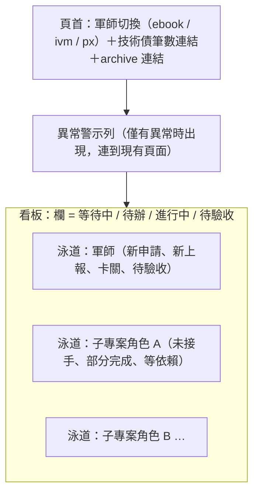
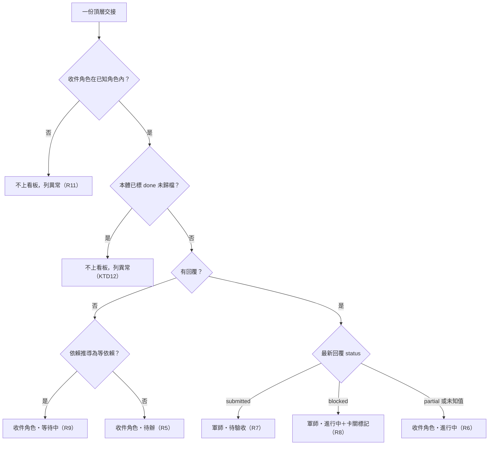

# 軍師沙盤看板化 - Plan

## Goal Capsule

- **Objective**：使用者打開軍師沙盤，一眼就能看出每份尚未收尾的交接此刻輪到哪個角色（軍師或哪個子專案）處理。
- **Means**：沙盤首頁改為「持球者泳道 × 狀態欄」的看板，一個軍師一張；看板放不下的資訊移到其他頁面（KTD1、KTD4）。
- **Product authority**：本文件的 Product Contract。改善交接標題寫法、ADR 020（沙盤登入自動啟動）屬相鄰工作，不在本計畫範圍。
- **Execution profile**：只動 `skills/kunsu-dashboard/` 的渲染層與兩個資料類別的顯示欄位，加上沙盤相關文件；交接分類邏輯（kunsu-inbox SKILL.md 4a 的鏡像）零改動。
- **Stop conditions**：若實作發現必須更動 `not_picked_up`／`partial_done`／`awaiting_confirm` 的分類規則才能滿足 R5–R9，停下回報，因為那會連動 kunsu-inbox 4a 與 SessionStart hook。
- **Tail ownership**：沙盤 pytest 全綠、`scripts/consistency-check.sh` 全綠、真實啟動伺服器以 curl 檢查三個頁面皆回 200 且含預期結構。
- **Open blockers**：無。

---

## Product Contract

### Summary

沙盤首頁改為看板：每個軍師一張，縱向泳道是持球者（軍師本身與其各子專案角色），橫向是狀態欄（等待中、待辦、進行中、待驗收），卡片掛在下一個要動作的角色底下。異常、技術債、已歸檔的完成交接各自移到看板以外的頁面，現有頁面完整保留。

### Problem Frame

handoff 的收尾需要兩個交棒點：子專案投遞 `submitted` 回覆表態完成，軍師驗收後以 `/handoff done` 歸檔。現有沙盤以「軍師 → 子專案 → 分類清單」的巢狀結構呈現，分類雖有文字標示，但使用者無法一眼看出某份交接卡在誰身上——要逐一展開軍師與子專案分組、讀分類標題，才能把「部分完成」「已回覆待確認」換算成「現在輪到誰」。使用者過去用過 Trello／Jira 一類的 issue tracker，期待每件事直接歸屬在某個角色底下，像那個角色的待辦項目。

另一個閱讀障礙是交接標題：frontmatter 的 `title` 多半與檔名 slug 相同，是去掉標點的整句長句（例如「研究用戶端可自帶XForwardedFor偽造來源IP的弱點範圍與各消費點危害再提修法選項供裁示」），主旨與要求的動作擠在一起，難以掃讀。

### Key Decisions

- **自行把沙盤改成看板，不引入外部看板工具。** 痛點是「看不出球在誰手上」，沙盤已有完整的狀態推導，只缺呈現；外部工具需要同步程式、定時輪詢與第二份資料，換到的只是現成的篩選與搜尋。(session-settled: user-directed — chosen over Kanboard 或 Plane CE 加單向同步程式: 工作量較小且不需同步、輪詢與重複資料) Governs R1, R19
- **主軸為持球者泳道加狀態欄。** (session-settled: user-directed — chosen over 單純依持球者分欄、傳統依狀態分欄: 同時看得出輪到誰與進度) Governs R2, R3
- **一個軍師一張看板。** (session-settled: user-directed — chosen over 三個軍師合成一張、依子專案實體合併泳道: 各軍師角色集合不同，分開較清楚) Governs R1, R2
- **卡關（`blocked`）的卡片歸軍師泳道。** 卡關通常需要軍師出面協調、補資訊或派新交接。(session-settled: user-directed — chosen over 留在子專案泳道標紅、依回覆內容另立欄位判定: 球實際上在軍師手上) Governs R8
- **等依賴的交接另開「等待中」欄。** (session-settled: user-directed — chosen over 留在原欄只加標籤、掛到前置交接的持球者泳道: 一眼區分可開工與還不能動) Governs R3, R9
- **技術債移出看板。** 一個軍師的待辦技術債可達二、三十筆，放進軍師泳道會淹沒需要軍師處理的交接。(session-settled: user-directed — chosen over 看板底部獨立收合泳道、照放軍師泳道: 避免淹沒持球訊號) Governs R16
- **標題問題這次只在看板呈現層處理。** 舊交接受 Invariant 5 約束不能改標題，呈現層無論如何都要做；改善標題寫法另案處理。(session-settled: user-directed — chosen over 同時修改 handoff 標題指引: 範圍會跨到 handoff skill 與三個軍師) Governs R12, R13
- **現有頁面先並存，穩定後再決定是否退役。** (session-settled: user-directed — chosen over 看板直接取代: 保留異常、依賴圖等看板裝不下的細節) Governs R15

### Requirements

**看板結構**

- R1. 沙盤首頁改為看板；每個軍師一張，頁首可切換軍師。
- R2. 每張看板的縱向泳道為持球者：軍師本身一條，該軍師已登記的每個子專案角色代碼各一條。
- R3. 每張看板的橫向狀態欄依序為：等待中、待辦、進行中、待驗收；看板不設完成欄。
- R4. 某軍師沒有任何未收尾的交接、新申請或新上報且沒有異常時，該看板留白，不顯示佔位卡片；有異常時即使沒有卡片，也顯示警示列（見 R15）。

**持球者與欄位歸屬**

- R5. 尚無回覆的交接（未接手）放在收件角色（`to:`）泳道的「待辦」欄。
- R6. 最新回覆為 `partial` 的交接放在收件角色泳道的「進行中」欄。
- R7. 最新回覆為 `submitted` 的交接放在軍師泳道的「待驗收」欄，卡片顯示該回覆的驗收方式（`verify`）。
- R8. 最新回覆為 `blocked` 的交接放在軍師泳道的「進行中」欄，卡片以醒目的卡關標記呈現。
- R9. 尚無回覆且宣告的依賴（`depends_on`）尚未滿足的交接，放在收件角色泳道的「等待中」欄，卡片標示所等待的交接。
- R10. 軍師信箱中尚未處理的新申請與新上報，以卡片形式放在軍師泳道的「待辦」欄。
- R11. 收件角色不在該軍師已知角色代碼內的交接，不放上看板，改列為異常（見 R15）。

**卡片內容**

- R12. 卡片以交接 frontmatter 的標題為主，不顯示檔名；標題過長時截為兩行，可展開看全文。
- R13. 卡片附帶可掃讀的小欄位：收件角色、停留天數、所屬線別（`series`，有宣告時）、最新回覆摘錄（有回覆時）。
- R14. 卡片可展開檢視交接本體與最新回覆的完整內容。

**看板以外的頁面**

- R15. 現有沙盤頁面完整保留於另一個路由，承載異常（tripwire、stale 登記、腳本錯誤、未知收件角色）、依賴圖等看板裝不下的資訊；看板頂端僅在有異常時顯示一行警示並連結至該頁。
- R16. 待辦技術債不出現在看板上；看板顯示該軍師的技術債筆數並連結到列出技術債的頁面。
- R17. 新增一個 archive 頁面，列出已歸檔（已 done 收尾）的交接。

**行為約束**

- R18. 看板與所有新頁面皆為唯讀：不提供拖曳或任何改變交接狀態的操作；狀態只經由回覆檔與 `/handoff done` 改變。
- R19. 重新整理頁面即反映最新狀態，不依賴同步程式或背景輪詢。

### Board Layout



### Acceptance Examples

- AE1. **Covers R5, R7.** **Given** android 收到一份新交接且尚無回覆，**When** 使用者打開 ebook 看板，**Then** 卡片出現在 android 泳道的「待辦」欄；**When** android 投遞 `submitted` 回覆並標 `verify: needs-device` 後使用者刷新，**Then** 卡片移到軍師泳道的「待驗收」欄並顯示需實機測試。
- AE2. **Covers R8.** **Given** backend 對某交接回覆 `blocked`，**When** 使用者打開看板，**Then** 卡片在軍師泳道的「進行中」欄並帶卡關標記，不出現在 backend 泳道。
- AE3. **Covers R9.** **Given** ios 的交接宣告依賴另一份尚未 done 的交接且 ios 尚未回覆，**When** 使用者打開看板，**Then** 卡片在 ios 泳道的「等待中」欄並標示所等待的交接；**When** 前置交接 done 後刷新，**Then** 卡片移到 ios 泳道的「待辦」欄。
- AE4. **Covers R4, R17.** **Given** ivm 軍師所有交接都已 done 歸檔且信箱無新件，**When** 使用者切到 ivm 看板，**Then** 看板留白；已完成的交接可在 archive 頁找到。
- AE5. **Covers R15.** **Given** 某軍師出現 tripwire，**When** 使用者打開看板，**Then** 頂端出現一行警示，點擊後進入現有頁面對應位置；無異常時不顯示警示列。

### Success Criteria

- 使用者打開某軍師的看板，不必展開任何分組，就能說出每份未收尾交接現在輪到哪個角色。
- 沒有待處理事項時，看板是空的，不需要讀任何文字確認「沒事」。

### Scope Boundaries

- 改善交接標題的寫法（保留標點、主旨在前）：另案處理，涉及 handoff skill 指引與三個軍師的寫法。
- 在看板上拖曳或以任何方式改變交接狀態。
- 引入外部看板工具（Kanboard、Plane 等）或任何同步程式與定時輪詢。
- 現有頁面的退役時機：看板穩定後另行決定。
- 沙盤的登入自動啟動：由 ADR 020 處理，與本計畫互不依賴。

### Dependencies / Assumptions

- R9 的「等待中」只適用於尚無回覆的交接；已有回覆的交接即使依賴未滿足，仍依回覆狀態歸欄（R6–R8），僅在卡片上標示所等待的交接。此為推論，使用者未明確裁示。
- 新申請與新上報歸入「待辦」欄（R10）、卡關卡片歸入「進行中」欄（R8）為使用者於範圍確認時接受的推論。
- 現有狀態推導可直接沿用：`skills/kunsu-dashboard/app/subrepo_status.py` 提供交接標題、收件角色、最新回覆 status／verify／摘錄；`skills/kunsu-dashboard/app/handoff_graph.py` 推導等依賴並讀取 archive 內交接；`skills/kunsu-dashboard/app/kunsu_scan.py` 提供新申請與新上報；`skills/kunsu-dashboard/app/todo_status.py` 提供技術債清單。
- 沙盤目前未讀取 `series` 欄位（R13 需新增讀取），也沒有任何頁面列出已歸檔交接（R17 為全新頁面）。

### Sources / Research

- 外部看板工具 survey（2026-10-02）：Markdown 看板工具（Backlog.md、Tasks.md 等）只以單一 status 欄位或資料夾分欄且以拖曳寫回為核心；Obsidian Bases Kanban 需 1.14 以上（本機為 1.12.7），且無法從交接端取得最新回覆狀態與 git 狀態；自架工具中 Kanboard（泳道原生、`reference` 欄位可冪等 upsert、單容器加 SQLite、MIT）與 Plane CE（依 State 分欄再依 Label 分泳道、13 個服務）適配度最高，但皆需同步程式。
- 沙盤現況：`skills/kunsu-dashboard/app/main.py` 只有首頁一個路由，頁面為零 JS；交接分類見 `skills/kunsu-dashboard/app/subrepo_status.py`。
- 相關決策：`docs/adr/2026-07-11-adr-candidate-010-dashboard-service-exception.md`（沙盤例外條件）、`docs/adr/2026-07-12-adr-candidate-011-reply-verify-field.md`（verify 欄位與分類拆分）。

**Product Contract preservation**：restructured, no scope change——原 Outstanding Questions「Deferred to Planning」四項（路由命名、技術債頁形式、archive 頁排序與筆數、卡片展開方式與負向測試相容）已由 KTD4、KTD9、KTD10、KTD6 解答並自 Product Contract 移除；R4 補述「有異常時仍顯示警示列」以與 KTD11 一致（澄清，無範圍變更）；其餘 R、AE 文字未變。

---

## Planning Contract

### Key Technical Decisions

- KTD1. **每個軍師只呼叫一次 `get_subrepo_status`，以該軍師全部已知角色代碼作為收件範圍。** 現有函式每次都掃整個軍師的 `docs/handoffs/`，只是依 `our_roles` 過濾；傳入 `all_known_roles` 即得「該軍師全部交接」，不必新增資料層，也避免逐子專案呼叫造成未知角色與錯誤清單重複 N 份。Governs R2, R5–R11
- KTD2. **持球者與欄位歸屬放在一個純函式模組 `app/board_model.py`，只讀現有分類結果與依賴圖，不改分類規則。** 歸欄以「最新回覆狀態＋依賴推導」決定；「等待中」只在尚無回覆且 `derived` 為等依賴時成立，其餘節點（含不在 `derived` 的孤立或 done 節點）走一般規則。分類邏輯零改動，kunsu-inbox 4a 與 SessionStart hook 不必同步。Governs R5–R9, R11
- KTD3. **軍師泳道用保留內部鍵，不與任何角色代碼共用命名空間；角色泳道依角色代碼字母序固定排列，軍師泳道置頂。** 避免角色代碼恰好與軍師泳道同名時錨點與分組碰撞；固定順序讓刷新時位置不跳動。Governs R2
- KTD4. **路由：`/` 為看板，`/overview` 承載原頁面（整頁搬移、內容不變），`/archive` 為 archive 頁；看板與 archive 以查詢參數 `k=<軍師目錄名>` 選軍師。** `k` 只與 registry 中的軍師目錄名做白名單比對，不命中時退回第一個軍師並顯示提示列，參數絕不當作路徑使用。無 `k` 時取軍師目錄名排序後的第一個。新路由一律宣告 `response_class=HTMLResponse`（既有 `test_no_json_routes_in_app` 會檢查）。Governs R1, R15, R17
- KTD5. **看板與 archive 頁的渲染放在新模組 `app/board_html.py`，CSS class 一律用 `kb-` 前綴。** `main.py` 已逾 1200 行，不再加厚；`kb-` 前綴避開既有負向斷言針對的 `badge`、`chip`、`tlabel`、`dlabel`、`reply-excerpt` 字面。看板頁使用較寬的版面容器，不受原頁 `max-width:900px` 限制。`_page`、`_html_detail`、`_nav_anchor_id`、`_VERIFY_LABELS` 與泛化後的停留天數函式抽到新模組 `app/html_common.py`，`main.py` 與 `board_html.py` 都從該模組匯入；`board_html.py` 不得匯入 `app.main`（`main.py` 頂層會匯入 `board_html.py`，反向匯入會造成循環匯入而使沙盤無法啟動；比照 `handoff_graph_html.py` 不匯入 main 的先例）。Governs R1, R12–R14
- KTD6. **卡片全文展開沿用現有零 JS 的 `<details>`；常態可見區放標題（CSS 兩行截斷）、小欄位與回覆摘錄，展開區依序放完整標題、交接本體、最新回覆全文，全文一律轉義後以 `<pre>` 呈現。** 沿用既有教訓：重要訊號放在 `<details>` 外，避免被收合遮蔽。展開區的 `<pre>` 採 `white-space: pre-wrap` 折行並設固定最大高度、`overflow:auto`，展開時撐高所在泳道列，不跨欄浮出。單一格子超過 8 張卡片時，前 8 張常態顯示，其餘收進一個「另有 N 筆」的 `<details>`（軍師待驗收欄現況約二十餘筆）。卡關標記同時使用 ⛔ 圖示與顏色，不只靠顏色。Governs R12–R14
- KTD7. **`HandoffInfo` 新增兩個 display-only 欄位：`series`（字串正規化後的線別，空值為 None）與 `latest_reply_filename`（最新回覆檔名，供展開全文讀取）。** 兩者皆有預設值、經建構子帶入（frozen dataclass），不參與分類；`series` 先 `str()` 再顯示，因 YAML 可能把 `yes`、`123` 轉型。SessionStart hook 匯入同一資料類別，有預設值即相容。Governs R13, R14
- KTD8. **停留天數的基準日依欄位而定：待辦與等待中取交接本體 `created`，進行中與待驗收取最新回覆日期；新申請與新上報卡片取該檔 frontmatter `created` 為基準日。日期缺失、格式錯誤或在未來時顯示「日期不明」。泛化後的函式須保持現有單參數呼叫相容（既有 `test_days_waiting_label_pure_function`）。** 現有 `_days_waiting_label` 只吃回覆日期，需泛化為接受基準日與基準名稱。欄內依基準日升冪排序，陳年件浮頂。Governs R13
- KTD9. **技術債不另建新頁，看板頁首顯示該軍師的技術債筆數，連到 `/overview` 該軍師分組的既有錨點。** 原頁已有完整技術債區塊，另建頁只是重複。Governs R16
- KTD10. **archive 頁資料取自 `get_handoff_graph` 的 archive 節點，依檔名日期前綴新到舊排序，列出全部標題列。** 每列顯示標題、收件角色、歸檔前的本體 status 異常標記（「已歸檔未標 done」沿用依賴圖既有判定）與 `corrected_by`（容錯 tuple 與列表）；只有最近 50 份內嵌可展開的本體全文，較舊者只顯示標題列與本體相對路徑。實測 ebook archive 有 283 份、本體合計約 3.2MB，全部內嵌會讓每次載入讀檔並輸出數 MB 頁面，且量隨每次收尾增加。頂層與 archive 同名並存時依賴圖以頂層節點為準，該份 archive 本體不出現在 archive 頁，已由依賴圖的同名並存異常涵蓋。Governs R17
- KTD11. **異常彙整：看板頂端警示列在任一異常存在時出現，並逐類列出連到 `/overview` 對應軍師錨點。** 異常類別：軍師路徑失聯、tripwire、掃描腳本錯誤、未知收件角色、交接解析錯誤、依賴圖異常與無法解析依賴、頂層已標 `done` 但未歸檔、回覆自標 done。tripwire 或腳本錯誤時，警示列加註「新申請／新上報清單可能不完整」，因 `scan_kunsu` 會中途返回。交接解析錯誤以檔名去重，合併 `subrepo_status` 與 `handoff_graph` 兩邊的 errors 後再計數，避免同一壞檔重複計算。最新回覆自標 `status: done` 的交接（現有分類整筆略過、不進任何清單）列為異常類別「回覆自標 done」：以依賴圖頂層節點補判「收件角色已知、本體非 done、未出現在任何分類清單、未知收件角色清單與 errors 中」者。Governs R4, R11, R15
- KTD12. **頂層本體已標 `status: done` 但未歸檔的交接不放上看板，改列異常。** 現有分類不讀本體 status，會把它當未接手或待驗收；以依賴圖節點的本體 status 判定。Governs R5, R7, R15
- KTD13. **軍師路徑失聯時，該軍師看板不渲染格線，只顯示失聯說明與連到 `/overview` 的連結；軍師切換列仍列出該軍師。** 子專案路徑失聯不影響看板（看板資料只來自軍師 repo），只在 `/overview` 呈現。Governs R1, R15

### High-Level Technical Design

資料流——每次請求只讀一次 registry，看板與 archive 共用同一套掃描模組：

```mermaid
flowchart TB
  reg["registry 快照（一次讀取）"] --> pick["依 k 白名單選軍師（KTD4）"]
  pick --> sub["get_subrepo_status：全部已知角色（KTD1）"]
  pick --> scan["scan_kunsu：新申請、新上報、tripwire"]
  pick --> graph["get_handoff_graph：等依賴、本體 status、archive 節點"]
  pick --> todo["get_todo_status：技術債筆數"]
  sub --> model["board_model：卡片歸屬與異常彙整（KTD2）"]
  scan --> model
  graph --> model
  todo --> model
  model --> board["board_html：看板頁 /"]
  graph --> arch["board_html：archive 頁 /archive（KTD10）"]
```

交接歸欄的判定順序（directional，最終以 R5–R12 與 KTD 為準）：



### Assumptions

- 已有回覆但依賴未滿足的交接，依回覆狀態歸欄，只在卡片上標示所等待的交接（沿用 Product Contract Dependencies／Assumptions 的推論，使用者未明確裁示）。
- 最新回覆狀態為未知值（非 partial、submitted、blocked、done）時，比照現有分類歸「進行中」，卡片顯示原始 status 字串；為 done 時依 KTD11 列異常。
- 看板有卡片時，所有角色泳道皆顯示（空泳道淡色），維持固定結構；整張看板無卡片且無異常時，以一行空狀態文字取代格線。
- 新申請、新上報只含未 commit 的信箱新件，與「未 commit 即未處理」既有語意一致；已 commit 但未歸檔者不上看板。
- 新申請與新上報卡片的標題取該檔 frontmatter `title`，缺失或解析失敗時退回檔名；卡片帶「申請」或「上報」類型標記，不顯示收件角色與回覆摘錄，展開區為該檔全文。

### Sequencing

U1 → U2 → U3 → U4 → U5 → U6。U3 先把原頁搬到 `/overview` 並改測試路徑，確保既有 206 項測試在看板上線前保持綠燈。

---

## Implementation Units

### U1. HandoffInfo 新增 series 與最新回覆檔名

**Goal:** 讓看板卡片能顯示線別並讀取最新回覆全文。

**Requirements:** R13, R14；KTD7

**Dependencies:** 無

**Files:**
- `skills/kunsu-dashboard/app/subrepo_status.py`
- `skills/kunsu-dashboard/tests/test_subrepo_status.py`

**Approach:**
1. 資料類別加 `series: Optional[str] = None` 與 `latest_reply_filename: Optional[str] = None`。
2. 交接本體 frontmatter 讀到 `series` 時 `str()` 後去除空白，空字串視為 None。
3. 選出最新回覆時一併記下其檔名。
4. 分類分支與既有欄位不動。

**Patterns to follow:** `latest_reply_excerpt` 的加入方式（display-only、預設 None、經建構子帶入）。

**Test scenarios:**
- `series: 線A` 的交接，HandoffInfo.series 為「線A」。
- `series: yes` 與 `series: 123` 經 YAML 轉型為 bool／int，結果仍為字串且不拋例外（以實際 `str()` 結果斷言）。
- 無 `series` 或 `series:` 空值，結果為 None。
- 兩份回覆時，`latest_reply_filename` 為檔名排序最後一份。
- 無回覆時 `latest_reply_filename` 為 None。
- 既有分類結果（not_picked_up／partial_done／awaiting_confirm）對同一 fixture 不變。

**Verification:** 沙盤既有測試全綠，新增測試通過。

---

### U2. board_model：持球者與欄位歸屬、異常彙整

**Goal:** 以純函式把一個軍師的掃描結果轉成「泳道 × 欄位 × 卡片」模型與異常清單。

**Requirements:** R2–R11, R16；KTD1, KTD2, KTD3, KTD8, KTD11, KTD12, KTD13

**Dependencies:** U1

**Files:**
- `skills/kunsu-dashboard/app/board_model.py`（新增）
- `skills/kunsu-dashboard/tests/test_board_model.py`（新增）

**Approach:**
1. 輸入：已知角色集合、`SubrepoStatusResult`、`KunsuScanResult`、`HandoffGraphResult`、`TodoStatusResult`、軍師是否失聯。
2. 輸出：有序泳道（軍師保留鍵置頂，其餘角色字母序）、四個欄位的卡片清單、異常清單（類別＋筆數＋說明）、技術債筆數、「信箱清單可能不完整」旗標。
3. 卡片模型帶：類型（交接、申請、上報）、標題、收件角色、基準日與基準名稱、series、verify、卡關旗標、未知 status 原值、所等待的交接（以依賴圖節點的標題顯示；無法解析的依賴顯示「無法解析的依賴」標記，檔名只放在展開區）、回覆摘錄、本體與最新回覆的相對路徑。
4. 欄內依基準日升冪排序；基準日不明者排最後。
5. 申請與上報檔讀 frontmatter `title`，失敗時退回檔名，不拋例外。

**Execution note:** 先寫歸欄規則的失敗測試，再實作；此模組是看板正確性的唯一來源。

**Patterns to follow:** `app/handoff_graph.py` 的純函式與資料類別風格；`_parse_frontmatter` 的容錯讀取。

**Test scenarios:**
- Covers AE1. 無回覆交接進收件角色・待辦；最新回覆 submitted 且 verify needs-device 進軍師・待驗收並帶 verify。
- Covers AE2. 最新回覆 blocked 進軍師・進行中並帶卡關旗標，收件角色泳道沒有這張卡。
- Covers AE3. 無回覆且 `derived` 為等依賴，進收件角色・等待中並列出 `waiting_on`；同一交接 `derived` 為可開工時進待辦。
- 已回覆 partial 且依賴未滿足，進收件角色・進行中並標所等待交接。
- 不在 `derived` 的孤立交接、無回覆，進待辦。
- 最新回覆為未知值 `archived`，進收件角色・進行中並保留原值。
- 收件角色不在已知角色內，不產生卡片，異常清單含未知收件角色。
- 頂層本體 status 為 done 且未歸檔，不產生卡片，異常清單含該類。
- 新申請與新上報各產生一張軍師・待辦卡片並帶類型標記；檔案缺 title 時標題退回檔名；基準日取其 frontmatter created。
- 最新回覆 status 為 done、本體非 done 的頂層交接，不產生卡片，異常清單含「回覆自標 done」。
- 同一壞檔同時出現在兩邊 errors，異常計數只算一次。
- 等待中卡片的所等待項顯示被依賴交接的標題；被依賴者無法解析時顯示「無法解析的依賴」且常態區不含其檔名。
- tripwire 存在時，異常清單含 tripwire 且「信箱清單可能不完整」旗標為真。
- 軍師失聯時，不產生卡片，異常清單含失聯。
- 某角色代碼恰為軍師保留鍵的字面，仍產生獨立角色泳道，不與軍師泳道合併。
- 泳道順序：軍師置頂，其餘字母序；多次呼叫順序相同。
- 待辦欄兩張卡 created 分別為 2026-09-01 與 2026-09-20，前者排前；created 格式錯誤者排最後。
- 無任何交接、信箱新件與異常時，卡片數為零且異常清單為空。

**Verification:** 新測試通過，模組不依賴 FastAPI 或 HTML。

---

### U3. 路由調整：原頁搬到 /overview

**Goal:** 把現有首頁原封不動搬到 `/overview`，騰出 `/` 給看板。

**Requirements:** R15；KTD4

**Dependencies:** 無（可與 U1、U2 並行，但須先於 U4 合入）

**Files:**
- `skills/kunsu-dashboard/app/main.py`
- `skills/kunsu-dashboard/tests/test_main.py`
- `skills/kunsu-dashboard/tests/test_handoff_graph_html.py`

**Approach:**
1. 原 `index()` 改掛 `/overview`，內容與輸出不變；模組 docstring 與「唯一端點」註解改為描述三個端點。
2. 既有測試中請求 `/` 的呼叫一律改為 `/overview`（test_main 約 65 處、test_handoff_graph_html 約 7 處）。
3. 原頁頂端加一行連回看板的連結（不影響既有斷言字面）。

**Test scenarios:**
- 既有全部測試改路徑後維持全綠。
- `test_no_json_routes_in_app` 對新路由清單仍通過。

**Verification:** 沙盤 pytest 全綠；`/overview` 的 HTML 與搬移前同一 fixture 下除新增連結外一致。

---

### U4. 看板頁 /

**Goal:** 依 board_model 輸出渲染看板頁，含軍師切換、警示列、格線與卡片。

**Requirements:** R1–R4, R12–R16, R18, R19；KTD4, KTD5, KTD6, KTD9, KTD11, KTD13

**Dependencies:** U1, U2, U3

**Files:**
- `skills/kunsu-dashboard/app/board_html.py`（新增）
- `skills/kunsu-dashboard/app/html_common.py`（新增，自 `main.py` 抽出共用輔助函式，KTD5）
- `skills/kunsu-dashboard/app/main.py`（新增 `/` 路由，組裝資料並呼叫 board_html；改從 html_common 匯入共用函式）
- `skills/kunsu-dashboard/tests/test_board_html.py`（新增）

**Approach:**
1. `/` 路由讀一次 registry，以 `k` 白名單選軍師，呼叫四個掃描函式（KTD1），交給 board_model，再交給 board_html。
2. 頁首：軍師切換列（每個軍師一個連結，只標示目前所選，不計算其他軍師的卡片數——計數需對每個軍師都跑掃描腳本，會使每次刷新掃描全部軍師並推進掃描統計）、技術債筆數連結、archive 連結、`/overview` 連結，以及伺服器渲染當下的掃描時間（避免久開的空看板被誤讀為當下沒事）。
3. 警示列只在有異常時出現（KTD11）。
4. 格線以 CSS grid 排出泳道列與四個欄位；卡片常態區與展開區依 KTD6。
5. 整張看板無卡片且無異常時，以一行空狀態文字取代格線。
6. 所有 frontmatter 文字與檔案內容一律 `html.escape`。

**Patterns to follow:** `main.py` 的 `_page`、`_html_detail`、`_html_reply_excerpt`、`_VERIFY_LABELS`；`handoff_graph_html.py` 的獨立 CSS 字串與 class 前綴做法。

**Test scenarios:**
- Covers AE1. fixture 軍師含一份無回覆交接，`/?k=<軍師>` 的 android 泳道待辦欄出現該卡標題，且頁面不含該交接檔名字串。
- Covers AE4. 無卡片且無異常的軍師，頁面含空狀態文字且不含格線容器。
- Covers AE5. tripwire 存在時頁面含警示列與連到 `/overview` 的連結；無異常時不含警示列。
- `k` 為不存在的軍師名或 `../x`，回 200、顯示第一個軍師並含「找不到軍師」提示，且不讀取該路徑。
- 無 `k` 時顯示排序第一的軍師。
- registry 為空時回 200 並顯示尚無已登記軍師。
- 標題含 `<script>alert(1)</script>` 時輸出為轉義字串。
- 交接帶 series 時卡片顯示線別；無 series 時不出現線別欄位標記。
- 展開區含交接本體與最新回覆全文；最新回覆檔不可讀時顯示降級提示而非 500。
- 同一格 12 張卡片時，常態顯示 8 張，其餘收在「另有 4 筆」展開區。
- 頁面含掃描時間。
- 匯入 `app.board_html` 不會觸發匯入 `app.main`。
- 頁面不含 `badge`、`chip`、`tlabel`、`dlabel`、`reply-excerpt` 等既有 class 字面的 `<span class=` 形式。
- 軍師失聯時頁面含失聯說明與 `/overview` 連結、不含格線。
- 路由宣告為 HTMLResponse（既有 JSON 路由測試涵蓋）。

**Verification:** 新測試通過；真實啟動伺服器後 `curl` 首頁回 200、含 `<title>軍師沙盤（kunsu dashboard）</title>`。

---

### U5. archive 頁 /archive

**Goal:** 列出指定軍師已歸檔的交接。

**Requirements:** R17, R18；KTD4, KTD10

**Dependencies:** U4（共用頁首與 board_html）

**Files:**
- `skills/kunsu-dashboard/app/board_html.py`
- `skills/kunsu-dashboard/app/main.py`
- `skills/kunsu-dashboard/tests/test_board_html.py`

**Approach:**
1. `/archive` 路由以相同 `k` 白名單選軍師，只呼叫 `get_handoff_graph`。
2. 取 archive 位置的節點，依檔名日期前綴新到舊排序。
3. 每列顯示標題、收件角色、「已歸檔未標 done」標記、`corrected_by`，可展開本體全文。
4. 無 archive 時顯示空狀態文字。

**Patterns to follow:** `handoff_graph.py` 對 `corrected_by` tuple／列表的容錯；`_read_related_file` 的讀檔降級。

**Test scenarios:**
- Covers AE4. archive 內兩份交接依日期新到舊排列，標題可見、檔名不作為主文字。
- archive 內 55 份交接時，最新 50 份含可展開全文，其餘 5 份只有標題列與相對路徑。
- archive 內本體 `status: open` 的交接帶「已歸檔未標 done」標記。
- `corrected_by` 為兩元素列表時兩個檔名都顯示，不拋例外。
- 無 archive 目錄的軍師顯示空狀態文字。
- `k` 非法時行為同看板頁。

**Verification:** 新測試通過；真實伺服器 `curl /archive?k=ebook` 回 200。

---

### U6. 文件與詞彙同步

**Goal:** 讓沙盤的安裝、導覽與專案文件描述與新頁面結構一致。

**Requirements:** R1, R15–R17

**Dependencies:** U4, U5

**Files:**
- `skills/kunsu-dashboard/SKILL.md`
- `docs/playbooks/dashboard.md`
- `CLAUDE.md`（專案結構中 kunsu-dashboard 的 app 模組清單與測試數、開發狀態新增一條）
- `README.md`（若有描述沙盤首頁結構的段落）

**Approach:**
1. SKILL.md 與 playbook 改寫首頁為看板，新增 `/overview`、`/archive` 說明與看板閱讀方式（持球者泳道、四欄、警示列）。
2. CLAUDE.md 專案結構補 `board_model.py`、`board_html.py`。
3. 以 `rg` 掃 `127.0.0.1:8000/` 與「頁面導覽」相關字樣的殘留描述。

**Test expectation:** none -- 純文件；以 `scripts/consistency-check.sh` 全綠確認未破壞既有錨句。

**Verification:** consistency-check 全綠；文件中不再把舊頁結構描述成首頁。

---

## Verification Contract

| 檢查 | 指令 | 適用 |
|---|---|---|
| 沙盤單元與路由測試 | 在 `skills/kunsu-dashboard/` 執行 `python3 -m pytest` | U1–U5 |
| kunsu-inbox 測試（匯入沙盤資料類別） | 在 `skills/kunsu-inbox/` 執行 `python3 -m pytest` | U1 |
| 跨檔一致性 | 在 repo 根目錄執行 `scripts/consistency-check.sh` | U6 與全體 |
| 端到端煙霧測試 | 以 `skills/kunsu-dashboard/start.sh <空閒 port>` 啟動，`curl` `/`、`/?k=<軍師>`、`/overview`、`/archive?k=<軍師>` 皆回 200 且含預期結構 | U4、U5 |

## Definition of Done

- U1–U6 完成，上表檢查全部通過。
- 交接分類規則（`subrepo_status.py` 的三分類分支）與 kunsu-inbox SKILL.md 4a 未被修改。
- 看板與 archive 頁沒有任何改變交接狀態的操作，所有新路由皆回傳 HTML。
- 實作過程中嘗試後放棄的程式碼已移除，不留在 diff 中。
- 未納入本工作無關的檔案（`docs/adr/2026-10-01-adr-candidate-020-*.md`、`docs/progress/`）。

---

## Risks & Dependencies

- **既有測試大量改路徑（U3）**：約 72 處 `client.get("/")` 須改為 `/overview`。以機械替換處理，並確認負向斷言仍針對原頁內容。
- **series 讀端型別**：沙盤是第一個讀 `series` 的消費端，YAML 型別轉換值須字串化（KTD7）；既有 todo `docs/todos/series-讀端強健化引號值YAML-型別值CRLF.md` 涵蓋引號與 CRLF，本計畫只處理型別字串化，不關閉該 todo。
- **SessionStart hook 匯入 `HandoffInfo`**：新增欄位皆有預設值，hook 以 `getattr` 容錯；以 kunsu-inbox 測試確認。

## Sources & Research

- 沙盤資料流與可重用函式：`skills/kunsu-dashboard/app/main.py`（`index()`、`_page`、`_html_detail`、`_html_reply_excerpt`、`_days_waiting_label`、`_nav_anchor_id`）、`skills/kunsu-dashboard/app/subrepo_status.py`（分類分支、最新回覆以檔名日期與序號排序）、`skills/kunsu-dashboard/app/handoff_graph.py`（`derived`、`waiting_on`、archive 節點、anomalies）。
- 既有教訓：`CLAUDE.md` 開發狀態中沙盤各次迭代（class 前綴避開負向斷言、frozen dataclass 經建構子帶入、`<details>` 錨點掛內容區、解析錯誤不得靜默、display-only 欄位原則、archive 讀取的三種異常形狀）。
- 流程與邊界分析：tripwire 使信箱清單中斷、R2 與 R4 的空泳道語意、`derived` 不是全集、停留天數基準、泳道同名、查詢參數驗證、archive 規格——分別落在 KTD11、Assumptions、KTD2、KTD8、KTD3、KTD4、KTD10。
